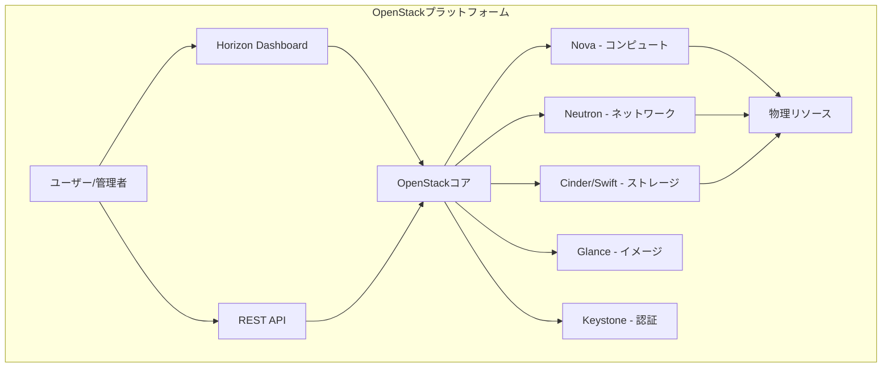
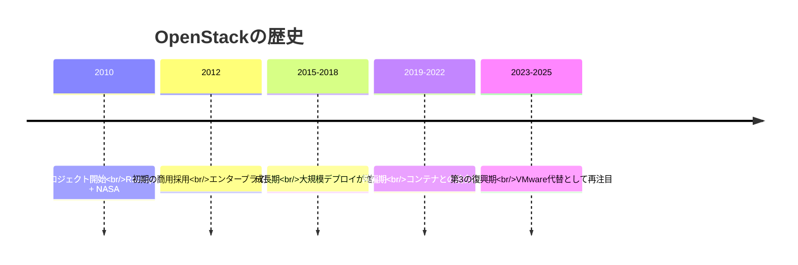
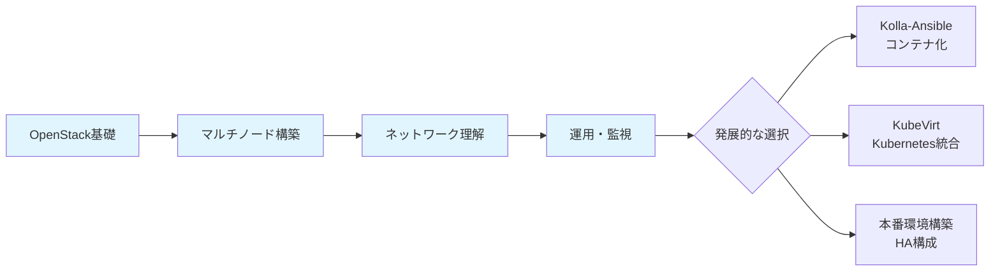
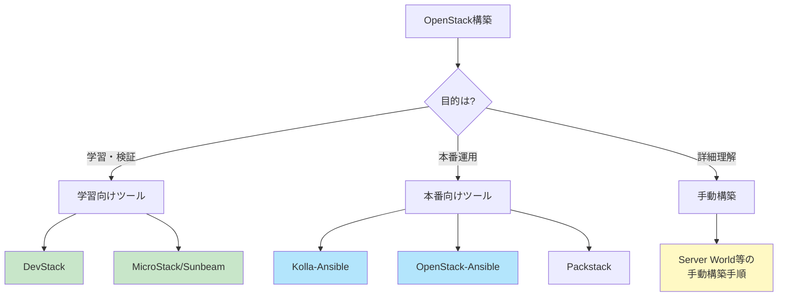
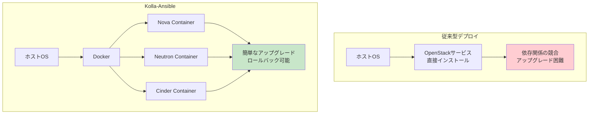
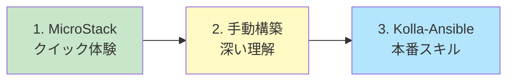
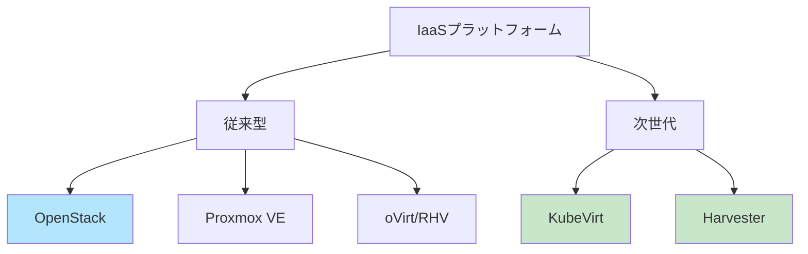
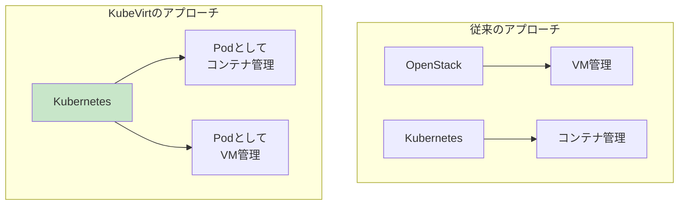
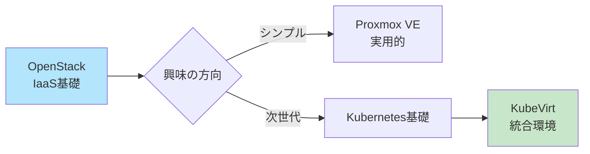

# Part 1: OpenStack概要と選択肢

## 目次

1. [OpenStackとは](#1-openstackとは)
2. [OpenStack構築方法の選択肢](#2-openstack構築方法の選択肢)
3. [他のIaaSプラットフォームとの比較](#3-他のiaasプラットフォームとの比較)

---

## 1. OpenStackとは

### 1.1 IaaSプラットフォームとしてのOpenStack ✅ 🎓🏢

**OpenStack**は、オープンソースのクラウドコンピューティングプラットフォームで、**Infrastructure as a Service（IaaS）**を提供します。データセンター全体のコンピュート、ストレージ、ネットワークリソースをプールし、管理・制御するためのツール群です。



#### 主な特徴

| 特徴                       | 説明                                      |
| -------------------------- | ----------------------------------------- |
| **オープンソース**         | Apache License 2.0、誰でも無料で利用可能  |
| **モジュラー設計**         | 必要な機能だけを選択してデプロイ可能      |
| **スケーラビリティ**       | 数台から数千台規模まで対応                |
| **マルチテナント**         | 複数のユーザー/組織でリソースを安全に共有 |
| **API駆動**                | 全ての操作をプログラムから実行可能        |
| **ハイパーバイザー非依存** | KVM、VMware、Hyper-V等をサポート          |

---

### 1.2 OpenStackの歴史と現状（2025年の位置づけ）⭐ 🎓

#### 歴史の概要



#### 2025年の現状

**最新リリース**: OpenStack 2025.2（現在の安定版）

**重要なトレンド**:

1. **✅ VMware移行の受け皿として再注目**
   - Broadcom買収後のVMware価格高騰により、多くの企業がOpenStackへ移行を検討
   - オープンソースでベンダーロックインがない点が評価されている

2. **✅ AI/MLワークロードへの対応**
   - GPU対応の強化
   - 大規模並列処理のサポート向上

3. **✅ Kubernetes統合の進展**
   - コンテナとVMを統合管理する需要の増加
   - KubeVirtとの連携が進む

4. **✅ エッジコンピューティング対応**
   - 分散環境での軽量デプロイ（MicroStack/Sunbeam）
   - 5Gインフラでの採用増加

#### コミュニティの規模 💡

- **34,000人以上**が**550社**で貢献
- Linuxカーネル、Chromiumウェブブラウザーと並んで、**最も活発な3つのオープンソースプロジェクトの1つ**
- 世界中の主要クラウドプロバイダーや企業が採用

---

### 1.3 なぜ今OpenStackを学ぶのか ✅ 🎓

#### OpenStack学習の価値

| 理由                     | 詳細                                                                                 |
| ------------------------ | ------------------------------------------------------------------------------------ |
| **✅ IaaSの本質を学べる** | VM、ネットワーク、ストレージの統合管理を深く理解できる。この知識は次世代IaaSでも必須 |
| **✅ 実務需要がある**     | VMware移行案件の増加により、OpenStackの需要が急増中                                  |
| **✅ 次世代技術の基盤**   | OpenStackを理解することで、KubeVirtなど次世代技術の学習が容易になる                  |
| **✅ オープンソース**     | 無料で学習環境を構築でき、商用利用も制限なし                                         |
| **⭐ キャリアの選択肢**   | クラウドインフラエンジニア、SREなど多様なキャリアパス                                |

#### 学習の推奨パス 💡



#### 2025年時点での評価

**OpenStackは全く古くない** - むしろ**第3の復興期**を迎えています：

- ✅ **市場拡大中**: VMware離れ、AI/MLワークロード需要
- ✅ **技術革新**: コンテナ化、Kubernetes統合
- ✅ **実績豊富**: 世界中の大規模クラウドで稼働
- ✅ **学習価値大**: IaaS基礎から次世代技術への橋渡し

---

## 2. OpenStack構築方法の選択肢

OpenStackのデプロイには、目的や規模に応じて様々な方法が用意されています。



---

### 2.1 DevStack（開発・テスト向け）✅ 🎓🧪

**DevStack**は、開発とテスト用に設計された、GitソースツリーからOpenStackクラウドを迅速にデプロイするスクリプトとユーティリティのセットです。

#### 特徴

| 項目             | 内容                     |
| ---------------- | ------------------------ |
| **対象環境**     | 開発・テスト             |
| **デプロイ時間** | 約30-60分                |
| **構成**         | 単一ノード、マルチノード |
| **対応OS**       | Ubuntu、Rocky Linux      |
| **難易度**       | 低                       |
| **本番利用**     | ❌ 非推奨                 |

#### メリット・デメリット

**✅ メリット**:

- 最も簡単にOpenStackを体験できる
- 最新の開発版を試せる
- 設定がシンプル

**❌ デメリット**:

- 本番環境向けには設計されていない
- セキュリティ設定が甘い
- アップグレードが困難

#### 使用例 💡

```bash
# DevStackの基本的なインストール手順（参考）
git clone https://opendev.org/openstack/devstack
cd devstack
cp samples/local.conf .
./stack.sh  # インストール開始
```

#### 推奨用途 🎓

- ✅ OpenStackの機能を素早く試したい
- ✅ 開発・デバッグ環境
- ❌ 本番環境
- ❌ 長期的な学習環境（再構築が必要になる）

---

### 2.2 MicroStack / Sunbeam（小規模環境向け）⭐ 🎓

**MicroStack**は数分でインストールでき、OpenStack経験がない人でも完全にアクセス可能な、最も簡単なOpenStackです。

#### 特徴

| 項目             | 内容                           |
| ---------------- | ------------------------------ |
| **対象環境**     | 学習、小規模本番、エッジ       |
| **デプロイ時間** | 約5分（初期インストール）      |
| **構成**         | 単一ノード、小規模マルチノード |
| **対応OS**       | Ubuntu 22.04/24.04 LTS         |
| **難易度**       | 非常に低                       |
| **本番利用**     | △ 小規模環境のみ               |

#### Sunbeamとの関係 💡

- **MicroStack**: Snapパッケージベースの簡易インストーラー
- **Sunbeam**: Jujuベースの次世代デプロイツール
- どちらも**Kubernetes管理コンテナ内でOpenStackサービスを実行**

#### メリット・デメリット

**✅ メリット**:

- **5つの簡単なステップ**でインストール完了
- OpenStackを基盤となるOSから完全に切り離し、アップグレードが簡単
- 最小要件：4コアCPU、16GB RAM、50GB SSD
- エッジデバイスや限られたハードウェアリソースでも動作

**❌ デメリット**:

- 大規模環境には不向き
- カスタマイズの自由度が低い
- Snap/Jujuの知識が必要（高度な設定時）

#### 推奨用途 🎓

- ✅ **初めてOpenStackを触る人に最適**
- ✅ 素早くプロトタイプを作りたい
- ✅ エッジコンピューティング環境
- △ 中規模以上の本番環境

---

### 2.3 Packstack（RDO - Red Hat系向け）💡 🧪

**Packstack**は、RHELおよびその他のRHEL互換ディストリビューションでの単一ノードOpenStackインストールツールで、小規模環境でのOpenStackインストールの概念実証を目的としたデプロイツールです。

#### 特徴

| 項目             | 内容                           |
| ---------------- | ------------------------------ |
| **対象環境**     | 概念実証（PoC）                |
| **デプロイ時間** | 約1-2時間                      |
| **構成**         | 単一ノード、小規模マルチノード |
| **対応OS**       | CentOS、RHEL、AlmaLinux        |
| **難易度**       | 中                             |
| **本番利用**     | △ 小規模のみ                   |

#### メリット・デメリット

**✅ メリット**:

- Red Hat系OSで動作
- 自動構築が可能
- Answerファイルでカスタマイズ可能

**❌ デメリット**:

- 最小メモリ要件を超えるハードウェアが必要
- 容量が少ない場合、コンポーネントの動作に影響
- アップグレードが複雑

#### 推奨用途 🧪

- ✅ Red Hat系OSでの検証環境
- ✅ 概念実証（PoC）
- ❌ 本番環境
- ❌ Ubuntu環境

---

### 2.4 Kolla-Ansible（本番環境向け）⭐ 🏢

**Kolla-Ansible**のミッションは、OpenStackクラウドを運用するための**本番対応コンテナとデプロイツール**を提供することです。DockerコンテナとAnsibleプレイブックを使用して、ベアメタルまたは仮想マシンにOpenStackをデプロイします。

#### 特徴

| 項目             | 内容                                |
| ---------------- | ----------------------------------- |
| **対象環境**     | 本番環境、大規模検証                |
| **デプロイ時間** | 約2-4時間（初回）                   |
| **構成**         | All-in-One、マルチノード、HA構成    |
| **対応OS**       | Rocky Linux 9、Ubuntu 24.04（推奨） |
| **難易度**       | 高                                  |
| **本番利用**     | ✅ 推奨                              |

#### コンテナ化のメリット ⭐



**主なメリット**:

1. **✅ アップグレードが簡単**
   - コンテナイメージを入れ替えるだけでバージョンアップ可能
   - ホストOSの再インストールが不要

2. **✅ クリーンな環境**
   - 必要なくなったらコンテナを削除するだけ

3. **✅ 一貫性**
   - 開発・ステージング・本番環境で同じコンテナイメージを使用

4. **✅ 高可用性（HA）対応**
   - HAProxy、Keepalived等を統合
   - データベースのクラスタリング対応

#### メリット・デメリット

**✅ メリット**:

- コンテナ化による優れた信頼性、スケーラビリティ、メンテナンス機能
- 本番環境に最適
- HA構成のサポート
- ローリングアップグレード可能

**❌ デメリット**:

- 学習曲線が急
- Ansible、Docker、OpenStackの知識が必要
- 初期設定が複雑

#### 推奨用途 🏢

- ✅ **本番環境（最推奨）**
- ✅ 大規模な検証環境
- ✅ HA構成が必要な環境
- △ 初学者の最初の環境（まず手動構築で理解を深めてから）

---

### 2.5 OpenStack-Ansible 💡 🏢

**OpenStack-Ansible**は、Ansibleを使用してLXCコンテナまたはベアメタル上にOpenStackをデプロイするツールです。

#### 特徴

| 項目             | 内容                     |
| ---------------- | ------------------------ |
| **対象環境**     | エンタープライズ本番環境 |
| **デプロイ時間** | 約3-6時間（初回）        |
| **構成**         | マルチノード、HA構成     |
| **対応OS**       | Ubuntu 22.04             |
| **難易度**       | 非常に高                 |
| **本番利用**     | ✅ 推奨                   |

#### メリット・デメリット

**✅ メリット**:

- エンタープライズ向けの高度な機能
- 複雑な設定が可能
- LXCコンテナによる軽量化

**❌ デメリット**:

- 非常に複雑
- 学習コストが高い
- ドキュメントが高度

#### 推奨用途 🏢

- ✅ 大規模エンタープライズ環境
- ✅ 高度なカスタマイズが必要
- ❌ 学習目的
- ❌ 小規模環境

---

### 2.6 手動構築（Server World等）✅ 🎓

**手動構築**は、各コンポーネントを一つずつコマンドでインストール・設定する方法です。

#### 特徴

| 項目             | 内容                   |
| ---------------- | ---------------------- |
| **対象環境**     | 学習・理解を深める     |
| **デプロイ時間** | 約4-8時間（初回）      |
| **構成**         | 自由に設定可能         |
| **対応OS**       | Ubuntu、Rocky Linux等  |
| **難易度**       | 高（但し理解が深まる） |
| **本番利用**     | △ 可能だが非推奨       |

#### メリット・デメリット

**✅ メリット**:

- **OpenStackの仕組みを深く理解できる**
- 各コンポーネントの役割が明確になる
- トラブルシューティング能力が向上
- カスタマイズの自由度が最高

**❌ デメリット**:

- 時間がかかる
- 設定ミスのリスク
- アップグレードが困難
- 本番運用には向かない

#### 推奨用途 🎓

- ✅ **OpenStackを深く理解したい（今回の目的）**
- ✅ 学習・教育目的
- ✅ 各コンポーネントの動作を確認したい
- ❌ 本番環境
- ❌ 素早く試したいだけ

#### 主な参考サイト 📚

- **Server World**: <https://www.server-world.info/query?os=Ubuntu_24.04&p=openstack_epoxy&f=1>
  - 日本語の詳細な手順
  - Ubuntu 24.04 + OpenStack Epoxy対応
  - 今回の構築で使用

---

### 2.7 構築方法の比較表 ✅

| 方法                  | 難易度 | 構築時間 | 学習価値 | 本番利用 | 推奨環境           |
| --------------------- | ------ | -------- | -------- | -------- | ------------------ |
| **DevStack**          | ⭐      | 30-60分  | ⭐⭐       | ❌        | 🎓 開発・テスト     |
| **MicroStack**        | ⭐      | 5-15分   | ⭐⭐       | △        | 🎓 初学者・エッジ   |
| **Packstack**         | ⭐⭐     | 1-2時間  | ⭐⭐⭐      | △        | 🧪 PoC（RHEL系）    |
| **手動構築**          | ⭐⭐⭐⭐⭐  | 4-8時間  | ⭐⭐⭐⭐⭐    | △        | 🎓 学習・理解       |
| **Kolla-Ansible**     | ⭐⭐⭐⭐   | 2-4時間  | ⭐⭐⭐⭐     | ✅        | 🏢 本番環境         |
| **OpenStack-Ansible** | ⭐⭐⭐⭐⭐  | 3-6時間  | ⭐⭐⭐⭐     | ✅        | 🏢 エンタープライズ |

#### 学習パスの推奨 🎓



**推奨される学習の流れ**:

1. **MicroStack**: OpenStackの全体像を素早く把握（オプション）
2. **手動構築**: 各コンポーネントの理解を深める（**今回はここ**）
3. **Kolla-Ansible**: 本番環境での運用スキルを習得

---

### 2.8 Vagrant + VirtualBoxでの学習環境構築 ✅ 🎓

学習目的でWindows PC上のVagrant + VirtualBoxを使う場合の推奨構成：

#### 推奨オプション

**オプション1: DevStack with Vagrant**

- Kolla-AnsibleやDevStackのVagrantfile設定が利用可能
- VirtualBoxをプロバイダーとして使用
- 推奨スペック：8GB RAM、4コアCPU

**オプション2: MicroStack（最も簡単）**

- VagrantでUbuntu 22.04/24.04のVMを作成
- VM内でMicroStackをインストール
- デプロイ約5分、設定約2分

**オプション3: 手動構築（最も学習効果が高い）** ⭐

- VagrantでマルチノードVMを作成
- Server World等の手順に従って手動構築
- **今回採用する方法**

---

## 3. 他のIaaSプラットフォームとの比較

OpenStack以外にも、様々なIaaSプラットフォームが存在します。特に次世代IaaSとして注目されているプラットフォームを比較します。



---

### 3.1 Proxmox VE 💡

**Proxmox Virtual Environment**は、仮想化とコンテナ化のためのオープンソースプラットフォームです。

#### 特徴

| 項目           | 内容                                                |
| -------------- | --------------------------------------------------- |
| **タイプ**     | ハイパーバイザー型仮想化プラットフォーム            |
| **コア技術**   | KVM（VM）、LXC（コンテナ）                          |
| **管理UI**     | Webベースの統合管理画面                             |
| **難易度**     | 低〜中                                              |
| **ライセンス** | AGPL v3（無償）、サブスクリプション（有償サポート） |

#### OpenStackとの比較

| 項目               | Proxmox VE  | OpenStack       |
| ------------------ | ----------- | --------------- |
| **学習難易度**     | 低          | 高              |
| **デプロイ時間**   | 30分〜1時間 | 4-8時間（手動） |
| **スケール**       | 小〜中規模  | 中〜超大規模    |
| **マルチテナント** | 限定的      | 完全対応        |
| **API**            | REST API    | 豊富なREST API  |
| **管理UI**         | 直感的      | やや複雑        |
| **コミュニティ**   | 中規模      | 非常に大規模    |

#### メリット・デメリット

**✅ メリット**:

- セットアップが非常に簡単
- 統合管理UIが使いやすい
- VMとコンテナを同一プラットフォームで管理
- バックアップ機能が標準搭載

**❌ デメリット**:

- マルチテナント機能が弱い
- 大規模環境には不向き
- OpenStack程のエコシステムはない

#### 推奨用途

- ✅ 中小企業の仮想化基盤
- ✅ 個人の自宅ラボ
- ✅ シンプルなVM管理
- ❌ マルチテナント環境
- ❌ 超大規模環境

---

### 3.2 KubeVirt ⭐

**KubeVirt**は、Kubernetes上で仮想マシン（VM）を動かすための技術です。

#### 特徴

| 項目           | 内容                                         |
| -------------- | -------------------------------------------- |
| **タイプ**     | Kubernetes拡張（Custom Resource Definition） |
| **コア技術**   | Kubernetes + KVM                             |
| **管理**       | kubectl、Kubernetesネイティブ                |
| **難易度**     | 高（Kubernetesの知識が必須）                 |
| **ライセンス** | Apache License 2.0                           |

#### OpenStackとの関係 💡



**重要な違い**:

- **OpenStack**: 専用のIaaSプラットフォーム
- **KubeVirt**: Kubernetesの**上に**VM機能を追加

#### メリット・デメリット

**✅ メリット**:

- Kubernetesの管理ツールでVMも管理
- コンテナとVMを統一的に扱える
- Kubernetes生態系の恩恵

**❌ デメリット**:

- Kubernetesの知識が必須
- OpenStackより機能が限定的
- まだ発展途上

#### OpenStackからの移行 📚

KubeVirtは「OpenStackの代替」というより「次世代の選択肢」です：

- OpenStackで仮想化の基礎を学ぶ
- Kubernetesの知識を習得
- KubeVirtで両者を統合

---

### 3.3 Harvester 💡

**Harvester**は、Kubernetesベースのハイパーコンバージドインフラストラクチャ（HCI）ソリューションで、KubeVirtを組み込んでいます。

#### 特徴

| 項目           | 内容                                  |
| -------------- | ------------------------------------- |
| **タイプ**     | HCI（Hyper-Converged Infrastructure） |
| **コア技術**   | Kubernetes + KubeVirt + Longhorn      |
| **管理UI**     | Webベースの統合管理画面               |
| **難易度**     | 中                                    |
| **ライセンス** | Apache License 2.0                    |

#### OpenStackとの比較

| 項目           | Harvester  | OpenStack                  |
| -------------- | ---------- | -------------------------- |
| **ベース技術** | Kubernetes | 専用フレームワーク         |
| **統合度**     | 高（HCI）  | 柔軟（コンポーネント選択） |
| **難易度**     | 中         | 高                         |
| **エッジ対応** | 得意       | 対応（やや複雑）           |

#### メリット・デメリット

**✅ メリット**:

- KubernetesとVMを統合管理
- エッジ環境に最適
- Rancher統合

**❌ デメリット**:

- 歴史が浅い
- コミュニティがOpenStackより小さい
- 大規模実績が少ない

---

### 3.4 oVirt / RHV 💡

**oVirt**は、Red Hat Virtualization（RHV）のオープンソース版で、KVMベースの仮想化管理プラットフォームです。

#### 特徴

| 項目           | 内容                       |
| -------------- | -------------------------- |
| **タイプ**     | 仮想化管理プラットフォーム |
| **コア技術**   | KVM、GlusterFS             |
| **管理UI**     | Webベースの管理ポータル    |
| **難易度**     | 中                         |
| **ライセンス** | Apache License 2.0         |

#### OpenStackとの比較

| 項目           | oVirt  | OpenStack    |
| -------------- | ------ | ------------ |
| **対象規模**   | 中規模 | 中〜超大規模 |
| **VMware代替** | ◯      | ◎            |
| **学習コスト** | 中     | 高           |
| **機能範囲**   | VM中心 | IaaS全般     |

---

### 3.5 IaaSプラットフォーム総合比較表 ✅

| プラットフォーム | 難易度 | 市場価値 | 将来性 | 学習推奨度 | 主な用途                 |
| ---------------- | ------ | -------- | ------ | ---------- | ------------------------ |
| **OpenStack**    | ⭐⭐⭐⭐⭐  | ⭐⭐⭐⭐⭐    | ⭐⭐⭐⭐⭐  | ⭐⭐⭐⭐⭐      | 🏢 大規模IaaS、VMware代替 |
| **Proxmox VE**   | ⭐⭐     | ⭐⭐⭐      | ⭐⭐⭐    | ⭐⭐⭐⭐       | 🏢 中小企業、自宅ラボ     |
| **KubeVirt**     | ⭐⭐⭐⭐⭐  | ⭐⭐⭐⭐     | ⭐⭐⭐⭐⭐  | ⭐⭐⭐⭐       | 🏢 K8s統合環境            |
| **Harvester**    | ⭐⭐⭐    | ⭐⭐⭐      | ⭐⭐⭐⭐   | ⭐⭐⭐        | 🏢 エッジ、HCI            |
| **oVirt/RHV**    | ⭐⭐⭐    | ⭐⭐⭐      | ⭐⭐⭐    | ⭐⭐⭐        | 🏢 Red Hat環境            |

#### 学習の推奨順序 🎓



---

### 3.6 OpenStack学習の意義（再確認）✅

#### なぜOpenStackから始めるべきか

1. **✅ IaaSの本質を学べる**
   - VM、ネットワーク、ストレージの統合管理
   - この知識は次世代IaaSでも必須の基礎

2. **✅ 実務需要が高い**
   - VMware移行案件の急増
   - 企業での採用拡大中
   - クラウドエンジニアの必須スキル

3. **✅ 次世代技術への橋渡し**
   - OpenStack理解 → KubeVirtの理解が容易
   - Kubernetes統合の実践的知識

4. **✅ コミュニティが活発**
   - 34,000人以上が貢献
   - 豊富な情報とサポート

---

## まとめ

### Part 1で学んだこと ✅

1. **OpenStackとは**: オープンソースのIaaSプラットフォームで、2025年現在も活発に開発されている
2. **構築方法の選択肢**: DevStack、MicroStack、Kolla-Ansible、手動構築など、目的に応じた方法がある
3. **他のIaaS比較**: Proxmox、KubeVirt、Harvesterなど、それぞれ特徴があるが、OpenStackは学習価値が非常に高い

### 今回の学習での選択 🎯

- **構築方法**: 手動構築（Server World参考）
- **理由**: OpenStackの仕組みを深く理解するため
- **環境**: Vagrant + VirtualBox（3ノード構成）

### 次のステップ 📚

Part 2では、OpenStackのアーキテクチャを詳しく学びます：

- 主要コンポーネントの役割
- ノード構成の考え方
- コンポーネント間の連携

---

## 参考リンク 📖

- OpenStack公式サイト: <https://www.openstack.org/>
- OpenStack公式ドキュメント: <https://docs.openstack.org/2025.2/>
- Server World（日本語手順）: <https://www.server-world.info/>
- MicroStack: <https://microstack.run/>
- DevStack: <https://docs.openstack.org/devstack/>
- Kolla-Ansible: <https://docs.openstack.org/kolla-ansible/>

---

**次へ**: [Part 2: OpenStackアーキテクチャの理解](02_architecture.md)
