# Part 3: ネットワーク設計ガイド

## 目次

1. [OpenStackのネットワーク構成](#1-openstackのネットワーク構成)
2. [ネットワークタイプの種類と選択](#2-ネットワークタイプの種類と選択)
3. [Neutronアーキテクチャの深堀り](#3-neutronアーキテクチャの深堀り)
4. [学習環境でのネットワーク設計例](#4-学習環境でのネットワーク設計例)

---

## 1. OpenStackのネットワーク構成

OpenStackでは、異なる目的を持つ**4つのネットワーク**を分離して構成することが推奨されます。

### 1.1 4つのネットワークの概要 ✅

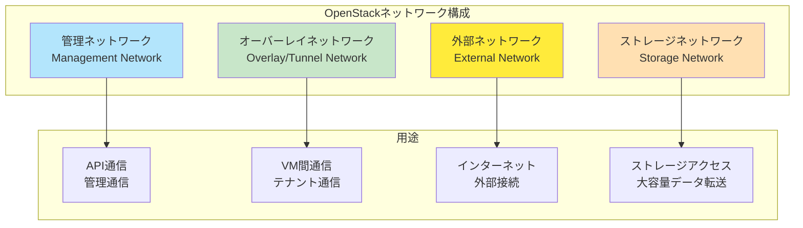

| ネットワーク                 | 重要度 | 主な用途                                 | 推奨分離 |
| ---------------------------- | ------ | ---------------------------------------- | -------- |
| **管理ネットワーク**         | ✅ 必須 | OpenStackコンポーネント間の通信、API、DB | 必須     |
| **オーバーレイネットワーク** | ✅ 必須 | VM間の通信（VXLANトンネル等）            | 推奨     |
| **外部ネットワーク**         | ✅ 必須 | インターネットへの接続                   | 必須     |
| **ストレージネットワーク**   | 💡 推奨 | Cinder、Glance等のストレージトラフィック | 推奨     |

---

### 1.2 管理ネットワーク（Management Network）✅

**役割**: OpenStackコンポーネント間の**内部通信**

#### 通信内容

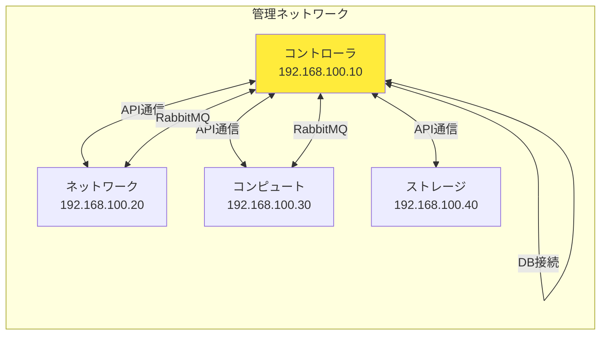

**主な通信**:

- ✅ REST API呼び出し
- ✅ データベースアクセス（MariaDB/MySQL）
- ✅ メッセージキュー通信（RabbitMQ）
- ✅ 管理者のSSH接続
- ✅ Horizonダッシュボードアクセス

#### 設計のポイント ⭐

| 項目                         | 推奨           | 理由                     |
| ---------------------------- | -------------- | ------------------------ |
| **プライベートネットワーク** | 必須           | セキュリティ確保         |
| **帯域幅**                   | 1Gbps以上      | API通信の遅延防止        |
| **冗長化**                   | 本番環境で推奨 | 可用性向上               |
| **VLAN分離**                 | 推奨           | 他のトラフィックから隔離 |

**IPアドレス例** 🎓:

```
ネットワーク: 192.168.100.0/24
- コントローラ: 192.168.100.10
- ネットワーク: 192.168.100.20
- コンピュート1: 192.168.100.31
- コンピュート2: 192.168.100.32
- ストレージ: 192.168.100.40
```

---

### 1.3 オーバーレイ/トンネルネットワーク（Overlay Network）✅

**役割**: **VM間の通信**を処理（VXLANトンネル等）

#### 仕組み

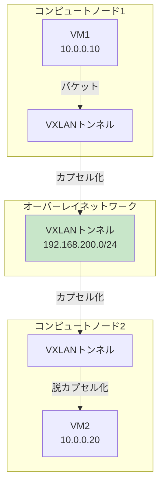

**カプセル化の流れ**:

```
1. VM1が10.0.0.20宛にパケット送信
2. コンピュートノード1のOVSがVXLANヘッダーを付加
   （送信元: 192.168.200.31, 宛先: 192.168.200.32）
3. オーバーレイネットワーク経由で転送
4. コンピュートノード2のOVSがVXLANヘッダーを除去
5. VM2がパケットを受信
```

#### 設計のポイント ⭐

| 項目            | 推奨     | 理由                    |
| --------------- | -------- | ----------------------- |
| **管理と分離**  | 必須     | トラフィック競合を防ぐ  |
| **帯域幅**      | 1-10Gbps | VM間通信の帯域確保      |
| **MTU設定**     | 1550以上 | VXLANオーバーヘッド対応 |
| **Jumbo Frame** | 推奨     | パフォーマンス向上      |

**MTUの考慮** 💡:

```
通常のMTU: 1500バイト
VXLANオーバーヘッド: 約50バイト
---
オーバーレイネットワークのMTU: 1550バイト以上推奨
```

**IPアドレス例** 🎓:

```
ネットワーク: 192.168.200.0/24
- ネットワークノード: 192.168.200.20
- コンピュート1: 192.168.200.31
- コンピュート2: 192.168.200.32
```

---

### 1.4 外部ネットワーク（External Network）✅

**役割**: **インターネットへの接続**、Floating IPの提供

#### 構成

```mermaid
graph TB
    Internet[インターネット]
    
    subgraph "外部ネットワーク"
        Router[物理ルーター<br/>203.0.113.1]
        External[外部ネットワーク<br/>203.0.113.0/24]
    end
    
    subgraph "ネットワークノード"
        L3Agent[L3 Agent<br/>仮想ルーター]
        ExternalIF[外部IF<br/>203.0.113.10]
    end
    
    subgraph "VM"
        VM[VM<br/>内部IP: 10.0.0.10<br/>Floating IP: 203.0.113.100]
    end
    
    Internet <--> Router
    Router <--> External
    External <--> ExternalIF
    ExternalIF <--> L3Agent
    L3Agent <-->|NAT変換| VM
    
    style External fill:#ffeb3b
```

**Floating IPの仕組み** ⭐:

```
1. VMは内部IPを持つ（例: 10.0.0.10）
2. Floating IPを割り当て（例: 203.0.113.100）
3. L3 AgentがNAT変換を実行
4. 外部から203.0.113.100にアクセス → 10.0.0.10に転送
```

#### 設計のポイント ⭐

| 項目                                     | 推奨                 | 理由                   |
| ---------------------------------------- | -------------------- | ---------------------- |
| **グローバルIPまたはルーティング可能IP** | 必須                 | インターネット接続     |
| **デフォルトゲートウェイ設定**           | 必須                 | 外部への通信経路       |
| **ネットワークタイプ**                   | FLAT推奨             | シンプルで理解しやすい |
| **セキュリティ**                         | ファイアウォール必須 | 外部からの攻撃対策     |

**IPアドレス例** 🎓:

```
学習環境（プライベートネットワーク）:
ネットワーク: 192.168.1.0/24（自宅ルーターと同じセグメント）
- 外部インターフェース: 192.168.1.200
- Floating IPプール: 192.168.1.201-192.168.1.220

本番環境:
ネットワーク: 203.0.113.0/24（グローバルIP）
- 外部インターフェース: 203.0.113.10
- Floating IPプール: 203.0.113.100-203.0.113.200
```

---

### 1.5 ストレージネットワーク（Storage Network）💡

**役割**: **ストレージトラフィック**の専用経路

#### 通信内容

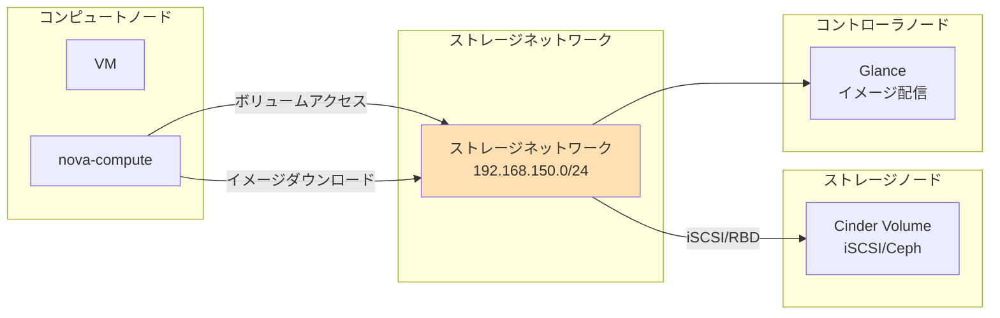

**主な通信**:

- ✅ Cinderボリュームのアタッチ（iSCSI、Ceph RBD等）
- ✅ Glanceからのイメージダウンロード
- ✅ VMのディスクI/O
- ✅ スナップショット作成

#### 設計のポイント ⭐

| 項目                 | 推奨           | 理由                          |
| -------------------- | -------------- | ----------------------------- |
| **専用ネットワーク** | 本番環境で必須 | 大容量転送による帯域圧迫防止  |
| **帯域幅**           | 10Gbps推奨     | ストレージI/Oのパフォーマンス |
| **Jumbo Frame**      | 推奨           | 大容量データ転送の効率化      |
| **冗長化**           | 本番環境で推奨 | ストレージ障害の回避          |

**IPアドレス例** 🎓:

```
ネットワーク: 192.168.150.0/24
- コントローラ（Glance）: 192.168.150.10
- コンピュート1: 192.168.150.31
- コンピュート2: 192.168.150.32
- ストレージ: 192.168.150.40
```

---

### 1.6 ネットワーク分離の重要性 ⭐

#### なぜネットワークを分離するのか

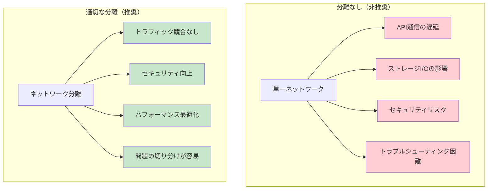

#### トラフィック分離のメリット

| メリット                   | 説明                                       | 重要度 |
| -------------------------- | ------------------------------------------ | ------ |
| **パフォーマンス向上**     | 各ネットワークが専用帯域を持ち、競合しない | ⭐      |
| **セキュリティ向上**       | 管理通信を外部から隔離                     | ✅      |
| **トラブルシューティング** | 問題の切り分けが容易                       | ⭐      |
| **スケーラビリティ**       | 各ネットワークを独立して拡張可能           | 💡      |

---

### 1.7 Layer-2 vs Layer-3の設計 💡

#### Layer-2設計（推奨されない）📚

```
全ノードが同じブロードキャストドメイン

デメリット:
- ブロードキャストストームのリスク
- スケールしにくい
- 障害の影響範囲が広い
```

#### Layer-3設計（推奨）⭐

```
各ネットワークをルーティングで分離

メリット:
- ブロードキャストドメインの分離
- スケーラビリティ向上
- 障害の影響を局所化
```

---

## 2. ネットワークタイプの種類と選択

OpenStackのML2プラグインは、**6種類のネットワークタイプ**をサポートしています。

### 2.1 ネットワークタイプの概要 ✅

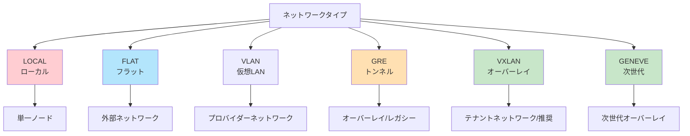

| タイプ     | 状態   | 用途                     | スケール     | 推奨度 |
| ---------- | ------ | ------------------------ | ------------ | ------ |
| **LOCAL**  | 非推奨 | 単一ノード               | 極小         | ❌      |
| **FLAT**   | 成熟   | 外部ネットワーク         | 低           | ✅      |
| **VLAN**   | 成熟   | プロバイダーネットワーク | 中（4094）   | ⭐      |
| **GRE**    | 準成熟 | オーバーレイ（レガシー） | 高           | △      |
| **VXLAN**  | 成熟   | テナントネットワーク     | 高（1600万） | ✅      |
| **GENEVE** | 発展中 | 次世代オーバーレイ       | 非常に高     | 💡      |

---

### 2.2 LOCAL（ローカル）❌ 📚

**LOCALタイプ**は、単一ノード内のみでVMが通信できる最も基本的なネットワークタイプです。

#### 特徴

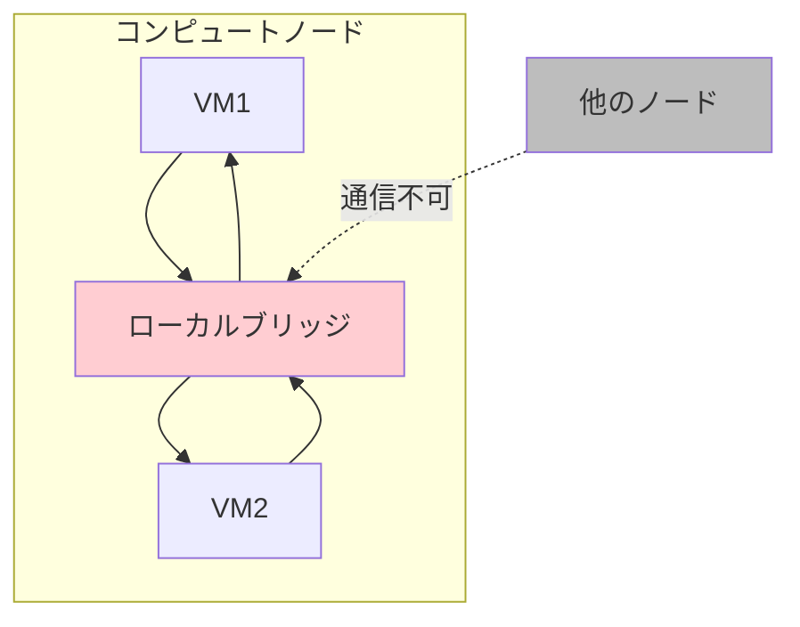

| 項目                 | 内容             |
| -------------------- | ---------------- |
| **スコープ**         | 単一ノード内のみ |
| **分離**             | なし             |
| **スケール**         | 極めて低い       |
| **物理スイッチ設定** | 不要             |
| **マルチテナント**   | 非対応           |

#### 問題点と非推奨理由 ❌

OpenStackコミュニティでは、LOCALタイプを**非推奨にする計画**があります：

**問題点**:

1. **制御不可**: 正確なネットワークタイプを制御できない
2. **セグメントID競合**: ローカルで割り当てられたIDが中央のNeutronと競合する可能性
3. **実用性なし**: 単一ノード内通信のみで実用的ではない

#### 使用例（参考のみ）📚

```bash
# LOCALネットワークの作成（非推奨）
openstack network create \
  --provider-network-type local \
  local-network
```

#### 推奨用途

- ❌ 本番環境
- ❌ 学習環境
- 🧪 デバッグ・テストのみ

---

### 2.3 FLAT（フラット）✅ 🎓

**FLATタイプ**は、VLANタグなしの単一L2セグメントを提供します。

#### 特徴

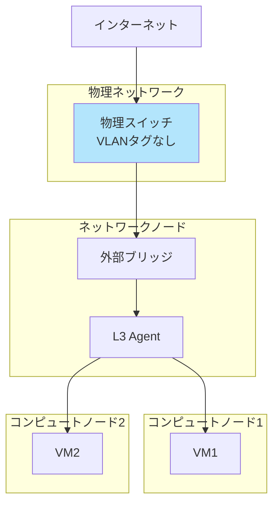

| 項目                 | 内容                       |
| -------------------- | -------------------------- |
| **スコープ**         | 全ノード                   |
| **分離**             | なし                       |
| **VLANタグ**         | なし                       |
| **物理スイッチ設定** | シンプル（タグなしポート） |
| **マルチテナント**   | 非対応                     |
| **複数ネットワーク** | 物理NIC数に依存            |

#### 主な用途 ⭐

**外部ネットワーク接続**に最適：

```
用途:
✅ インターネットへの接続
✅ Floating IPの提供
✅ 既存の物理ネットワークとの統合

理由:
- シンプルで理解しやすい
- 物理スイッチの設定が不要
- トラブルシューティングが容易
```

#### 使用例 🎓

```bash
# 外部ネットワークの作成（FLAT）
openstack network create \
  --provider-network-type flat \
  --provider-physical-network physnet1 \
  --external \
  external-network

# サブネットの作成
openstack subnet create \
  --network external-network \
  --subnet-range 192.168.1.0/24 \
  --gateway 192.168.1.1 \
  --allocation-pool start=192.168.1.201,end=192.168.1.220 \
  external-subnet
```

#### メリット・デメリット

**✅ メリット**:

- 設定が非常にシンプル
- 物理ネットワークと直接統合
- パフォーマンスが高い（オーバーヘッドなし）
- デバッグが容易

**❌ デメリット**:

- マルチテナント分離なし
- スケールしにくい（物理NIC数に制限）
- 複数の独立したネットワークを作れない

#### 推奨用途

- ✅ **外部ネットワーク（学習・本番）**
- ✅ 単純なネットワーク構成
- ❌ テナントネットワーク
- ❌ 大規模マルチテナント環境

---

### 2.4 VLAN（仮想LAN）⭐ 🏢

**VLANタイプ**は、802.1Q VLANタグを使用してネットワークを分離します。

#### 特徴

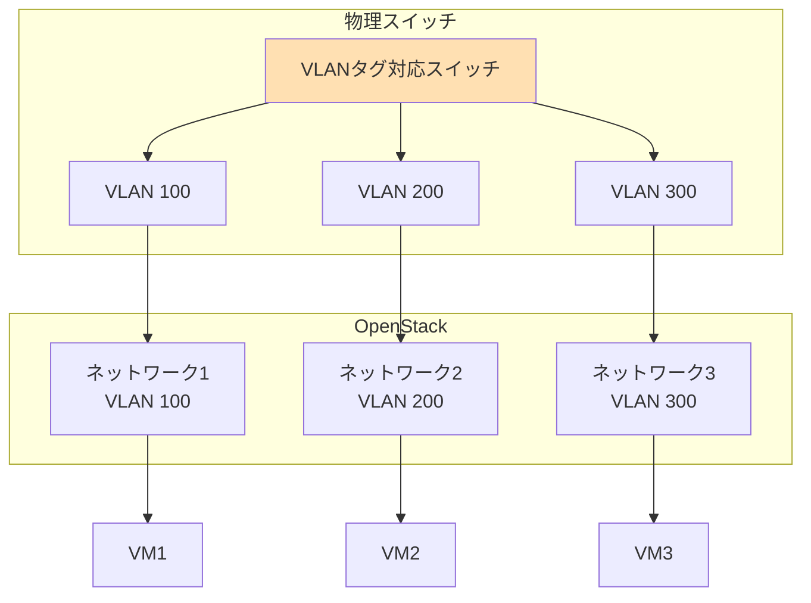

| 項目                   | 内容                   |
| ---------------------- | ---------------------- |
| **スコープ**           | 全ノード               |
| **分離**               | VLAN ID（12bit）で分離 |
| **最大ネットワーク数** | 4094                   |
| **物理スイッチ設定**   | 必要（トランクポート） |
| **マルチテナント**     | 対応                   |
| **オーバーヘッド**     | なし                   |

#### VLANの仕組み ⭐

```
Ethernet Frame:
[Dest MAC][Src MAC][Type][Data][FCS]

↓ VLANタグ追加

802.1Q Tagged Frame:
[Dest MAC][Src MAC][VLAN Tag][Type][Data][FCS]
                    ~~~~~~~~
                    12bit VLAN ID
                    (1-4094)
```

#### 使用例 💡

```bash
# VLANネットワークの作成
openstack network create \
  --provider-network-type vlan \
  --provider-physical-network physnet1 \
  --provider-segment 100 \
  tenant-network-vlan100

# サブネットの作成
openstack subnet create \
  --network tenant-network-vlan100 \
  --subnet-range 10.0.100.0/24 \
  tenant-subnet-vlan100
```

#### 物理スイッチの設定要件 ⭐

**トランクポート設定が必須**:

```
# Cisco スイッチの例
interface GigabitEthernet0/1
  switchport mode trunk
  switchport trunk allowed vlan 100,200,300
  switchport trunk native vlan 1
```

#### メリット・デメリット

**✅ メリット**:

- 物理ネットワークで実績豊富
- パフォーマンスが高い（オーバーヘッドなし）
- ハードウェアサポートが充実
- トラブルシューティングツールが豊富

**❌ デメリット**:

- 最大4094ネットワーク（大規模環境では不足）
- 物理スイッチの設定が必要
- ネットワーク管理者との調整が必要
- 物理インフラに依存

#### 推奨用途

- ✅ **本番環境のプロバイダーネットワーク**
- ✅ 既存VLANインフラとの統合
- ✅ パフォーマンス重視の環境
- △ 学習環境（物理スイッチ設定が必要）
- ❌ 超大規模マルチテナント（4094の制限）

---

### 2.5 GRE（Generic Routing Encapsulation）💡 📚

**GREタイプ**は、L2-in-L3トンネリングでオーバーレイネットワークを実現します。

#### 特徴

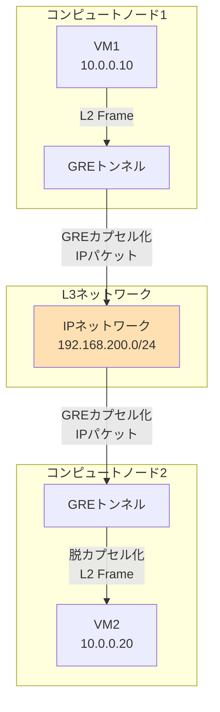

| 項目                   | 内容                 |
| ---------------------- | -------------------- |
| **スコープ**           | 全ノード（L3経由）   |
| **分離**               | GRE Key（32bit）     |
| **最大ネットワーク数** | 約42億               |
| **物理スイッチ設定**   | 不要（IP到達性のみ） |
| **マルチテナント**     | 対応                 |
| **オーバーヘッド**     | あり（約24バイト）   |
| **状態**               | 準成熟（非推奨傾向） |

#### GREカプセル化の仕組み 💡

```
元のL2フレーム:
[Ethernet Header][IP Packet][Data]

↓ GREカプセル化

カプセル化後:
[Outer IP Header][GRE Header][Inner Ethernet Header][IP Packet][Data]
                 ~~~~~~~~~~~
                 GRE Key (32bit)
```

#### メリット・デメリット

**✅ メリット**:

- 物理スイッチの設定不要
- 大規模スケール可能（VLANより多い）
- マルチテナント対応

**❌ デメリット**:

- VXLANより古い技術
- パフォーマンスがVXLANより劣る傾向
- 一部の環境でサポート状況が不明
- **新規採用は推奨されない**

#### 使用例（参考のみ）📚

```bash
# GREネットワークの作成（非推奨）
openstack network create \
  --provider-network-type gre \
  tenant-network-gre
```

#### 推奨用途

- ❌ 新規構築（VXLANを推奨）
- 🧪 既存GRE環境の維持のみ
- 📚 学習・理解目的

**注意**: GREプロバイダーネットワークのステータスは「未成熟（immature）」となっており、新規採用は推奨されません。

---

### 2.6 VXLAN（Virtual Extensible LAN）✅ 🎓🏢

**VXLANタイプ**は、現在の**主流オーバーレイ技術**で、テナントネットワークに最適です。

#### 特徴

```mermaid
graph TB
    subgraph "コンピュートノード1<br/>192.168.200.31"
        VM1[VM1<br/>10.0.0.10<br/>VXLAN 1000]
        VTEP1[VTEP<br/>VXLANカプセル化]
    end
    
    subgraph "物理ネットワーク<br/>L3 IPネットワーク"
        L3Net[UDP/IP Network]
    end
    
    subgraph "コンピュートノード2<br/>192.168.200.32"
        VM2[VM2<br/>10.0.0.20<br/>VXLAN 1000]
        VTEP2[VTEP<br/>VXLAN脱カプセル化]
    end
    
    VM1 -->|Ethernet Frame| VTEP1
    VTEP1 -->|UDP(4789)<br/>VXLAN Header<br/>VNI=1000| L3Net
    L3Net -->|UDP(4789)<br/>VXLAN Header<br/>VNI=1000| VTEP2
    VTEP2 -->|Ethernet Frame| VM2
    
    style L3Net fill:#c8e6c9
    style VTEP1 fill:#b3e5fc
    style VTEP2 fill:#b3e5fc
```

| 項目                   | 内容                 |
| ---------------------- | -------------------- |
| **スコープ**           | 全ノード（L3経由）   |
| **分離**               | VNI（24bit）         |
| **最大ネットワーク数** | 約1600万             |
| **物理スイッチ設定**   | 不要（IP到達性のみ） |
| **マルチテナント**     | 完全対応             |
| **オーバーヘッド**     | あり（約50バイト）   |
| **ポート**             | UDP 4789             |
| **状態**               | 成熟・推奨           |

#### VXLANカプセル化の詳細 ⭐

```
元のL2フレーム:
[Ethernet Header][IP Packet][Data]

↓ VXLANカプセル化

完全なパケット構造:
[Outer Ethernet Header]     - 物理ネットワークのL2
[Outer IP Header]           - 送信元/宛先 VTEP IP
[Outer UDP Header]          - ポート 4789
[VXLAN Header]              - VNI (24bit) ← ネットワークID
[Inner Ethernet Header]     - VM間の元のL2
[Inner IP Packet]           - VM間の元のIP
[Data]                      - 実際のデータ
```

**VNI (VXLAN Network Identifier)**:

- 24ビット = 約1600万の一意なネットワークID
- VLANの4094制限を大幅に超える

#### MTU設定の重要性 ⭐

```
標準Ethernet MTU: 1500バイト
VXLANオーバーヘッド: 約50バイト
---
推奨設定:
物理ネットワークMTU: 1550バイト以上
VM内部MTU: 1450バイト（安全のため）

または:
Jumbo Frame: 9000バイト（パフォーマンス重視）
```

#### 使用例 🎓

```bash
# VXLANネットワークの作成
openstack network create \
  --provider-network-type vxlan \
  tenant-network

# サブネットの作成
openstack subnet create \
  --network tenant-network \
  --subnet-range 10.0.0.0/24 \
  --gateway 10.0.0.1 \
  tenant-subnet
```

#### メリット・デメリット

**✅ メリット**:

- **大規模スケール**（1600万ネットワーク）
- **マルチテナント完全対応**
- 物理スイッチ設定不要（IP到達性のみ）
- 物理インフラから独立
- **業界標準**（RFC 7348）
- 豊富なツール・実績

**❌ デメリット**:

- MTU設定の考慮が必要
- わずかなオーバーヘッド
- デバッグがやや複雑（カプセル化のため）

#### 推奨用途

- ✅ **テナントネットワーク（最推奨）**
- ✅ 学習環境
- ✅ 本番環境
- ✅ マルチテナント環境
- ✅ 大規模クラウド

---

### 2.7 GENEVE（Generic Network Virtualization Encapsulation）💡 📚

**GENEVEタイプ**は、VXLANの後継として設計された**次世代オーバーレイプロトコル**です。

#### 特徴

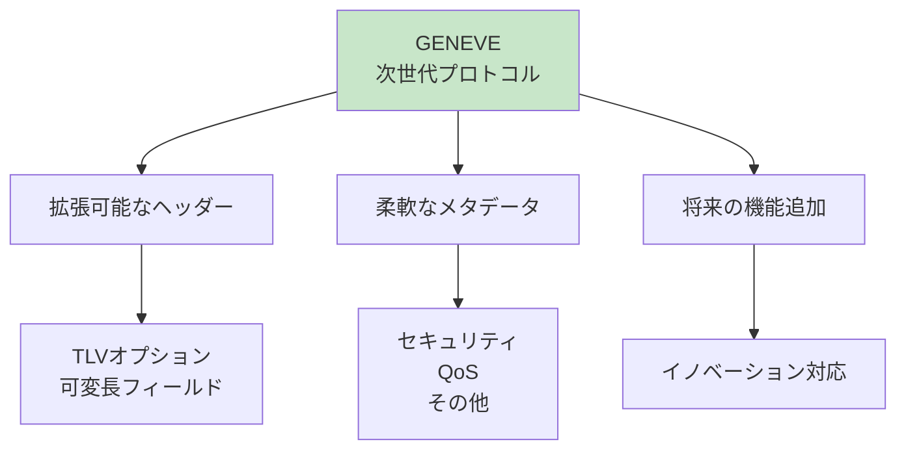

| 項目                   | 内容               |
| ---------------------- | ------------------ |
| **スコープ**           | 全ノード（L3経由） |
| **分離**               | VNI（24bit）       |
| **最大ネットワーク数** | 約1600万+          |
| **物理スイッチ設定**   | 不要               |
| **マルチテナント**     | 完全対応           |
| **オーバーヘッド**     | 可変（拡張可能）   |
| **ポート**             | UDP 6081           |
| **状態**               | 発展中             |

#### VXLANとの比較 💡

| 項目           | VXLAN    | GENEVE                |
| -------------- | -------- | --------------------- |
| **標準化**     | RFC 7348 | RFC 8926              |
| **ヘッダー**   | 固定長   | 可変長（拡張可能）    |
| **メタデータ** | 限定的   | 豊富（TLVオプション） |
| **将来性**     | 成熟     | 発展中                |
| **採用状況**   | 広範囲   | 増加中                |
| **推奨度**     | ✅ 現在   | 💡 将来                |

#### GENEVEの利点 ⭐

**拡張可能なヘッダー**:

```
VXLANは固定ヘッダー → 将来の機能追加が困難

GENEVEは可変長ヘッダー（TLV形式）:
- セキュリティポリシー
- QoS情報
- サービスチェイン
- 将来の新機能
→ すべて標準的な方法で追加可能
```

#### 使用例（参考）📚

```bash
# GENEVEネットワークの作成
openstack network create \
  --provider-network-type geneve \
  tenant-network-geneve
```

#### メリット・デメリット

**✅ メリット**:

- 拡張性が非常に高い
- 将来の機能追加に対応
- VXLANの欠点を改善
- 複数ベンダーが支援

**❌ デメリット**:

- まだ発展途上
- 採用実績がVXLANより少ない
- 一部ツールで未対応

#### 推奨用途

- 💡 将来を見据えた新規構築
- 📚 最新技術の学習
- ❌ 現時点での学習環境（VXLANで十分）
- 💡 本番環境（2-3年後に主流予測）

---

### 2.8 ネットワークタイプの総合比較 ✅

| タイプ     | スケール | 物理SW設定 | マルチテナント | オーバーヘッド | 推奨環境     |
| ---------- | -------- | ---------- | -------------- | -------------- | ------------ |
| **LOCAL**  | ❌        | 不要       | ❌              | なし           | ❌ 非推奨     |
| **FLAT**   | ❌        | 不要       | ❌              | なし           | ✅ 外部NW     |
| **VLAN**   | 4094     | 必要       | ✅              | なし           | ⭐ 本番       |
| **GRE**    | 42億     | 不要       | ✅              | あり           | △ レガシー   |
| **VXLAN**  | 1600万   | 不要       | ✅              | あり           | ✅ テナントNW |
| **GENEVE** | 1600万+  | 不要       | ✅              | 可変           | 💡 将来       |

#### 学習環境での推奨構成 🎓

```
外部ネットワーク: FLAT
  ↓
  シンプルで理解しやすい
  物理ネットワークと直接接続

テナントネットワーク: VXLAN
  ↓
  現在の主流技術
  マルチテナント対応
  実践的なスキル習得
```

#### 本番環境での推奨構成 🏢

```
外部ネットワーク: FLAT または VLAN
  ↓
  既存インフラとの統合

テナントネットワーク: VXLAN（主流）または GENEVE（将来）
  ↓
  大規模スケール
  マルチテナント対応
```

---

## 3. Neutronアーキテクチャの深堀り

### 3.1 プロバイダーネットワーク vs テナントネットワーク ⭐

OpenStackには**2種類のネットワーク**があります：

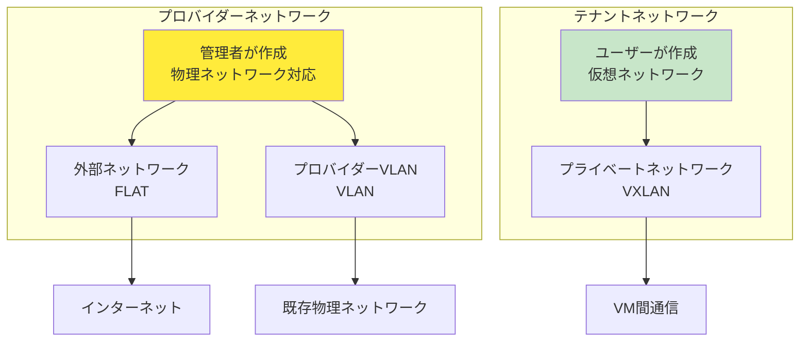

#### プロバイダーネットワーク

```
作成者: 管理者（admin権限）
用途: 外部接続、既存インフラとの統合
特徴:
- 物理ネットワークに直接マッピング
- 全テナントで共有可能
- FLAT、VLANタイプが一般的

例:
- 外部ネットワーク（インターネット接続）
- 社内ネットワーク接続
```

#### テナントネットワーク

```
作成者: 各プロジェクトのユーザー
用途: プロジェクト内のプライベートネットワーク
特徴:
- 他のプロジェクトから完全分離
- ユーザーが自由に作成・削除可能
- VXLAN、GENEVEタイプが一般的

例:
- Webサーバー用プライベートネットワーク
- DBサーバー用プライベートネットワーク
```

---

### 3.2 Neutronのコンポーネント構成 ⭐

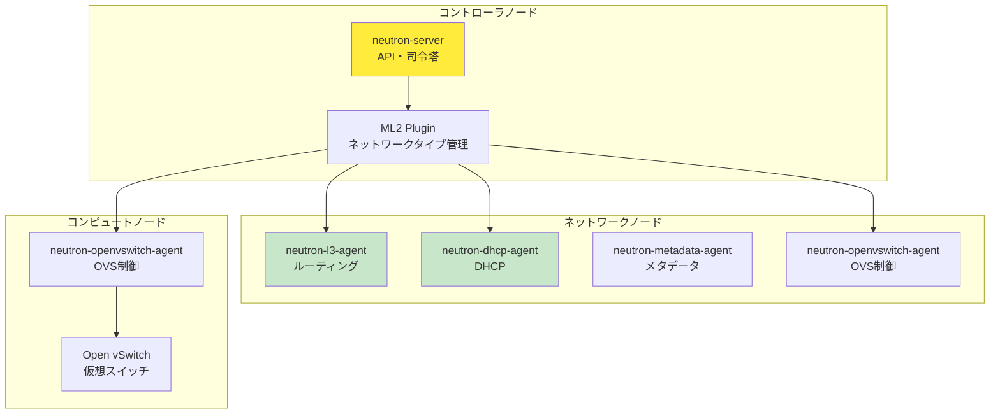

#### ML2 (Modular Layer 2) Plugin ✅

**ML2プラグイン**は、Neutronのコアプラグインで、複数のネットワークタイプを統一的に管理します。

**Type Drivers**:

- flat, vlan, vxlan, gre, geneve, local
- 使用するネットワークタイプを選択

**Mechanism Drivers**:

- openvswitch（Open vSwitch）
- linuxbridge（Linux Bridge）
- その他のSDNコントローラー

---

### 3.3 セキュリティグループとFirewall ⭐

#### セキュリティグループ

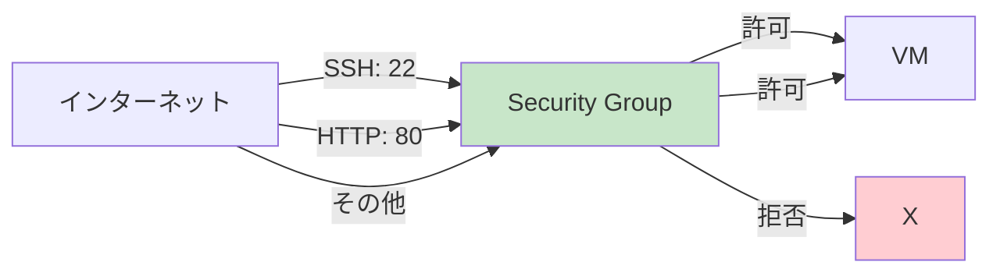

**セキュリティグループ**は、VMレベルの**ステートフルファイアウォール**：

```
動作:
- デフォルトは全て拒否
- ルールで明示的に許可
- ステートフル（戻りトラフィック自動許可）

適用範囲:
- VMの仮想NIC（ポート）に適用
```

**設定例**:

```bash
# セキュリティグループの作成
openstack security group create web-sg

# SSH許可
openstack security group rule create \
  --protocol tcp --dst-port 22 \
  --remote-ip 0.0.0.0/0 web-sg

# HTTP許可
openstack security group rule create \
  --protocol tcp --dst-port 80 \
  --remote-ip 0.0.0.0/0 web-sg
```

#### FWaaS (Firewall as a Service) 💡

**FWaaS**は、ルーターレベルのファイアウォール：

```
動作:
- ルーター単位で適用
- ネットワーク境界でのフィルタリング

適用範囲:
- 仮想ルーター全体
```

---

## 4. 学習環境でのネットワーク設計例

### 4.1 最小構成（2 NIC）🎓

**最もシンプル**な構成：

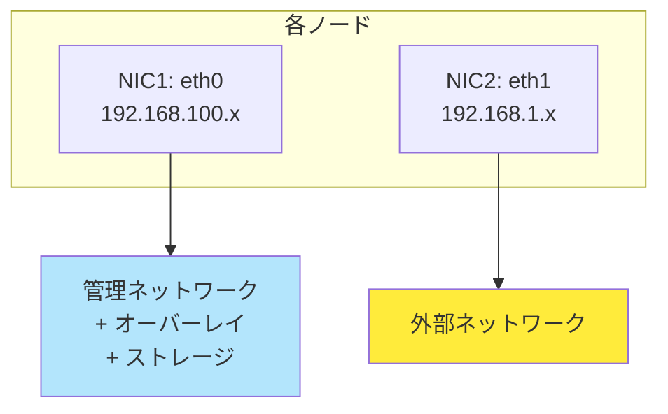

| NIC      | ネットワーク                     | 用途               |
| -------- | -------------------------------- | ------------------ |
| **eth0** | 管理 + オーバーレイ + ストレージ | 内部通信全て       |
| **eth1** | 外部                             | インターネット接続 |

**メリット**:

- ✅ 最小のNIC数
- ✅ 設定が簡単

**デメリット**:

- ❌ トラフィック競合
- ❌ パフォーマンス低下のリスク

---

### 4.2 標準構成（3 NIC）⭐ 🎓

**推奨される学習環境**の構成：

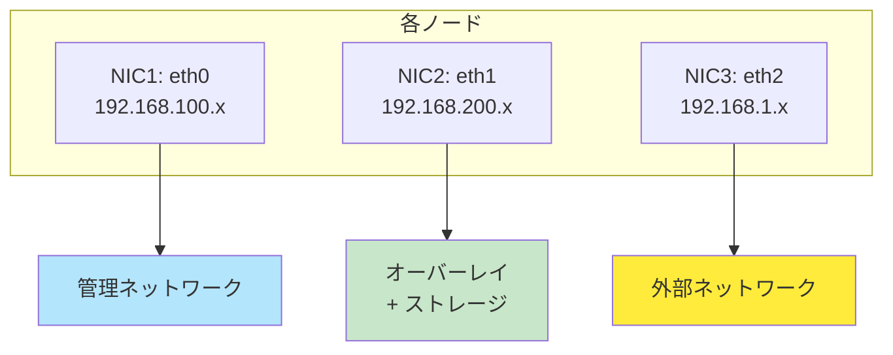

| NIC      | ネットワーク              | 用途                        | IPアドレス例     |
| -------- | ------------------------- | --------------------------- | ---------------- |
| **eth0** | 管理                      | API、DB、RabbitMQ           | 192.168.100.0/24 |
| **eth1** | オーバーレイ + ストレージ | VXLAN、Cinder、Glance       | 192.168.200.0/24 |
| **eth2** | 外部                      | インターネット、Floating IP | 192.168.1.0/24   |

**メリット**:

- ✅ 管理とデータの分離
- ✅ 理解しやすい
- ✅ パフォーマンス向上

**デメリット**:

- △ ストレージとオーバーレイが共有

---

### 4.3 完全分離構成（4 NIC）⭐ 🏢

**本番環境**や**詳細理解**を目的とした構成：

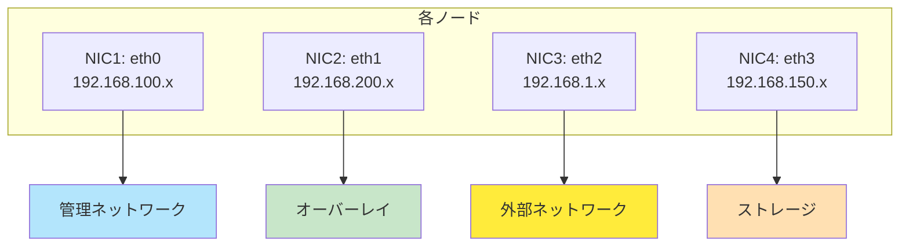

| NIC      | ネットワーク | 用途                        | IPアドレス例     |
| -------- | ------------ | --------------------------- | ---------------- |
| **eth0** | 管理         | API、DB、RabbitMQ           | 192.168.100.0/24 |
| **eth1** | オーバーレイ | VXLANトンネル               | 192.168.200.0/24 |
| **eth2** | 外部         | インターネット、Floating IP | 192.168.1.0/24   |
| **eth3** | ストレージ   | Cinder、Glance              | 192.168.150.0/24 |

**メリット**:

- ✅ 完全なトラフィック分離
- ✅ 最高のパフォーマンス
- ✅ 本番環境に近い

**デメリット**:

- ❌ NIC数が多い
- ❌ 設定が複雑

---

### 4.4 今回の学習環境構成 ✅ 🎓

**採用構成**: 標準構成（3 NIC）

#### ノード別のネットワーク構成

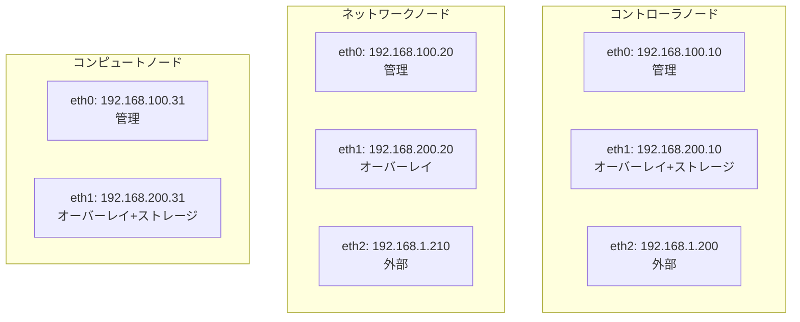

#### IPアドレス割り当て表

| ノード           | 管理（eth0）   | オーバーレイ（eth1） | 外部（eth2）  |
| ---------------- | -------------- | -------------------- | ------------- |
| **コントローラ** | 192.168.100.10 | 192.168.200.10       | 192.168.1.200 |
| **ネットワーク** | 192.168.100.20 | 192.168.200.20       | 192.168.1.210 |
| **コンピュート** | 192.168.100.31 | 192.168.200.31       | -             |

#### ネットワークタイプの選択

| ネットワーク | タイプ | 理由                 |
| ------------ | ------ | -------------------- |
| **外部**     | FLAT   | シンプル、学習に最適 |
| **テナント** | VXLAN  | 現在の主流、実践的   |

---

## まとめ

### Part 3で学んだこと ✅

1. **4つのネットワーク構成**
   - 管理、オーバーレイ、外部、ストレージ
   - 各ネットワークの役割と分離の重要性

2. **6種類のネットワークタイプ**
   - LOCAL（非推奨）、FLAT（外部向け）、VLAN（本番向け）
   - GRE（レガシー）、**VXLAN（テナント推奨）**、GENEVE（将来）

3. **Neutronアーキテクチャ**
   - Neutron ServerとL3/DHCP Agentの関係
   - プロバイダーネットワーク vs テナントネットワーク
   - セキュリティグループ

4. **学習環境のネットワーク設計**
   - 標準構成（3 NIC）を採用
   - FLAT（外部）+ VXLAN（テナント）

### 次のステップ 📚

Part 4では、OpenStackのシステム設計を学びます：

- ノード設計（All-in-One、マルチノード、HA構成）
- ストレージ設計（Cinder、Swift、Ceph）
- ハードウェア要件
- OS選択

---

**前へ**: [Part 2: OpenStackアーキテクチャの理解](02_architecture.md)  
**次へ**: [Part 4: システム設計ガイド](04_system_design.md)
