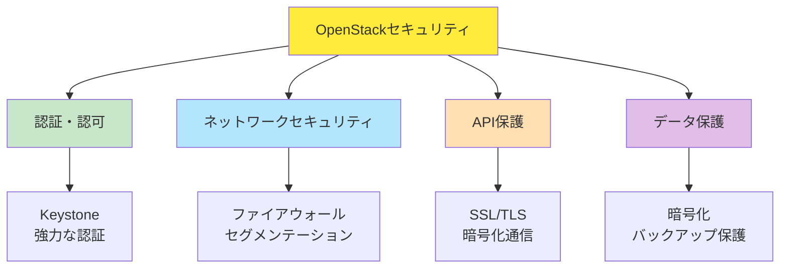
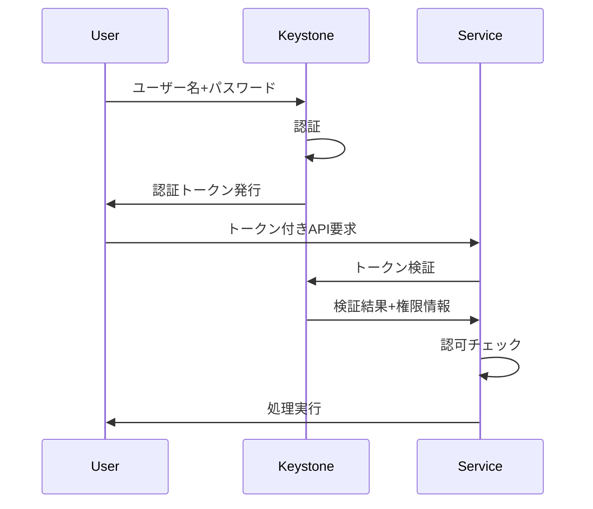
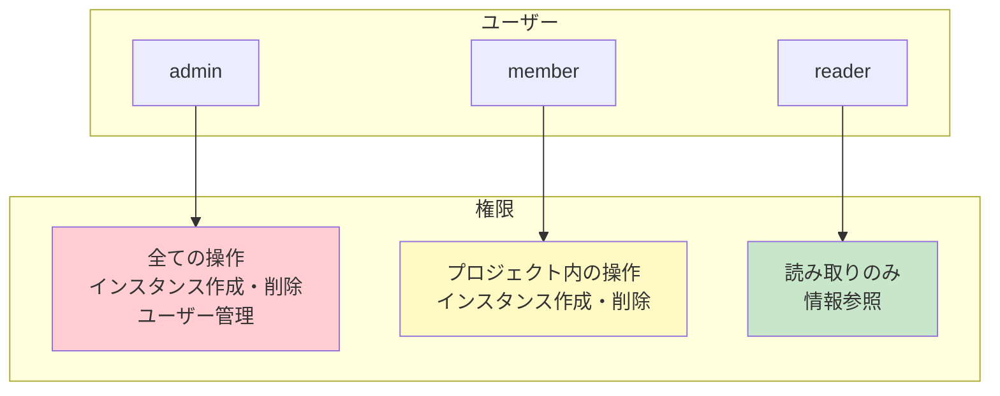
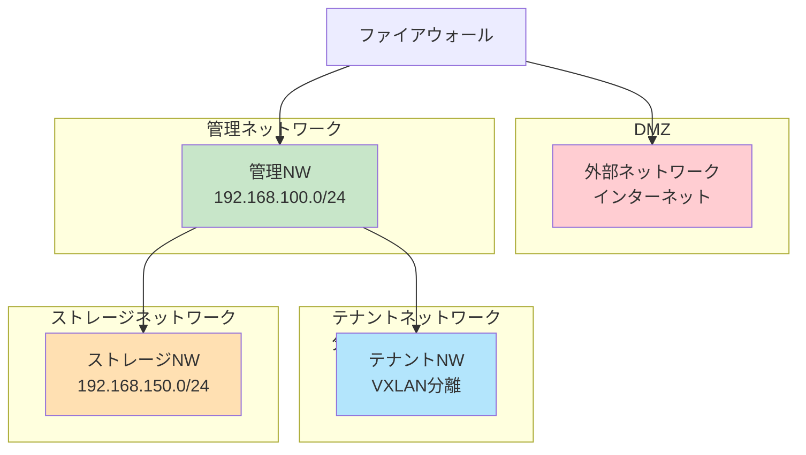
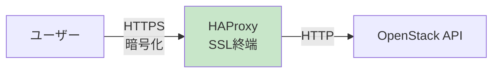
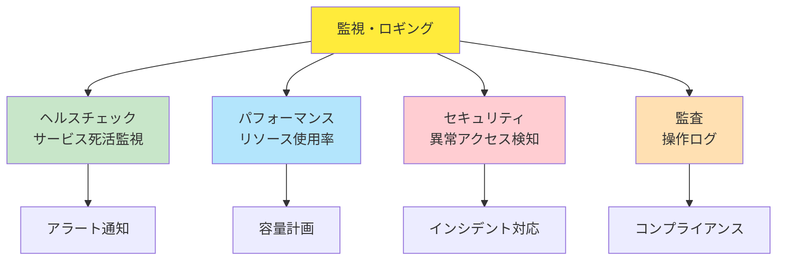
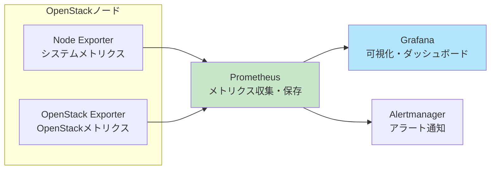
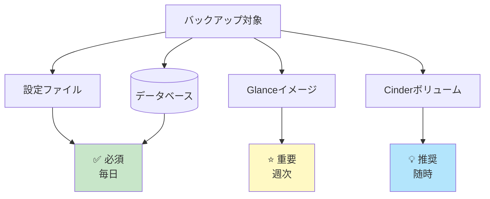

# Part 5: 運用・セキュリティ設計

## 目次

1. [セキュリティ設計](#1-セキュリティ設計)
2. [監視・ロギング](#2-監視ロギング)
3. [バックアップとディザスタリカバリ](#3-バックアップとディザスタリカバリ)
4. [その他の検討事項](#4-その他の検討事項)

---

## 1. セキュリティ設計

### 1.1 OpenStackセキュリティの重要性 ✅

OpenStackは、多くのコンポーネントとネットワーク通信で構成されているため、**セキュリティは設計段階から考慮**する必要があります。



---

### 1.2 認証とアクセス制御 ✅

#### Keystoneによる認証 ⭐

**Keystone**は、OpenStackの全サービスへのアクセスを制御する**中央認証サービス**です。



#### パスワードポリシー ⭐

**強力なパスワード**は基本中の基本：

| 項目             | 推奨設定                         |
| ---------------- | -------------------------------- |
| **最小文字数**   | 12文字以上                       |
| **複雑さ**       | 大文字・小文字・数字・記号を含む |
| **有効期限**     | 90日（本番環境）                 |
| **再利用制限**   | 直近5個のパスワードは使用不可    |
| **ロックアウト** | 5回失敗後にアカウントロック      |

**設定例**:

```ini
# /etc/keystone/keystone.conf
[security_compliance]
password_regex = ^(?=.*\d)(?=.*[a-z])(?=.*[A-Z])(?=.*\W).{12,}$
password_regex_description = パスワードは12文字以上で、大文字・小文字・数字・記号を含む必要があります
```

#### ロールベースのアクセス制御（RBAC）⭐

OpenStackは**ロール**でアクセス権限を管理：



**主なロール**:

| ロール     | 権限                       | 推奨用途       |
| ---------- | -------------------------- | -------------- |
| **admin**  | 全ての操作が可能           | システム管理者 |
| **member** | プロジェクト内の操作が可能 | 一般ユーザー   |
| **reader** | 読み取りのみ               | 監視・レポート |

**最小権限の原則** 💡:

```
各ユーザーには、業務に必要な最小限の権限のみを付与

例:
- 開発者: member（プロジェクト内のVM操作のみ）
- 監視担当: reader（情報参照のみ）
- インフラ管理者: admin（システム全体の管理）
```

#### 多要素認証（MFA）💡 🏢

**本番環境では推奨**:

```
認証要素の組み合わせ:
1. 知識: パスワード
2. 所持: TOTPトークン（Google Authenticator等）
3. 生体: 指紋認証（オプション）

設定:
Keystoneに外部認証（LDAP、Active Directory）を統合
TOTP（Time-based One-Time Password）を有効化
```

---

### 1.3 ネットワークセキュリティ ✅

#### ネットワークセグメンテーション ⭐

**トラフィックを分離**することで、セキュリティを向上：



**セグメンテーションの原則**:

1. **管理ネットワークは外部から隔離** ✅
   - プライベートIPアドレス使用
   - VPN経由でのみアクセス

2. **テナント間は完全分離** ✅
   - VXLANで論理的に分離
   - セキュリティグループで制御

3. **ストレージトラフィックは専用NW** 💡
   - 管理トラフィックと分離
   - 大容量データ転送の影響を回避

#### ファイアウォール設定 ⭐

**各ノードでファイアウォール**（firewalld / iptables）を設定：

**コントローラノード**:

```bash
# 管理ネットワークからのアクセスのみ許可
# MariaDB（3306）
firewall-cmd --add-rich-rule='rule family="ipv4" source address="192.168.100.0/24" port port="3306" protocol="tcp" accept' --permanent

# RabbitMQ（5672）
firewall-cmd --add-rich-rule='rule family="ipv4" source address="192.168.100.0/24" port port="5672" protocol="tcp" accept' --permanent

# Keystone API（5000）
firewall-cmd --add-service=http --permanent
firewall-cmd --add-service=https --permanent
```

**ネットワークノード**:

```bash
# L3 Agentの外部通信を許可
firewall-cmd --add-masquerade --permanent
```

#### IDS/IPS（侵入検知・防止）💡 🏢

**本番環境での推奨**:

```
ツール例:
- Snort: オープンソースIDS/IPS
- Suricata: 高性能IDS/IPS
- OSSEC: ホストベースIDS

配置:
- ネットワークノードに配置
- 外部ネットワークとの境界で監視
```

---

### 1.4 APIエンドポイントの保護 ⭐

#### SSL/TLS暗号化 ✅ 🏢

**本番環境では必須**、学習環境ではオプション：



**SSL証明書の種類**:

| 証明書             | 用途               | 推奨度         |
| ------------------ | ------------------ | -------------- |
| **Let's Encrypt**  | 無料証明書         | ✅ 学習・小規模 |
| **商用証明書**     | 信頼性の高い証明書 | 🏢 本番環境     |
| **自己署名証明書** | テスト用           | 🎓 学習のみ     |

**HAProxy設定例**:

```
frontend openstack_api
    bind *:443 ssl crt /etc/ssl/certs/openstack.pem
    default_backend api_servers

backend api_servers
    server controller1 192.168.100.10:5000 check
```

#### APIレート制限 💡

**DDoS攻撃対策**:

```ini
# Nova API設定例
[api]
rate_limit_strategy = keystone
rate_limit_requests = 100
rate_limit_period = 60
```

---

### 1.5 データ保護 💡

#### 保存データの暗号化 🏢

**機密データを暗号化**:

| データ種類            | 暗号化方法          | 推奨度     |
| --------------------- | ------------------- | ---------- |
| **Cinderボリューム**  | LUKS暗号化          | 💡 機密情報 |
| **Swiftオブジェクト** | サーバー側暗号化    | 💡 機密情報 |
| **データベース**      | 透過的暗号化（TDE） | 🏢 本番推奨 |
| **バックアップ**      | 暗号化バックアップ  | ✅ 必須     |

**Cinderボリューム暗号化の例**:

```bash
# 暗号化ボリュームタイプの作成
openstack volume type create LUKS
cinder encryption-type-create --cipher aes-xts-plain64 --key_size 256 --control_location front-end LUKS nova.volume.encryptors.luks.LuksEncryptor

# 暗号化ボリュームの作成
openstack volume create --size 10 --type LUKS encrypted-volume
```

#### Barbican（キー管理サービス）💡

**暗号鍵を安全に管理**:

```
Barbicanの役割:
- 暗号鍵の生成・保存
- 証明書の管理
- パスワードの安全な保管

連携:
- Cinder: ボリューム暗号化
- Swift: オブジェクト暗号化
- Octavia: SSL証明書管理
```

---

### 1.6 学習環境 vs 本番環境のセキュリティ ✅

| 項目                   | 学習環境 🎓             | 本番環境 🏢           |
| ---------------------- | ---------------------- | -------------------- |
| **パスワード**         | シンプルでOK           | 強力なパスワード必須 |
| **SSL/TLS**            | 自己署名証明書 or なし | 商用証明書必須       |
| **多要素認証**         | 不要                   | 推奨                 |
| **ファイアウォール**   | 基本設定               | 厳密な設定           |
| **IDS/IPS**            | 不要                   | 推奨                 |
| **暗号化**             | 不要                   | データに応じて必須   |
| **セグメンテーション** | 最小限                 | 完全分離             |
| **監査ログ**           | 基本のみ               | 詳細なログ必須       |

---

## 2. 監視・ロギング

### 2.1 監視の重要性 ✅

**監視**は、システムの健全性を保ち、問題を早期発見するために不可欠です。



---

### 2.2 ログ管理 ⭐

#### OpenStackのログ

**主要コンポーネントのログ**:

| コンポーネント   | ログパス                                 | 監視すべき内容                 |
| ---------------- | ---------------------------------------- | ------------------------------ |
| **Nova**         | `/var/log/nova/`                         | VM作成エラー、スケジュール失敗 |
| **Neutron**      | `/var/log/neutron/`                      | ネットワーク接続エラー、L3障害 |
| **Cinder**       | `/var/log/cinder/`                       | ボリューム作成エラー、接続失敗 |
| **Keystone**     | `/var/log/keystone/`                     | 認証失敗、不正アクセス試行     |
| **Apache/Nginx** | `/var/log/apache2/` or `/var/log/nginx/` | APIアクセスログ、HTTPエラー    |

#### ログレベル ⭐

```
ログレベルの種類:
DEBUG: 詳細なデバッグ情報（開発・トラブルシューティング）
INFO: 一般的な情報（通常動作の記録）
WARNING: 警告（問題の可能性）
ERROR: エラー（機能不全）
CRITICAL: 致命的エラー（システム停止）

推奨設定:
学習環境: INFO or DEBUG
本番環境: WARNING or INFO
```

**設定例**:

```ini
# /etc/nova/nova.conf
[DEFAULT]
log_dir = /var/log/nova
debug = false  # 本番環境ではfalse
log_level = INFO
```

#### 監視すべき重要なイベント ✅

**セキュリティ関連**:

- ✅ 認証失敗の試行
- ✅ 権限のない操作の試行
- ✅ 予期しないサービスの起動・停止

**運用関連**:

- ✅ サービスのクラッシュ
- ✅ リソース枯渇（ディスク、メモリ）
- ✅ API応答時間の遅延

**異常検知**:

- ✅ ログが生成されていない（サービス停止の可能性）
- ✅ 突然のエラー増加
- ✅ 異常なトラフィックパターン

#### ログの確認方法 🎓

```bash
# サービスログの確認（systemd環境）
journalctl -u nova-compute -f

# ログファイルの確認
tail -f /var/log/nova/nova-compute.log

# エラーのみ表示
grep ERROR /var/log/nova/nova-compute.log

# 特定期間のログ
journalctl -u nova-compute --since "2025-10-30 10:00" --until "2025-10-30 11:00"
```

---

### 2.3 監視ツール 💡

#### Horizon Dashboard（基本監視）✅ 🎓

**OpenStack標準のWeb管理画面**:

```
監視可能な項目:
✅ インスタンスの状態
✅ リソース使用量（CPU、メモリ、ディスク）
✅ ネットワークトラフィック
✅ サービスの稼働状況

メリット:
- 追加ツール不要
- 直感的なUI
- 基本的な監視に十分

デメリット:
- アラート機能が限定的
- 詳細なメトリクスには不向き
```

#### Prometheus + Grafana ⭐ 🏢

**本番環境で推奨される監視スタック**:



**監視項目例**:

- システムメトリクス: CPU、メモリ、ディスク使用率
- OpenStackメトリクス: インスタンス数、ボリューム数、APIレスポンス時間
- ネットワークメトリクス: 帯域幅、パケットロス

#### Ceilometer / Gnocchi 💡 📚

**OpenStack純正のテレメトリーサービス**:

```
機能:
- リソース使用量の収集
- 課金データの生成
- パフォーマンス分析

注意:
- 高いリソース要件
- 複雑な設定
- 学習環境では不要
```

#### その他の監視ツール 📚

| ツール        | 用途         | 推奨度           |
| ------------- | ------------ | ---------------- |
| **Nagios**    | サービス監視 | 💡 レガシー環境   |
| **Zabbix**    | 統合監視     | 💡 既存Zabbix環境 |
| **ELK Stack** | ログ分析     | 💡 大規模ログ分析 |

---

### 2.4 学習環境での推奨監視 🎓

**最小限の監視**で十分：

```
必須:
✅ Horizon Dashboard
✅ journalctl / syslog
✅ OpenStack CLIでの状態確認

オプション:
△ Prometheus + Grafana（学習後期）

不要:
❌ Ceilometer
❌ ELK Stack
❌ 商用監視ツール
```

**基本的なヘルスチェック**:

```bash
# サービスの状態確認
systemctl status nova-compute
systemctl status neutron-l3-agent

# OpenStackサービスの状態
openstack compute service list
openstack network agent list

# ログの確認
journalctl -u nova-compute --since "1 hour ago"
```

---

## 3. バックアップとディザスタリカバリ

### 3.1 バックアップ戦略 ⭐

**バックアップは運用の基本**です。



---

### 3.2 バックアップ対象 ✅

#### 設定ファイル ✅

**最も重要なバックアップ対象**:

```
バックアップすべきディレクトリ:
/etc/nova/
/etc/neutron/
/etc/cinder/
/etc/glance/
/etc/keystone/
/etc/horizon/

頻度: 毎日 or 設定変更時
保存先: 別サーバーまたはオブジェクトストレージ
```

**バックアップスクリプト例**:

```bash
#!/bin/bash
# OpenStack設定ファイルのバックアップ

BACKUP_DIR="/backup/openstack-config"
DATE=$(date +%Y%m%d)

# ディレクトリ作成
mkdir -p ${BACKUP_DIR}/${DATE}

# 設定ファイルをコピー
tar czf ${BACKUP_DIR}/${DATE}/nova-config.tar.gz /etc/nova/
tar czf ${BACKUP_DIR}/${DATE}/neutron-config.tar.gz /etc/neutron/
tar czf ${BACKUP_DIR}/${DATE}/cinder-config.tar.gz /etc/cinder/
tar czf ${BACKUP_DIR}/${DATE}/glance-config.tar.gz /etc/glance/
tar czf ${BACKUP_DIR}/${DATE}/keystone-config.tar.gz /etc/keystone/

# 7日以上前のバックアップを削除
find ${BACKUP_DIR} -type d -mtime +7 -exec rm -rf {} \;
```

#### データベース ✅

**全ての状態情報を保持**:

```
バックアップすべきデータベース:
- nova
- nova_api
- nova_cell0
- neutron
- cinder
- glance
- keystone

頻度: 毎日
方法: mysqldump または mysqlbackup
```

**バックアップスクリプト例**:

```bash
#!/bin/bash
# OpenStackデータベースのバックアップ

BACKUP_DIR="/backup/openstack-db"
DATE=$(date +%Y%m%d)

# 全データベースをバックアップ
mysqldump --all-databases --single-transaction \
  --quick --lock-tables=false \
  > ${BACKUP_DIR}/openstack-db-${DATE}.sql

# 圧縮
gzip ${BACKUP_DIR}/openstack-db-${DATE}.sql

# 7日以上前のバックアップを削除
find ${BACKUP_DIR} -name "*.sql.gz" -mtime +7 -delete
```

#### Glanceイメージ ⭐

```
バックアップ対象:
- OSイメージファイル
- イメージメタデータ（データベースに含まれる）

頻度: 週次 or イメージ追加時
保存先: 別ストレージまたはオブジェクトストレージ
```

**バックアップ方法**:

```bash
# イメージディレクトリのバックアップ
tar czf glance-images-$(date +%Y%m%d).tar.gz /var/lib/glance/images/
```

#### Cinderボリューム 💡

```
バックアップ方法:
1. Cinderスナップショット機能
2. スナップショットからボリューム作成
3. 定期的なバックアップジョブ

頻度: データの重要度に応じて
```

**スナップショット作成**:

```bash
# ボリュームのスナップショット
openstack volume snapshot create --volume my-volume my-snapshot

# スナップショットからボリューム作成
openstack volume create --snapshot my-snapshot restored-volume
```

---

### 3.3 バックアップのベストプラクティス ⭐

#### 3-2-1ルール 🏢

```
3: データのコピーを3つ作成
2: 異なるメディアに2つ保存
1: 1つはオフサイト（別の場所）に保存

例:
コピー1: 本番サーバー
コピー2: バックアップサーバー（同じデータセンター）
コピー3: クラウドストレージ or リモートサイト
```

#### 暗号化 ✅

```
バックアップは必ず暗号化:
- 保存時の暗号化
- 転送時の暗号化（rsync over SSH等）

ツール例:
- GPG: ファイル暗号化
- Restic: 暗号化バックアップツール
```

**暗号化バックアップ例**:

```bash
# GPGで暗号化
tar czf - /etc/nova/ | gpg --encrypt --recipient admin@example.com > nova-config.tar.gz.gpg

# 復号化
gpg --decrypt nova-config.tar.gz.gpg | tar xzf -
```

#### テストリストア ⭐

```
バックアップは定期的にテスト:
- 月次でリストアテスト実施
- 手順書の更新
- リストア時間の測定

重要: バックアップできていてもリストアできなければ意味がない
```

---

### 3.4 ディザスタリカバリ（DR）💡 🏢

#### RTO と RPO 🏢

```
RTO (Recovery Time Objective):
- システム復旧までの許容時間
- 例: 4時間以内にサービス再開

RPO (Recovery Point Objective):
- データ損失の許容範囲
- 例: 1時間分のデータ損失まで許容

設計:
RTO/RPOに基づいてバックアップ頻度と復旧手順を決定
```

#### DR戦略 🏢

| 戦略                   | 説明               | RTO    | RPO   | コスト |
| ---------------------- | ------------------ | ------ | ----- | ------ |
| **コールドスタンバイ** | バックアップのみ   | 数日   | 1日   | 低     |
| **ウォームスタンバイ** | 最小構成を常時稼働 | 数時間 | 1時間 | 中     |
| **ホットスタンバイ**   | フル構成を常時稼働 | 数分   | 数秒  | 高     |

#### 学習環境でのバックアップ 🎓

**最小限で十分**:

```
必須:
✅ 設定ファイルのバックアップ
✅ データベースのバックアップ

推奨:
💡 Vagrantfileの保存（再構築用）

不要:
❌ DR戦略
❌ 複雑なバックアップスケジュール
❌ オフサイトバックアップ
```

---

## 4. その他の検討事項

### 4.1 コンプライアンスと規制 💡 🏢

**本番環境では重要**、学習環境では不要。

#### 主な規制・標準

| 規制/標準   | 概要                                       | 対象                     |
| ----------- | ------------------------------------------ | ------------------------ |
| **GDPR**    | EU一般データ保護規則                       | EU市民のデータを扱う組織 |
| **HIPAA**   | 医療情報保護法（米国）                     | 医療データを扱う組織     |
| **PCI DSS** | クレジットカード業界データセキュリティ基準 | カード決済を扱う組織     |
| **SOC 2**   | サービス組織統制報告書                     | クラウドサービス提供者   |

#### Keystoneでのコンプライアンス対応 💡

```
機能:
- 監査ログ: 全ての操作を記録
- アクセス制御: 最小権限の原則
- データ保持ポリシー: ログの保存期間設定

設定例:
[audit]
enabled = true
audit_map_file = /etc/keystone/api_audit_map.conf
```

---

### 4.2 容量計画（キャパシティプランニング）💡 🏢

#### リソース監視と予測

```
監視項目:
- コンピュートノードのCPU/メモリ使用率
- ストレージの使用量と増加率
- ネットワーク帯域の使用状況

予測:
現在の使用傾向から将来のリソース需要を予測
例: 月10%増加 → 6ヶ月後に容量不足
```

#### スケールアウトの計画

```
閾値設定:
- CPU使用率 70%でアラート
- メモリ使用率 80%でアラート
- ディスク使用率 85%でアラート

アクション:
- コンピュートノード追加
- ストレージ拡張
- ネットワーク帯域増強
```

---

### 4.3 アップグレード戦略 💡 🏢

#### OpenStackのバージョンアップ

```
OpenStackのリリースサイクル:
- 6ヶ月ごとに新バージョン
- 各バージョンは18ヶ月サポート
- LTS版も存在（より長期サポート）

アップグレード方針:
- 計画的なアップグレード
- テスト環境での事前検証
- ローリングアップグレード（無停止）
```

#### Kolla-Ansibleでのアップグレード ⭐

```
メリット:
✅ コンテナ化により簡単
✅ ローリングアップグレード対応
✅ ロールバック可能

手順:
1. 新バージョンのイメージをpull
2. コンテナを順次更新
3. 問題があれば旧イメージにロールバック
```

---

### 4.4 ドキュメント化 ✅

**運用ドキュメントは必須**:

#### 必要なドキュメント

```
構成管理:
✅ ネットワーク図
✅ IPアドレス管理表
✅ サーバー構成一覧

手順書:
✅ インストール手順
✅ バックアップ・リストア手順
✅ トラブルシューティング手順
✅ アップグレード手順

運用マニュアル:
✅ 日常運用タスク
✅ 監視項目とアラート対応
✅ エスカレーション手順
```

---

### 4.5 学習環境 vs 本番環境の優先順位 ✅

| 項目                 | 学習環境 🎓      | 本番環境 🏢        |
| -------------------- | --------------- | ----------------- |
| **セキュリティ**     | 基本設定のみ    | ✅ 最優先          |
| **高可用性**         | 不要            | ✅ 必須（SLA次第） |
| **監視**             | 基本のみ        | ✅ 詳細な監視      |
| **バックアップ**     | 設定ファイル+DB | ✅ 全データ        |
| **DR戦略**           | 不要            | 💡 検討            |
| **コンプライアンス** | 不要            | 💡 業界次第        |
| **ドキュメント**     | 学習メモ程度    | ✅ 詳細必須        |
| **アップグレード**   | 随時            | 💡 計画的          |

---

## まとめ

### Part 5で学んだこと ✅

1. **セキュリティ設計**
   - 認証・認可（Keystone、RBAC）
   - ネットワークセキュリティ（セグメンテーション、ファイアウォール）
   - API保護（SSL/TLS）
   - 学習環境はシンプル、本番環境は厳格に

2. **監視・ロギング**
   - Horizon Dashboard（基本）
   - Prometheus + Grafana（本番推奨）
   - ログ管理の重要性

3. **バックアップとディザスタリカバリ**
   - 設定ファイルとデータベースは必須
   - 3-2-1ルール
   - 暗号化とテストリストア

4. **その他の検討事項**
   - コンプライアンス（本番環境）
   - 容量計画
   - アップグレード戦略
   - ドキュメント化

### 次のステップ 📚

Part 6では、実践ガイドと構成例を学びます：

- 学習環境の構成パターン
- 今回の学習環境の構成
- Vagrant + VirtualBoxでの環境構築
- 構築手順の概要

---

**前へ**: [Part 4: システム設計ガイド](04_system_design.md)  
**次へ**: [Part 6: 実践ガイドと構成例](06_practical_guide.md)
