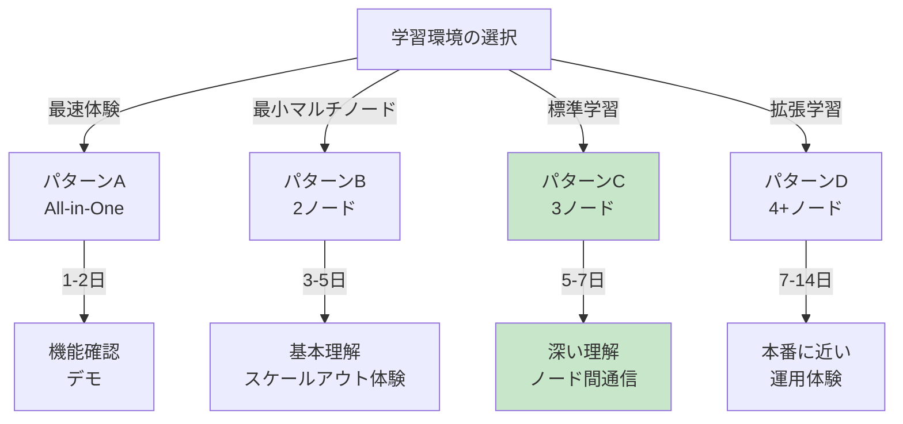
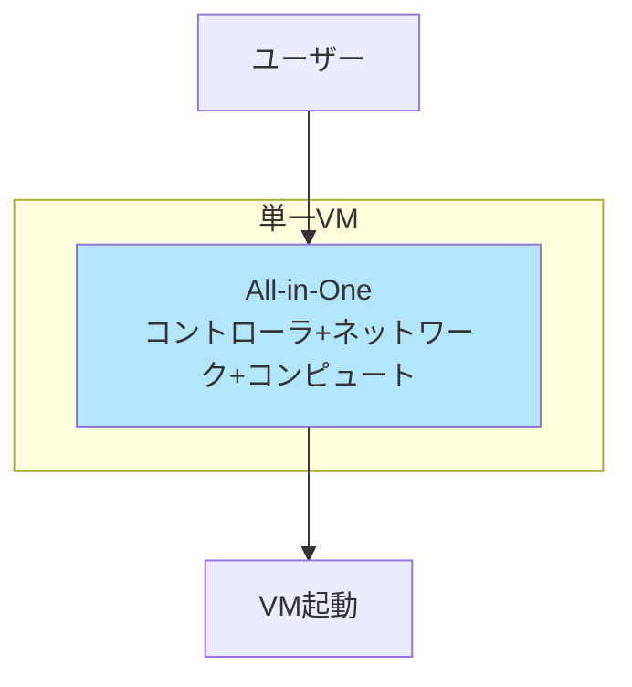
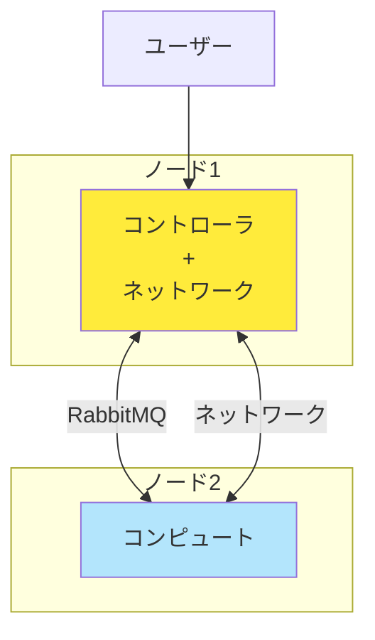
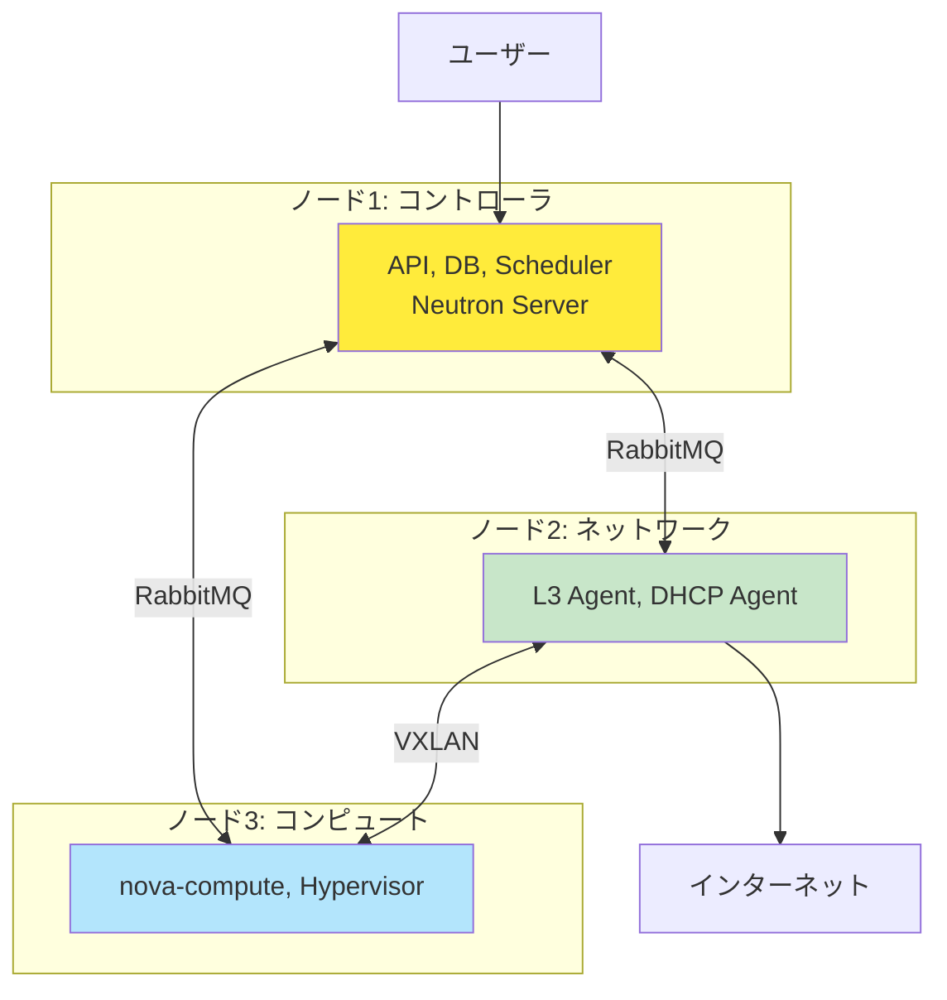
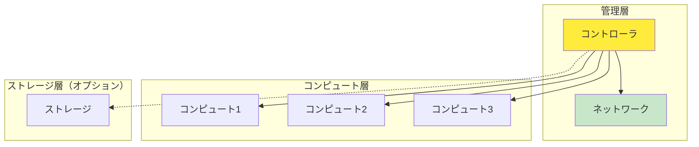
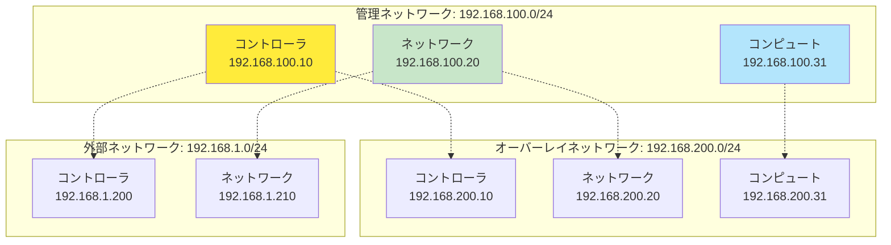
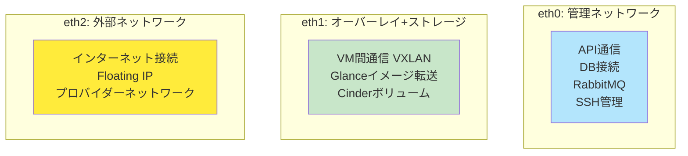
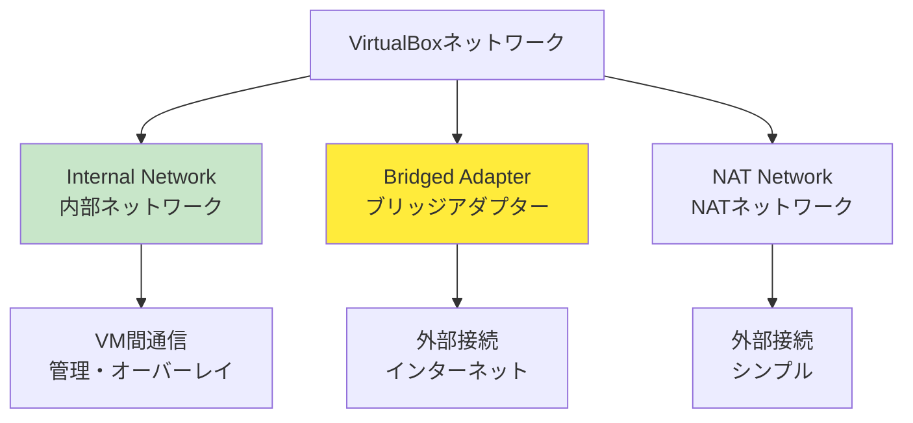
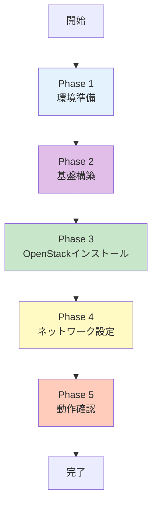
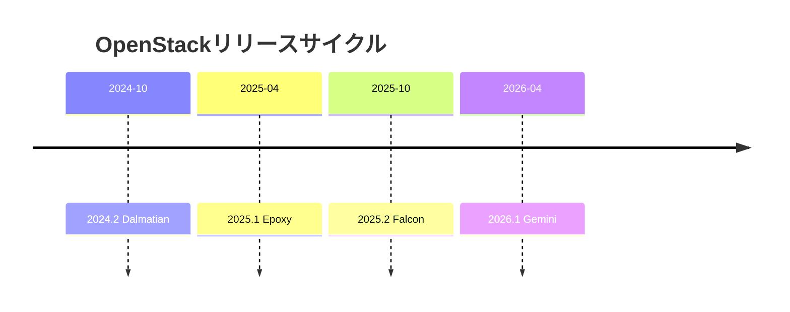

# Part 6: 実践ガイドと構成例

## 目次

1. [学習環境の構成パターン](#1-学習環境の構成パターン)
2. [今回の学習環境の構成](#2-今回の学習環境の構成)
3. [Vagrant + VirtualBox での環境構築](#3-vagrant--virtualbox-での環境構築)
4. [構築手順の概要](#4-構築手順の概要)
5. [スケーラビリティとパフォーマンス](#5-スケーラビリティとパフォーマンス)
6. [アップグレード戦略](#6-アップグレード戦略)
7. [開発環境との統合](#7-開発環境との統合)
8. [実践演習例](#8-実践演習例)

---

## 1. 学習環境の構成パターン

### 1.1 構成パターンの全体像 ✅

OpenStack学習環境には、**4つの主要な構成パターン**があります。



---

### 1.2 パターンA: All-in-One 🎓

**1台で全機能を体験**



| 項目         | 内容           |
| ------------ | -------------- |
| **ノード数** | 1台            |
| **構築時間** | 2-4時間        |
| **学習期間** | 1-2日          |
| **難易度**   | ⭐              |
| **リソース** | 8GB RAM, 4コア |

**メリット**:

- ✅ 最も簡単
- ✅ リソース要件が最小
- ✅ OpenStackの全体像を素早く把握

**デメリット**:

- ❌ ノード間通信を学べない
- ❌ スケールアウトを体験できない
- ❌ 本番環境からは遠い

**推奨用途**:

- OpenStackの初体験
- 機能のクイック確認
- デモ環境

---

### 1.3 パターンB: 2ノード構成 🎓

**最小のマルチノード体験**



| 項目         | 内容            |
| ------------ | --------------- |
| **ノード数** | 2台             |
| **構築時間** | 4-6時間         |
| **学習期間** | 3-5日           |
| **難易度**   | ⭐⭐              |
| **リソース** | 16GB RAM, 8コア |

**メリット**:

- ✅ ノード間通信を体験
- ✅ リソース効率的
- ✅ スケールアウトの基礎理解

**デメリット**:

- ❌ コントローラとネットワークが同居（理解がやや難しい）
- ❌ 役割分担が不明確

**推奨用途**:

- マルチノード入門
- リソースが限られている環境

---

### 1.4 パターンC: 3ノード構成（標準）⭐ 🎓

**最も推奨される学習構成**



| 項目         | 内容             |
| ------------ | ---------------- |
| **ノード数** | 3台              |
| **構築時間** | 6-8時間          |
| **学習期間** | 5-7日            |
| **難易度**   | ⭐⭐⭐              |
| **リソース** | 20GB RAM, 12コア |

**メリット**:

- ✅ **各役割が独立して理解しやすい**
- ✅ Neutron ServerとL3 Agentの違いを実体験
- ✅ ノード間の通信フローを完全理解
- ✅ 実践的な構成
- ✅ **今回採用する構成**

**デメリット**:

- △ リソースが3台分必要
- △ 設定がやや複雑

**推奨用途**:

- **OpenStackを本格的に学びたい**
- ノード間通信の理解を深めたい
- 本番環境に向けた準備

---

### 1.5 パターンD: 4+ノード構成 💡

**より本番に近い環境**



| 項目         | 内容             |
| ------------ | ---------------- |
| **ノード数** | 4-5台            |
| **構築時間** | 8-12時間         |
| **学習期間** | 7-14日           |
| **難易度**   | ⭐⭐⭐⭐             |
| **リソース** | 32GB RAM, 16コア |

**メリット**:

- ✅ スケールアウトを実践
- ✅ ロードバランシングを体験
- ✅ より本番環境に近い

**デメリット**:

- ❌ 高いリソース要件
- ❌ 複雑な管理

**推奨用途**:

- スケーラビリティの学習
- 本番環境への移行前
- チーム学習

---

### 1.6 構成パターンの比較表 ✅

| パターン          | ノード | 難易度 | リソース | 学習価値 | 推奨度   |
| ----------------- | ------ | ------ | -------- | -------- | -------- |
| **A: All-in-One** | 1      | ⭐      | 8GB      | ⭐⭐       | 💡 初体験 |
| **B: 2ノード**    | 2      | ⭐⭐     | 16GB     | ⭐⭐⭐      | 💡 入門   |
| **C: 3ノード**    | 3      | ⭐⭐⭐    | 20GB     | ⭐⭐⭐⭐⭐    | ✅ 最推奨 |
| **D: 4+ノード**   | 4+     | ⭐⭐⭐⭐   | 32GB+    | ⭐⭐⭐⭐     | 💡 発展   |

---

## 2. 今回の学習環境の構成

### 2.1 採用構成: パターンC（3ノード）✅



---

### 2.2 ノード別の詳細構成 ✅

#### コントローラノード

```yaml
ホスト名: controller
役割: OpenStackの司令塔

リソース:
  CPU: 2-4コア
  メモリ: 4-8GB
  ディスク: 40-80GB
  NIC: 3つ

ネットワーク:
  eth0 (管理): 192.168.100.10/24
  eth1 (オーバーレイ+ストレージ): 192.168.200.10/24
  eth2 (外部): 192.168.1.200/24

主なサービス:
  - MariaDB / MySQL
  - RabbitMQ
  - Keystone (認証)
  - Glance (イメージ)
  - Nova API / Scheduler / Conductor
  - Neutron Server
  - Cinder API / Scheduler
  - Horizon (ダッシュボード)
```

#### ネットワークノード

```yaml
ホスト名: network
役割: ネットワーク機能の実行

リソース:
  CPU: 2-4コア
  メモリ: 2-4GB
  ディスク: 20-40GB
  NIC: 3つ

ネットワーク:
  eth0 (管理): 192.168.100.20/24
  eth1 (オーバーレイ): 192.168.200.20/24
  eth2 (外部): 192.168.1.210/24

主なサービス:
  - Neutron L3 Agent
  - Neutron DHCP Agent
  - Neutron Metadata Agent
  - Neutron Open vSwitch Agent
```

#### コンピュートノード

```yaml
ホスト名: compute1
役割: VMの実行

リソース:
  CPU: 2-4コア（仮想化支援機能必須）
  メモリ: 4-8GB
  ディスク: 40-100GB
  NIC: 2つ

ネットワーク:
  eth0 (管理): 192.168.100.31/24
  eth1 (オーバーレイ+ストレージ): 192.168.200.31/24

主なサービス:
  - Nova Compute
  - Neutron Open vSwitch Agent
  - Libvirt / KVM
```

---

### 2.3 ネットワーク設計の詳細 ⭐

#### ネットワーク分離の目的



#### IPアドレス割り当て表

| ネットワーク                          | コントローラ   | ネットワーク   | コンピュート   |
| ------------------------------------- | -------------- | -------------- | -------------- |
| **管理<br/>192.168.100.0/24**         | 192.168.100.10 | 192.168.100.20 | 192.168.100.31 |
| **オーバーレイ<br/>192.168.200.0/24** | 192.168.200.10 | 192.168.200.20 | 192.168.200.31 |
| **外部<br/>192.168.1.0/24**           | 192.168.1.200  | 192.168.1.210  | -              |

**Floating IPプール**: 192.168.1.201 - 192.168.1.220

---

### 2.4 ネットワークタイプの選択 ✅

```yaml
外部ネットワーク:
  タイプ: FLAT
  理由:
    - シンプルで理解しやすい
    - 自宅ルーターと直接接続
    - 学習に最適
  
  物理ネットワーク名: physnet1
  インターフェース: eth2

テナントネットワーク:
  タイプ: VXLAN
  理由:
    - 現在の主流技術
    - マルチテナント対応
    - 実践的なスキル習得
  
  VNI範囲: 1000-2000
  インターフェース: eth1
```

---

### 2.5 ストレージ設計 ✅

```yaml
Cinder（ブロックストレージ）:
  バックエンド: LVM
  ボリュームグループ: cinder-volumes
  サイズ: 20GB
  
  理由:
    - シンプルで理解しやすい
    - 追加ソフトウェア不要
    - 学習に最適

Swift（オブジェクトストレージ）:
  構成: なし（オプション）
  
  理由:
    - 学習の主眼ではない
    - 必要に応じて後から追加可能

エフェメラルストレージ:
  場所: /var/lib/nova/instances/
  サイズ: コンピュートノードのディスク次第
```

---

## 3. Vagrant + VirtualBox での環境構築

### 3.1 Vagrantfile の設計思想 ⭐

**Vagrantfile**は、仮想マシンの設定を**コードで管理**するファイルです。

#### 設計の原則

```
原則1: 再現性
- 誰でも同じ環境を構築できる
- Vagrantfileを共有すれば環境を複製可能

原則2: 自動化
- 手動設定を最小化
- プロビジョニングで初期設定を自動化

原則3: 柔軟性
- リソースを簡単に調整可能
- ノード数を容易に変更可能
```

---

### 3.2 Vagrantfile の主要設定 ⭐

**最小限の設定例**（コメント付き）:

```ruby
# -*- mode: ruby -*-
# vi: set ft=ruby :

Vagrant.configure("2") do |config|
  # 全ノード共通の設定
  config.vm.box = "ubuntu/jammy64"  # Ubuntu 22.04 LTS
  
  # VirtualBoxプロバイダーの共通設定
  config.vm.provider "virtualbox" do |vb|
    vb.gui = false
    vb.linked_clone = true  # ディスク容量節約
  end
  
  # コントローラノードの定義
  config.vm.define "controller" do |controller|
    controller.vm.hostname = "controller"
    
    # ネットワーク設定
    controller.vm.network "private_network", 
      ip: "192.168.100.10",  # 管理NW
      virtualbox__intnet: "mgmt-net"
    
    controller.vm.network "private_network",
      ip: "192.168.200.10",  # オーバーレイ+ストレージNW
      virtualbox__intnet: "overlay-net"
    
    controller.vm.network "private_network",
      ip: "192.168.1.200",   # 外部NW（ブリッジ推奨）
      bridge: "en0: Ethernet"  # 実際のNIC名に変更
    
    # リソース設定
    controller.vm.provider "virtualbox" do |vb|
      vb.memory = "6144"  # 6GB RAM
      vb.cpus = 4
      vb.name = "openstack-controller"
    end
  end
  
  # ネットワークノードの定義
  config.vm.define "network" do |network|
    network.vm.hostname = "network"
    
    network.vm.network "private_network",
      ip: "192.168.100.20",
      virtualbox__intnet: "mgmt-net"
    
    network.vm.network "private_network",
      ip: "192.168.200.20",
      virtualbox__intnet: "overlay-net"
    
    network.vm.network "private_network",
      ip: "192.168.1.210",
      bridge: "en0: Ethernet"
    
    network.vm.provider "virtualbox" do |vb|
      vb.memory = "2048"
      vb.cpus = 2
      vb.name = "openstack-network"
    end
  end
  
  # コンピュートノードの定義
  config.vm.define "compute1" do |compute|
    compute.vm.hostname = "compute1"
    
    compute.vm.network "private_network",
      ip: "192.168.100.31",
      virtualbox__intnet: "mgmt-net"
    
    compute.vm.network "private_network",
      ip: "192.168.200.31",
      virtualbox__intnet: "overlay-net"
    
    compute.vm.provider "virtualbox" do |vb|
      vb.memory = "4096"
      vb.cpus = 4
      vb.name = "openstack-compute1"
      
      # 入れ子仮想化を有効化（重要）
      vb.customize ["modifyvm", :id, "--nested-hw-virt", "on"]
    end
  end
end
```

---

### 3.3 ネットワーク設定の詳細 ⭐

#### VirtualBoxのネットワークタイプ



**今回の構成**:

| ネットワーク     | VirtualBoxタイプ | 用途                 |
| ---------------- | ---------------- | -------------------- |
| **管理**         | Internal Network | ノード間通信（隔離） |
| **オーバーレイ** | Internal Network | VXLAN通信（隔離）    |
| **外部**         | Bridged Adapter  | インターネット接続   |

---

### 3.4 入れ子仮想化の設定 ✅

**コンピュートノードでは必須**:

```ruby
# Vagrantfile内
vb.customize ["modifyvm", :id, "--nested-hw-virt", "on"]
```

**確認方法**（VM内）:

```bash
# 仮想化支援機能の確認
egrep -c '(vmx|svm)' /proc/cpuinfo
# 1以上ならOK

# KVMモジュールの確認
lsmod | grep kvm
# kvm_intel または kvm_amd が表示されればOK
```

---

### 3.5 プロビジョニング 💡

**初期設定を自動化**:

```ruby
# Vagrantfile内
config.vm.provision "shell", inline: <<-SHELL
  # パッケージ更新
  apt-get update
  
  # hostsファイルの設定
  cat >> /etc/hosts <<EOF
192.168.100.10 controller
192.168.100.20 network
192.168.100.31 compute1
EOF
  
  # タイムゾーン設定
  timedatectl set-timezone Asia/Tokyo
  
  # 基本パッケージのインストール
  apt-get install -y python3-pip vim git curl
SHELL
```

---

### 3.6 Vagrant基本コマンド 🎓

```bash
# 全VMの起動
vagrant up

# 特定のVMのみ起動
vagrant up controller

# VMへのSSH接続
vagrant ssh controller

# VMの停止
vagrant halt

# VMの再起動
vagrant reload

# VMの削除（完全にクリーンアップ）
vagrant destroy -f

# VMの状態確認
vagrant status
```

---

## 4. 構築手順の概要

### 4.1 全体のフロー ✅



---

### 4.2 Phase 1: 環境準備 ✅

```yaml
ステップ1.1: ホストマシンの準備
  - VirtualBoxのインストール
  - Vagrantのインストール
  - ディスク空き容量の確認（200GB以上推奨）

ステップ1.2: Vagrantfileの作成
  - 3ノード構成のVagrantfile作成
  - ネットワーク設定の確認
  - リソース割り当ての調整

ステップ1.3: VM起動
  $ vagrant up
  # 初回は10-20分程度かかる
```

---

### 4.3 Phase 2: 基盤構築 ✅

```yaml
ステップ2.1: 全ノード共通設定
  - hostsファイルの設定
  - NTPによる時刻同期
  - OpenStackリポジトリの追加
  
  参考: Server World
  https://www.server-world.info/query?os=Ubuntu_24.04&p=openstack_epoxy&f=1

ステップ2.2: コントローラノード
  - MariaDB / MySQLのインストール
  - RabbitMQのインストール
  - Memcachedのインストール
  - データベースの作成

ステップ2.3: 疎通確認
  - ノード間の通信確認
  - データベース接続確認
  - RabbitMQ動作確認
```

---

### 4.4 Phase 3: OpenStackインストール ⭐

```yaml
ステップ3.1: Keystone（認証）
  コントローラノード:
    - keystoneのインストール
    - データベース設定
    - エンドポイント設定
    - adminユーザー作成

ステップ3.2: Glance（イメージ）
  コントローラノード:
    - glanceのインストール
    - ストレージバックエンド設定
    - テストイメージのアップロード

ステップ3.3: Nova（コンピュート）
  コントローラノード:
    - nova-api, nova-scheduler, nova-conductorのインストール
  
  コンピュートノード:
    - nova-computeのインストール
    - libvirt / KVMの設定
    - コントローラへの登録

ステップ3.4: Neutron（ネットワーク）
  コントローラノード:
    - neutron-serverのインストール
    - ML2プラグインの設定
  
  ネットワークノード:
    - neutron-l3-agent, neutron-dhcp-agentのインストール
    - Open vSwitchの設定
  
  コンピュートノード:
    - neutron-openvswitch-agentのインストール

ステップ3.5: Horizon（ダッシュボード）
  コントローラノード:
    - horizonのインストール
    - Webサーバー（Apache）の設定

ステップ3.6: Cinder（ブロックストレージ）
  コントローラノード:
    - cinder-api, cinder-schedulerのインストール
  
  コントローラノード（ストレージ兼用）:
    - cinder-volumeのインストール
    - LVMの設定
```

**重要**: 各コンポーネントのインストールは、Server Worldの手順に従って実施してください。

---

### 4.5 Phase 4: ネットワーク設定 ⭐

```yaml
ステップ4.1: プロバイダーネットワーク（外部）の作成
  タイプ: FLAT
  
  コマンド例:
  $ openstack network create \
    --provider-network-type flat \
    --provider-physical-network physnet1 \
    --external \
    external-network
  
  $ openstack subnet create \
    --network external-network \
    --subnet-range 192.168.1.0/24 \
    --gateway 192.168.1.1 \
    --allocation-pool start=192.168.1.201,end=192.168.1.220 \
    external-subnet

ステップ4.2: テナントネットワーク（プライベート）の作成
  タイプ: VXLAN
  
  コマンド例:
  $ openstack network create private-network
  
  $ openstack subnet create \
    --network private-network \
    --subnet-range 10.0.0.0/24 \
    --gateway 10.0.0.1 \
    private-subnet

ステップ4.3: ルーターの作成
  $ openstack router create router1
  
  $ openstack router set \
    --external-gateway external-network \
    router1
  
  $ openstack router add subnet \
    router1 private-subnet
```

---

### 4.6 Phase 5: 動作確認 ✅

```yaml
ステップ5.1: サービス稼働確認
  $ openstack compute service list
  $ openstack network agent list
  $ openstack volume service list

ステップ5.2: イメージのアップロード
  # Ubuntu Cloud Imageのダウンロード
  $ wget https://cloud-images.ubuntu.com/jammy/current/jammy-server-cloudimg-amd64.img
  
  # Glanceへアップロード
  $ openstack image create \
    --disk-format qcow2 \
    --container-format bare \
    --public \
    --file jammy-server-cloudimg-amd64.img \
    ubuntu-22.04

ステップ5.3: フレーバーの作成
  $ openstack flavor create \
    --vcpus 1 --ram 1024 --disk 10 \
    m1.tiny

ステップ5.4: セキュリティグループの設定
  $ openstack security group rule create \
    --protocol tcp --dst-port 22 \
    --remote-ip 0.0.0.0/0 \
    default
  
  $ openstack security group rule create \
    --protocol icmp \
    --remote-ip 0.0.0.0/0 \
    default

ステップ5.5: キーペアの作成
  $ openstack keypair create --public-key ~/.ssh/id_rsa.pub mykey

ステップ5.6: VMの起動
  $ openstack server create \
    --flavor m1.tiny \
    --image ubuntu-22.04 \
    --network private-network \
    --key-name mykey \
    test-vm

ステップ5.7: Floating IPの割り当て
  # Floating IPの作成
  $ openstack floating ip create external-network
  
  # VMへの割り当て
  $ openstack server add floating ip test-vm <FLOATING_IP>

ステップ5.8: SSH接続確認
  $ ssh ubuntu@<FLOATING_IP>
```

---

### 4.7 トラブルシューティングのポイント 💡

```yaml
問題1: VMが起動しない
  確認:
    - nova-compute サービスの状態
    - /var/log/nova/nova-compute.log
    - 仮想化支援機能の有効化
  
  $ systemctl status nova-compute
  $ journalctl -u nova-compute -f

問題2: ネットワークに接続できない
  確認:
    - neutron-l3-agent, neutron-dhcp-agent の状態
    - /var/log/neutron/
    - Open vSwitch の設定
  
  $ openstack network agent list
  $ ovs-vsctl show

問題3: Floating IPに接続できない
  確認:
    - セキュリティグループのルール
    - ルーターの外部ゲートウェイ設定
    - ネットワークノードのNAT設定
  
  $ openstack security group rule list
  $ openstack router show router1
```

---

## 5. スケーラビリティとパフォーマンス

### 5.1 コンピュートノードの追加 ⭐

**スケールアウトを体験**:

```yaml
ステップ1: Vagrantfileにcompute2を追加
  config.vm.define "compute2" do |compute|
    compute.vm.hostname = "compute2"
    compute.vm.network "private_network", ip: "192.168.100.32"
    compute.vm.network "private_network", ip: "192.168.200.32"
    # ...
  end

ステップ2: 新しいVMを起動
  $ vagrant up compute2

ステップ3: OpenStackに登録
  compute2ノード内:
  # Nova Computeのインストール
  # 設定ファイルの編集
  # サービスの起動

ステップ4: 確認
  $ openstack compute service list
  # compute2が追加されていることを確認

ステップ5: VMを起動してロードバランシングを確認
  $ openstack server create ... test-vm-1
  $ openstack server create ... test-vm-2
  # 2つのVMが異なるコンピュートノードに配置されることを確認
```

---

### 5.2 ボトルネックの特定 💡

```yaml
CPU:
  確認: top, htop, mpstat
  対策: コンピュートノード追加

メモリ:
  確認: free -h, vmstat
  対策: スワップ無効化、メモリ増強

ディスクI/O:
  確認: iostat, iotop
  対策: SSD使用、ストレージ専用NW

ネットワーク:
  確認: iftop, nethogs, iperf
  対策: 10Gbps NIC、ネットワーク分離
```

---

### 5.3 パフォーマンスチューニング 💡 🏢

```yaml
Nova:
  # CPUオーバーコミット比率の調整
  [DEFAULT]
  cpu_allocation_ratio = 16.0  # デフォルト
  ram_allocation_ratio = 1.5

Neutron:
  # MTU設定（VXLAN対応）
  [DEFAULT]
  global_physnet_mtu = 1500
  path_mtu = 1450

Cinder:
  # 並列処理数の調整
  [DEFAULT]
  max_concurrent_builds = 10
```

---

## 6. アップグレード戦略

### 6.1 OpenStackのリリースサイクル ⭐



```
リリース頻度: 6ヶ月ごと
サポート期間: 18ヶ月
推奨: 年1回のアップグレード
```

---

### 6.2 アップグレード手順（手動構築の場合）💡

```yaml
準備:
  1. バックアップの取得
  2. テスト環境での検証
  3. ドキュメントの確認

実施:
  Phase 1: データベースのバックアップ
    $ mysqldump --all-databases > backup.sql
  
  Phase 2: 各サービスのアップグレード
    # パッケージの更新
    $ apt update
    $ apt upgrade openstack-*
    
    # データベーススキーマの更新
    $ nova-manage db sync
    $ neutron-db-manage upgrade heads
    $ cinder-manage db sync
  
  Phase 3: サービスの再起動
    $ systemctl restart nova-*
    $ systemctl restart neutron-*
  
  Phase 4: 動作確認
    $ openstack compute service list
    $ openstack network agent list
```

---

### 6.3 Kolla-Ansibleへの移行 ⭐

**手動構築で理解を深めた後、Kolla-Ansibleへ移行**:

```yaml
メリット:
  ✅ コンテナ化による簡単なアップグレード
  ✅ ローリングアップグレード対応
  ✅ ロールバック可能
  ✅ 本番環境の標準的な方法

手順:
  1. Kolla-Ansibleのインストール
  2. インベントリファイルの作成
  3. globals.ymlの設定
  4. デプロイ実行
  
  $ kolla-ansible -i inventory deploy

アップグレード:
  $ kolla-ansible -i inventory upgrade
```

---

## 7. 開発環境との統合

### 7.1 Terraform との連携 ⭐

**Infrastructure as Code**:

```hcl
# main.tf
terraform {
  required_providers {
    openstack = {
      source  = "terraform-provider-openstack/openstack"
      version = "~> 1.51"
    }
  }
}

provider "openstack" {
  auth_url    = "http://192.168.100.10:5000/v3"
  user_name   = "admin"
  password    = "admin_password"
  tenant_name = "admin"
  domain_name = "Default"
}

resource "openstack_compute_instance_v2" "web_server" {
  name            = "web-server"
  image_name      = "ubuntu-22.04"
  flavor_name     = "m1.small"
  key_pair        = "mykey"
  security_groups = ["default"]

  network {
    name = "private-network"
  }
}

resource "openstack_networking_floatingip_v2" "fip" {
  pool = "external-network"
}

resource "openstack_compute_floatingip_associate_v2" "fip_assoc" {
  floating_ip = openstack_networking_floatingip_v2.fip.address
  instance_id = openstack_compute_instance_v2.web_server.id
}
```

---

### 7.2 Ansible との連携 ⭐

**構成管理の自動化**:

```yaml
# playbook.yml
---
- hosts: openstack_instances
  become: yes
  tasks:
    - name: Nginxのインストール
      apt:
        name: nginx
        state: present
    
    - name: Nginxの起動
      service:
        name: nginx
        state: started
        enabled: yes
    
    - name: ファイアウォールの設定
      ufw:
        rule: allow
        port: 80
        proto: tcp
```

---

### 7.3 CI/CDパイプライン 💡

```yaml
GitLab CI/CD例:
  stages:
    - build
    - test
    - deploy
  
  deploy_to_openstack:
    stage: deploy
    script:
      - openstack server create ...
      - ansible-playbook deploy.yml
    only:
      - master
```

---

## 8. 実践演習例

### 8.1 演習1: Webサーバーの構築 🎓

```yaml
目的: OpenStackの基本操作を習得

手順:
  1. Ubuntuインスタンスの作成
  2. Floating IPの割り当て
  3. SSH接続
  4. Nginxのインストール
  5. ブラウザでアクセス確認

実行コマンド:
  $ openstack server create \
    --flavor m1.small \
    --image ubuntu-22.04 \
    --network private-network \
    --key-name mykey \
    web-server
  
  $ openstack floating ip create external-network
  $ openstack server add floating ip web-server <FLOATING_IP>
  
  $ ssh ubuntu@<FLOATING_IP>
  ubuntu@web-server:~$ sudo apt update
  ubuntu@web-server:~$ sudo apt install -y nginx
  
  # ブラウザで http://<FLOATING_IP> にアクセス

学習ポイント:
  ✅ インスタンスの作成フロー
  ✅ ネットワークの仕組み
  ✅ Floating IPの役割
```

---

### 8.2 演習2: ロードバランサーの構築 💡

```yaml
目的: 複数インスタンスの負荷分散

手順:
  1. 2台のWebサーバーを作成
  2. プライベートネットワークに配置
  3. 各サーバーでNginxを設定（異なるコンテンツ）
  4. ロードバランサーを作成
  5. Floating IPを割り当て
  6. 負荷分散を確認

実行コマンド:
  # インスタンス作成
  $ openstack server create ... web1
  $ openstack server create ... web2
  
  # Octavia（LBaaS）を使用
  $ openstack loadbalancer create \
    --name lb1 \
    --vip-subnet-id private-subnet
  
  $ openstack loadbalancer pool create \
    --name pool1 \
    --lb-algorithm ROUND_ROBIN \
    --protocol HTTP \
    lb1
  
  $ openstack loadbalancer member create \
    --address 10.0.0.10 \
    --protocol-port 80 \
    pool1
  
  $ openstack loadbalancer member create \
    --address 10.0.0.11 \
    --protocol-port 80 \
    pool1

学習ポイント:
  ⭐ スケールアウトの実践
  ⭐ 高可用性の基礎
```

---

### 8.3 演習3: プライベートネットワークの分離 💡

```yaml
目的: マルチテナント環境の理解

手順:
  1. 2つのプロジェクトを作成
  2. 各プロジェクトで独立したネットワークを作成
  3. 各ネットワークにVMを配置
  4. ネットワーク間の通信が分離されていることを確認

実行コマンド:
  # プロジェクト作成
  $ openstack project create project-A
  $ openstack project create project-B
  
  # project-Aのネットワーク
  $ openstack network create \
    --project project-A \
    network-A
  
  # project-Bのネットワーク
  $ openstack network create \
    --project project-B \
    network-B

学習ポイント:
  ✅ VXLANによる分離
  ✅ マルチテナントの仕組み
```

---

### 8.4 演習4: ボリュームの作成と接続 🎓

```yaml
目的: 永続ストレージの理解

手順:
  1. Cinderボリュームの作成
  2. インスタンスへの接続
  3. ボリュームのフォーマットとマウント
  4. データの永続性確認
  5. スナップショットの作成

実行コマンド:
  # ボリューム作成
  $ openstack volume create \
    --size 10 \
    data-volume
  
  # インスタンスへの接続
  $ openstack server add volume \
    web-server data-volume
  
  # VM内でマウント
  $ ssh ubuntu@<FLOATING_IP>
  ubuntu@web-server:~$ sudo mkfs.ext4 /dev/vdb
  ubuntu@web-server:~$ sudo mkdir /mnt/data
  ubuntu@web-server:~$ sudo mount /dev/vdb /mnt/data
  
  # スナップショット作成
  $ openstack volume snapshot create \
    --volume data-volume \
    data-snapshot

学習ポイント:
  ✅ エフェメラルとCinderの違い
  ✅ ボリューム管理の基礎
```

---

## まとめ

### Part 6で学んだこと ✅

1. **学習環境の構成パターン**
   - All-in-One、2ノード、**3ノード（採用）**、4+ノード
   - 各パターンの特徴と推奨用途

2. **今回の学習環境の構成**
   - 3ノード構成の詳細
   - ネットワーク設計（3 NIC構成）
   - IPアドレス割り当て

3. **Vagrant + VirtualBox での環境構築**
   - Vagrantfileの設計
   - ネットワーク設定
   - 入れ子仮想化の有効化

4. **構築手順の概要**
   - Phase 1-5の流れ
   - Server Worldの活用
   - トラブルシューティング

5. **スケーラビリティとパフォーマンス**
   - コンピュートノードの追加
   - ボトルネックの特定
   - パフォーマンスチューニング

6. **アップグレード戦略**
   - OpenStackのリリースサイクル
   - 手動アップグレード
   - Kolla-Ansibleへの移行

7. **開発環境との統合**
   - Terraform連携
   - Ansible連携
   - CI/CDパイプライン

8. **実践演習例**
   - Webサーバー構築
   - ロードバランサー
   - プライベートネットワーク分離
   - ボリューム管理

---

## 次のステップ 🎯

### 学習の進め方


### 参考資料

- **Server World**: <https://www.server-world.info/>
- **OpenStack公式ドキュメント**: <https://docs.openstack.org/>
- **Kolla-Ansible**: <https://docs.openstack.org/kolla-ansible/>

---

**全Part完了！お疲れ様でした！** 🎉

**前へ**: [Part 5: 運用・セキュリティ設計](05_operations_security.md)  
**付録へ**: [付録A: 用語集](appendix_a_glossary.md)
