# Part 2: OpenStackアーキテクチャの理解

## 目次

- [Part 2: OpenStackアーキテクチャの理解](#part-2-openstackアーキテクチャの理解)
  - [目次](#目次)
  - [1. OpenStackの主要コンポーネント](#1-openstackの主要コンポーネント)
    - [1.1 Keystone（認証・認可サービス）✅ 🎓🏢](#11-keystone認証認可サービス-)
      - [主な機能](#主な機能)
      - [主要概念 ⭐](#主要概念-)
      - [認証フロー 💡](#認証フロー-)
      - [Keystoneの重要性 ✅](#keystoneの重要性-)
    - [1.2 Nova（コンピュートサービス）✅ 🎓🏢](#12-novaコンピュートサービス-)
      - [主な機能](#主な機能-1)
      - [Novaのコンポーネント構成 ⭐](#novaのコンポーネント構成-)
      - [VMインスタンス作成の流れ 💡](#vmインスタンス作成の流れ-)
      - [フレーバーとイメージ ⭐](#フレーバーとイメージ-)
    - [1.3 Neutron（ネットワークサービス）✅ 🎓🏢](#13-neutronネットワークサービス-)
      - [主な機能](#主な機能-2)
      - [Neutronのアーキテクチャ（重要） ⭐](#neutronのアーキテクチャ重要-)
      - [Neutron ServerとL3 Agentの違い（重要ポイント）✅](#neutron-serverとl3-agentの違い重要ポイント)
      - [例で理解する 💡](#例で理解する-)
      - [DHCP Agentの役割 ⭐](#dhcp-agentの役割-)
      - [その他のNeutronエージェント 💡](#その他のneutronエージェント-)
    - [1.4 Glance（イメージサービス）✅ 🎓🏢](#14-glanceイメージサービス-)
      - [主な機能](#主な機能-3)
      - [Glanceのアーキテクチャ ⭐](#glanceのアーキテクチャ-)
      - [イメージの種類 💡](#イメージの種類-)
      - [VM作成時のイメージ取得フロー 💡](#vm作成時のイメージ取得フロー-)
    - [1.5 Cinder（ブロックストレージサービス）✅ 🎓🏢](#15-cinderブロックストレージサービス-)
      - [主な機能](#主な機能-4)
      - [AWSとの対比 ⭐](#awsとの対比-)
      - [Cinderのアーキテクチャ ⭐](#cinderのアーキテクチャ-)
      - [Cinderのバックエンド 💡](#cinderのバックエンド-)
      - [ボリュームのライフサイクル 💡](#ボリュームのライフサイクル-)
    - [1.6 Swift（オブジェクトストレージサービス）⭐ 🏢](#16-swiftオブジェクトストレージサービス-)
      - [主な機能](#主な機能-5)
      - [AWSとの対比 ⭐](#awsとの対比--1)
      - [CinderとSwiftの違い ✅](#cinderとswiftの違い-)
    - [1.7 Horizon（ダッシュボード）✅ 🎓🏢](#17-horizonダッシュボード-)
      - [主な機能](#主な機能-6)
      - [Horizonの位置づけ 💡](#horizonの位置づけ-)
    - [1.8 その他の重要なコンポーネント 💡](#18-その他の重要なコンポーネント-)
      - [Heat（オーケストレーション）📚 🏢](#heatオーケストレーション-)
      - [Ceilometer（メトリクス）📚 🏢](#ceilometerメトリクス-)
      - [Barbican（シークレット管理）📚 🏢](#barbicanシークレット管理-)
  - [2. ノード構成の考え方](#2-ノード構成の考え方)
    - [2.1 コントローラノード ✅ 🎓🏢](#21-コントローラノード--)
      - [役割：指示役・管理役](#役割指示役管理役)
      - [主なコンポーネント ⭐](#主なコンポーネント-)
      - [会社に例えると 💡](#会社に例えると-)
      - [ハードウェア要件 🎓](#ハードウェア要件-)
    - [2.2 コンピュートノード ✅ 🎓🏢](#22-コンピュートノード--)
      - [役割：VMの実行環境](#役割vmの実行環境)
      - [主なコンポーネント ⭐](#主なコンポーネント--1)
      - [会社に例えると 💡](#会社に例えると--1)
      - [重要な機能：仮想化支援 ✅](#重要な機能仮想化支援-)
      - [ハードウェア要件 🎓](#ハードウェア要件--1)
      - [スケールアウト ⭐](#スケールアウト-)
    - [2.3 ネットワークノード ✅ 🎓🏢](#23-ネットワークノード--)
      - [役割：実際のネットワーク処理](#役割実際のネットワーク処理)
      - [主なコンポーネント（再確認）⭐](#主なコンポーネント再確認)
      - [Neutron Serverとの関係（再確認）✅](#neutron-serverとの関係再確認)
      - [会社に例えると 💡](#会社に例えると--2)
      - [ハードウェア要件 🎓](#ハードウェア要件--2)
    - [2.4 ストレージノード ⭐ 🏢](#24-ストレージノード--)
      - [役割：データの永続化](#役割データの永続化)
      - [Cinderストレージノード ⭐](#cinderストレージノード-)
      - [Swiftストレージノード 💡](#swiftストレージノード-)
      - [会社に例えると 💡](#会社に例えると--3)
      - [ハードウェア要件 🎓](#ハードウェア要件--3)
    - [2.5 ノード役割のまとめ ✅](#25-ノード役割のまとめ-)
      - [各ノードの比較表 ✅](#各ノードの比較表-)
  - [3. コンポーネント間の連携](#3-コンポーネント間の連携)
    - [3.1 メッセージキュー（RabbitMQ）の役割 ✅](#31-メッセージキューrabbitmqの役割-)
      - [メッセージキューのメリット ⭐](#メッセージキューのメリット-)
    - [3.2 データベース（MariaDB/MySQL）の役割 ✅](#32-データベースmariadbmysqlの役割-)
      - [保存される情報 ⭐](#保存される情報-)
    - [3.3 API連携のフロー ✅](#33-api連携のフロー-)
      - [VM作成の完全なフロー 💡](#vm作成の完全なフロー-)
    - [3.4 コンポーネント間の依存関係 ⭐](#34-コンポーネント間の依存関係-)
      - [起動順序 ✅](#起動順序-)
  - [まとめ](#まとめ)
    - [Part 2で学んだこと ✅](#part-2で学んだこと-)
    - [次のステップ 📚](#次のステップ-)

---

## 1. OpenStackの主要コンポーネント

OpenStackは、複数のコンポーネント（プロジェクト）が連携して動作するモジュラー型のシステムです。各コンポーネントは独立した機能を提供し、REST APIを通じて相互に通信します。

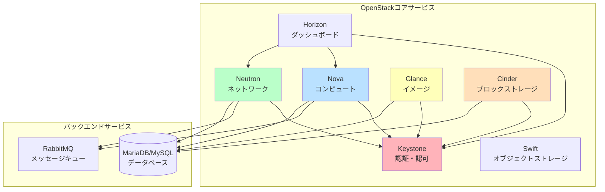

---

### 1.1 Keystone（認証・認可サービス）✅ 🎓🏢

**Keystone**は、OpenStackの**アイデンティティサービス**で、全てのコンポーネントの認証・認可を一元管理します。

#### 主な機能

| 機能                       | 説明                              |
| -------------------------- | --------------------------------- |
| **認証（Authentication）** | ユーザーの身元確認                |
| **認可（Authorization）**  | ユーザーの権限管理                |
| **サービスカタログ**       | 各サービスのエンドポイント管理    |
| **トークン管理**           | APIアクセス用のトークン発行・検証 |

#### 主要概念 ⭐

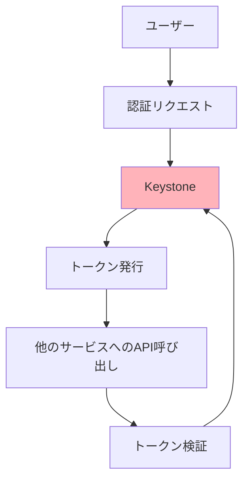

**重要な概念**:

- **ユーザー（User）**: 人間またはサービスアカウント
- **プロジェクト（Project）/テナント（Tenant）**: リソースのグルーピング単位
- **ロール（Role）**: ユーザーに割り当てられる権限
- **ドメイン（Domain）**: ユーザーとプロジェクトを管理する名前空間
- **エンドポイント（Endpoint）**: 各サービスのAPI URL

#### 認証フロー 💡

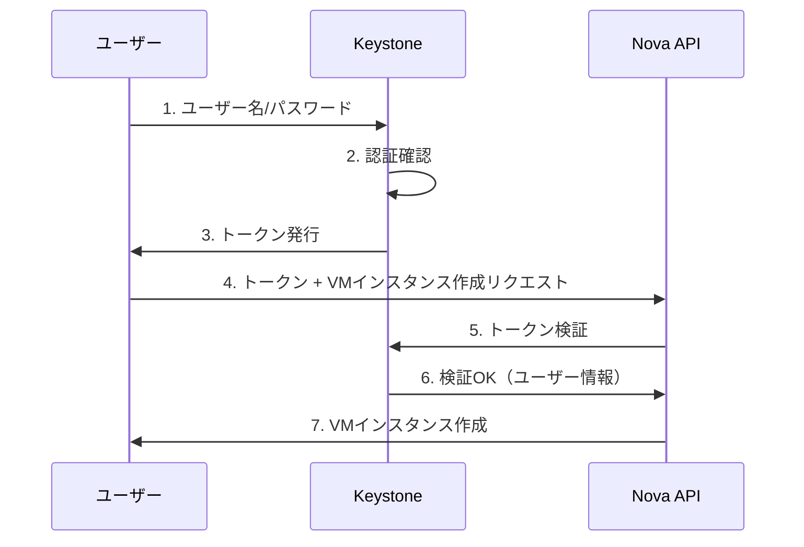

#### Keystoneの重要性 ✅

Keystoneは**OpenStackの心臓部**です：

- 全てのサービスがKeystoneで認証
- Keystoneが停止すると、全サービスが利用不可
- セキュリティの要

---

### 1.2 Nova（コンピュートサービス）✅ 🎓🏢

**Nova**は、OpenStackの**コンピュートサービス**で、仮想マシン（VM）のライフサイクルを管理します。

#### 主な機能

| 機能                     | 説明                                      |
| ------------------------ | ----------------------------------------- |
| **VMインスタンス管理**   | 作成、起動、停止、削除                    |
| **フレーバー管理**       | VMのスペック（CPU、メモリ、ディスク）定義 |
| **スケジューリング**     | VMを配置するコンピュートノードの選択      |
| **ハイパーバイザー制御** | KVM、Xen、VMware等の制御                  |

#### Novaのコンポーネント構成 ⭐

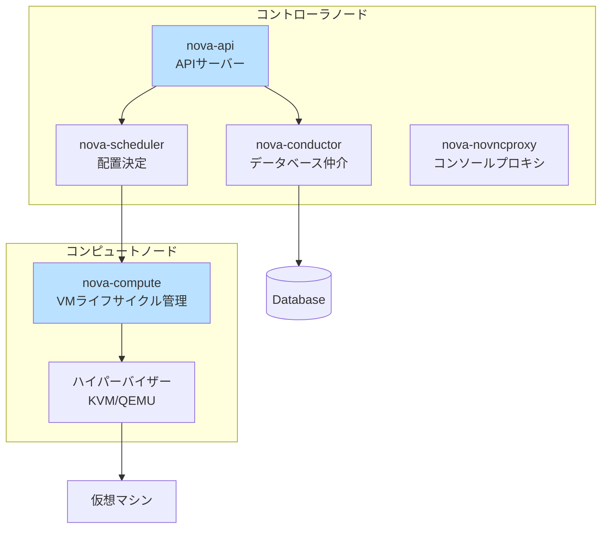

**各コンポーネントの役割**:

| コンポーネント      | 役割                                               | 配置場所     |
| ------------------- | -------------------------------------------------- | ------------ |
| **nova-api**        | REST APIの提供、リクエストの受付                   | コントローラ |
| **nova-scheduler**  | VMを配置するコンピュートノードを選択               | コントローラ |
| **nova-conductor**  | データベースへのアクセスを仲介（セキュリティ向上） | コントローラ |
| **nova-compute**    | ハイパーバイザーを制御し、VMを実際に管理           | コンピュート |
| **nova-novncproxy** | ブラウザからVMコンソールへのアクセスを提供         | コントローラ |

#### VMインスタンス作成の流れ 💡

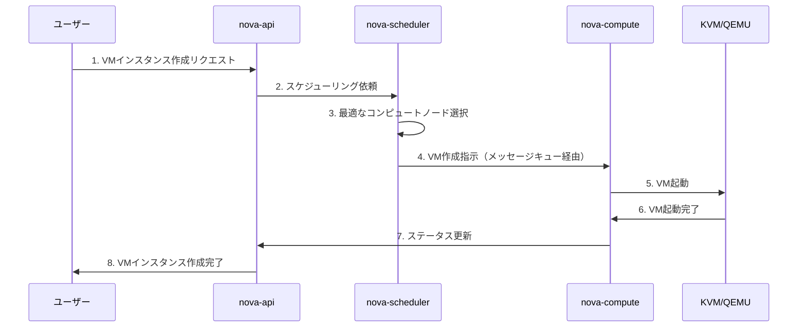

#### フレーバーとイメージ ⭐

**フレーバー（Flavor）**: VMのスペックテンプレート

```bash
例：
- m1.tiny:   1 vCPU, 512MB RAM, 1GB Disk
- m1.small:  1 vCPU, 2GB RAM, 20GB Disk
- m1.medium: 2 vCPU, 4GB RAM, 40GB Disk
```

**イメージ（Image）**: VMのOSテンプレート（Glanceで管理）

---

### 1.3 Neutron（ネットワークサービス）✅ 🎓🏢

**Neutron**は、OpenStackの**ネットワークサービス**で、仮想ネットワークを提供します。

#### 主な機能

| 機能                     | 説明                                |
| ------------------------ | ----------------------------------- |
| **仮想ネットワーク管理** | テナントごとの独立したネットワーク  |
| **ルーティング**         | L3ルーター、フローティングIP        |
| **セキュリティグループ** | ファイアウォールルール              |
| **DHCP**                 | IPアドレスの自動割り当て            |
| **ロードバランサー**     | LBaaS（Load Balancer as a Service） |

#### Neutronのアーキテクチャ（重要） ⭐

**最も理解が難しい部分**：Neutron Serverとエージェントの関係

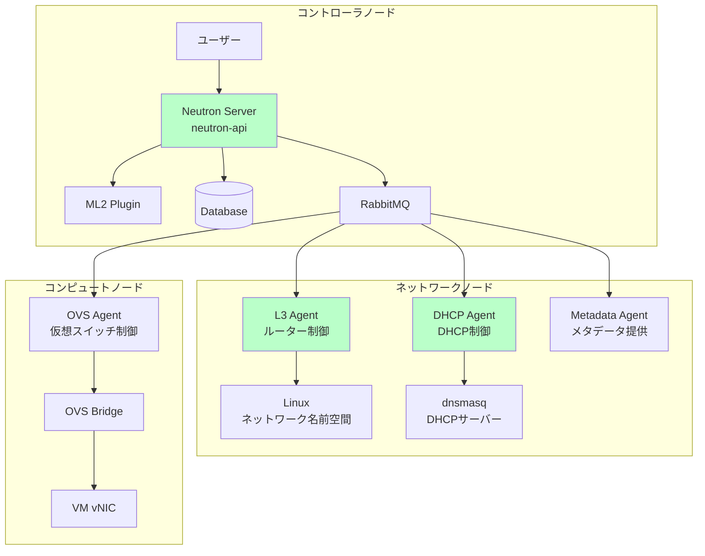

#### Neutron ServerとL3 Agentの違い（重要ポイント）✅

これは**OpenStackで最も混乱しやすいポイント**です。

**Neutron Server（コントローラノード）の役割** = **指示を受ける司令塔**

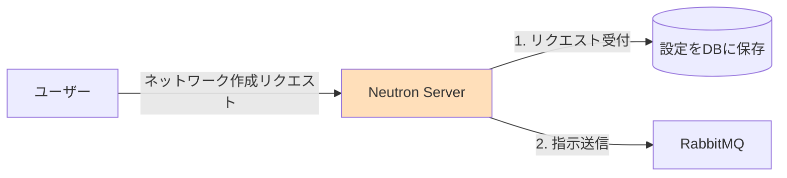

- **REST APIの提供**: 「ネットワークを作って」というリクエストを受ける
- **設定の管理**: ネットワーク設定をデータベースに保存
- **指示の送信**: メッセージキューを通じてエージェントに指示

**L3 Agent（ネットワークノード）の役割** = **実際に動作させる作業員**

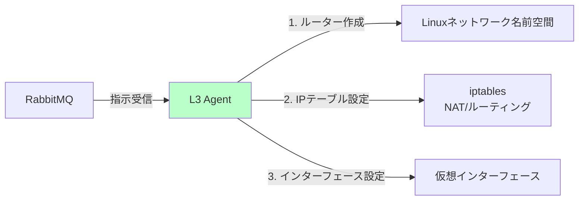

- **仮想ルータの実装**: 実際にLinuxのネットワーク名前空間でルーターを作成
- **ルーティング処理**: L3レイヤーでのパケット転送
- **NAT処理**: Floating IPとプライベートIPの変換
- **外部ネットワーク接続**: VMから外部への通信を実現

#### 例で理解する 💡

**例：ユーザーが「ルーターを作成」する場合**

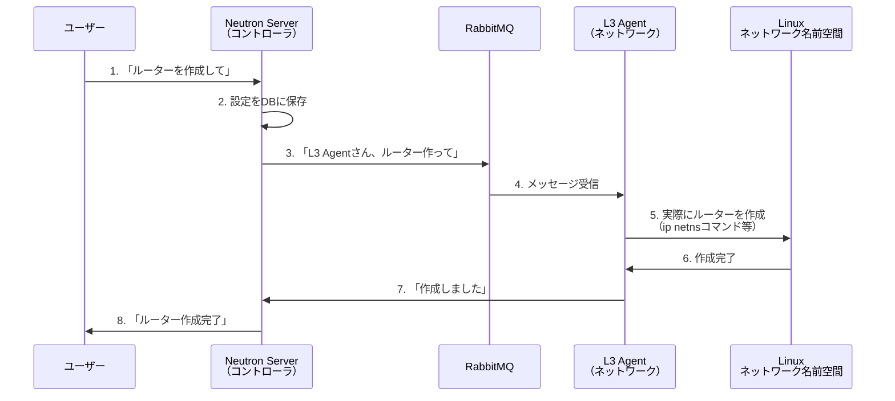

**会社に例えると**:

- **Neutron Server** = 本社の受付・企画部（顧客の要望を聞いて、作業指示書を作る）
- **L3 Agent** = 現場の作業員（指示書に従って、実際に工事を行う）

#### DHCP Agentの役割 ⭐

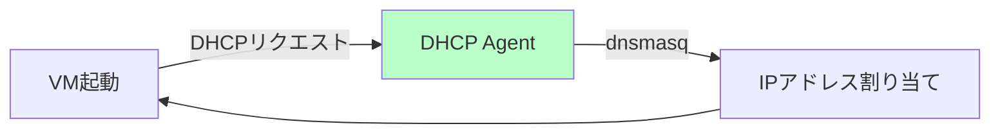

- **DHCPサーバーの実装**: dnsmasqプロセスを実行
- **IPアドレスの自動割り当て**: VMにIPアドレスを配布
- **DNSサーバー情報の提供**: VMにDNS設定を提供

#### その他のNeutronエージェント 💡

| エージェント                  | 役割                                     | 配置場所     |
| ----------------------------- | ---------------------------------------- | ------------ |
| **neutron-metadata-agent**    | VMへのメタデータ提供（クラウド初期化等） | ネットワーク |
| **neutron-lbaas-agent**       | ロードバランサー機能                     | ネットワーク |
| **neutron-fwaas-agent**       | ファイアウォール機能                     | ネットワーク |
| **neutron-openvswitch-agent** | Open vSwitchの制御                       | コンピュート |

---

### 1.4 Glance（イメージサービス）✅ 🎓🏢

**Glance**は、OpenStackの**イメージサービス**で、VMのOSイメージを管理します。

#### 主な機能

| 機能                       | 説明                                               |
| -------------------------- | -------------------------------------------------- |
| **イメージ登録**           | OS イメージのアップロード                          |
| **イメージ取得**           | VM作成時のイメージ取得                             |
| **イメージメタデータ管理** | イメージの情報管理                                 |
| **イメージストレージ**     | ファイルシステムまたはオブジェクトストレージに保存 |

#### Glanceのアーキテクチャ ⭐

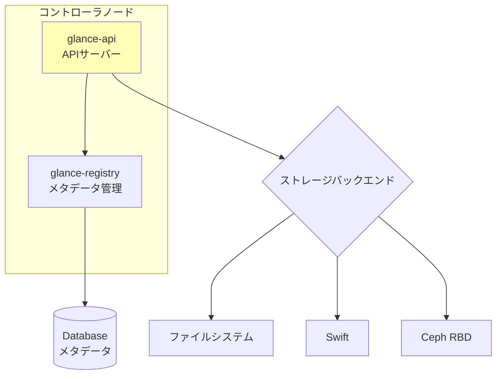

#### イメージの種類 💡

| 形式      | 説明                          | 使用例         |
| --------- | ----------------------------- | -------------- |
| **Raw**   | 生のディスクイメージ          | シンプルな環境 |
| **QCOW2** | QEMU Copy-On-Write v2（推奨） | KVM環境        |
| **VDI**   | VirtualBox形式                | VirtualBox     |
| **VMDK**  | VMware形式                    | VMware環境     |
| **VHD**   | Hyper-V形式                   | Microsoft環境  |

#### VM作成時のイメージ取得フロー 💡

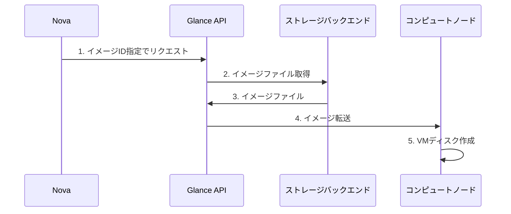

---

### 1.5 Cinder（ブロックストレージサービス）✅ 🎓🏢

**Cinder**は、OpenStackの**ブロックストレージサービス**で、VMに接続する仮想ディスク（ボリューム）を提供します。

#### 主な機能

| 機能                   | 説明                       |
| ---------------------- | -------------------------- |
| **ボリューム作成**     | 仮想ディスクの作成         |
| **ボリュームアタッチ** | VMへのボリューム接続       |
| **スナップショット**   | ボリュームのバックアップ   |
| **ボリュームタイプ**   | SSD、HDD等の性能レベル定義 |

#### AWSとの対比 ⭐

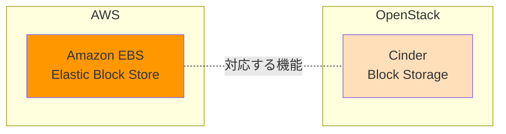

**Cinderは「OpenStackのEBS」**:

- VMに追加ディスクとして接続
- VMからは通常のハードディスクに見える
- スナップショット・バックアップが可能
- VMから切り離して別のVMに付け替え可能

#### Cinderのアーキテクチャ ⭐

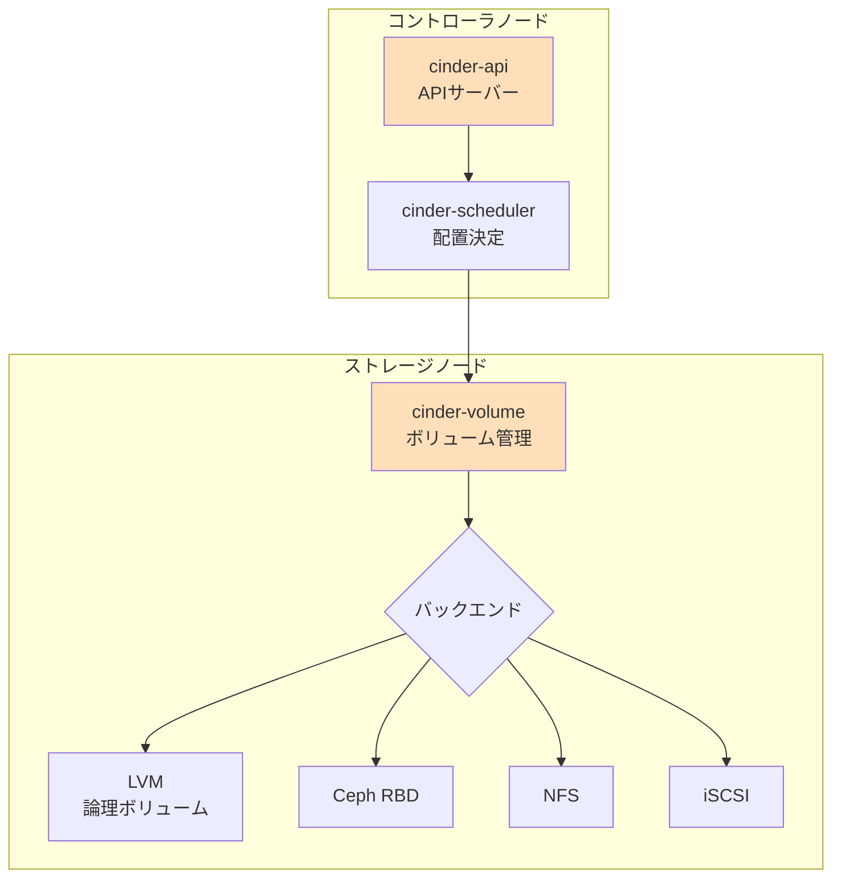

#### Cinderのバックエンド 💡

| バックエンド | 説明                         | 推奨環境           |
| ------------ | ---------------------------- | ------------------ |
| **LVM**      | Linux Logical Volume Manager | 学習環境 🎓         |
| **Ceph RBD** | 分散ストレージ               | 本番環境 🏢         |
| **NFS**      | Network File System          | 小規模環境         |
| **iSCSI**    | 専用ストレージアレイ         | エンタープライズ 🏢 |

#### ボリュームのライフサイクル 💡

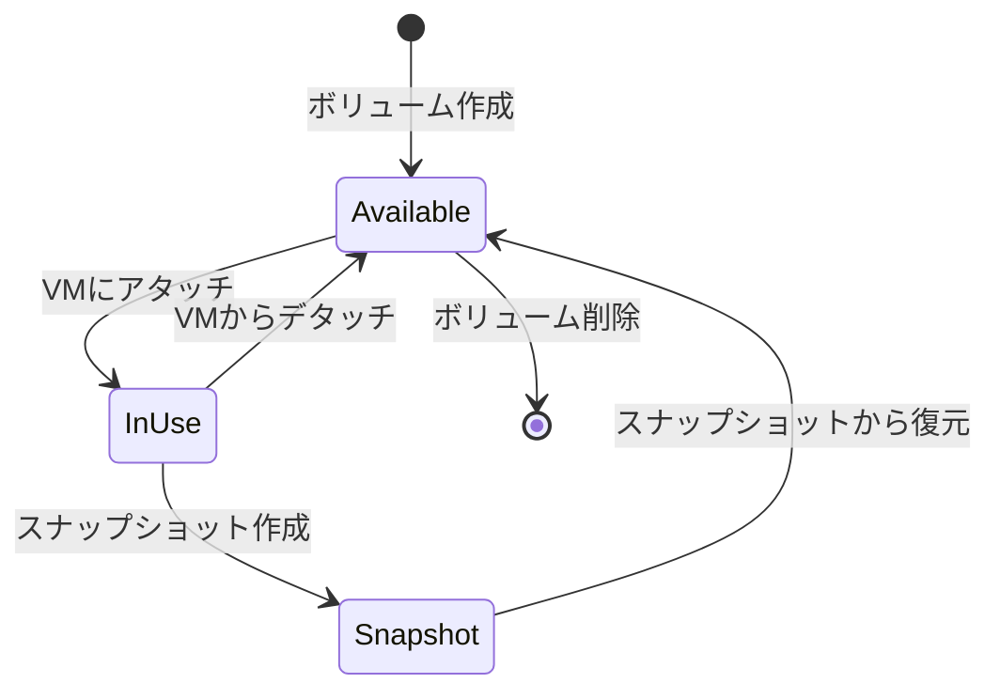

---

### 1.6 Swift（オブジェクトストレージサービス）⭐ 🏢

**Swift**は、OpenStackの**オブジェクトストレージサービス**で、REST API経由でアクセスできるスケーラブルなストレージを提供します。

#### 主な機能

| 機能                 | 説明                         |
| -------------------- | ---------------------------- |
| **オブジェクト保存** | ファイル、画像、動画等の保存 |
| **REST API**         | HTTP/HTTPSでのアクセス       |
| **高可用性**         | データの自動レプリケーション |
| **大容量対応**       | ペタバイト規模まで対応       |

#### AWSとの対比 ⭐

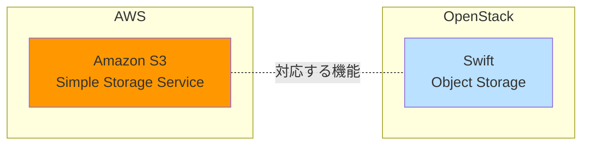

**Swiftは「OpenStackのS3」**:

- REST APIでファイルを保存・取得
- バケット（コンテナ）にオブジェクトを格納
- 画像、動画、バックアップファイル等に適している
- 高い冗長性・耐久性

#### CinderとSwiftの違い ✅

| 比較項目             | Cinder（ブロックストレージ） | Swift（オブジェクトストレージ） |
| -------------------- | ---------------------------- | ------------------------------- |
| **アクセス方法**     | VMから直接マウント           | REST API                        |
| **用途**             | VMのディスク、データベース   | 画像、動画、バックアップ        |
| **ファイルシステム** | 必要（VMがフォーマット）     | 不要（オブジェクト単位）        |
| **パフォーマンス**   | 高速（ブロックレベル）       | 中速（HTTP経由）                |
| **スケール**         | 中規模                       | 大規模（ペタバイト級）          |
| **AWS対応**          | EBS                          | S3                              |

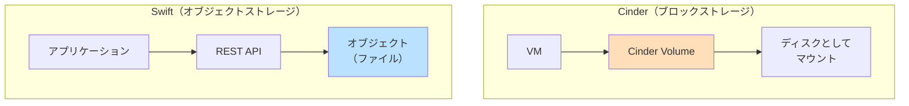

---

### 1.7 Horizon（ダッシュボード）✅ 🎓🏢

**Horizon**は、OpenStackの**Webベースのダッシュボード**で、グラフィカルな管理インターフェースを提供します。

#### 主な機能

| 機能                 | 説明                           |
| -------------------- | ------------------------------ |
| **VM管理**           | インスタンスの作成・削除・操作 |
| **ネットワーク管理** | 仮想ネットワークの作成・設定   |
| **ボリューム管理**   | ストレージの管理               |
| **イメージ管理**     | OSイメージのアップロード・管理 |
| **ユーザー管理**     | プロジェクト・ユーザーの管理   |

#### Horizonの位置づけ 💡

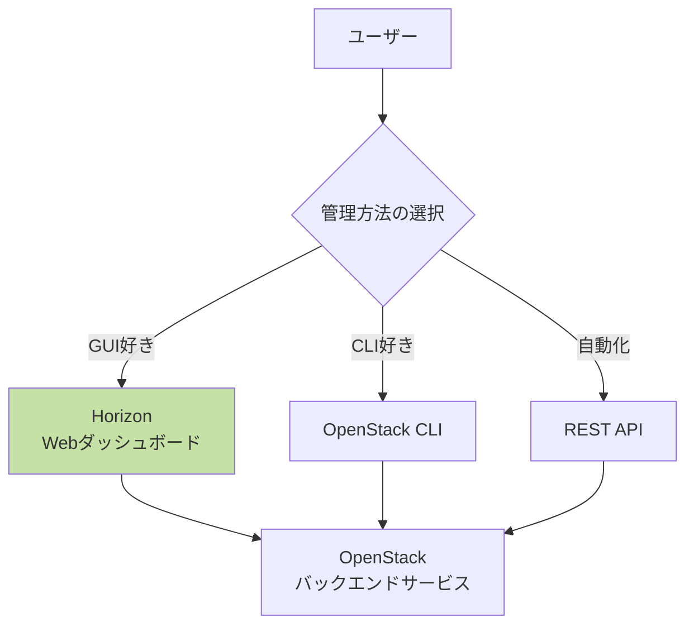

**重要なポイント**:

- Horizonは**フロントエンド**に過ぎない
- 裏では全て**REST API**を使用している
- CLIやAPIで同じことができる
- 学習にはHorizonが便利

---

### 1.8 その他の重要なコンポーネント 💡

#### Heat（オーケストレーション）📚 🏢

**Heat**は、OpenStackの**オーケストレーションサービス**で、インフラのコード化（IaC）を実現します。

- **AWS対応**: CloudFormation
- **用途**: 複雑なインフラをテンプレートで定義・デプロイ
- **形式**: HOTテンプレート（YAML形式）

#### Ceilometer（メトリクス）📚 🏢

**Ceilometer**は、**メトリクス収集サービス**で、リソースの使用状況を監視します。

- **用途**: 課金、監視、キャパシティプランニング
- **収集データ**: CPU使用率、ネットワークトラフィック、ストレージ使用量

#### Barbican（シークレット管理）📚 🏢

**Barbican**は、**シークレット管理サービス**で、鍵やパスワードを安全に保管します。

- **用途**: 証明書、暗号鍵、APIキーの管理
- **セキュリティ**: 暗号化されたストレージ

---

## 2. ノード構成の考え方

OpenStackは、役割ごとにノード（物理または仮想サーバー）を分けて構成します。これにより、スケーラビリティと保守性が向上します。

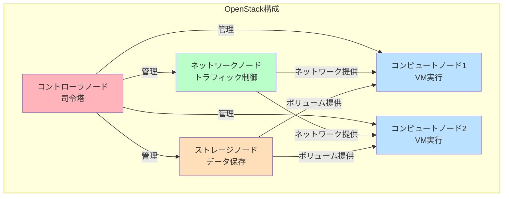

---

### 2.1 コントローラノード ✅ 🎓🏢

**コントローラノード**は、OpenStackの**司令塔**です。

#### 役割：指示役・管理役

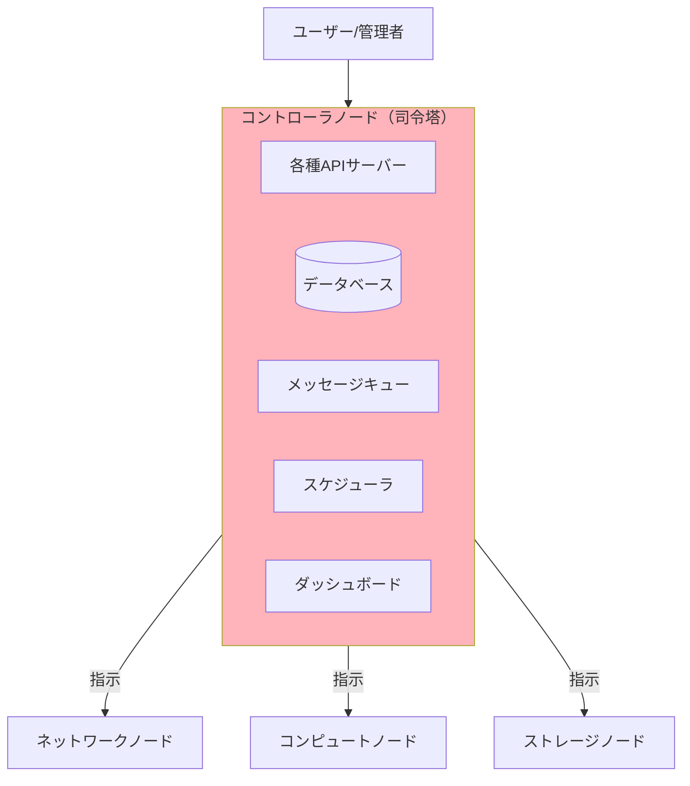

#### 主なコンポーネント ⭐

| サービス             | コンポーネント                 | 役割                   |
| -------------------- | ------------------------------ | ---------------------- |
| **認証**             | Keystone                       | 全サービスの認証・認可 |
| **コンピュート**     | Nova API, Scheduler, Conductor | VM管理の指示           |
| **ネットワーク**     | Neutron Server                 | ネットワーク管理の指示 |
| **イメージ**         | Glance                         | イメージ管理           |
| **ストレージ**       | Cinder API, Scheduler          | ボリューム管理の指示   |
| **ダッシュボード**   | Horizon                        | Web UI                 |
| **データベース**     | MariaDB/MySQL                  | 全体の状態管理         |
| **メッセージキュー** | RabbitMQ                       | コンポーネント間通信   |

#### 会社に例えると 💡

- **本社・管理部門**
- 顧客からの注文を受け付ける（API）
- 作業指示書を作成する（スケジューラ）
- 各現場に指示を送る（メッセージキュー）
- 全体の情報を管理する（データベース）

#### ハードウェア要件 🎓

| 項目         | 学習環境 | 本番環境    |
| ------------ | -------- | ----------- |
| **CPU**      | 2-4 vCPU | 8+ cores    |
| **メモリ**   | 4-8GB    | 16-32GB     |
| **ディスク** | 50-100GB | 200GB+ SSD  |
| **NIC**      | 2-3      | 4+ (冗長化) |

---

### 2.2 コンピュートノード ✅ 🎓🏢

**コンピュートノード**は、OpenStackの**筋肉・作業員**です。

#### 役割：VMの実行環境

```mermaid
graph TB
    Controller[コントローラノード] -->|VM作成指示| Compute[コンピュートノード]

    subgraph Compute ["コンピュートノード（作業員）"]
        NovaCompute[nova-compute]
        Hypervisor[ハイパーバイザー<br/>KVM/QEMU]
        OVSAgent[OVS Agent<br/>ネットワーク接続]
    end

    Hypervisor --> VM1[VM 1]
    Hypervisor --> VM2[VM 2]
    Hypervisor --> VM3[VM 3]

    OVSAgent --> Network[ネットワークノード]

    style Compute fill:#bae1ff
```

#### 主なコンポーネント ⭐

| コンポーネント                | 役割                                         |
| ----------------------------- | -------------------------------------------- |
| **nova-compute**              | ハイパーバイザーの制御、VMライフサイクル管理 |
| **ハイパーバイザー**          | KVM/QEMUで実際にVMを実行                     |
| **neutron-openvswitch-agent** | 仮想スイッチの管理、VMのネットワーク接続     |

#### 会社に例えると 💡

- **工場・作業場**
- 実際に製品（VM）を作る
- 複数の作業台（VM）で同時に作業可能
- 作業指示書（メッセージキュー）に従って動く

#### 重要な機能：仮想化支援 ✅

**CPUの仮想化支援機能が必須**:

- **Intel**: VT-x
- **AMD**: AMD-V

```bash
# 仮想化支援の確認方法
egrep -c '(vmx|svm)' /proc/cpuinfo
# 1以上なら対応
```

#### ハードウェア要件 🎓

| 項目         | 学習環境                 | 本番環境    |
| ------------ | ------------------------ | ----------- |
| **CPU**      | 2-4 vCPU（要VT-x/AMD-V） | 16+ cores   |
| **メモリ**   | 4-8GB                    | 64-256GB    |
| **ディスク** | 50-100GB                 | 1TB+ SSD    |
| **NIC**      | 2                        | 4+ (冗長化) |

#### スケールアウト ⭐

**コンピュートノードは水平スケールが容易**:

```mermaid
graph LR
    Controller[コントローラ] --> Compute1[コンピュート1]
    Controller --> Compute2[コンピュート2]
    Controller --> Compute3[コンピュート3]
    Controller -.追加可能.-> ComputeN[コンピュートN]

    style ComputeN stroke-dasharray: 5 5
```

- リソース不足時にコンピュートノードを追加
- コントローラノードから自動的に認識
- VMの配置はSchedulerが自動的に分散

---

### 2.3 ネットワークノード ✅ 🎓🏢

**ネットワークノード**は、OpenStackの**郵便局・配送センター**です。

#### 役割：実際のネットワーク処理

```mermaid
graph TB
    Controller[コントローラノード] -->|ネットワーク設定指示| Network[ネットワークノード]

    subgraph Network ["ネットワークノード（配送センター）"]
        L3Agent[L3 Agent<br/>ルーティング]
        DHCPAgent[DHCP Agent<br/>IP割り当て]
        MetaAgent[Metadata Agent<br/>メタデータ提供]

        L3Agent --> Router[仮想ルーター<br/>Linux名前空間]
        DHCPAgent --> DHCP[dnsmasq<br/>DHCPサーバー]
    end

    Network --> External[外部ネットワーク<br/>インターネット]
    Network --> Compute[コンピュートノード<br/>VM]

    style Network fill:#baffc9
```

#### 主なコンポーネント（再確認）⭐

| コンポーネント     | 役割                   | 実際の処理                         |
| ------------------ | ---------------------- | ---------------------------------- |
| **L3 Agent**       | レイヤー3ルーティング  | 仮想ルーター作成、NAT、Floating IP |
| **DHCP Agent**     | IPアドレス自動割り当て | dnsmasqでDHCPサーバー実行          |
| **Metadata Agent** | VMへのメタデータ提供   | クラウド初期化データの提供         |

#### Neutron Serverとの関係（再確認）✅

```mermaid
sequenceDiagram
    participant User as ユーザー
    participant NS as Neutron Server<br/>（コントローラ）
    participant MQ as RabbitMQ
    participant L3 as L3 Agent<br/>（ネットワーク）

    User->>NS: 「Floating IP作成」
    NS->>NS: 設定をDBに保存
    NS->>MQ: L3 Agentに指示送信
    MQ->>L3: 指示受信
    L3->>L3: iptablesでNAT設定
    L3->>NS: 完了報告
    NS->>User: 「Floating IP作成完了」

    Note over NS: 指示役（司令塔）
    Note over L3: 実作業員
```

#### 会社に例えると 💡

- **郵便局・配送センター**
- 本社（コントローラ）からの配送指示を受ける
- 実際に荷物（パケット）を配送する
- 配送先の振り分け（ルーティング）
- 配送先の確認（DHCP）

#### ハードウェア要件 🎓

| 項目         | 学習環境 | 本番環境                               |
| ------------ | -------- | -------------------------------------- |
| **CPU**      | 1-2 vCPU | 4-8 cores                              |
| **メモリ**   | 2-4GB    | 8-16GB                                 |
| **ディスク** | 30-50GB  | 100GB+                                 |
| **NIC**      | 3+       | 4+ (外部/管理/オーバーレイ/ストレージ) |

---

### 2.4 ストレージノード ⭐ 🏢

**ストレージノード**は、OpenStackの**倉庫**です。

#### 役割：データの永続化

```mermaid
graph TB
    subgraph Storage ["ストレージノード（倉庫）"]
        Cinder[Cinder Volume<br/>ブロックストレージ]
        Swift[Swift<br/>オブジェクトストレージ]

        Cinder --> LVM[LVMボリューム]
        Swift --> Objects[オブジェクト<br/>ファイル]
    end

    Compute[コンピュートノード] -->|ボリューム接続| Cinder
    App[アプリケーション] -->|REST API| Swift

    style Storage fill:#ffdfba
```

#### Cinderストレージノード ⭐

**役割**:

- VMに接続するボリュームの実体を管理
- iSCSI/NFS等のプロトコルでコンピュートノードに提供

**主なコンポーネント**:

- **cinder-volume**: ボリュームの作成・削除・管理
- **バックエンドストレージ**: LVM、Ceph、NFS等

#### Swiftストレージノード 💡

**役割**:

- オブジェクト（ファイル）の保存
- 複数ノードでデータをレプリケーション

**主なコンポーネント**:

- **swift-object-server**: オブジェクトの保存
- **swift-account-server**: アカウント情報管理
- **swift-container-server**: コンテナ管理

#### 会社に例えると 💡

- **倉庫**
- Cinder: 製品用の部品倉庫（ブロック単位で管理）
- Swift: 書類アーカイブ（ファイル単位で管理）

#### ハードウェア要件 🎓

| 項目         | 学習環境 | 本番環境                        |
| ------------ | -------- | ------------------------------- |
| **CPU**      | 1-2 vCPU | 4-8 cores                       |
| **メモリ**   | 2-4GB    | 8-16GB                          |
| **ディスク** | 100GB+   | 10TB+ (複数ディスク)            |
| **NIC**      | 2        | 4+ (専用ストレージネットワーク) |

---

### 2.5 ノード役割のまとめ ✅

```mermaid
graph TB
    User[ユーザー] --> Controller

    subgraph "各ノードの役割"
        Controller[コントローラノード<br/>📋 司令塔・本社<br/>指示を出す]
        Network[ネットワークノード<br/>📮 郵便局<br/>実際に配送する]
        Compute[コンピュートノード<br/>🏭 工場<br/>実際に製品を作る]
        Storage[ストレージノード<br/>🏢 倉庫<br/>データを保管する]
    end

    Controller -->|指示| Network
    Controller -->|指示| Compute
    Controller -->|指示| Storage

    Network -->|ネットワーク| Compute
    Storage -->|ボリューム| Compute

    style Controller fill:#ffb3ba
    style Network fill:#baffc9
    style Compute fill:#bae1ff
    style Storage fill:#ffdfba
```

#### 各ノードの比較表 ✅

| ノード           | 役割                   | 主なコンポーネント                    | 例え   | スケール         |
| ---------------- | ---------------------- | ------------------------------------- | ------ | ---------------- |
| **コントローラ** | 司令塔・指示役         | API、DB、スケジューラ、Neutron Server | 本社   | 垂直（HA化）     |
| **コンピュート** | VM実行                 | nova-compute、ハイパーバイザ          | 工場   | 水平（追加容易） |
| **ネットワーク** | 実際のネットワーク処理 | L3 Agent、DHCP Agent                  | 郵便局 | 垂直（HA化）     |
| **ストレージ**   | データ保存             | Cinder、Swift                         | 倉庫   | 水平（追加容易） |

---

## 3. コンポーネント間の連携

OpenStackのコンポーネントは、メッセージキューとデータベースを介して連携します。

### 3.1 メッセージキュー（RabbitMQ）の役割 ✅

**RabbitMQ**は、コンポーネント間の**非同期通信**を実現します。

```mermaid
sequenceDiagram
    participant API as Nova API<br/>（コントローラ）
    participant MQ as RabbitMQ<br/>（メッセージキュー）
    participant Compute as nova-compute<br/>（コンピュート）

    API->>MQ: 1. メッセージ送信<br/>「VM作成して」
    API->>API: 2. すぐにリターン<br/>（待たない）
    MQ->>Compute: 3. メッセージ配信
    Compute->>Compute: 4. VM作成処理<br/>（時間がかかる）
    Compute->>MQ: 5. 完了通知
    MQ->>API: 6. ステータス更新

    Note over API,Compute: 非同期処理により<br/>APIがブロックされない
```

#### メッセージキューのメリット ⭐

| メリット             | 説明                                  |
| -------------------- | ------------------------------------- |
| **非同期処理**       | APIサーバーが処理完了を待たなくて良い |
| **疎結合**           | コンポーネント同士が直接通信しない    |
| **スケーラビリティ** | ワーカーを増やせば並列処理が向上      |
| **信頼性**           | メッセージの永続化で処理の確実性向上  |

---

### 3.2 データベース（MariaDB/MySQL）の役割 ✅

**MariaDB/MySQL**は、OpenStackの**状態管理**を担当します。

```mermaid
graph TB
    subgraph "各サービス"
        Nova[Nova]
        Neutron[Neutron]
        Glance[Glance]
        Cinder[Cinder]
        Keystone[Keystone]
    end

    Nova --> DB[(MariaDB/MySQL)]
    Neutron --> DB
    Glance --> DB
    Cinder --> DB
    Keystone --> DB

    DB --> Storage1[nova データベース]
    DB --> Storage2[neutron データベース]
    DB --> Storage3[glance データベース]
    DB --> Storage4[cinder データベース]
    DB --> Storage5[keystone データベース]

    style DB fill:#4db6ac
```

#### 保存される情報 ⭐

| サービス     | データベース | 保存される情報                         |
| ------------ | ------------ | -------------------------------------- |
| **Nova**     | nova         | VM情報、フレーバー、ホスト情報         |
| **Neutron**  | neutron      | ネットワーク、サブネット、ルーター設定 |
| **Glance**   | glance       | イメージのメタデータ                   |
| **Cinder**   | cinder       | ボリューム情報、スナップショット       |
| **Keystone** | keystone     | ユーザー、プロジェクト、ロール         |

---

### 3.3 API連携のフロー ✅

OpenStackの全ての操作は、REST APIを通じて実行されます。

#### VM作成の完全なフロー 💡

```mermaid
sequenceDiagram
    participant User as ユーザー
    participant Horizon as Horizon
    participant Keystone as Keystone
    participant Nova as Nova API
    participant Glance as Glance
    participant Neutron as Neutron
    participant MQ as RabbitMQ
    participant Compute as nova-compute

    User->>Horizon: 1. VMインスタンス作成リクエスト
    Horizon->>Keystone: 2. トークン認証
    Keystone->>Horizon: 3. トークン発行
    Horizon->>Nova: 4. VM作成API呼び出し（トークン付き）
    Nova->>Keystone: 5. トークン検証
    Nova->>Glance: 6. イメージ取得
    Nova->>Neutron: 7. ネットワーク準備
    Nova->>MQ: 8. VM作成メッセージ送信
    MQ->>Compute: 9. メッセージ配信
    Compute->>Compute: 10. ハイパーバイザーでVM作成
    Compute->>Nova: 11. 完了通知
    Nova->>Horizon: 12. ステータス更新
    Horizon->>User: 13. VM作成完了
```

---

### 3.4 コンポーネント間の依存関係 ⭐

```mermaid
graph TB
    subgraph "基盤サービス（最初に起動）"
        DB[(MariaDB/MySQL)]
        MQ[RabbitMQ]
    end

    subgraph "コアサービス"
        Keystone[Keystone<br/>認証]
    end

    subgraph "他のサービス"
        Nova[Nova]
        Neutron[Neutron]
        Glance[Glance]
        Cinder[Cinder]
        Horizon[Horizon]
    end

    DB --> Keystone
    MQ --> Keystone

    Keystone --> Nova
    Keystone --> Neutron
    Keystone --> Glance
    Keystone --> Cinder
    Keystone --> Horizon

    DB --> Nova
    DB --> Neutron
    DB --> Glance
    DB --> Cinder

    MQ --> Nova
    MQ --> Neutron
    MQ --> Cinder

    style Keystone fill:#ffb3ba
    style DB fill:#4db6ac
    style MQ fill:#ffd54f
```

#### 起動順序 ✅

**正しい起動順序**:

1. **MariaDB/MySQL** - データベース
2. **RabbitMQ** - メッセージキュー
3. **Keystone** - 認証サービス
4. **その他のサービス** - Nova、Neutron、Glance、Cinder等
5. **Horizon** - ダッシュボード

---

## まとめ

### Part 2で学んだこと ✅

1. **OpenStackの主要コンポーネント**
   - Keystone（認証）、Nova（コンピュート）、Neutron（ネットワーク）
   - Glance（イメージ）、Cinder（ブロックストレージ）、Swift（オブジェクトストレージ）
   - Horizon（ダッシュボード）

2. **ノード構成の考え方**
   - **コントローラ**: 司令塔・指示役
   - **コンピュート**: VM実行・作業員
   - **ネットワーク**: 実際のネットワーク処理・配送センター
   - **ストレージ**: データ保存・倉庫

3. **重要な理解ポイント**
   - **Neutron ServerとL3 Agentの違い**: 指示役 vs 実作業員
   - **CinderとSwiftの違い**: ブロックストレージ vs オブジェクトストレージ
   - **メッセージキューの役割**: 非同期通信の実現
   - **データベースの役割**: 状態管理

### 次のステップ 📚

Part 3では、OpenStackのネットワーク設計について詳しく学びます：

- OpenStackの4つのネットワーク構成
- ネットワークタイプ（FLAT、VXLAN等）の詳細
- Neutronアーキテクチャの深堀り
- 学習環境でのネットワーク設計例

---

**前へ**: [Part 1: OpenStack概要と選択肢](01_overview.md)
**次へ**: [Part 3: ネットワーク設計ガイド](03_network_design.md)
