# Part 4: システム設計ガイド

## 目次

- [Part 4: システム設計ガイド](#part-4-システム設計ガイド)
  - [目次](#目次)
  - [1. ノード設計](#1-ノード設計)
    - [1.1 構成パターンの全体像 ✅](#11-構成パターンの全体像-)
    - [1.2 All-in-One構成 🎓](#12-all-in-one構成-)
      - [アーキテクチャ](#アーキテクチャ)
      - [特徴](#特徴)
      - [メリット・デメリット](#メリットデメリット)
      - [リソース要件 🎓](#リソース要件-)
      - [推奨用途](#推奨用途)
    - [1.3 マルチノード構成（基本）⭐ 🎓](#13-マルチノード構成基本-)
      - [パターンA: 2ノード構成（最小マルチノード）](#パターンa-2ノード構成最小マルチノード)
      - [パターンB: 3ノード構成（標準マルチノード）✅ 🎓](#パターンb-3ノード構成標準マルチノード-)
      - [パターンC: 4ノード構成（拡張マルチノード）💡](#パターンc-4ノード構成拡張マルチノード)
    - [1.4 高可用性（HA）構成 🏢](#14-高可用性ha構成-)
      - [アーキテクチャ](#アーキテクチャ-1)
      - [主要コンポーネント](#主要コンポーネント)
      - [最小HA構成のノード数](#最小ha構成のノード数)
      - [メリット・デメリット](#メリットデメリット-1)
      - [推奨用途](#推奨用途-1)
    - [1.5 分散構成（DCN - Distributed Compute Node）💡 🏢](#15-分散構成dcn---distributed-compute-node-)
      - [アーキテクチャ](#アーキテクチャ-2)
      - [特徴](#特徴-1)
      - [推奨用途](#推奨用途-2)
    - [1.6 構成パターンの比較表 ✅](#16-構成パターンの比較表-)
    - [1.7 スケーラビリティの考え方 ⭐](#17-スケーラビリティの考え方-)
      - [垂直スケール vs 水平スケール](#垂直スケール-vs-水平スケール)
      - [コンピュートノードのスケールアウト ⭐](#コンピュートノードのスケールアウト-)
    - [1.8 リソース割り当ての考え方 💡](#18-リソース割り当ての考え方-)
      - [オーバーコミット ⭐](#オーバーコミット-)
      - [フレーバー設計 💡](#フレーバー設計-)
  - [2. ストレージ設計](#2-ストレージ設計)
    - [2.1 OpenStackのストレージ概要 ✅](#21-openstackのストレージ概要-)
    - [2.2 エフェメラルストレージ（一時ストレージ）💡](#22-エフェメラルストレージ一時ストレージ)
      - [特徴](#特徴-2)
    - [2.3 Cinder（ブロックストレージ）✅](#23-cinderブロックストレージ)
      - [アーキテクチャ](#アーキテクチャ-3)
      - [ストレージバックエンドの種類 ⭐](#ストレージバックエンドの種類-)
        - [**LVM (Logical Volume Manager)** 🎓](#lvm-logical-volume-manager-)
      - [メリット](#メリット)
      - [デメリット](#デメリット)
      - [LVMの仕組み](#lvmの仕組み)
        - [**Ceph RBD (RADOS Block Device)** 🏢](#ceph-rbd-rados-block-device-)
      - [メリット](#メリット-1)
      - [デメリット](#デメリット-1)
      - [Cephの仕組み](#cephの仕組み)
        - [**その他のバックエンド** 💡](#その他のバックエンド-)
      - [Cinderボリュームの操作 ⭐](#cinderボリュームの操作-)
    - [2.4 Swift（オブジェクトストレージ）💡](#24-swiftオブジェクトストレージ)
      - [アーキテクチャ](#アーキテクチャ-4)
        - [主要コンセプト](#主要コンセプト)
      - [特徴](#特徴-3)
      - [メリット・デメリット](#メリットデメリット-2)
        - [メリット](#メリット-2)
        - [デメリット](#デメリット-2)
      - [使用例 💡](#使用例-)
    - [2.5 ストレージの比較 ✅](#25-ストレージの比較-)
    - [2.6 学習環境でのストレージ設計 🎓](#26-学習環境でのストレージ設計-)
      - [推奨構成](#推奨構成)
      - [設定例](#設定例)
  - [3. ハードウェア要件](#3-ハードウェア要件)
    - [3.1 構成パターン別のリソース要件 ✅](#31-構成パターン別のリソース要件-)
      - [パターンA: All-in-One構成 🎓](#パターンa-all-in-one構成-)
      - [パターンB: 2ノード構成 🎓](#パターンb-2ノード構成-)
      - [パターンC: 3ノード構成（標準）⭐ 🎓](#パターンc-3ノード構成標準-)
      - [パターンD: 4+ノード構成（拡張）💡](#パターンd-4ノード構成拡張)
    - [3.2 本番環境のリソース要件 🏢](#32-本番環境のリソース要件-)
      - [最小本番環境（3ノード）](#最小本番環境3ノード)
      - [大規模本番環境（HA構成）](#大規模本番環境ha構成)
    - [3.3 コンピュートノードの設計 ⭐](#33-コンピュートノードの設計-)
      - [CPU要件](#cpu要件)
      - [メモリ要件](#メモリ要件)
      - [ディスク要件](#ディスク要件)
    - [3.4 ネットワーク要件 ⭐](#34-ネットワーク要件-)
      - [NICの数と役割](#nicの数と役割)
      - [帯域幅要件](#帯域幅要件)
  - [4. OS選択とハイパーバイザー](#4-os選択とハイパーバイザー)
    - [4.1 推奨OS ✅](#41-推奨os-)
      - [Ubuntu（推奨）⭐ 🎓](#ubuntu推奨-)
      - [メリット](#メリット-3)
      - [推奨理由](#推奨理由)
      - [Rocky Linux / AlmaLinux 💡](#rocky-linux--almalinux-)
      - [メリット](#メリット-4)
      - [推奨環境](#推奨環境)
      - [その他のOS 📚](#その他のos-)
    - [4.2 ハイパーバイザーの選択 ✅](#42-ハイパーバイザーの選択-)
      - [KVM/QEMU（推奨）⭐](#kvmqemu推奨)
      - [メリット](#メリット-5)
      - [デメリット](#デメリット-3)
      - [その他のハイパーバイザー 💡](#その他のハイパーバイザー-)
  - [まとめ](#まとめ)
    - [Part 4で学んだこと ✅](#part-4で学んだこと-)
    - [次のステップ 📚](#次のステップ-)

---

## 1. ノード設計

> **関連情報**:
>
> - アーキテクチャの理解: [Part 2 - ノード構成](02_architecture.md#2-ノード構成の考え方)
> - 実践例: [Part 6 - 学習環境の構成](06_practical_guide.md#1-学習環境の構成パターン)

OpenStackの構成は、目的・規模・可用性要件によって大きく変わります。

### 1.1 構成パターンの全体像 ✅

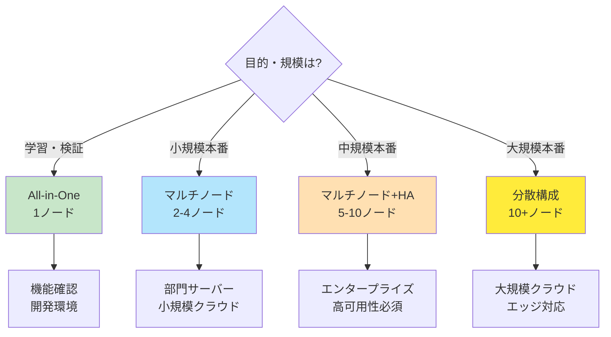

---

### 1.2 All-in-One構成 🎓

**全てのコンポーネントを1台**のサーバーで動作させる構成。

#### アーキテクチャ

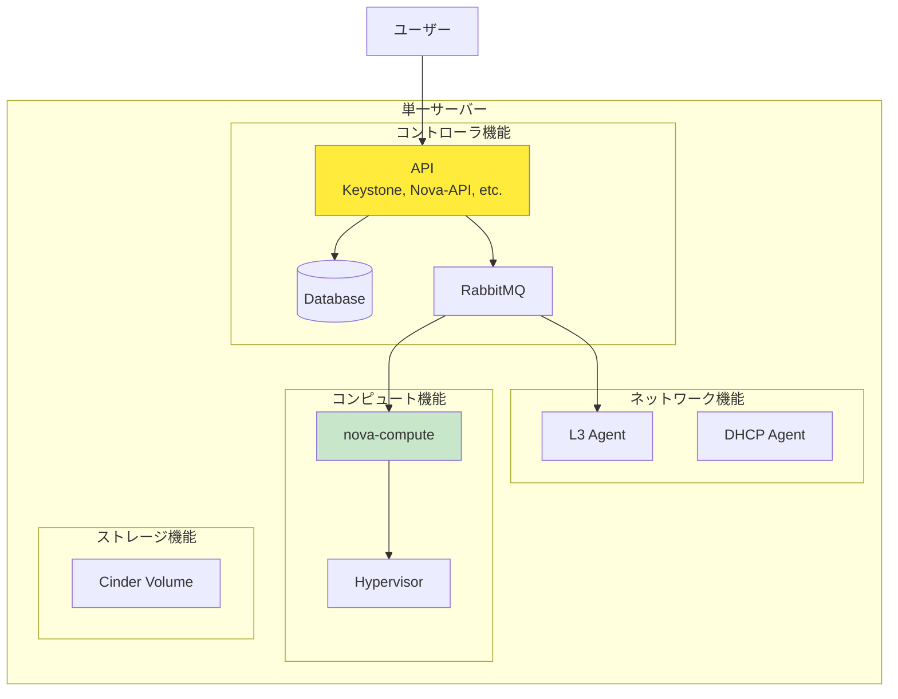

#### 特徴

| 項目                 | 内容                 |
| -------------------- | -------------------- |
| **ノード数**         | 1台                  |
| **リソース要件**     | 中程度（8-16GB RAM） |
| **セットアップ時間** | 短い（2-4時間）      |
| **可用性**           | なし（単一障害点）   |
| **スケーラビリティ** | なし                 |
| **コスト**           | 最小                 |

#### メリット・デメリット

**✅ メリット**:

- セットアップが最も簡単
- 1台で全機能を体験できる
- リソース要件が最小
- OpenStackの全体像を素早く把握

**❌ デメリット**:

- 本番環境には不向き
- スケールアウト不可
- 単一障害点（SPOF）
- パフォーマンスが限定的
- 実際のノード間通信を学べない

#### リソース要件 🎓

**最小要件:**

- CPU: 4コア（仮想化支援機能必須）
- メモリ: 8GB
- ディスク: 40GB
- NIC: 2つ（管理+外部）

**推奨要件:**

- CPU: 8コア
- メモリ: 16GB
- ディスク: 100GB（SSD推奨）
- NIC: 2つ

#### 推奨用途

- ✅ **OpenStack初体験**
- ✅ 機能確認・デモ
- ✅ 開発環境
- ❌ 本番環境
- ❌ マルチノード動作の学習

---

### 1.3 マルチノード構成（基本）⭐ 🎓

**役割ごとにノードを分散**させた構成。

#### パターンA: 2ノード構成（最小マルチノード）

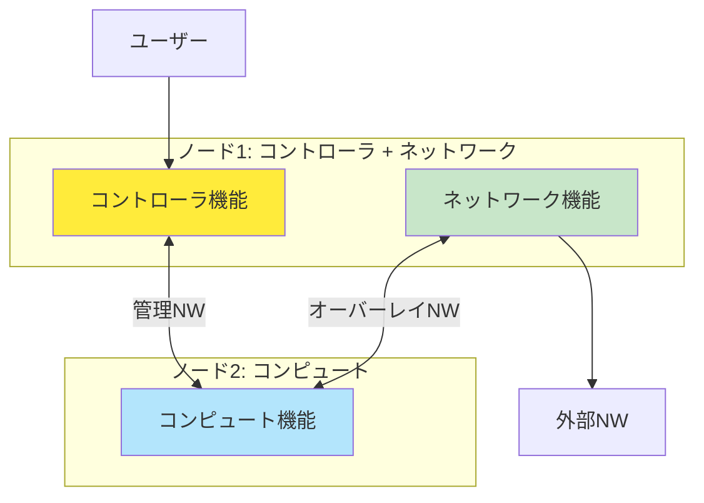

**特徴**:

- コントローラとネットワークを同居
- 理解しやすく、リソース効率的
- 最小のマルチノード体験

**リソース要件**:

```bash
ノード1（コントローラ+ネットワーク）:
  CPU: 4コア, メモリ: 8GB, ディスク: 60GB, NIC: 3

ノード2（コンピュート）:
  CPU: 4コア, メモリ: 8GB, ディスク: 60GB, NIC: 2
```

#### パターンB: 3ノード構成（標準マルチノード）✅ 🎓

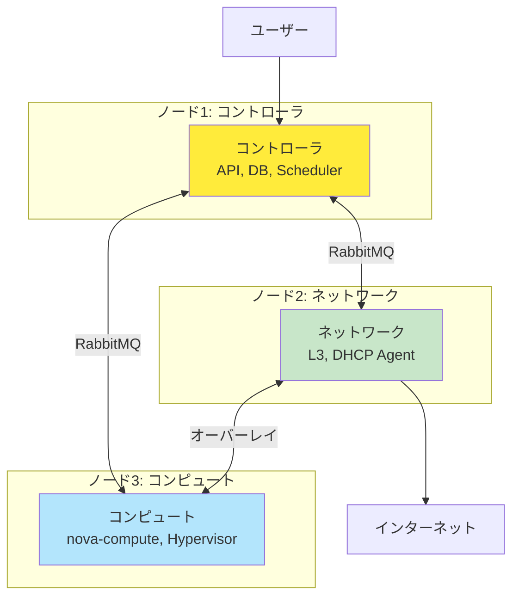

**特徴**:

- ✅ **各役割が独立して理解しやすい**
- ✅ 推奨される学習構成
- ✅ ノード間の通信を実体験
- ✅ スケールアウトの基礎

**リソース要件** 🎓:

```bash
ノード1（コントローラ）:
  CPU: 2-4コア, メモリ: 4-8GB, ディスク: 40-80GB, NIC: 3

ノード2（ネットワーク）:
  CPU: 2-4コア, メモリ: 2-4GB, ディスク: 20-40GB, NIC: 3

ノード3（コンピュート）:
  CPU: 2-4コア, メモリ: 4-8GB, ディスク: 40-100GB, NIC: 2
```

**メリット・デメリット**:

**✅ メリット**:

- 役割分担が明確
- トラブルシューティングが容易
- コンピュートノードを追加可能
- 実践的な構成

**❌ デメリット**:

- リソースが3台分必要
- 設定がやや複雑
- まだHA構成ではない

#### パターンC: 4ノード構成（拡張マルチノード）💡

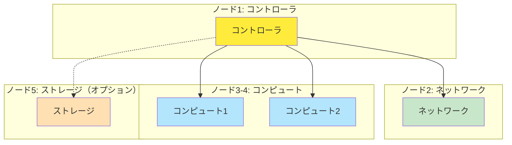

**特徴**:

- 複数のコンピュートノード
- スケールアウトを体験
- より本番環境に近い

**推奨用途**:

- 💡 スケーラビリティの学習
- 💡 ロードバランシングの体験
- 🏢 小規模本番環境

---

### 1.4 高可用性（HA）構成 🏢

**複数の冗長化されたコントローラ**で高可用性を実現。

#### アーキテクチャ

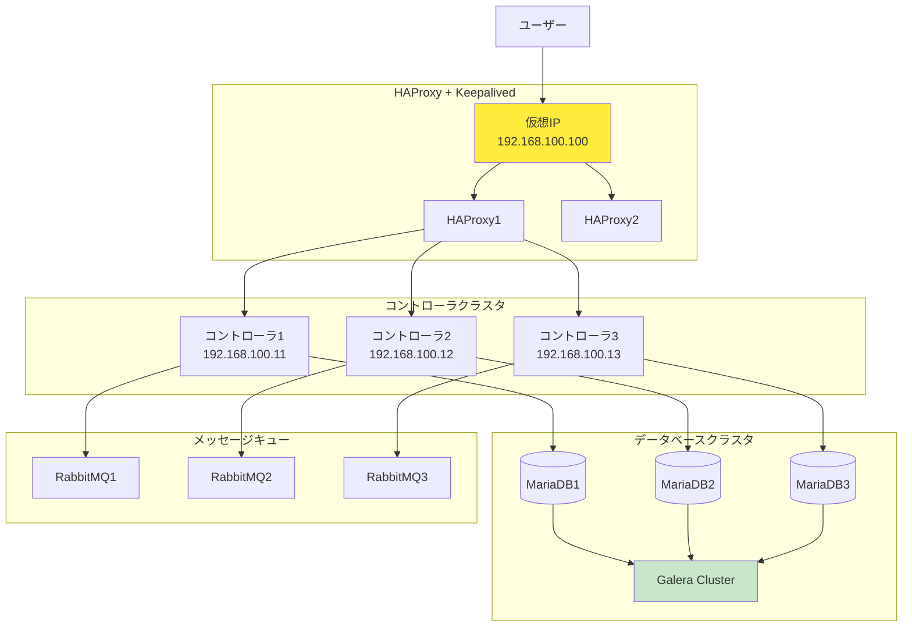

#### 主要コンポーネント

| コンポーネント   | 役割              | 冗長化方式                      |
| ---------------- | ----------------- | ------------------------------- |
| **HAProxy**      | ロードバランサー  | Active-Standby（Keepalived）    |
| **コントローラ** | API、スケジューラ | Active-Active                   |
| **MariaDB**      | データベース      | Galera Cluster（Active-Active） |
| **RabbitMQ**     | メッセージキュー  | Cluster（Active-Active）        |
| **ネットワーク** | L3/DHCP Agent     | VRRP（Active-Standby）          |

#### 最小HA構成のノード数

- **コントローラ:** 3台（奇数台推奨）
- **ネットワーク:** 2台以上
- **コンピュート:** 2台以上

**最小:** 7台
**推奨:** 10台以上

#### メリット・デメリット

**✅ メリット**:

- 高可用性（ノード障害に耐える）
- 計画メンテナンスが容易
- 本番環境に適する
- パフォーマンスとスケーラビリティ

**❌ デメリット**:

- 複雑な設定
- 高いリソース要件
- 運用コストが高い
- 学習曲線が急

#### 推奨用途

- ✅ **本番環境（SLA要件がある場合）**
- ✅ ミッションクリティカルなシステム
- ❌ 学習環境（オーバースペック）
- 💡 学習の最終段階として理解

---

### 1.5 分散構成（DCN - Distributed Compute Node）💡 🏢

**地理的に分散**したコンピュートノードを管理する構成。

#### アーキテクチャ

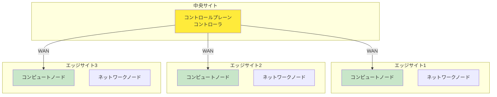

#### 特徴

**中央サイト:**

- コントロールプレーン（API、DB、スケジューラ）
- 全エッジサイトを管理

**エッジサイト:**

- データプレーン（コンピュート、ネットワーク）
- ローカルでVMを実行
- レイテンシーが低い

#### 推奨用途

- 💡 **5G/エッジコンピューティング**
- 💡 CDN、IoTゲートウェイ
- 💡 地理的に分散したオフィス
- 📚 最先端のクラウドアーキテクチャ

---

### 1.6 構成パターンの比較表 ✅

| 構成           | ノード数 | 可用性 | 複雑さ | コスト   | 推奨環境           |
| -------------- | -------- | ------ | ------ | -------- | ------------------ |
| **All-in-One** | 1        | ❌      | ⭐      | 最小     | 🎓 学習・検証       |
| **2ノード**    | 2        | ❌      | ⭐⭐     | 低       | 🎓 学習             |
| **3ノード**    | 3        | ❌      | ⭐⭐⭐    | 中       | ✅ 学習・小規模本番 |
| **4+ノード**   | 4+       | △      | ⭐⭐⭐    | 中〜高   | 🏢 小〜中規模本番   |
| **HA構成**     | 7+       | ✅      | ⭐⭐⭐⭐⭐  | 高       | 🏢 本番環境         |
| **分散構成**   | 10+      | ✅      | ⭐⭐⭐⭐⭐  | 非常に高 | 🏢 エッジ・大規模   |

---

### 1.7 スケーラビリティの考え方 ⭐

#### 垂直スケール vs 水平スケール

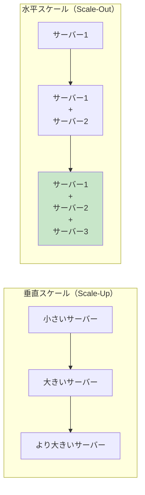

**OpenStackの推奨**: **水平スケール（Scale-Out）**

| 要素              | 垂直スケール           | 水平スケール |
| ----------------- | ---------------------- | ------------ |
| **方法**          | より強力なハードウェア | ノードを追加 |
| **コスト**        | 非線形に増加           | 線形に増加   |
| **可用性**        | 単一障害点             | 冗長性あり   |
| **柔軟性**        | 限定的                 | 高い         |
| **OpenStack適性** | △                      | ✅            |

#### コンピュートノードのスケールアウト ⭐

```text
初期構成:
  コントローラ: 1台
  ネットワーク: 1台
  コンピュート: 2台（20 VM）

      ↓ リソース不足

スケールアウト:
  コントローラ: 1台（変更なし）
  ネットワーク: 1台（変更なし）
  コンピュート: 4台（40 VM）← 2台追加

      ↓ さらにスケールアウト

最終構成:
  コンピュート: 10台（100 VM）← 6台追加
```

**メリット**:

- ✅ 必要な時に必要な分だけ追加
- ✅ 初期投資を抑制
- ✅ 段階的な成長に対応

---

### 1.8 リソース割り当ての考え方 💡

#### オーバーコミット ⭐

OpenStackでは、物理リソースを超えてVMにリソースを割り当てる**オーバーコミット**が可能：

```text
物理サーバー:
  CPU: 16コア
  メモリ: 64GB

      ↓ オーバーコミット設定

仮想リソース:
  CPU: 256 vCPU（16:1）
  メモリ: 96GB（1.5:1）

      ↓ VMへの割り当て

32台のVM（各8 vCPU, 3GB RAM）を起動可能
```

| リソース     | デフォルト比率 | 説明                     |
| ------------ | -------------- | ------------------------ |
| **CPU**      | 16:1           | 物理1コア → 仮想16コア   |
| **RAM**      | 1.5:1          | 物理64GB → 仮想96GB      |
| **ディスク** | 1:1            | 通常オーバーコミットなし |

**メリット・注意点**:

**✅ メリット**:

- リソースの有効活用
- コスト削減
- より多くのVMを起動可能

**⚠️ 注意点**:

- 全VMが同時にフル稼働するとパフォーマンス低下
- ワークロードの特性を理解して設定
- CPU使用率の低いVMが多い環境に適する

#### フレーバー設計 💡

**フレーバー**は、VMのリソース定義（AWS のインスタンスタイプに相当）：

```bash
# 小規模フレーバー
openstack flavor create \
  --vcpus 1 --ram 1024 --disk 10 \
  m1.tiny

# 中規模フレーバー
openstack flavor create \
  --vcpus 2 --ram 2048 --disk 20 \
  m1.small

# 大規模フレーバー
openstack flavor create \
  --vcpus 4 --ram 4096 --disk 40 \
  m1.medium
```

**設計の考え方**:

**ユーザーニーズ:**

- 開発環境: m1.tiny, m1.small
- Webサーバー: m1.medium
- データベース: m1.large（高RAM）
- AI/ML: gpu.large（GPU付き）

---

## 2. ストレージ設計

### 2.1 OpenStackのストレージ概要 ✅

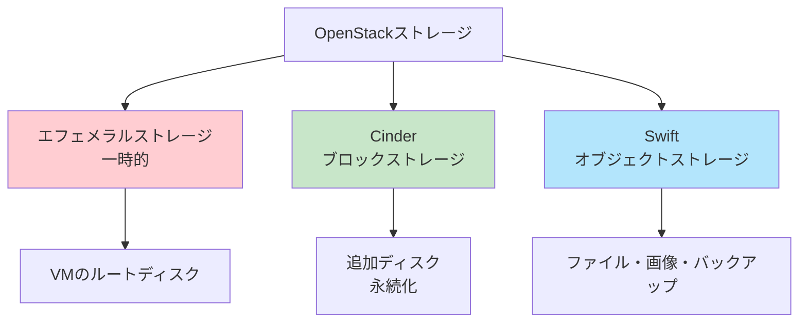

---

### 2.2 エフェメラルストレージ（一時ストレージ）💡

**エフェメラルストレージ**は、VMのルートディスクとして使用される**一時的**なストレージ。

#### 特徴

- **保存場所:** コンピュートノードのローカルディスク
- **永続性:** なし（VM削除時に消失）
- **用途:** OSのブート、一時データ
- **パフォーマンス:** 高速（ローカルディスク）

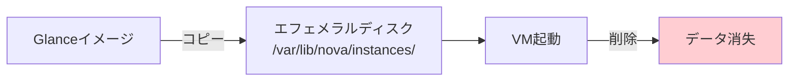

**メリット・デメリット**:

**✅ メリット**:

- 高速（ローカルSSD）
- 追加コストなし

**❌ デメリット**:

- VM削除時にデータ消失
- バックアップ不可
- 別コンピュートノードへの移行困難

---

### 2.3 Cinder（ブロックストレージ）✅

> **基本概念**: Cinderの基本的な仕組みについては [Part 2 - 1.5 Cinder](02_architecture.md#15-cinderブロックストレージサービス) を参照してください。

**Cinder**は、VMに接続する**永続的なボリューム**を提供（≈ AWS EBS）。

#### アーキテクチャ

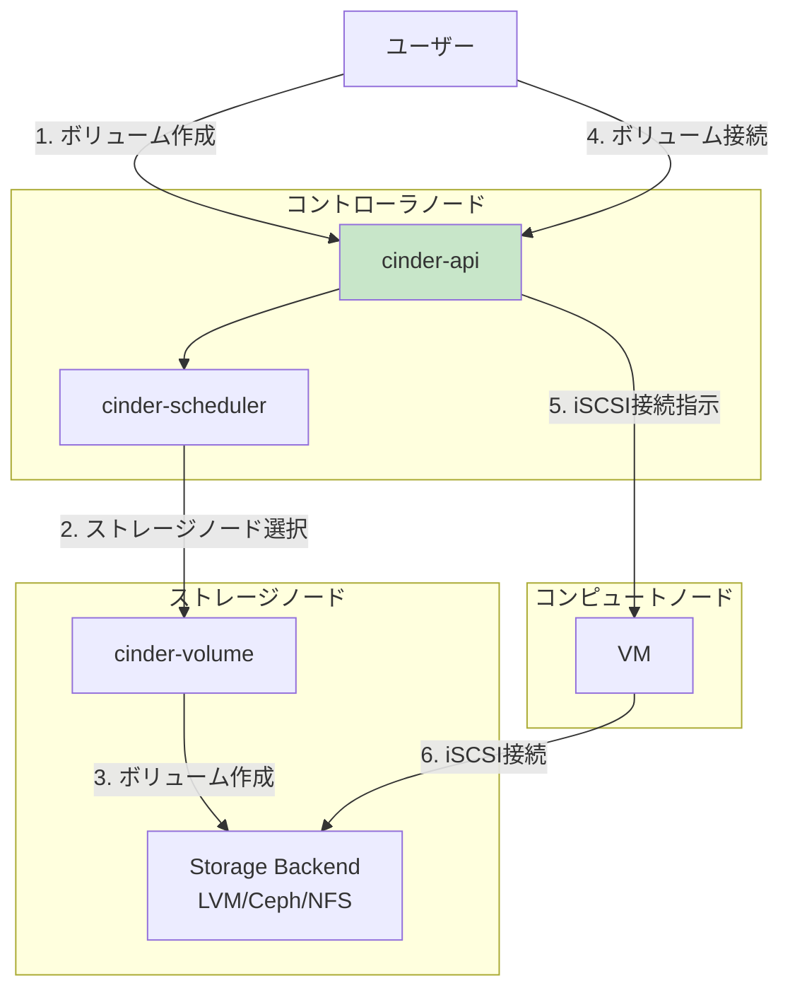

#### ストレージバックエンドの種類 ⭐

##### **LVM (Logical Volume Manager)** 🎓

**概要:** Linuxの論理ボリューム管理

#### メリット

- ✅ 設定が簡単
- ✅ 学習に最適
- ✅ 追加ソフトウェア不要

#### デメリット

- ❌ 単一ノード（冗長性なし）
- ❌ スケールしにくい
- ❌ 本番環境には不向き

**推奨環境:** 学習、小規模検証

#### LVMの仕組み

```text
物理ディスク: /dev/sdb
    ↓
物理ボリューム（PV）: /dev/sdb
    ↓
ボリュームグループ（VG）: cinder-volumes
    ↓
論理ボリューム（LV）: volume-xxxxx（VMごと）
    ↓
iSCSI経由でVMに接続
```

**設定例**:

```bash
# ボリュームグループの作成
pvcreate /dev/sdb
vgcreate cinder-volumes /dev/sdb

# Cinder設定
[lvm]
volume_driver = cinder.volume.drivers.lvm.LVMVolumeDriver
volume_group = cinder-volumes
```

##### **Ceph RBD (RADOS Block Device)** 🏢

**概要:** 分散ストレージシステム

#### メリット

- ✅ 高可用性（自動レプリケーション）
- ✅ スケーラブル
- ✅ 高性能
- ✅ 統合ストレージ（ブロック+オブジェクト+ファイル）

#### デメリット

- ❌ 複雑な設定
- ❌ 最低3台のストレージノード必要
- ❌ 学習コストが高い

**推奨環境:** 本番環境、中〜大規模

#### Cephの仕組み

```text
Cephクラスタ:
  - Monitor（MON）: クラスタ状態管理
  - OSD（Object Storage Daemon）: 実際のデータ保存
  - Manager（MGR）: 管理・監視

データの流れ:
  VM → RBD → Ceph OSD（複数に自動レプリケーション）
```

##### **その他のバックエンド** 💡

| バックエンド | 説明                         | 推奨環境           |
| ------------ | ---------------------------- | ------------------ |
| **NFS**      | ネットワークファイルシステム | 🧪 テスト           |
| **iSCSI**    | 専用ストレージアレイ         | 🏢 既存SAN活用      |
| **NetApp**   | NetAppストレージ             | 🏢 エンタープライズ |
| **Dell EMC** | Dell EMCストレージ           | 🏢 エンタープライズ |

#### Cinderボリュームの操作 ⭐

```bash
# ボリューム作成
openstack volume create \
  --size 10 \
  my-volume

# ボリュームをVMに接続
openstack server add volume \
  my-vm my-volume

# VM内でマウント
sudo mkfs.ext4 /dev/vdb
sudo mount /dev/vdb /mnt/data
```

---

### 2.4 Swift（オブジェクトストレージ）💡

**Swift**は、非構造化データを保存する**オブジェクトストレージ**（≈ AWS S3）。

#### アーキテクチャ

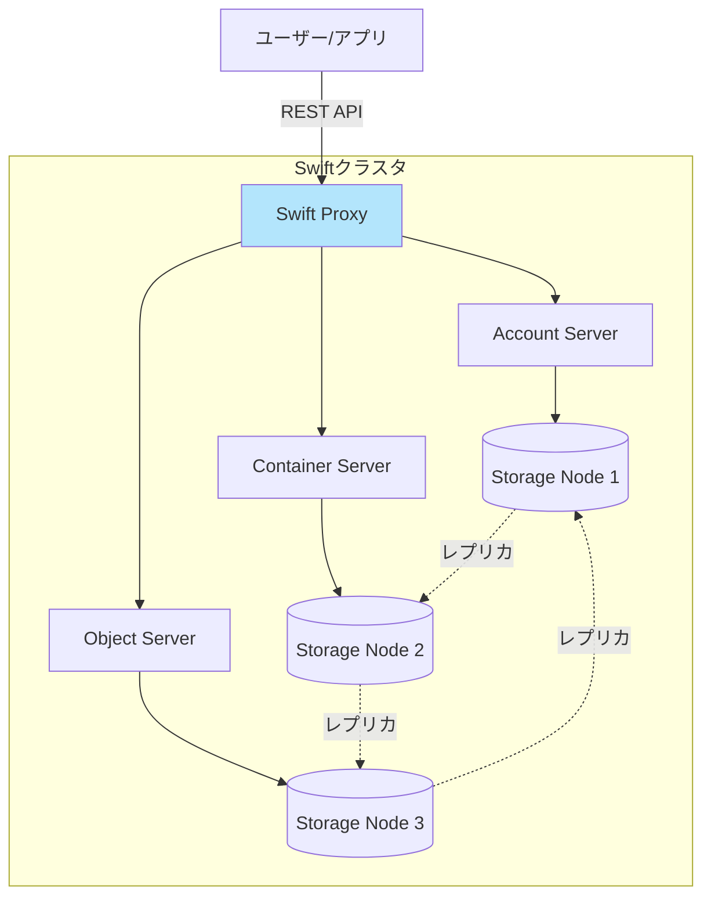

##### 主要コンセプト

```text
Account: ストレージアカウント（テナント）
    ↓
Container: バケット（ファイルのグループ）
    ↓
Object: 実際のファイル
```

**例**:

```text
Account: project-A
  Container: images
    Object: photo1.jpg
    Object: photo2.jpg
  Container: backups
    Object: db-backup-2025-10-30.tar.gz
```

#### 特徴

| 項目             | 内容                           |
| ---------------- | ------------------------------ |
| **アクセス方法** | REST API（HTTP/HTTPS）         |
| **冗長性**       | 複数レプリカ（デフォルト3）    |
| **スケール**     | ペタバイト規模                 |
| **用途**         | 画像、動画、バックアップ、ログ |
| **一貫性**       | 結果整合性                     |

#### メリット・デメリット

##### メリット

- ✅ 大容量データに対応
- ✅ 高い耐久性（複数レプリカ）
- ✅ REST APIで簡単アクセス
- ✅ スケーラブル

##### デメリット

- ❌ 低レイテンシーが必要な用途には不向き
- ❌ ファイルシステムとして直接マウント不可
- ❌ 部分的な更新ができない（全体を置き換え）

#### 使用例 💡

```bash
# コンテナ作成
openstack container create my-container

# オブジェクトアップロード
openstack object create my-container file.txt

# オブジェクトダウンロード
openstack object save my-container file.txt
```

---

### 2.5 ストレージの比較 ✅

| ストレージ       | 用途             | 永続性 | アクセス方法     | 推奨ケース           |
| ---------------- | ---------------- | ------ | ---------------- | -------------------- |
| **エフェメラル** | VMルートディスク | ❌      | ブロックデバイス | 一時的なVM           |
| **Cinder**       | 追加ディスク     | ✅      | ブロックデバイス | データベース、アプリ |
| **Swift**        | ファイル保存     | ✅      | REST API         | 画像、バックアップ   |

---

### 2.6 学習環境でのストレージ設計 🎓

#### 推奨構成

**Cinder:**

- バックエンド: LVM
- ボリュームグループ: 20-50GB
- 理由: シンプルで理解しやすい

**Swift:**

- 学習環境ではオプション
- 必要に応じて別途構築

**エフェメラル:**

- デフォルト設定を使用

#### 設定例

```ini
# /etc/cinder/cinder.conf
[DEFAULT]
enabled_backends = lvm

[lvm]
volume_driver = cinder.volume.drivers.lvm.LVMVolumeDriver
volume_group = cinder-volumes
volume_backend_name = LVM
```

---

## 3. ハードウェア要件

### 3.1 構成パターン別のリソース要件 ✅

#### パターンA: All-in-One構成 🎓

**最小要件:**

| 項目     | 要件                        |
| -------- | --------------------------- |
| CPU      | 4コア（仮想化支援機能必須） |
| メモリ   | 8GB                         |
| ディスク | 40GB                        |
| NIC      | 2つ（管理+外部）            |

**推奨要件:**

- CPU: 8コア
- メモリ: 16GB
- ディスク: 100GB（SSD推奨）

#### パターンB: 2ノード構成 🎓

| ノード                        | CPU   | メモリ | ディスク | NIC |
| ----------------------------- | ----- | ------ | -------- | --- |
| **コントローラ+ネットワーク** | 4コア | 8GB    | 60GB     | 3   |
| **コンピュート**              | 4コア | 8GB    | 60GB     | 2   |
| **合計**                      | 8コア | 16GB   | 120GB    | -   |

**ホストマシン要件:**

- CPU: 10コア以上
- メモリ: 20GB以上（24GB推奨）
- ディスク: 150GB以上

#### パターンC: 3ノード構成（標準）⭐ 🎓

| ノード           | CPU      | メモリ  | ディスク  | NIC |
| ---------------- | -------- | ------- | --------- | --- |
| **コントローラ** | 2-4コア  | 4-8GB   | 40-80GB   | 3   |
| **ネットワーク** | 2-4コア  | 2-4GB   | 20-40GB   | 3   |
| **コンピュート** | 2-4コア  | 4-8GB   | 40-100GB  | 2   |
| **合計**         | 6-12コア | 10-20GB | 100-220GB | -   |

**ホストマシン要件 (Vagrant + VirtualBox):**

- CPU: 8コア以上（仮想化支援機能必須）
- メモリ: 16GB以上（24GB推奨）
- ディスク: 200GB以上の空き容量（SSD推奨）

#### パターンD: 4+ノード構成（拡張）💡

| ノード             | CPU     | メモリ | ディスク | NIC |
| ------------------ | ------- | ------ | -------- | --- |
| **コントローラ**   | 4コア   | 8GB    | 80GB     | 3   |
| **ネットワーク**   | 2-4コア | 4GB    | 40GB     | 3   |
| **コンピュート×2** | 各4コア | 各8GB  | 各100GB  | 各2 |
| **合計**           | 14コア  | 28GB   | 320GB    | -   |

**ホストマシン要件:**

- CPU: 16コア以上
- メモリ: 32GB以上
- ディスク: 400GB以上（SSD推奨）

---

### 3.2 本番環境のリソース要件 🏢

#### 最小本番環境（3ノード）

| ノード           | CPU       | メモリ   | ディスク              | NIC |
| ---------------- | --------- | -------- | --------------------- | --- |
| **コントローラ** | 8-16コア  | 16-32GB  | 100GB SSD             | 3-4 |
| **ネットワーク** | 8-16コア  | 16-32GB  | 50GB SSD              | 3-4 |
| **コンピュート** | 16-32コア | 64-128GB | 100GB SSD + 大容量HDD | 3-4 |

#### 大規模本番環境（HA構成）

**コントローラ: 3台**

- 各: 16コア, 32GB RAM, 200GB SSD, 4 NIC

**ネットワーク: 2台**

- 各: 16コア, 32GB RAM, 100GB SSD, 4 NIC

**コンピュート: 10台以上**

- 各: 32コア, 128GB RAM, 1TB SSD, 4 NIC

**ストレージ（Ceph）: 3台以上**

- 各: 16コア, 64GB RAM, 複数の大容量HDD/SSD

---

### 3.3 コンピュートノードの設計 ⭐

#### CPU要件

**必須:**

✅ **仮想化支援機能**

- Intel: VT-x（VMX）
- AMD: AMD-V（SVM）

**確認方法（Linux）:**

```bash
grep -E '(vmx|svm)' /proc/cpuinfo
```

**VirtualBox上の入れ子仮想化:**

- VirtualBoxの設定で「Nested VT-x/AMD-V」を有効化

#### メモリ要件

**計算式:**

必要メモリ = ホストOS + OpenStackサービス + VM用メモリ

**例:**

- ホストOS: 2GB
- nova-compute等: 1GB
- VM用: 10GB（2GB × 5台）

**合計:** 13GB
**推奨:** 16GB（余裕を持つ）

#### ディスク要件

**構成:**

- OS用: 30-50GB（SSD推奨）
- エフェメラルストレージ: 50-500GB（SSD推奨）
- Cinderボリューム: 別ディスク（容量による）

**学習環境:**
単一ディスクでも可（パーティション分割）

**本番環境:**
複数ディスクを推奨（性能とデータ保護）

---

### 3.4 ネットワーク要件 ⭐

#### NICの数と役割

**学習環境（3 NIC）** 🎓:

- eth0: 管理ネットワーク
- eth1: オーバーレイ + ストレージ
- eth2: 外部ネットワーク

**本番環境（4 NIC）** 🏢:

- eth0: 管理ネットワーク（1Gbps）
- eth1: オーバーレイネットワーク（10Gbps）
- eth2: 外部ネットワーク（10Gbps）
- eth3: ストレージネットワーク（10Gbps）

#### 帯域幅要件

| ネットワーク     | 学習環境 | 本番環境  | 推奨技術       |
| ---------------- | -------- | --------- | -------------- |
| **管理**         | 1Gbps    | 1-10Gbps  | Ethernet       |
| **オーバーレイ** | 1Gbps    | 10-25Gbps | Ethernet, RDMA |
| **外部**         | 1Gbps    | 10-40Gbps | Ethernet       |
| **ストレージ**   | 1Gbps    | 10-25Gbps | Ethernet, RDMA |

---

## 4. OS選択とハイパーバイザー

### 4.1 推奨OS ✅

#### Ubuntu（推奨）⭐ 🎓

**バージョン:** Ubuntu 24.04 LTS

#### メリット

- ✅ OpenStackの公式サポート
- ✅ 豊富な日本語情報（Server World等）
- ✅ パッケージが最新
- ✅ 学習に最適

#### 推奨理由

- 今回の学習で使用
- Server Worldの手順が利用可能

#### Rocky Linux / AlmaLinux 💡

**バージョン:** Rocky Linux 9 / AlmaLinux 9

#### メリット

- ✅ RHEL互換（エンタープライズ向け）
- ✅ 安定性重視
- ✅ RDO（Red Hat OpenStack）対応

#### 推奨環境

- 本番環境（特にRHEL環境）
- Packstackを使用する場合

#### その他のOS 📚

| OS                | サポート状況         | 推奨度 |
| ----------------- | -------------------- | ------ |
| **Debian**        | コミュニティサポート | △      |
| **CentOS Stream** | 開発版（本番非推奨） | ❌      |
| **openSUSE**      | コミュニティサポート | △      |

---

### 4.2 ハイパーバイザーの選択 ✅

#### KVM/QEMU（推奨）⭐

**概要:** Linuxカーネル組み込みの仮想化技術

#### メリット

- ✅ OpenStackのデフォルト
- ✅ 高性能
- ✅ Linux標準機能
- ✅ 無料

#### デメリット

- ❌ Linux専用

**推奨度:** ✅ 学習・本番ともに最推奨

**仮想化支援機能の確認**:

```bash
# Intel VT-x or AMD-Vの確認
egrep -c '(vmx|svm)' /proc/cpuinfo
# 1以上なら対応

# KVMモジュールの確認
lsmod | grep kvm
# kvm_intel または kvm_amd が表示されればOK
```

#### その他のハイパーバイザー 💡

| ハイパーバイザー | 用途               | 推奨度 |
| ---------------- | ------------------ | ------ |
| **VMware ESXi**  | 既存VMware環境     | 💡      |
| **Hyper-V**      | Windows Server環境 | 💡      |
| **Xen**          | レガシー環境       | △      |

---

## まとめ

### Part 4で学んだこと ✅

1. **ノード設計**
   - All-in-One（学習初期）
   - **3ノード構成（今回採用）** - 学習に最適
   - HA構成（本番環境）
   - 分散構成（エッジ）

2. **ストレージ設計**
   - エフェメラル（一時）
   - **Cinder（ブロック）** - LVMバックエンド推奨
   - Swift（オブジェクト）

3. **ハードウェア要件**
   - 学習環境: 合計 6-12コア、10-20GB RAM
   - 本番環境: HA構成で大規模スペック

4. **OS選択**
   - **Ubuntu 24.04 LTS**（今回使用）
   - ハイパーバイザー: **KVM/QEMU**

### 次のステップ 📚

Part 5では、OpenStackの運用・セキュリティ設計を学びます：

- セキュリティ設計
- 監視・ロギング
- バックアップとディザスタリカバリ

---

**前へ**: [Part 3: ネットワーク設計ガイド](03_network_design.md)
**次へ**: [Part 5: 運用・セキュリティ設計](05_operations_security.md)
