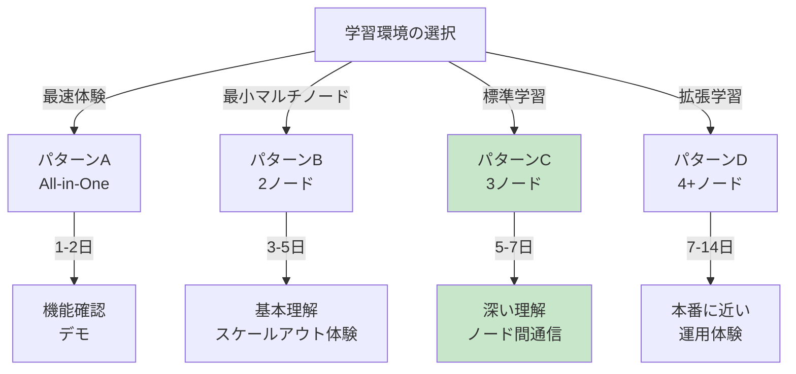
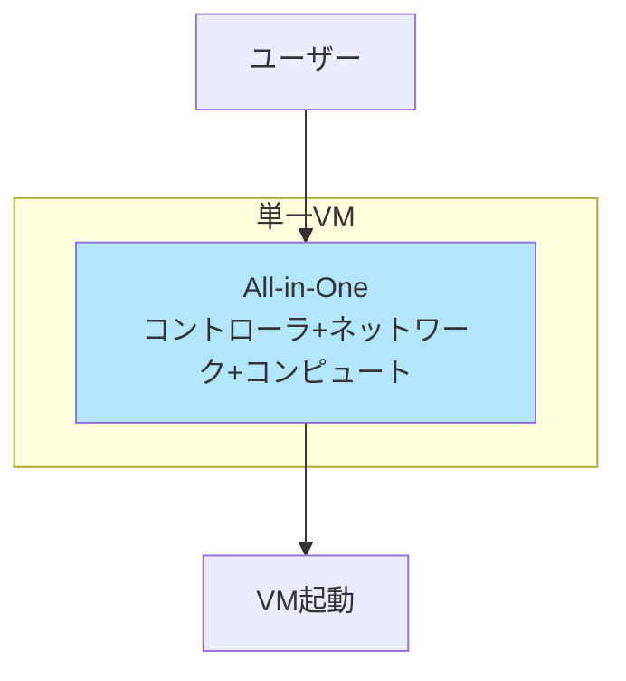
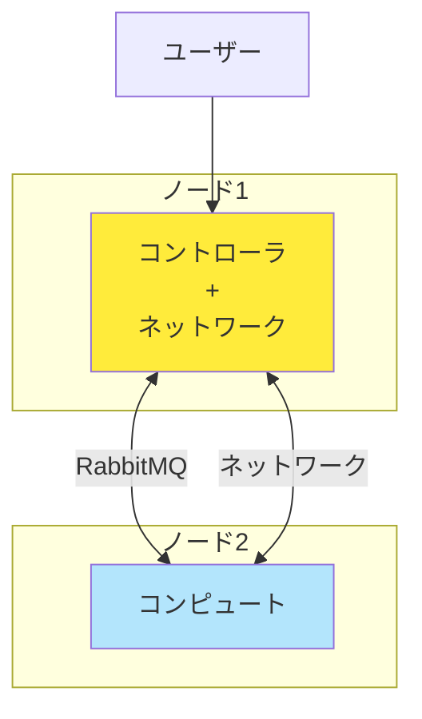
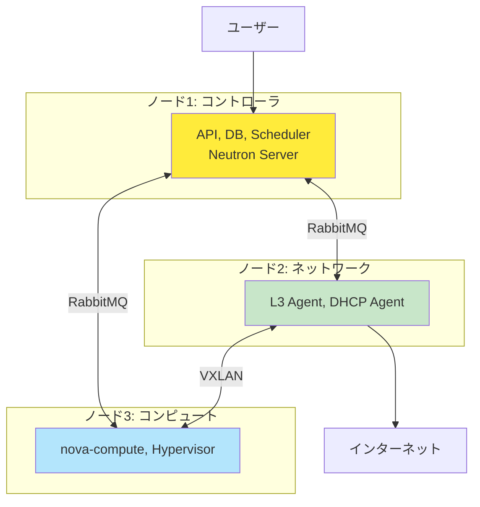
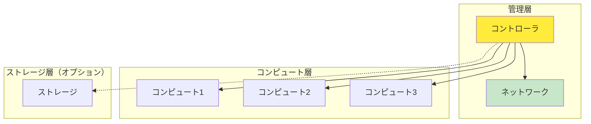
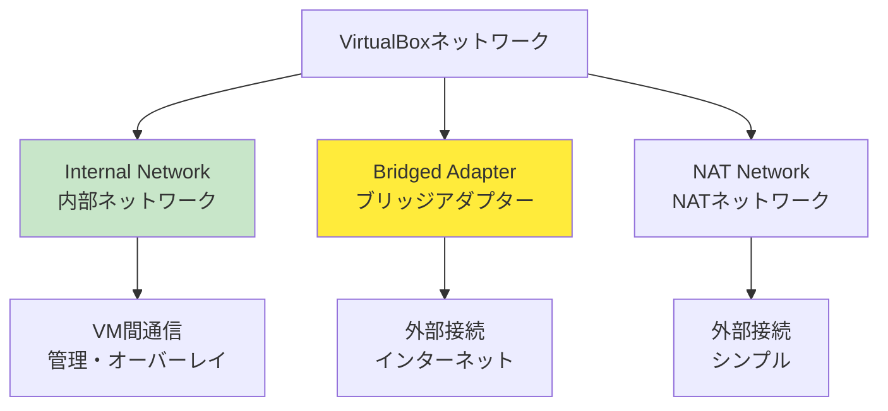
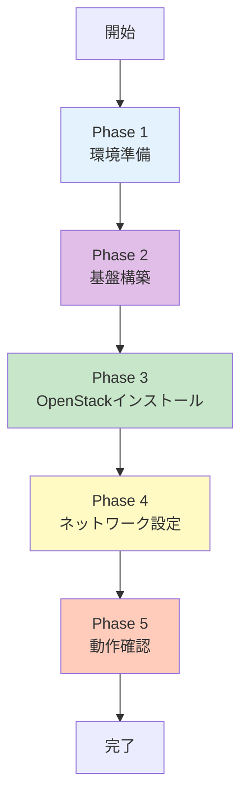
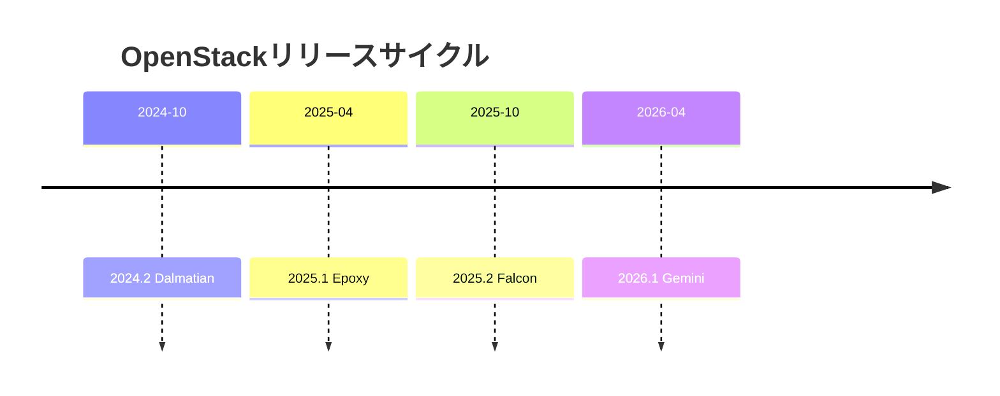

# Part 6: 実践ガイドと構成例

## 目次

- [Part 6: 実践ガイドと構成例](#part-6-実践ガイドと構成例)
  - [目次](#目次)
  - [1. 学習環境の構成パターン](#1-学習環境の構成パターン)
    - [1.1 構成パターンの全体像 ✅](#11-構成パターンの全体像-)
    - [1.2 パターンA: All-in-One 🎓](#12-パターンa-all-in-one-)
    - [1.3 パターンB: 2ノード構成 🎓](#13-パターンb-2ノード構成-)
    - [1.4 パターンC: 3ノード構成（標準）⭐ 🎓](#14-パターンc-3ノード構成標準-)
    - [1.5 パターンD: 4+ノード構成 💡](#15-パターンd-4ノード構成-)
    - [1.6 構成パターンの比較表 ✅](#16-構成パターンの比較表-)
  - [2. 今回採用する構成](#2-今回採用する構成)
  - [3. Vagrant + VirtualBox での環境構築](#3-vagrant--virtualbox-での環境構築)
    - [3.1 Vagrantfile の設計思想 ⭐](#31-vagrantfile-の設計思想-)
      - [設計の原則](#設計の原則)
    - [3.2 VirtualBoxのネットワークタイプ ⭐](#32-virtualboxのネットワークタイプ-)
    - [3.3 入れ子仮想化の設定 ✅](#33-入れ子仮想化の設定-)
    - [3.4 プロビジョニング 💡](#34-プロビジョニング-)
    - [3.5 Vagrant基本コマンド 🎓](#35-vagrant基本コマンド-)
  - [4. 構築手順の概要](#4-構築手順の概要)
    - [4.1 全体のフロー ✅](#41-全体のフロー-)
    - [4.2 Phase 1: 環境準備](#42-phase-1-環境準備)
    - [4.3 Phase 2: 基盤構築](#43-phase-2-基盤構築)
    - [4.4 Phase 3: OpenStackコアサービスのインストール](#44-phase-3-openstackコアサービスのインストール)
    - [4.5 Phase 4: ネットワーク設定](#45-phase-4-ネットワーク設定)
    - [4.6 Phase 5: 動作確認](#46-phase-5-動作確認)
    - [4.7 トラブルシューティングのポイント 💡](#47-トラブルシューティングのポイント-)
  - [5. スケーラビリティとパフォーマンス](#5-スケーラビリティとパフォーマンス)
    - [5.1 コンピュートノードの追加 ⭐](#51-コンピュートノードの追加-)
    - [5.2 ボトルネックの特定 💡](#52-ボトルネックの特定-)
    - [5.3 パフォーマンスチューニング 💡 🏢](#53-パフォーマンスチューニング--)
  - [6. アップグレード戦略](#6-アップグレード戦略)
    - [6.1 OpenStackのリリースサイクル ⭐](#61-openstackのリリースサイクル-)
    - [6.2 アップグレード手順（手動構築の場合）💡](#62-アップグレード手順手動構築の場合)
    - [6.3 Kolla-Ansibleへの移行 ⭐](#63-kolla-ansibleへの移行-)
  - [7. 開発環境との統合](#7-開発環境との統合)
    - [7.1 Terraform との連携 ⭐](#71-terraform-との連携-)
    - [7.2 Ansible との連携 ⭐](#72-ansible-との連携-)
    - [7.3 CI/CDパイプライン 💡](#73-cicdパイプライン-)
  - [8. 実践演習例](#8-実践演習例)
    - [8.1 演習1: Webサーバーの構築 🎓](#81-演習1-webサーバーの構築-)
  - [8.2 演習2: ロードバランサーの構築 💡](#82-演習2-ロードバランサーの構築-)
  - [8.3 演習3: プライベートネットワークの分離 💡](#83-演習3-プライベートネットワークの分離-)
  - [8.4 演習4: ボリュームの作成と接続 🎓](#84-演習4-ボリュームの作成と接続-)
  - [まとめ](#まとめ)
    - [Part 6で学んだこと ✅](#part-6で学んだこと-)
  - [次のステップ 🎯](#次のステップ-)
    - [学習の進め方](#学習の進め方)
    - [参考資料](#参考資料)
      - [このPartで使用した主なリンク](#このpartで使用した主なリンク)

---

## 1. 学習環境の構成パターン

### 1.1 構成パターンの全体像 ✅

> **詳細な構成設計**: 各構成パターンの詳細については [Part 4 - ノード設計](04_system_design.md#1-ノード設計) を参照してください。

OpenStack学習環境には、**4つの主要な構成パターン**があります。



---

### 1.2 パターンA: All-in-One 🎓

**1台で全機能を体験**



| 項目         | 内容           |
| ------------ | -------------- |
| **ノード数** | 1台            |
| **構築時間** | 2-4時間        |
| **学習期間** | 1-2日          |
| **難易度**   | ⭐              |
| **リソース** | 8GB RAM, 4コア |

**メリット**:

- ✅ 最も簡単
- ✅ リソース要件が最小
- ✅ OpenStackの全体像を素早く把握

**デメリット**:

- ❌ ノード間通信を学べない
- ❌ スケールアウトを体験できない
- ❌ 本番環境からは遠い

**推奨用途**:

- OpenStackの初体験
- 機能のクイック確認
- デモ環境

---

### 1.3 パターンB: 2ノード構成 🎓

**最小のマルチノード体験**



| 項目         | 内容            |
| ------------ | --------------- |
| **ノード数** | 2台             |
| **構築時間** | 4-6時間         |
| **学習期間** | 3-5日           |
| **難易度**   | ⭐⭐              |
| **リソース** | 16GB RAM, 8コア |

**メリット**:

- ✅ ノード間通信を体験
- ✅ リソース効率的
- ✅ スケールアウトの基礎理解

**デメリット**:

- ❌ コントローラとネットワークが同居（理解がやや難しい）
- ❌ 役割分担が不明確

**推奨用途**:

- マルチノード入門
- リソースが限られている環境

---

### 1.4 パターンC: 3ノード構成（標準）⭐ 🎓

**最も推奨される学習構成**



| 項目         | 内容             |
| ------------ | ---------------- |
| **ノード数** | 3台              |
| **構築時間** | 6-8時間          |
| **学習期間** | 5-7日            |
| **難易度**   | ⭐⭐⭐              |
| **リソース** | 20GB RAM, 12コア |

**メリット**:

- ✅ **各役割が独立して理解しやすい**
- ✅ Neutron ServerとL3 Agentの違いを実体験
- ✅ ノード間の通信フローを完全理解
- ✅ 実践的な構成
- ✅ **今回採用する構成**

**デメリット**:

- △ リソースが3台分必要
- △ 設定がやや複雑

**推奨用途**:

- **OpenStackを本格的に学びたい**
- ノード間通信の理解を深めたい
- 本番環境に向けた準備

---

### 1.5 パターンD: 4+ノード構成 💡

**より本番に近い環境**



| 項目         | 内容             |
| ------------ | ---------------- |
| **ノード数** | 4-5台            |
| **構築時間** | 8-12時間         |
| **学習期間** | 7-14日           |
| **難易度**   | ⭐⭐⭐⭐             |
| **リソース** | 32GB RAM, 16コア |

**メリット**:

- ✅ スケールアウトを実践
- ✅ ロードバランシングを体験
- ✅ より本番環境に近い

**デメリット**:

- ❌ 高いリソース要件
- ❌ 複雑な管理

**推奨用途**:

- スケーラビリティの学習
- 本番環境への移行前
- チーム学習

---

### 1.6 構成パターンの比較表 ✅

| パターン          | ノード | 難易度 | リソース | 学習価値 | 推奨度   |
| ----------------- | ------ | ------ | -------- | -------- | -------- |
| **A: All-in-One** | 1      | ⭐      | 8GB      | ⭐⭐       | 💡 初体験 |
| **B: 2ノード**    | 2      | ⭐⭐     | 16GB     | ⭐⭐⭐      | 💡 入門   |
| **C: 3ノード**    | 3      | ⭐⭐⭐    | 20GB     | ⭐⭐⭐⭐⭐    | ✅ 最推奨 |
| **D: 4+ノード**   | 4+     | ⭐⭐⭐⭐   | 32GB+    | ⭐⭐⭐⭐     | 💡 発展   |

---

## 2. 今回採用する構成

このプロジェクトでは、**パターンC: 3ノード構成**を採用しています。

詳細な構成（ノード別の役割、リソース、ネットワーク設計、IPアドレス割り当て等）については、プロジェクトの学習ロードマップを参照してください。

---

## 3. Vagrant + VirtualBox での環境構築

### 3.1 Vagrantfile の設計思想 ⭐

**Vagrantfile**は、仮想マシンの設定を**コードで管理**するファイルです。

#### 設計の原則

**原則1: 再現性**

- 誰でも同じ環境を構築できる
- Vagrantfileを共有すれば環境を複製可能

**原則2: 自動化**

- 手動設定を最小化
- プロビジョニングで初期設定を自動化

**原則3: 柔軟性**

- リソースを簡単に調整可能
- ノード数を容易に変更可能

---

### 3.2 VirtualBoxのネットワークタイプ ⭐

OpenStack学習環境では、以下のネットワークタイプを組み合わせて使用します：



**各ネットワークタイプの特徴**:

| タイプ               | 用途                 | 特徴                         |
| -------------------- | -------------------- | ---------------------------- |
| **Internal Network** | ノード間の内部通信   | VM間のみ通信可能、完全に隔離 |
| **Bridged Adapter**  | 外部ネットワーク接続 | 物理ネットワークに直接接続   |
| **NAT Network**      | インターネット接続   | シンプルな外部接続           |

---

### 3.3 入れ子仮想化の設定 ✅

**コンピュートノードでは必須**:

OpenStackのコンピュートノードがVM内でさらにVMを起動するため、入れ子仮想化（Nested Virtualization）が必要です。

**VirtualBoxでの設定**:

```ruby
# Vagrantfile内
vb.customize ["modifyvm", :id, "--nested-hw-virt", "on"]
```

**確認方法**（VM内）:

```bash
# 仮想化支援機能の確認
egrep -c '(vmx|svm)' /proc/cpuinfo
# 1以上ならOK

# KVMモジュールの確認
lsmod | grep kvm
# kvm_intel または kvm_amd が表示されればOK
```

---

### 3.4 プロビジョニング 💡

**初期設定を自動化**:

Vagrantのプロビジョニング機能を使用して、VM起動時に自動で初期設定を行うことができます。

**プロビジョニングの例**:

```ruby
# Vagrantfile内
config.vm.provision "shell", inline: <<-SHELL
  # パッケージ更新
  apt-get update

  # hostsファイルの設定
  cat >> /etc/hosts <<EOF
<IPアドレス> <ホスト名>
EOF

  # タイムゾーン設定
  timedatectl set-timezone Asia/Tokyo

  # 基本パッケージのインストール
  apt-get install -y python3-pip vim git curl
SHELL
```

---

### 3.5 Vagrant基本コマンド 🎓

```bash
# 全VMの起動
vagrant up

# 特定のVMのみ起動
vagrant up <node-name>

# VMへのSSH接続
vagrant ssh <node-name>

# VMの停止
vagrant halt

# VMの再起動
vagrant reload

# VMの削除（完全にクリーンアップ）
vagrant destroy -f

# VMの状態確認
vagrant status
```

---

## 4. 構築手順の概要

### 4.1 全体のフロー ✅

OpenStack環境の構築は、一般的に以下の流れで進めます：



---

### 4.2 Phase 1: 環境準備

**目的**: 仮想化基盤の構築

**主な作業**:

- ホストマシンの準備（VirtualBox、Vagrant等）
- VM構成の定義（Vagrantfile作成）
- ネットワーク設定
- リソース割り当ての調整
- VM起動と疎通確認

---

### 4.3 Phase 2: 基盤構築

**目的**: OpenStackの土台となるミドルウェアの構築

**主な作業**:

- 全ノード共通設定（hosts、NTP、リポジトリ）
- データベース構築（MariaDB / MySQL）
- メッセージキュー構築（RabbitMQ）
- キャッシュサーバー構築（Memcached）
- 疎通確認

---

### 4.4 Phase 3: OpenStackコアサービスのインストール

**目的**: 最小限のOpenStack機能を構築

**主なコンポーネント**:

1. **Keystone（認証サービス）**
   - アイデンティティ管理
   - エンドポイント管理

2. **Glance（イメージサービス）**
   - VMイメージの管理
   - ストレージバックエンド設定

3. **Nova（コンピュートサービス）**
   - VMのライフサイクル管理
   - ハイパーバイザー連携（KVM等）

4. **Neutron（ネットワークサービス）**
   - 仮想ネットワーク管理
   - L3/DHCP/メタデータエージェント

5. **Cinder（ブロックストレージ）** - オプション
   - 永続ボリューム管理

6. **Horizon（ダッシュボード）** - オプション
   - Web UI

> **参考**: 各コンポーネントの詳細なインストール手順は、[Server World](https://www.server-world.info/)や[OpenStack公式ドキュメント](https://docs.openstack.org/)を参照してください。

---

### 4.5 Phase 4: ネットワーク設定

**目的**: OpenStack上で使用するネットワークの作成

**主な作業**:

1. **プロバイダーネットワーク（外部）の作成**
   - タイプ: FLAT or VLAN
   - Floating IP用

2. **テナントネットワーク（プライベート）の作成**
   - タイプ: VXLAN or GRE
   - VM間の内部通信用

3. **ルーターの作成**
   - 外部ネットワークとの接続
   - NAT機能

---

### 4.6 Phase 5: 動作確認

**目的**: 構築した環境の動作確認

**主な確認項目**:

1. **サービス稼働確認**
   - compute service list
   - network agent list
   - volume service list

2. **VMイメージの準備**
   - Cloud Imageのアップロード
   - フレーバーの作成

3. **セキュリティ設定**
   - セキュリティグループのルール作成
   - SSH鍵ペアの作成

4. **VM起動テスト**
   - インスタンス作成
   - Floating IP割り当て
   - SSH接続確認

---

### 4.7 トラブルシューティングのポイント 💡

> **詳細なトラブルシューティング**: 問題が解決しない場合は、[付録B: トラブルシューティング](appendix_b_troubleshooting.md) を参照してください。

**一般的な問題と対処法**:

**問題1: VMが起動しない**

確認項目:

- nova-compute サービスの状態
- ログファイル（/var/log/nova/）
- 仮想化支援機能の有効化

**問題2: ネットワークに接続できない**

確認項目:

- neutron-l3-agent, neutron-dhcp-agent の状態
- ログファイル（/var/log/neutron/）
- Open vSwitch の設定

**問題3: Floating IPに接続できない**

確認項目:

- セキュリティグループのルール
- ルーターの外部ゲートウェイ設定
- ネットワークノードのNAT設定

---

## 5. スケーラビリティとパフォーマンス

### 5.1 コンピュートノードの追加 ⭐

**スケールアウトの概念**:

OpenStackの主な利点の一つは、簡単にコンピュートノードを追加してリソースを拡張できることです。

**一般的な手順**:

1. **新しいノードの準備**
   - 物理サーバーまたはVMの用意
   - 必要なネットワーク設定
   - OS のインストール

2. **Nova Computeのインストール**
   - nova-compute パッケージのインストール
   - 設定ファイルの編集（データベース接続、RabbitMQ接続等）
   - ハイパーバイザー（KVM/Libvirt）の設定

3. **コントローラへの登録**
   - サービスの起動
   - 自動的にコントローラに登録される

4. **確認とテスト**
   - サービス一覧で新しいノードを確認
   - テストVMを起動してロードバランシングを確認

```bash
# サービス確認
openstack compute service list

# 新しいノードの状態確認
openstack hypervisor list
```

---

### 5.2 ボトルネックの特定 💡

**リソース別の確認方法と対策**:

**CPU:**

- 確認: `top`, `htop`, `mpstat`
- 対策: コンピュートノード追加

**メモリ:**

- 確認: `free -h`, `vmstat`
- 対策: スワップ無効化、メモリ増強

**ディスクI/O:**

- 確認: `iostat`, `iotop`
- 対策: SSD使用、ストレージ専用NW

**ネットワーク:**

- 確認: `iftop`, `nethogs`, `iperf`
- 対策: 10Gbps NIC、ネットワーク分離

---

### 5.3 パフォーマンスチューニング 💡 🏢

**Nova（コンピュートサービス）:**

```ini
# CPUとメモリのオーバーコミット比率の調整
[DEFAULT]
cpu_allocation_ratio = 16.0
ram_allocation_ratio = 1.5
```

**Neutron（ネットワークサービス）:**

```ini
# MTU設定（VXLAN使用時は調整が必要）
[DEFAULT]
global_physnet_mtu = 1500
path_mtu = 1450
```

**Cinder（ブロックストレージ）:**

```ini
# 並列処理数の調整
[DEFAULT]
max_concurrent_builds = 10
```

---

## 6. アップグレード戦略

### 6.1 OpenStackのリリースサイクル ⭐



**アップグレード方針:**

- リリース頻度: 6ヶ月ごと
- サポート期間: 18ヶ月
- 推奨: 年1回のアップグレード

---

### 6.2 アップグレード手順（手動構築の場合）💡

**準備:**

1. バックアップの取得
2. テスト環境での検証
3. ドキュメントの確認

**実施:**

**Phase 1: データベースのバックアップ**

```bash
mysqldump --all-databases > backup.sql
```

**Phase 2: 各サービスのアップグレード**

```bash
# パッケージの更新
apt update
apt upgrade openstack-*

# データベーススキーマの更新
nova-manage db sync
neutron-db-manage upgrade heads
cinder-manage db sync
```

**Phase 3: サービスの再起動**

```bash
systemctl restart nova-*
systemctl restart neutron-*
```

**Phase 4: 動作確認**

```bash
openstack compute service list
openstack network agent list
```

---

### 6.3 Kolla-Ansibleへの移行 ⭐

**手動構築で理解を深めた後、Kolla-Ansibleへ移行**:

**メリット:**

- ✅ コンテナ化による簡単なアップグレード
- ✅ ローリングアップグレード対応
- ✅ ロールバック可能
- ✅ 本番環境の標準的な方法

**手順:**

1. Kolla-Ansibleのインストール
2. インベントリファイルの作成
3. globals.ymlの設定
4. デプロイ実行

```bash
kolla-ansible -i inventory deploy
```

**アップグレード:**

```bash
kolla-ansible -i inventory upgrade
```

---

## 7. 開発環境との統合

### 7.1 Terraform との連携 ⭐

**Infrastructure as Code**:

```hcl
# main.tf
terraform {
  required_providers {
    openstack = {
      source  = "terraform-provider-openstack/openstack"
      version = "~> 1.51"
    }
  }
}

provider "openstack" {
  auth_url    = "http://<CONTROLLER_IP>:5000/v3"
  user_name   = "admin"
  password    = "<ADMIN_PASSWORD>"
  tenant_name = "admin"
  domain_name = "Default"
}

resource "openstack_compute_instance_v2" "web_server" {
  name            = "web-server"
  image_name      = "ubuntu-22.04"
  flavor_name     = "m1.small"
  key_pair        = "mykey"
  security_groups = ["default"]

  network {
    name = "private-network"
  }
}

resource "openstack_networking_floatingip_v2" "fip" {
  pool = "external-network"
}

resource "openstack_compute_floatingip_associate_v2" "fip_assoc" {
  floating_ip = openstack_networking_floatingip_v2.fip.address
  instance_id = openstack_compute_instance_v2.web_server.id
}
```

---

### 7.2 Ansible との連携 ⭐

**構成管理の自動化**:

```yaml
# playbook.yml
---
- hosts: openstack_instances
  become: yes
  tasks:
    - name: Nginxのインストール
      apt:
        name: nginx
        state: present

    - name: Nginxの起動
      service:
        name: nginx
        state: started
        enabled: yes

    - name: ファイアウォールの設定
      ufw:
        rule: allow
        port: 80
        proto: tcp
```

---

### 7.3 CI/CDパイプライン 💡

**GitLab CI/CD例:**

- **Stages:** build、test、deploy
- **Deploy Stage:** OpenStack APIを使用してインスタンスをデプロイ

```yaml
deploy_to_openstack:
  stage: deploy
  script:
    - openstack server create ...
      - ansible-playbook deploy.yml
    only:
      - master
```

---

## 8. 実践演習例

### 8.1 演習1: Webサーバーの構築 🎓

**目的:** OpenStackの基本操作を習得

**手順:**

1. Ubuntuインスタンスの作成
2. Floating IPの割り当て
3. SSH接続
4. Nginxのインストール
5. ブラウザでアクセス確認

**実行コマンド:**

```bash
openstack server create \
  --flavor m1.small \
  --image ubuntu-22.04 \
  --network private-network \
  --key-name mykey \
  web-server

openstack floating ip create external-network
openstack server add floating ip web-server <FLOATING_IP>

ssh ubuntu@<FLOATING_IP>
# VM内で以下を実行
sudo apt update
sudo apt install -y nginx

# 最後にブラウザで http://<FLOATING_IP> にアクセスして確認
```

**学習ポイント:**

- ✅ インスタンスの作成フロー
- ✅ ネットワークの仕組み
- ✅ Floating IPの役割

---

## 8.2 演習2: ロードバランサーの構築 💡

**目的:** 複数インスタンスの負荷分散

**手順:**

1. 2台のWebサーバーを作成
2. プライベートネットワークに配置
3. 各サーバーでNginxを設定（異なるコンテンツ）
4. ロードバランサーを作成
5. Floating IPを割り当て
6. 負荷分散を確認

**実行コマンド:**

```bash
# インスタンス作成
openstack server create ... web1
openstack server create ... web2

# Octavia（LBaaS）を使用
openstack loadbalancer create \
  --name lb1 \
  --vip-subnet-id private-subnet

openstack loadbalancer pool create \
  --name pool1 \
  --lb-algorithm ROUND_ROBIN \
  --protocol HTTP \
  lb1

openstack loadbalancer member create \
  --address 10.0.0.10 \
  --protocol-port 80 \
  pool1

openstack loadbalancer member create \
  --address 10.0.0.11 \
  --protocol-port 80 \
  pool1
```

**学習ポイント:**

- ⭐ スケールアウトの実践
- ⭐ 高可用性の基礎

---

## 8.3 演習3: プライベートネットワークの分離 💡

**目的:** マルチテナント環境の理解

**手順:**

1. 2つのプロジェクトを作成
2. 各プロジェクトで独立したネットワークを作成
3. 各ネットワークにVMを配置
4. ネットワーク間の通信が分離されていることを確認

**実行コマンド:**

```bash
# プロジェクト作成
openstack project create project-A
openstack project create project-B

# project-Aのネットワーク
openstack network create \
  --project project-A \
  network-A

# project-Bのネットワーク
openstack network create \
  --project project-B \
  network-B
```

**学習ポイント:**

- ✅ VXLANによる分離
- ✅ マルチテナントの仕組み

---

## 8.4 演習4: ボリュームの作成と接続 🎓

**目的:** 永続ストレージの理解

**手順:**

1. Cinderボリュームの作成
2. インスタンスへの接続
3. ボリュームのフォーマットとマウント
4. データの永続性確認
5. スナップショットの作成

**実行コマンド:**

```bash
# ボリューム作成
openstack volume create \
  --size 10 \
  data-volume

# インスタンスへの接続
openstack server add volume \
  web-server data-volume

# VM内でマウント
ssh ubuntu@<FLOATING_IP>
# 以下はVM内で実行
sudo mkfs.ext4 /dev/vdb
sudo mkdir /mnt/data
sudo mount /dev/vdb /mnt/data

# スナップショット作成
openstack volume snapshot create \
  --volume data-volume \
  data-snapshot
```

**学習ポイント:**

- ✅ エフェメラルとCinderの違い
- ✅ ボリューム管理の基礎

---

## まとめ

### Part 6で学んだこと ✅

1. **学習環境の構成パターン**
   - All-in-One、2ノード、**3ノード（採用）**、4+ノード
   - 各パターンの特徴と推奨用途

2. **今回の学習環境の構成**
   - 3ノード構成の詳細
   - ネットワーク設計（3 NIC構成）
   - IPアドレス割り当て

3. **Vagrant + VirtualBox での環境構築**
   - Vagrantfileの設計
   - ネットワーク設定
   - 入れ子仮想化の有効化

4. **構築手順の概要**
   - Phase 1-5の流れ
   - Server Worldの活用
   - トラブルシューティング

5. **スケーラビリティとパフォーマンス**
   - コンピュートノードの追加
   - ボトルネックの特定
   - パフォーマンスチューニング

6. **アップグレード戦略**
   - OpenStackのリリースサイクル
   - 手動アップグレード
   - Kolla-Ansibleへの移行

7. **開発環境との統合**
   - Terraform連携
   - Ansible連携
   - CI/CDパイプライン

8. **実践演習例**
   - Webサーバー構築
   - ロードバランサー
   - プライベートネットワーク分離
   - ボリューム管理

---

## 次のステップ 🎯

### 学習の進め方


### 参考資料

詳細な参考リンク集は [付録C: 参考リンク集](appendix_c_references.md) を参照してください。

#### このPartで使用した主なリンク

- **Server World**: <https://www.server-world.info/>
- **OpenStack公式ドキュメント**: <https://docs.openstack.org/>
- **Kolla-Ansible**: <https://docs.openstack.org/kolla-ansible/>

---

**全Part完了！お疲れ様でした！** 🎉

**前へ**: [Part 5: 運用・セキュリティ設計](05_operations_security.md)
**付録へ**: [付録A: 用語集](appendix_a_glossary.md)
