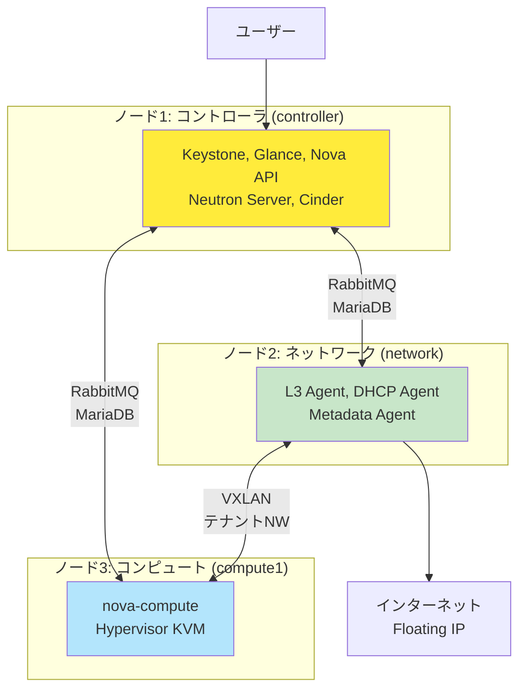
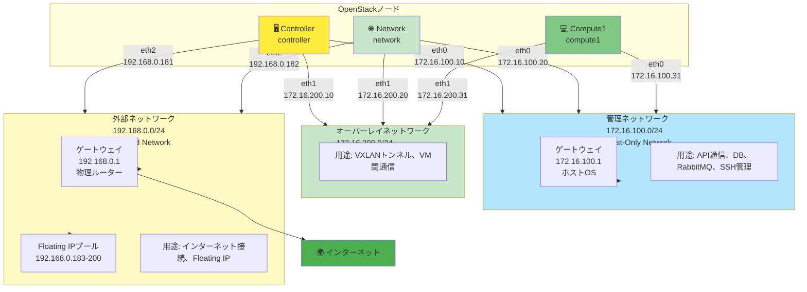

# 🎯 OpenStack学習環境構築ロードマップ

## 目次

- [🎯 OpenStack学習環境構築ロードマップ](#-openstack学習環境構築ロードマップ)
  - [目次](#目次)
  - [📖 このドキュメントの位置づけ](#-このドキュメントの位置づけ)
    - [ドキュメント体系](#ドキュメント体系)
    - [推奨学習フロー](#推奨学習フロー)
  - [📋 前提条件と学習環境の概要](#-前提条件と学習環境の概要)
    - [ホストマシンの要件](#ホストマシンの要件)
    - [採用構成](#採用構成)
  - [🏗️ 学習環境の構成詳細](#️-学習環境の構成詳細)
    - [3ノード構成の全体像](#3ノード構成の全体像)
    - [ノード別の役割とリソース](#ノード別の役割とリソース)
      - [コントローラノード](#コントローラノード)
      - [ネットワークノード](#ネットワークノード)
      - [コンピュートノード](#コンピュートノード)
  - [🌐 ネットワーク構成](#-ネットワーク構成)
    - [ネットワーク全体構成図](#ネットワーク全体構成図)
    - [ネットワーク分離の目的](#ネットワーク分離の目的)
    - [IPアドレス割り当て表](#ipアドレス割り当て表)
    - [外部からのアクセス方法](#外部からのアクセス方法)
      - [本番環境での一般的な構成](#本番環境での一般的な構成)
      - [学習環境での構成](#学習環境での構成)
      - [外部ネットワーク（eth2）の役割](#外部ネットワークeth2の役割)
    - [ネットワークタイプの選択](#ネットワークタイプの選択)
  - [💾 ストレージ設計](#-ストレージ設計)
    - [Cinder（ブロックストレージ）](#cinderブロックストレージ)
    - [Swift（オブジェクトストレージ）](#swiftオブジェクトストレージ)
    - [エフェメラルストレージ](#エフェメラルストレージ)
    - [Glance（イメージストレージ）](#glanceイメージストレージ)
  - [💻 Vagrant + VirtualBox環境](#-vagrant--virtualbox環境)
    - [環境の特徴](#環境の特徴)
    - [VirtualBoxネットワーク構成](#virtualboxネットワーク構成)
    - [Vagrantfileの設計](#vagrantfileの設計)
  - [📁 プロジェクト構成](#-プロジェクト構成)
  - [⚡ コアパス（最短ルート）](#-コアパス最短ルート)
    - [**Phase 1: 環境準備** ⭐⭐](#phase-1-環境準備-)
    - [**Phase 2: 基盤構築** ⭐⭐⭐](#phase-2-基盤構築-)
    - [**Phase 3: Keystone（認証サービス）** ⭐⭐⭐](#phase-3-keystone認証サービス-)
    - [**Phase 4: Glance（イメージサービス）** ⭐⭐](#phase-4-glanceイメージサービス-)
    - [**Phase 5: Nova（コンピュートサービス）** ⭐⭐⭐](#phase-5-novaコンピュートサービス-)
    - [**Phase 6: Neutron（ネットワークサービス）** ⭐⭐⭐⭐](#phase-6-neutronネットワークサービス-)
    - [**Phase 7: 初回VM起動** ⭐⭐](#phase-7-初回vm起動-)
    - [**Phase 8: Cinder（ボリュームサービス）** ⭐⭐⭐](#phase-8-cinderボリュームサービス-)
    - [**Phase 9: 基本演習・統合確認** ⭐⭐](#phase-9-基本演習統合確認-)
  - [🔧 オプション学習項目（深掘り用）](#-オプション学習項目深掘り用)
    - [**カテゴリA: 管理機能強化**](#カテゴリa-管理機能強化)
      - [**項目A-1: Horizon（ダッシュボード）** ⭐⭐](#項目a-1-horizonダッシュボード-)
      - [**項目A-2: Cinderの詳細設定** ⭐⭐⭐](#項目a-2-cinderの詳細設定-)
      - [**項目A-3: Quota（クォータ）の設定** ⭐⭐](#項目a-3-quotaクォータの設定-)
    - [**カテゴリB: ネットワーク深掘り**](#カテゴリb-ネットワーク深掘り)
      - [**項目B-1: 演習2 - ロードバランサー構築** ⭐⭐](#項目b-1-演習2---ロードバランサー構築-)
      - [**項目B-2: 演習3 - マルチテナント分離** ⭐⭐⭐](#項目b-2-演習3---マルチテナント分離-)
      - [**項目B-3: VLANネットワークの構築** ⭐](#項目b-3-vlanネットワークの構築-)
      - [**項目B-4: セキュリティグループ詳細** ⭐⭐](#項目b-4-セキュリティグループ詳細-)
    - [**カテゴリC: 運用・監視**](#カテゴリc-運用監視)
      - [**項目C-1: バックアップとリストア** ⭐⭐⭐](#項目c-1-バックアップとリストア-)
      - [**項目C-2: ログ管理** ⭐⭐](#項目c-2-ログ管理-)
      - [**項目C-3: 監視設定（基本）** ⭐⭐](#項目c-3-監視設定基本-)
      - [**項目C-4: Prometheus + Grafana監視** ⭐](#項目c-4-prometheus--grafana監視-)
    - [**カテゴリD: スケーラビリティ**](#カテゴリd-スケーラビリティ)
      - [**項目D-1: コンピュートノードの追加** ⭐⭐⭐](#項目d-1-コンピュートノードの追加-)
      - [**項目D-2: ホストアグリゲートの設定** ⭐⭐](#項目d-2-ホストアグリゲートの設定-)
      - [**項目D-3: ライブマイグレーション** ⭐](#項目d-3-ライブマイグレーション-)
    - [**カテゴリE: 自動化・IaC**](#カテゴリe-自動化iac)
      - [**項目E-1: Terraform連携** ⭐⭐⭐](#項目e-1-terraform連携-)
      - [**項目E-2: Ansible連携** ⭐⭐⭐](#項目e-2-ansible連携-)
      - [**項目E-3: Heat（オーケストレーション）** ⭐⭐](#項目e-3-heatオーケストレーション-)
      - [**項目E-4: CI/CDパイプライン** ⭐](#項目e-4-cicdパイプライン-)
    - [**カテゴリF: 次世代への移行**](#カテゴリf-次世代への移行)
      - [**項目F-1: Kolla-Ansibleへの移行** ⭐⭐⭐](#項目f-1-kolla-ansibleへの移行-)
      - [**項目F-2: アップグレード実践** ⭐⭐](#項目f-2-アップグレード実践-)
      - [**項目F-3: HA構成の構築** ⭐](#項目f-3-ha構成の構築-)
  - [📊 学習ロードマップ全体図](#-学習ロードマップ全体図)
  - [🎯 学習の進め方のコツ](#-学習の進め方のコツ)
    - [**1. コアパスは必ず完了させる**](#1-コアパスは必ず完了させる)
    - [**2. CommandとTerraformの使い分け**](#2-commandとterraformの使い分け)
    - [**3. オプションは興味に応じて選択**](#3-オプションは興味に応じて選択)
    - [**4. 推奨学習順序（コアパス後）**](#4-推奨学習順序コアパス後)
    - [**5. つまずいたら**](#5-つまずいたら)
    - [**6. Terraformの活用ポイント**](#6-terraformの活用ポイント)
  - [📝 学習記録テンプレート](#-学習記録テンプレート)
  - [🔗 参考リンク](#-参考リンク)
    - [必須リンク](#必須リンク)
    - [IaC関連](#iac関連)
    - [オプションリンク](#オプションリンク)
  - [📚 Terraformサンプルの全体構成](#-terraformサンプルの全体構成)

## 📖 このドキュメントの位置づけ

このドキュメントは**実践的な構築手順書**です。

### ドキュメント体系

- **Part 1～6**: OpenStackの理論、概念、アーキテクチャを学ぶ
- **このロードマップ**: 実際に手を動かして構築する手順の概要
  - このドキュメントは概要のみを記載しており、具体的なコマンドやTerraformコードは含まれていません
  - 各Phaseの詳細な手順（Command例・Terraform例を含む）は、各Phase専用の詳細資料（例: `phase1_environment_setup.md`）を参照してください

### 推奨学習フロー


1. **Part 1～3を読んで概念を理解**
   - OpenStackとは何か
   - アーキテクチャの全体像
   - ネットワークの仕組み

2. **このロードマップで実際に構築**
   - 手を動かして理解を深める
   - トラブルシューティングを体験

3. **Part 4～6で運用・セキュリティを学ぶ**
   - 本番環境への応用
   - 運用のベストプラクティス

---

## 📋 前提条件と学習環境の概要

### ホストマシンの要件

| 項目         | 最小要件                    | 推奨要件             |
| ------------ | --------------------------- | -------------------- |
| **CPU**      | 6コア（仮想化支援機能必須） | 8コア以上            |
| **メモリ**   | 16GB                        | 24GB以上             |
| **ディスク** | 150GB空き容量               | 200GB以上（SSD推奨） |
| **OS**       | Windows 10/11, macOS, Linux | -                    |

**必要なソフトウェア:**

- VirtualBox 7.0以降
- Vagrant 2.3以降

**仮想化支援機能:**

- Intel VT-x または AMD-V が有効であること
- 確認方法は [Phase 1: 環境準備](phase1_environment_setup.md#仮想化支援機能の確認) を参照

### 採用構成

- **構成**: 3ノード構成（Controller、Network、Compute）
- **環境**: Vagrant + VirtualBox
- **構築方法**: 手動構築（Server World参照）
- **目標**: OpenStackの仕組みを深く理解する
- **プロジェクトリポジトリ**: <https://github.com/y-nosuke/vagrant-samples>

---

## 🏗️ 学習環境の構成詳細

### 3ノード構成の全体像

この学習環境では、OpenStackの各役割を独立したノードに分離し、実際のマルチノード環境に近い構成で学習します。

> **📌 この図の目的**: ノードの役割とサービス間の関係を理解するための**サービス/コンポーネント視点**の図です。どのサービスがどのノードで動作するかを示します。



### ノード別の役割とリソース

#### コントローラノード

**ホスト名:** controller

**役割:** OpenStackの司令塔

**リソース:**

- CPU: 2-4コア
- メモリ: 4-8GB
- ディスク: 40-80GB
- NIC: 3つ

**ネットワーク:**

- eth0 (管理): 172.16.100.10/24
- eth1 (オーバーレイ): 172.16.200.10/24
- eth2 (外部): 192.168.0.181/24

**主なサービス:**

- MariaDB / MySQL
- RabbitMQ
- Keystone (認証)
- Glance (イメージ)
- Nova API / Scheduler / Conductor
- Neutron Server
- Cinder API / Scheduler / Volume
- Horizon (ダッシュボード)

#### ネットワークノード

**ホスト名:** network

**役割:** ネットワーク機能の実行

**リソース:**

- CPU: 2-4コア
- メモリ: 2-4GB
- ディスク: 20-40GB
- NIC: 3つ

**ネットワーク:**

- eth0 (管理): 172.16.100.20/24
- eth1 (オーバーレイ): 172.16.200.20/24
- eth2 (外部): 192.168.0.182/24

**主なサービス:**

- Neutron L3 Agent
- Neutron DHCP Agent
- Neutron Metadata Agent
- Neutron Open vSwitch Agent

#### コンピュートノード

**ホスト名:** compute1

**役割:** VMの実行

**リソース:**

- CPU: 2-4コア（仮想化支援機能必須）
- メモリ: 4-8GB
- ディスク: 40-100GB
- NIC: 2つ

**ネットワーク:**

- eth0 (管理): 172.16.100.31/24
- eth1 (オーバーレイ): 172.16.200.31/24

**主なサービス:**

- Nova Compute
- Neutron Open vSwitch Agent
- Libvirt / KVM

---

## 🌐 ネットワーク構成

### ネットワーク全体構成図

> **📌 この図の目的**: 各ノードがどのネットワークに接続されているか、各インターフェースにどのIPアドレスが割り当てられているかを示します。



### ネットワーク分離の目的

各ノードは3つの独立したネットワークに接続されています。ネットワークを分離することで、トラフィックを効率的に分離し、セキュリティとパフォーマンスを向上させます。

**管理ネットワーク (172.16.100.0/24)**

- **OpenStackの用途**: OpenStackコンポーネント間の通信（API、データベース、RabbitMQ）、管理者による外部アクセス（SSH、Horizonダッシュボード）
- **接続ノード**: 全ノード（controller, network, compute1）
- **インターフェース**: eth0
- **OpenStackの要件**: 管理ネットワークはOpenStackコンポーネント間の通信だけでなく、管理者による外部アクセス（SSH、Horizon）も含む（`03_network_design.md`参照）
- **IPアドレス範囲**: 172.16.100.0/24（クラスBプライベートIP）

**オーバーレイネットワーク (172.16.200.0/24)**

- **OpenStackの用途**: VM間通信（VXLANトンネル）、テナント通信の分離、Glanceイメージ転送、Cinderボリューム転送
- **接続ノード**: 全ノード（controller, network, compute1）
- **インターフェース**: eth1
- **OpenStackの要件**: オーバーレイネットワークは管理ネットワークと分離する必要がある（`03_network_design.md`参照）。VXLANトンネルによるVM間通信を処理し、管理トラフィックとの競合を避ける
- **IPアドレス範囲**: 172.16.200.0/24（クラスBプライベートIP）
- **MTU考慮**: VXLANオーバーヘッド（約50バイト）に対応するため、MTU 1550以上が推奨

**外部ネットワーク (192.168.0.0/24)**

- **OpenStackの用途**: VM（インスタンス）へのFloating IP提供、インターネット接続、プロバイダーネットワーク（FLAT）
- **接続ノード**: controller, network（compute1は接続なし）
- **インターフェース**: eth2
- **ノードIP**: 192.168.0.181-182
- **Floating IPプール**: 192.168.0.183-200
- **OpenStackの要件**: 外部ネットワークはVM（インスタンス）にFloating IPを割り当て、外部（インターネット）への接続を提供するために必要（`03_network_design.md`参照）。グローバルIPまたはルーティング可能IPが必須
- **IPアドレス範囲**: 192.168.0.0/24

### IPアドレス割り当て表

| ノード     | ホスト名   | 管理NW (eth0) | オーバーレイNW (eth1) | 外部NW (eth2) |
| ---------- | ---------- | ------------- | --------------------- | ------------- |
| Controller | controller | 172.16.100.10 | 172.16.200.10         | 192.168.0.181 |
| Network    | network    | 172.16.100.20 | 172.16.200.20         | 192.168.0.182 |
| Compute1   | compute1   | 172.16.100.31 | 172.16.200.31         | -             |

**Floating IPプール**: 192.168.0.183 - 192.168.0.200

> **注意**: 本番環境と同じNIC構成（eth0=管理、eth1=オーバーレイ、eth2=外部）を使用しています。ブリッジモードにより、外部ネットワークは実際の物理ネットワークに接続され、インターネットアクセスが可能です。

### 外部からのアクセス方法

OpenStackの4つのネットワーク（管理、オーバーレイ、外部、ストレージ）だけの場合、**外部からOpenStackにアクセスする方法**は以下の通りです：

#### 本番環境での一般的な構成

- **Horizonダッシュボードへのアクセス**: **管理ネットワーク経由**
  - 管理者は物理ネットワーク経由で管理ネットワークにアクセス
  - コントローラノードの管理ネットワークIP（例: 172.16.100.10）にアクセス
  - 管理ネットワークは外部ネットワークと分離されており、セキュリティが確保されている

- **各ノードへのSSH接続**: **管理ネットワーク経由**
  - 管理者は物理ネットワーク経由で管理ネットワークにアクセス
  - 各ノードの管理ネットワークIP（例: 172.16.100.10, 172.16.100.20）にSSH接続

- **OpenStack APIへのアクセス**: **管理ネットワーク経由**
  - Keystone、Nova、NeutronなどのAPIエンドポイントは管理ネットワークIPで公開
  - 管理者は管理ネットワーク経由でAPIにアクセス

#### 学習環境での構成

- **Horizonダッシュボードへのアクセス**: **管理ネットワーク経由（Host-Only Network）**
  - ホストOSからコントローラノードの管理ネットワークIP（172.16.100.10）にアクセス
  - 例: `http://172.16.100.10/horizon`

- **各ノードへのSSH接続**: **管理ネットワーク経由（Host-Only Network）**
  - ホストOSから各ノードの管理ネットワークIPにSSH接続
  - 例: `ssh vagrant@172.16.100.10`（controller）、`ssh vagrant@172.16.100.20`（network）

- **OpenStack APIへのアクセス**: **管理ネットワーク経由（Host-Only Network）**
  - ホストOSからコントローラノードの管理ネットワークIP経由でAPIアクセス

#### 外部ネットワーク（eth2）の役割

- **外部ネットワークは主にVM（インスタンス）のFloating IP用**
  - OpenStackが起動するVMにFloating IPを割り当てるために使用
  - 外部からVMへのアクセス（例: WebサーバーVMへのHTTPアクセス）は外部ネットワーク経由
  - **OpenStackノード自体への管理アクセスには使用しない**（管理ネットワークを使用）

> **💡 重要**: 本番環境でも、OpenStackノードへの管理アクセス（SSH、Horizon、API）は通常**管理ネットワーク経由**です。外部ネットワークはVMのFloating IP用であり、OpenStackの管理用ではありません。

### ネットワークタイプの選択

**プロバイダーネットワーク（External）:**

- **タイプ:** FLAT
- **物理ネットワーク名:** physnet1
- **対応インターフェース:** eth3 (Controller, Network)
- **用途:** Floating IP、外部接続

**テナントネットワーク（Private）:**

- **タイプ:** VXLAN
- **VNI範囲:** 1001-10000（必要に応じて拡張可能）
- **対応インターフェース:** eth2 (全ノード)
- **用途:** VM間の分離された通信

---

## 💾 ストレージ設計

### Cinder（ブロックストレージ）

**バックエンド:** LVM

- **ボリュームグループ:** cinder-volumes
- **サイズ:** 20GB（推奨）
- **配置:** コントローラノード（学習環境では兼用）
- **理由:**
  - シンプルで理解しやすい
  - 追加ソフトウェア不要
  - 学習に最適

**設定概要:**

- LVMパッケージのインストール
- 物理ボリュームとボリュームグループ（cinder-volumes）の作成

### Swift（オブジェクトストレージ）

**構成:** なし（オプション）

- オブジェクトストレージは学習の主眼ではないため、基本構成には含めない
- 必要に応じて後から追加可能

### エフェメラルストレージ

**場所:** `/var/lib/nova/instances/`

- VMの一時ディスクとして使用
- コンピュートノードのローカルディスク上に配置
- サイズ: コンピュートノードのディスク容量に依存

### Glance（イメージストレージ）

**バックエンド:** ファイルシステム

- **場所:** `/var/lib/glance/images/`
- **配置:** コントローラノード
- **理由:** シンプルで学習環境に最適

---

## 💻 Vagrant + VirtualBox環境

### 環境の特徴

**入れ子仮想化:**

- コンピュートノードでVMを起動するため、入れ子仮想化が必要
- VirtualBoxの設定で「Nested VT-x/AMD-V」を有効化

### VirtualBoxネットワーク構成

学習環境では、OpenStackの各ネットワークをVirtualBoxの異なるネットワークタイプで実装しています。

**管理ネットワーク (172.16.100.0/24) - Host-Only Network**

- **VirtualBoxタイプ**: **Host-Only Network**
- **特徴**: ホストOSから直接SSH/API接続が可能、クラスBプライベートIP（172.16.0.0/12）
- **選定理由**:
  - **VirtualBoxの要件**: 学習環境では、ホストOSからVMへの直接アクセスが必要（SSH、API、Horizonダッシュボード）
  - **Internal Networkとの比較**: OpenStackコンポーネント間の通信だけならInternal Networkで十分だが、管理者アクセスにはHost-Only Networkが必要
  - **本番環境との対応**: 本番環境では管理者は物理ネットワーク経由で管理ネットワークにアクセス。学習環境ではVirtualBoxのHost-Only Networkがこの役割を担う
  - **開発・デバッグ**: ホストOSから直接アクセス可能なため、学習・開発環境として利便性が高い

**オーバーレイネットワーク (172.16.200.0/24) - Internal Network**

- **VirtualBoxタイプ**: **Internal Network**
- **特徴**: VM間のみ通信可能（完全に隔離）、クラスBプライベートIP（172.16.0.0/12）
- **選定理由**:
  - **VirtualBoxの要件**: VM間のみ通信可能な完全に隔離されたネットワークが必要。ホストOSからテナント通信を直接見えないようにする（セキュリティ向上）
  - **Internal Networkの選択理由**: オーバーレイネットワークは通常ホストOSから直接アクセスしない設計であり、VM間のみの通信に特化しているため、Internal Networkが最適
  - **本番環境との対応**: 本番環境では物理的に分離された専用ネットワークとして構成。学習環境ではVirtualBoxのInternal Networkがこの役割を担う
  - **MTU考慮**: VXLANオーバーヘッド（約50バイト）に対応するため、MTU 1550以上が推奨（学習環境では通常の1500でも動作）

**外部ネットワーク (192.168.0.0/24) - Bridged Network**

- **VirtualBoxタイプ**: **Bridged Network**（ブリッジモード）
- **特徴**: ホストPCの物理ネットワークに接続、インターネットアクセス可能、本番環境と同じ構成
- **ノードIP**: 192.168.0.181-182
- **Floating IPプール**: 192.168.0.183-200
- **選定理由**:
  - **VirtualBoxの要件**: Floating IPの動作確認には、物理ネットワーク上のデバイスからVMへの直接アクセスが必要
  - **Bridged Networkの選択理由**: ホストPCの物理ネットワークに接続され、物理ネットワーク上のデバイスとVMが同じセグメントで通信できるため、本番環境に近い構成
  - **NAT Networkとの比較**: NAT Networkだと外部からVMへの直接アクセスが難しく、Floating IPの動作確認に不適切
  - **本番環境との対応**: 本番環境ではグローバルIPまたはルーティング可能IPを使用。学習環境ではホストPCの物理ネットワーク（例: 192.168.0.0/24）を使用することで、本番環境と同じ動作を確認可能
  - **プロバイダーネットワーク（FLAT）**: シンプルで理解しやすいプロバイダーネットワークタイプの動作確認に適している

> **📌 注意**: OpenStackのネットワーク構成の詳細は [🌐 ネットワーク構成](#-ネットワーク構成) セクションを参照してください。

### Vagrantfileの設計

Vagrantfileは以下の設計思想で作成されています：

**原則1: 再現性**

- 誰でも同じ環境を構築できる
- Vagrantfileを共有すれば環境を複製可能

**原則2: 自動化**

- 手動設定を最小化
- プロビジョニングで初期設定を自動化可能

**原則3: 柔軟性**

- リソースを簡単に調整可能
- ノード数を容易に変更可能

詳細な設定とカスタマイズ方法は [Phase 1: 環境準備](phase1_environment_setup.md) を参照してください。

---

## 📁 プロジェクト構成

**主要ディレクトリとファイル**:

- `Vagrantfile`: 3ノード構成定義
- `provision/`: プロビジョニングスクリプト（common.sh、controller.sh、network.sh、compute.sh）
- `configs/`: 設定ファイルテンプレート（hosts、ntp.conf）
- `scripts/`: 運用スクリプト（backup.sh、health-check.sh、cleanup.sh）
- `docs/`: ドキュメント（network-diagram.md、troubleshooting.md、learning-log.md）

---

## ⚡ コアパス（最短ルート）

最小限の時間で一通りの機能を学び、実際にVMを起動できるまでの必須項目です。OpenStackの各主要サービスを1つずつ順序立てて学習します。

### **Phase 1: 環境準備** ⭐⭐

**目的**: VagrantでVM環境を構築

**Step 1-1: ホストマシンの準備** ⭐⭐⭐

- VirtualBoxのインストール
- Vagrantのインストール
- ディスク空き容量の確認（200GB以上推奨）
- 仮想化支援機能の確認（Intel VT-x / AMD-V）

**Step 1-2: ネットワーク設定** ⭐⭐⭐

- VirtualBox Host-Only Networkの作成
  - 管理ネットワーク用（172.16.100.0/24）の設定
  - Windows: `scripts/setup_vbox_network.ps1` を実行
  - macOS/Linux: `scripts/setup_vbox_network.sh` を実行
- ブリッジネットワークの設定（外部ネットワーク用）
  - ホストPCの物理ネットワークインターフェースの確認
  - 必要に応じて環境変数 `BRIDGE_INTERFACE` で指定

**Step 1-3: プロジェクトのセットアップ** ⭐⭐⭐

- リポジトリのクローン
- Vagrantfileの確認と必要に応じた調整
  - メモリ・CPU割り当て
  - ネットワーク設定（管理・オーバーレイ・外部）
  - 入れ子仮想化の有効化設定

**Step 1-4: VM起動と基本確認** ⭐⭐⭐

- 3ノードの起動
- 各ノードへのSSH接続確認（Vagrant経由またはHost-Only Network経由）
- ノード間の疎通確認

**Step 1-5: 環境の削除（クリーンアップ）** ⭐⭐

- 学習環境を完全に削除する場合の手順
- Windows: `scripts/cleanup_environment.ps1` を実行
- macOS/Linux: `scripts/cleanup_environment.sh` を実行
- Vagrant VM、VirtualBox Host-Only Networkの削除
- 詳細: [環境の削除（クリーンアップ）](phase1_environment_setup.md#環境の削除クリーンアップ)

**学習ポイント**:

- 3つのネットワーク（管理・オーバーレイ・外部）の理解
- Host-Only Networkによるホストからの直接アクセス
- 入れ子仮想化の必要性
- IPアドレス割り当ての確認（管理: 172.16.100.0/24、オーバーレイ: 172.16.200.0/24、外部: 192.168.0.0/24）

**詳細手順**: [Phase 1: 環境準備](phase1_environment_setup.md)

---

### **Phase 2: 基盤構築** ⭐⭐⭐

**目的**: OpenStackの土台を作る

**Step 2-1: 全ノード共通設定** ⭐⭐⭐

- hostsファイルの設定（/etc/hosts）
- NTPによる時刻同期設定
- OpenStackリポジトリの追加（Ubuntu 24.04 + Epoxy）
- パッケージの更新

**Step 2-2: コントローラノードのデータベース構築** ⭐⭐⭐

- MariaDB / MySQLのインストール
- root用パスワード設定
- リモート接続の設定
- 文字コード設定（UTF-8）
- OpenStack用データベースの作成準備

**Step 2-3: RabbitMQのインストール** ⭐⭐⭐

- RabbitMQのインストール
- openstack用ユーザーの作成
- 権限設定
- 動作確認

**Step 2-4: Memcachedのインストール** ⭐⭐

- Memcachedのインストール
- 設定ファイルの編集（リスン設定）
- サービスの起動

**Step 2-5: 基盤の動作確認** ⭐⭐⭐

- ノード間通信の確認
- データベース接続確認
- RabbitMQ動作確認
- Memcached動作確認

**学習ポイント**:

- RabbitMQの役割（メッセージキュー）
- データベースの重要性
- 各サービスの依存関係

**参考**: [Server World - OpenStack Epoxy](https://www.server-world.info/query?os=Ubuntu_24.04&p=openstack_epoxy)
**詳細手順**: [Phase 2: 基盤構築](phase2_foundation.md)

---

### **Phase 3: Keystone（認証サービス）** ⭐⭐⭐

**目的**: OpenStackの認証・認可基盤を構築

**Step 3-1: Keystoneのインストール** ⭐⭐⭐

- keystoneデータベースの作成
- keystoneユーザーの作成と権限付与
- keystoneパッケージのインストール
- /etc/keystone/keystone.conf の設定
  - データベース接続設定
  - トークン設定
- データベースの同期
- Apache HTTP Serverの設定
- サービスの起動

**Step 3-2: プロジェクト・ユーザー・ロールの作成** ⭐⭐⭐

- adminプロジェクトの作成
- adminユーザーの作成
- adminロールの作成
- サービスプロジェクトの作成
- 環境変数ファイル（admin-openrc）の作成
- 動作確認（openstack token issue）

**学習ポイント**:

- Keystoneの役割（認証・認可）
- プロジェクト、ユーザー、ロールの関係
- エンドポイントの概念
- OpenStackサービス間認証の仕組み

**参考**: [Server World - Keystone](https://www.server-world.info/query?os=Ubuntu_24.04&p=openstack_epoxy&f=3)
**詳細手順**: [Phase 3: Keystone構築](phase3_keystone.md)

---

### **Phase 4: Glance（イメージサービス）** ⭐⭐

**目的**: VMイメージの管理システムを構築

**Step 4-1: Glanceのインストール** ⭐⭐⭐

- glanceデータベースの作成
- glanceユーザーの作成
- Keystoneでのサービス登録
- エンドポイントの作成
- glanceパッケージのインストール
- /etc/glance/glance-api.conf の設定
  - データベース接続
  - Keystone認証設定
  - ストレージバックエンド設定（ファイルシステム）
- データベースの同期
- サービスの起動

**Step 4-2: テストイメージのアップロード** ⭐⭐

- Ubuntu Cloud ImageのダウンロードとGlanceへの登録
- イメージプロパティの設定
- 動作確認

**学習ポイント**:

- Glanceのアーキテクチャ
- イメージストレージの仕組み
- クラウドイメージとは何か
- イメージの形式とプロパティ

**参考**: [Server World - Glance](https://www.server-world.info/query?os=Ubuntu_24.04&p=openstack_epoxy&f=4)
**詳細手順**: [Phase 4: Glance構築](phase4_glance.md)

---

### **Phase 5: Nova（コンピュートサービス）** ⭐⭐⭐

**目的**: 仮想マシンの管理システムを構築

**Step 5-1: Novaコントローラ側のインストール** ⭐⭐⭐

- novaデータベースの作成（nova_api、nova、nova_cell0）
- novaユーザーの作成
- Keystoneでのサービス登録
- エンドポイントの作成
- Novaパッケージのインストール
  - nova-api、nova-conductor、nova-scheduler、nova-novncproxy
- /etc/nova/nova.conf の設定
  - データベース接続、RabbitMQ接続、Keystone認証設定、VNC設定
- データベースの同期、Cell0の登録、Cell1の作成
- サービスの起動

**Step 5-2: Novaコンピュート側のインストール** ⭐⭐⭐

- Novaパッケージのインストール（nova-compute）
- /etc/nova/nova.conf の設定
  - コントローラへの接続設定、ハイパーバイザー設定（KVM）、VNC設定
- libvirt / KVMの設定確認
- サービスの起動
- コントローラでのコンピュートノード登録確認

**Step 5-3: Flavorの作成** ⭐⭐

- 標準Flavor（m1.tiny、m1.small、m1.medium、m1.large）の作成
- Nova動作確認

**学習ポイント**:

- Novaのアーキテクチャ（API、Scheduler、Conductor、Compute）
- スケジューラーの役割
- ハイパーバイザー（KVM）の理解
- Cellの概念

**参考**: [Server World - Nova Controller](https://www.server-world.info/query?os=Ubuntu_24.04&p=openstack_epoxy&f=5) / [Nova Compute](https://www.server-world.info/query?os=Ubuntu_24.04&p=openstack_epoxy&f=6)
**詳細手順**: [Phase 5: Nova構築](phase5_nova.md)

---

### **Phase 6: Neutron（ネットワークサービス）** ⭐⭐⭐⭐

**目的**: 仮想ネットワークの管理システムを構築

**Step 6-1: Neutronサーバーの構築** ⭐⭐⭐

- neutronデータベースの作成
- neutronユーザーの作成
- Keystoneでのサービス登録
- エンドポイントの作成
- Neutronパッケージのインストール（neutron-server、neutron-plugin-ml2）
- /etc/neutron/neutron.conf と ml2_conf.ini の設定
- データベースの同期、サービスの起動

**Step 6-2: ネットワークノードの構築** ⭐⭐⭐

- Neutronパッケージのインストール（l3-agent、dhcp-agent、metadata-agent、openvswitch-agent）
- Open vSwitchのインストールと設定
- 各エージェントの設定ファイル編集
- OVSブリッジ（br-ex）の作成と外部インターフェース接続
- サービスの起動

**Step 6-3: コンピュートノードのNeutronエージェント** ⭐⭐⭐

- Neutronパッケージのインストール（neutron-openvswitch-agent）
- Open vSwitchのインストール
- openvswitch_agent.ini の設定
- Nova設定の更新（Neutron連携設定）
- サービスの再起動

**Step 6-4: ネットワークの作成** ⭐⭐⭐

- 外部ネットワークの作成（FLAT）
- テナントネットワークの作成（VXLAN）
- ルーターの作成と設定
- 動作確認

**学習ポイント**:

- Neutronのアーキテクチャ（Server、L3/DHCP/Metadata Agent）
- プロバイダーネットワーク vs テナントネットワーク
- VXLANによるネットワーク分離の仕組み
- Open vSwitchの役割
- Floating IPの前提となるルーター設定

**参考**: [Server World - Neutron](https://www.server-world.info/query?os=Ubuntu_24.04&p=openstack_epoxy&f=7)
**詳細手順**: [Phase 6: Neutron構築](phase6_neutron.md)

---

### **Phase 7: 初回VM起動** ⭐⭐

**目的**: 初めてのVM起動を成功させる

**Step 7-1: SSH鍵ペアの作成** ⭐⭐⭐

- SSH鍵ペアの生成とOpenStackへの登録

**Step 7-2: セキュリティグループの設定** ⭐⭐⭐

- デフォルトセキュリティグループへのルール追加（SSH、ICMP、HTTP）

**Step 7-3: VM（インスタンス）の作成** ⭐⭐⭐

- インスタンス（test-vm）の作成と起動確認

**Step 7-4: Floating IPの割り当て** ⭐⭐⭐

- Floating IPの作成とインスタンスへの割り当て

**Step 7-5: SSH接続確認** ⭐⭐⭐

- pingによる疎通確認
- SSH接続とVM内での動作確認

**学習ポイント**:

- VMが起動するまでの一連の流れ
- セキュリティグループの重要性
- Floating IPの役割
- プライベートIPとFloating IPの関係

**詳細手順**: [Phase 7: 初回VM起動](phase7_first_vm.md)

---

### **Phase 8: Cinder（ボリュームサービス）** ⭐⭐⭐

**目的**: 永続ブロックストレージシステムを構築

**Step 8-1: Cinderのインストール（コントローラ）** ⭐⭐⭐

- cinderデータベースの作成
- cinderユーザーの作成
- Keystoneでのサービス登録
- Cinderパッケージのインストール（cinder-api、cinder-scheduler）
- /etc/cinder/cinder.conf の設定
- データベースの同期
- サービスの起動

**Step 8-2: Cinder Volumeのインストール（コントローラ兼用）** ⭐⭐⭐

- LVMのインストールと設定
- ボリュームグループの作成
- cinder-volumeのインストール
- /etc/cinder/cinder.conf の設定（ボリュームバックエンド）
- サービスの起動

**Step 8-3: ボリュームの作成と接続** ⭐⭐⭐

- Cinderボリューム（data-volume）の作成
- インスタンスへの接続とVM内でのフォーマット・マウント

**Step 8-4: スナップショットの作成** ⭐⭐

- ボリュームスナップショットの作成
- スナップショットからのボリューム復元

**学習ポイント**:

- エフェメラルディスクとCinderボリュームの違い
- 永続ストレージの重要性
- ボリュームのライフサイクル管理
- スナップショットによるバックアップ

**参考**: [Server World - Cinder](https://www.server-world.info/query?os=Ubuntu_24.04&p=openstack_epoxy&f=10)
**詳細手順**: [Phase 8: Cinder構築](phase8_cinder.md)

---

### **Phase 9: 基本演習・統合確認** ⭐⭐

**目的**: 実践的なスキルを身につけ、全サービスの連携を確認

**Step 9-1: Webサーバー構築演習** ⭐⭐⭐

- Webサーバー用インスタンス（web-server）の作成とFloating IPの割り当て
- パッケージの更新とNginxのインストール
- サービスの起動確認
- ブラウザでのアクセス確認とカスタムページの作成

**Step 9-2: 全サービス連携確認** ⭐⭐

- 各OpenStackサービスの状態確認
- サービス間連携の動作確認
- ログの確認方法

**Step 9-3: 基本運用操作** ⭐⭐

- インスタンスの停止・再起動・削除
- ボリュームのデタッチ・アタッチ
- 設定ファイルの基本的なバックアップ

**学習ポイント**:

- インスタンスの作成フロー
- ネットワークの仕組み
- Floating IPの実際の動作
- OpenStack全体のサービス連携
- 基本的な運用操作

**詳細手順**: [Phase 9: 基本演習・統合確認](phase9_exercises.md)

---

## 🔧 オプション学習項目（深掘り用）

コアパスを完了後、興味や必要性に応じて学習する項目です。

---

### **カテゴリA: 管理機能強化**

**こんな人におすすめ**:

- Web UIで管理したい
- ストレージ管理をもっと深く理解したい

#### **項目A-1: Horizon（ダッシュボード）** ⭐⭐

**Step A-1-1: Horizonのインストール**

- Horizonパッケージのインストール
- Apache HTTP Serverの設定
- /etc/openstack-dashboard/local_settings.py の設定
  - OPENSTACK_HOST設定
  - セッション設定
- サービスの起動

**Step A-1-2: ダッシュボードへのアクセス**

- ブラウザでアクセス（<http://controller/horizon）>
- adminユーザーでログイン
- 各種操作の確認
  - インスタンス管理
  - ネットワーク管理
  - ボリューム管理

**学習内容**: Web UIによる管理

---

#### **項目A-2: Cinderの詳細設定** ⭐⭐⭐

**Step A-2-1: 複数ボリュームタイプの設定**

- ボリュームタイプの作成（SSD、HDD）
- QoSの設定
- バックエンドの追加設定

**Step A-2-2: ボリュームの詳細操作**

- ボリュームのリサイズ
- ボリュームの転送
- マルチアタッチの設定

**Step A-2-3: バックアップとリストア**

- Cinder Backup Serviceのインストール
- バックアップの作成
- リストアの実行

**学習内容**: ボリューム管理の詳細

---

#### **項目A-3: Quota（クォータ）の設定** ⭐⭐

**Step A-3-1: プロジェクトクォータの設定**

- プロジェクトごとのリソース制限（インスタンス数、コア数、メモリ）の設定

**Step A-3-2: クォータのテスト**

- 制限を超えたリソース作成の試行
- エラーメッセージの確認

**学習内容**: プロジェクトごとのリソース制限

---

### **カテゴリB: ネットワーク深掘り**

**こんな人におすすめ**:

- ネットワークエンジニア
- 高可用性・スケーラビリティを学びたい

#### **項目B-1: 演習2 - ロードバランサー構築** ⭐⭐

**Step B-1-1: Octaviaのインストール**

- Octaviaのインストールと設定
- アンフィラインスタンス（管理用VM）の構築

**Step B-1-2: Webサーバー2台の構築**

- インスタンスの作成（web1、web2）
- Nginxのインストール
- 異なるコンテンツの配置

**Step B-1-3: ロードバランサーの作成**

- ロードバランサー（lb1）の作成
- プールとリスナーの設定
- メンバー（web1、web2）の追加
- Floating IPの割り当て

**Step B-1-4: 負荷分散の確認**

- 複数回アクセスして負荷分散を確認

**学習内容**: スケールアウトの実践、高可用性の基礎

---

#### **項目B-2: 演習3 - マルチテナント分離** ⭐⭐⭐

**Step B-2-1: 複数プロジェクトの作成**

- プロジェクトA、Bの作成
- 各プロジェクト用のユーザー作成とロール割り当て

**Step B-2-2: 各プロジェクトでネットワークを作成**

- project-Aのネットワーク（10.1.0.0/24）の作成
- project-Bのネットワーク（10.2.0.0/24）の作成

**Step B-2-3: 各ネットワークにVMを配置**

- 各プロジェクトでインスタンスを作成

**Step B-2-4: ネットワーク分離の確認**

- 異なるプロジェクトのVM間で通信できないことを確認
- VXLAN VNIの確認

**学習内容**: VXLANによる分離、マルチテナントの仕組み

---

#### **項目B-3: VLANネットワークの構築** ⭐

**Step B-3-1: VLAN設定の変更**

- ml2_conf.iniの変更（VLANタイプの追加）
- 物理スイッチ側のVLAN設定

**Step B-3-2: VLANプロバイダーネットワークの作成**

- VLANネットワーク（VLAN ID: 100）の作成

**Step B-3-3: 動作確認**

- VMの作成とアクセス確認

**学習内容**: プロバイダーネットワークのVLAN版

---

#### **項目B-4: セキュリティグループ詳細** ⭐⭐

**Step B-4-1: カスタムセキュリティグループの作成**

- Web用セキュリティグループ（HTTP、HTTPS許可）の作成
- DB用セキュリティグループ（MySQL許可、Webグループからのみアクセス可）の作成

**Step B-4-2: 詳細なルール設定**

- 送信元セキュリティグループの指定
- ポート範囲の指定
- プロトコルの詳細設定

**Step B-4-3: セキュリティグループのテスト**

- ルールの効果確認

**学習内容**: ファイアウォールルールの詳細設定

---

### **カテゴリC: 運用・監視**

**こんな人におすすめ**:

- 運用エンジニア
- 本番環境を見据えた学習をしたい

#### **項目C-1: バックアップとリストア** ⭐⭐⭐

**Step C-1-1: 設定ファイルのバックアップ**

- バックアップスクリプトの作成
- 各サービスの設定ファイル（/etc/keystone、/etc/glance、/etc/nova、/etc/neutron、/etc/cinder）のバックアップ

**Step C-1-2: データベースのバックアップ**

- データベースのダンプ（全データベースまたは特定データベースのみ）

**Step C-1-3: リストアのテスト**

- テスト環境でのリストア実施

**学習内容**: 設定ファイル・DBバックアップ

---

#### **項目C-2: ログ管理** ⭐⭐

**Step C-2-1: ログの場所の確認**

- 各サービスのログファイル
  - /var/log/keystone/
  - /var/log/nova/
  - /var/log/neutron/
  - /var/log/glance/
  - /var/log/cinder/

**Step C-2-2: ログレベルの調整**

- DEBUG、INFO、WARNINGレベルの設定

**Step C-2-3: ログローテーションの設定**

- logrotateの設定

**学習内容**: 各サービスのログ確認方法

---

#### **項目C-3: 監視設定（基本）** ⭐⭐

**Step C-3-1: サービス稼働確認コマンド**

- サービス状態の確認スクリプト作成
- Compute Services、Network Agents、Volume Servicesの確認

**Step C-3-2: ヘルスチェックスクリプト**

- 定期的なヘルスチェックスクリプトの作成
- cronでの定期実行設定

**Step C-3-3: アラート設定（基本）**

- サービスダウン時のメール通知

**学習内容**: サービス稼働確認コマンド

---

#### **項目C-4: Prometheus + Grafana監視** ⭐

**Step C-4-1: Prometheusのインストール**

- Prometheusのインストールと設定
- OpenStack Exporterの設定

**Step C-4-2: Grafanaのインストール**

- Grafanaのインストール
- データソースの設定

**Step C-4-3: ダッシュボードの作成**

- OpenStack用ダッシュボードのインポート
- カスタムダッシュボードの作成

**学習内容**: 本格的な監視システム構築

---

### **カテゴリD: スケーラビリティ**

**こんな人におすすめ**:

- 大規模環境を想定した学習
- スケールアウトの仕組みを理解したい

#### **項目D-1: コンピュートノードの追加** ⭐⭐⭐

**Step D-1-1: 新しいコンピュートノードの準備**

- Vagrantfileの編集（compute2追加）
- VM起動

**Step D-1-2: Nova Computeのインストール**

- Phase 3と同様の手順でインストール

**Step D-1-3: スケールアウトの確認**

- 複数のVMを作成し、異なるコンピュートノードに分散されることを確認
- インスタンスの配置先を確認

**学習内容**: 水平スケーリングの実践

---

#### **項目D-2: ホストアグリゲートの設定** ⭐⭐

**Step D-2-1: ホストアグリゲートの作成**

- SSD搭載ノード用アグリゲート（ssd-aggregate）の作成
- メタデータを使用したFlavor（m1.ssd）の作成とアグリゲートへの紐付け

**Step D-2-2: Flavorの紐付け**

- メタデータを使用したFlavorとアグリゲートの紐付け

**Step D-2-3: 動作確認**

- 特定のアグリゲートにVMが配置されることを確認

**学習内容**: ノードのグループ化

---

#### **項目D-3: ライブマイグレーション** ⭐

**Step D-3-1: ライブマイグレーション設定**

- 共有ストレージの設定（NFS等）
- nova.confの設定

**Step D-3-2: ライブマイグレーションの実行**

- 稼働中のVMを別のコンピュートノードへライブマイグレーション

**Step D-3-3: 動作確認**

- サービス無停止での移動を確認

**学習内容**: VMの無停止移動

---

### **カテゴリE: 自動化・IaC**

**こんな人におすすめ**:

- DevOpsエンジニア
- インフラのコード化を学びたい

#### **項目E-1: Terraform連携** ⭐⭐⭐

**Step E-1-1: Terraformのインストール**

- Terraformのインストール
- OpenStack Providerの設定

**Step E-1-2: Terraform設定ファイルの作成**

- provider.tf、variables.tf、main.tf、outputs.tfの作成
- ネットワーク、インスタンス、セキュリティグループの定義

**Step E-1-3: リソースのデプロイ**

- terraform init、plan、applyの実行

  ```bash
  terraform init
  terraform plan
  terraform apply
  ```

**Step E-1-4: リソースの管理**

- terraform destroyでの削除
- stateファイルの管理

**学習内容**: IaCによるインフラ管理

---

#### **項目E-2: Ansible連携** ⭐⭐⭐

**Step E-2-1: Ansibleのインストール**

- Ansibleのインストール
- インベントリファイルの作成

**Step E-2-2: Playbookの作成**

- VM内の構成管理Playbookの作成
- Webサーバーの自動構築Playbook

**Step E-2-3: 実行とテスト**

- ansible-playbookコマンドでの実行

  ```bash
  ansible-playbook -i inventory playbooks/webserver.yml
  ```

- 冪等性の確認

**学習内容**: VM内の構成管理自動化

---

#### **項目E-3: Heat（オーケストレーション）** ⭐⭐

**Step E-3-1: Heatのインストール**

- Heatのインストールと設定

**Step E-3-2: テンプレートの作成**

- HOT（Heat Orchestration Template）の作成
- ネットワーク、VM、ボリュームを含むスタック定義

**Step E-3-3: スタックのデプロイ**

- openstack stack createコマンドでのデプロイ
- スタックの更新と削除

**学習内容**: OpenStack標準のIaCツール

---

#### **項目E-4: CI/CDパイプライン** ⭐

**Step E-4-1: GitLab Runnerのセットアップ**

- GitLab Runnerのインストール

**Step E-4-2: .gitlab-ci.ymlの作成**

- OpenStackへのデプロイパイプラインの定義
- validate、deploy、testステージの設定

**Step E-4-3: パイプラインの実行**

- コミット時の自動デプロイ

**学習内容**: GitLab CI/CDとの統合

---

### **カテゴリF: 次世代への移行**

**こんな人におすすめ**:

- 本番環境の構築・運用を目指す
- エンタープライズ向けの知識が必要

#### **項目F-1: Kolla-Ansibleへの移行** ⭐⭐⭐

**Step F-1-1: Kolla-Ansibleのインストール**

- Kolla-Ansibleのインストール
- 仮想環境の準備

  ```bash
  python3 -m venv kolla-venv
  source kolla-venv/bin/activate
  pip install kolla-ansible
  ```

**Step F-1-2: インベントリとglobals.ymlの設定**

- multinode、all-in-oneインベントリの作成
- globals.ymlでの各種設定

**Step F-1-3: デプロイの実行**

- prechecks、bootstrap-servers、deploy

  ```bash
  kolla-ansible -i inventory bootstrap-servers
  kolla-ansible -i inventory prechecks
  kolla-ansible -i inventory deploy
  ```

**Step F-1-4: 動作確認**

- コンテナ化されたOpenStackの確認
- 手動構築環境との違いの理解

**学習内容**: コンテナ化されたOpenStack

---

#### **項目F-2: アップグレード実践** ⭐⭐

**Step F-2-1: アップグレード計画の作成**

- リリースノートの確認
- 互換性の確認

**Step F-2-2: 手動構築環境のアップグレード**

- パッケージの更新
- データベーススキーマの更新

  ```bash
  apt update
  apt upgrade openstack-*

  nova-manage db sync
  neutron-db-manage upgrade heads
  glance-manage db_sync
  cinder-manage db sync
  ```

**Step F-2-3: Kolla-Ansible環境のアップグレード**

- kolla-ansible upgradeコマンドの実行

  ```bash
  kolla-ansible -i inventory upgrade
  ```

**学習内容**: OpenStackバージョンアップ

---

#### **項目F-3: HA構成の構築** ⭐

**Step F-3-1: HA環境の設計**

- 3台のコントローラノード構成
- HAProxy、Keepalivedの設計

**Step F-3-2: コントローラの冗長化**

- MariaDB Galera Clusterの構築
- RabbitMQクラスタの構築
- HAProxyとKeepalivedの設定

**Step F-3-3: 動作確認**

- フェイルオーバーのテスト

**学習内容**: 高可用性構成（3台構成）

---

## 📊 学習ロードマップ全体図

```bash
開始
 ↓
[コアパス - 1サービス1Phase構成]
 ├─ Phase 1: 環境準備
 ├─ Phase 2: 基盤構築 (MariaDB, RabbitMQ, Memcached)
 ├─ Phase 3: Keystone (認証サービス)
 ├─ Phase 4: Glance (イメージサービス)
 ├─ Phase 5: Nova (コンピュートサービス)
 ├─ Phase 6: Neutron (ネットワークサービス)
 ├─ Phase 7: 初回VM起動
 ├─ Phase 8: Cinder (ボリュームサービス)
 └─ Phase 9: 基本演習・統合確認
 ↓
さらに学習する？
 ├─ [Yes] → オプション学習項目
 │    ├─ カテゴリA: 管理機能強化
 │    ├─ カテゴリB: ネットワーク深掘り
 │    ├─ カテゴリC: 運用・監視
 │    ├─ カテゴリD: スケーラビリティ
 │    ├─ カテゴリE: 自動化・IaC
 │    └─ カテゴリF: 次世代への移行
 └─ [No] → 学習完了
```

---

## 🎯 学習の進め方のコツ

### **1. コアパスは必ず完了させる**

最初にVMが起動するまでを確実に習得しましょう。これがすべての基盤になります。

### **2. CommandとTerraformの使い分け**

**Commandで学ぶべきこと**:

- OpenStackの内部動作の理解
- トラブルシューティング能力
- 各コンポーネントの依存関係

**Terraformで学ぶべきこと**:

- インフラのコード化（IaC）
- 再現可能な環境構築
- バージョン管理されたインフラ

**推奨アプローチ**:

1. 最初はCommandで構築し、仕組みを理解する
2. 理解できたらTerraformでコード化する
3. 両方を併記しているので、自分の学習スタイルに合わせて選択

### **3. オプションは興味に応じて選択**

自分の目的や興味に応じて、カテゴリを選んで深掘りしてください。全部やる必要はありません。

### **4. 推奨学習順序（コアパス後）**

**ステップ1**: カテゴリC（運用・監視）

- 環境を安定させる
- バックアップとログ管理は重要

**ステップ2**: カテゴリB（ネットワーク）またはカテゴリD（スケーラビリティ）

- 本質的な理解を深める
- ネットワークエンジニア → カテゴリB
- インフラエンジニア → カテゴリD

**ステップ3**: カテゴリE（IaC）

- 実務的なスキル
- DevOps志向の方は優先的に
- TerraformとAnsibleの組み合わせ

**ステップ4**: カテゴリF（次世代移行）

- 本番環境を見据えた学習
- Kolla-Ansibleは本番での標準

### **5. つまずいたら**

- **付録B（トラブルシューティング）を参照**
  - プロジェクトのdocs/troubleshooting.mdに記録

- **Server Worldのコメント欄を確認**
  - 同じ問題に遭遇した人の解決策

- **ログファイルを必ず確認する習慣をつける**
  - journalctlやtailコマンドでのログ確認

- **学習記録をつける**
  - docs/learning-log.mdに日々の進捗を記録
  - 問題と解決策を記録

### **6. Terraformの活用ポイント**

**Terraformが特に有効なケース**:

- ネットワーク・サブネット・ルーターの構築
- 複数インスタンスの一括作成
- セキュリティグループの管理
- 環境の破棄と再作成

**Terraformのベストプラクティス**:

- ファイル構成: provider.tf、variables.tf、networks.tf、instances.tf、security_groups.tf、outputs.tfなどに分割
- 基本的なワークフロー: init → fmt → validate → plan → apply → destroy

---

## 📝 学習記録テンプレート

各Phaseの最後に以下の項目を記録することをおすすめします：

```markdown
## Phase X: [フェーズ名]

### 実施日
YYYY/MM/DD

### 完了したStep
- Step X-1: [ステップ名] ✅
- Step X-2: [ステップ名] ✅

### 使用した方法
- [ ] Command
- [ ] Terraform
- [ ] 両方

### 学んだこと
-
-

### 遭遇した問題と解決策
**問題**:
**解決策**:

### 参考にしたリンク
-

### 次回への引き継ぎ事項
-
```

---

## 🔗 参考リンク

### 必須リンク

- **Server World**: <https://www.server-world.info/query?os=Ubuntu_24.04&p=openstack_epoxy>
- **OpenStack公式ドキュメント**: <https://docs.openstack.org/>
- **プロジェクトリポジトリ**: <https://github.com/y-nosuke/vagrant-samples>

### IaC関連

- **Terraform OpenStack Provider**: <https://registry.terraform.io/providers/terraform-provider-openstack/openstack/latest/docs>
- **Terraform Examples**: <https://github.com/terraform-provider-openstack/terraform-provider-openstack/tree/main/examples>

### オプションリンク

- **Kolla-Ansible**: <https://docs.openstack.org/kolla-ansible/>
- **Ansible OpenStack Collection**: <https://docs.ansible.com/ansible/latest/collections/openstack/cloud/>
- **OpenStack Community**: <https://www.openstack.org/community/>

---

## 📚 Terraformサンプルの全体構成

学習を進める際に、以下のようなTerraform構成を作成することをおすすめします：

**推奨ディレクトリ構成**:

- `network/`: ネットワーク、サブネット、ルーター関連
- `security/`: セキュリティグループ、キーペア関連
- `compute/`: Flavor、イメージ、インスタンス、Floating IP関連
- `storage/`: ボリューム、ボリューム接続関連
- `advanced/`: ロードバランサー、アグリゲート、マルチテナント関連

**基本的な.gitignore**:

- Terraform関連: `.terraform/`、`*.tfstate`、`.terraform.lock.hcl`、`terraform.tfvars`
- SSH Keys: `*.pem`、`*.pub`
- Backup files: `*.bak`

---

**Good luck with your OpenStack learning journey! 🚀**
