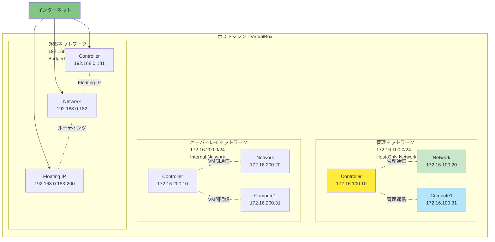

# Phase 1: 環境準備

## 目次

- [Phase 1: 環境準備](#phase-1-環境準備)
  - [目次](#目次)
  - [📋 概要](#-概要)
    - [目的](#目的)
    - [構成](#構成)
  - [🎯 前提条件](#-前提条件)
    - [ホストマシンの要件](#ホストマシンの要件)
    - [必要なソフトウェア](#必要なソフトウェア)
  - [📐 ネットワーク構成](#-ネットワーク構成)
    - [ノード詳細](#ノード詳細)
  - [📝 Step 1-1: ホストマシンの準備](#-step-1-1-ホストマシンの準備)
    - [仮想化支援機能の確認](#仮想化支援機能の確認)
      - [Windows（PowerShell 7.x管理者権限で実行）](#windowspowershell-7x管理者権限で実行)
      - [macOS](#macos)
      - [Linux](#linux)
    - [VirtualBoxのインストール](#virtualboxのインストール)
      - [Chocolatey（Windows推奨）](#chocolateywindows推奨)
      - [手動インストール](#手動インストール)
    - [Vagrantのインストール](#vagrantのインストール)
      - [Chocolatey（Windows推奨）](#chocolateywindows推奨-1)
      - [手動インストール](#手動インストール-1)
    - [インストール確認](#インストール確認)
  - [📝 Step 1-2: ネットワーク作成](#-step-1-2-ネットワーク作成)
    - [Host-Only Networkの作成](#host-only-networkの作成)
    - [ブリッジネットワークの確認](#ブリッジネットワークの確認)
    - [Host-Only Network設定の確認](#host-only-network設定の確認)
      - [コマンドラインでの確認（推奨）](#コマンドラインでの確認推奨)
      - [VirtualBox GUIでの確認](#virtualbox-guiでの確認)
      - [Windowsネットワーク設定での確認](#windowsネットワーク設定での確認)
      - [確認コマンドの実行例](#確認コマンドの実行例)
  - [📝 Step 1-3: VM起動と基本確認](#-step-1-3-vm起動と基本確認)
    - [Vagrantfileの内容確認](#vagrantfileの内容確認)
    - [メモリ・CPU設定の調整（オプション）](#メモリcpu設定の調整オプション)
    - [全ノードの起動](#全ノードの起動)
    - [ノードごとに起動（メモリ不足の場合）](#ノードごとに起動メモリ不足の場合)
    - [VM状態の確認](#vm状態の確認)
    - [SSH接続テスト](#ssh接続テスト)
      - [方法1: Vagrant経由（推奨：初回）](#方法1-vagrant経由推奨初回)
      - [方法2: 直接SSH接続（Host-Only Network経由）](#方法2-直接ssh接続host-only-network経由)
    - [ネットワーク構成の確認](#ネットワーク構成の確認)
      - [管理ネットワーク（Host-Only Network）の確認](#管理ネットワークhost-only-networkの確認)
      - [オーバーレイネットワーク（Internal Network）の確認](#オーバーレイネットワークinternal-networkの確認)
      - [外部ネットワーク（Bridged Network）の確認](#外部ネットワークbridged-networkの確認)
    - [ノード間の疎通確認](#ノード間の疎通確認)
  - [✅ Phase 1 完了チェックリスト](#-phase-1-完了チェックリスト)
  - [🔧 よく使うVagrantコマンド](#-よく使うvagrantコマンド)
  - [🛠️ 補助ツール](#️-補助ツール)
    - [✅ 前提条件確認スクリプト（check\_environment.ps1 / check\_environment.sh）](#-前提条件確認スクリプトcheck_environmentps1--check_environmentsh)
    - [🚀 環境構築スクリプト（setup\_environment.ps1 / setup\_environment.sh）](#-環境構築スクリプトsetup_environmentps1--setup_environmentsh)
    - [🗑️ 環境削除スクリプト（cleanup\_environment.ps1 / cleanup\_environment.sh）](#️-環境削除スクリプトcleanup_environmentps1--cleanup_environmentsh)
  - [⚠️ トラブルシューティング](#️-トラブルシューティング)
  - [📚 次のステップ](#-次のステップ)
  - [📝 学習記録](#-学習記録)
  - [🔗 関連ドキュメント](#-関連ドキュメント)

## 📋 概要

このPhaseでは、Vagrant + VirtualBoxを使用してOpenStack学習用の3ノード構成VMを構築します。

### 目的

- VagrantとVirtualBoxのインストール
- 3ノード構成のVMを起動
- ノード間のネットワーク疎通確認

### 構成

- **Controller Node**: コントロールプレーン（API、DB、メッセージキュー）
- **Network Node**: ネットワークサービス（L3、DHCP、メタデータ）
- **Compute Node**: VM実行環境（ハイパーバイザー）

---

## 🎯 前提条件

### ホストマシンの要件

| 項目     | 最小要件                    | 推奨要件         |
| -------- | --------------------------- | ---------------- |
| CPU      | 6コア（仮想化支援機能必須） | 8コア以上        |
| メモリ   | 16GB                        | 24GB以上         |
| ディスク | 150GB空き容量               | 200GB以上（SSD） |
| OS       | Windows 10/11, macOS, Linux | -                |

### 必要なソフトウェア

- [VirtualBox](https://www.virtualbox.org/) 7.0以降
- [Vagrant](https://www.vagrantup.com/) 2.3以降

---

## 📐 ネットワーク構成



### ノード詳細

| ノード     | ホスト名   | 管理IP        | オーバーレイIP | 外部IP        | CPU | RAM |
| ---------- | ---------- | ------------- | -------------- | ------------- | --- | --- |
| Controller | controller | 172.16.100.10 | 172.16.200.10  | 192.168.0.181 | 4   | 8GB |
| Network    | network    | 172.16.100.20 | 172.16.200.20  | 192.168.0.182 | 2   | 4GB |
| Compute    | compute1   | 172.16.100.31 | 172.16.200.31  | -             | 4   | 8GB |

**Floating IPプール**: 192.168.0.183 - 192.168.0.200

---

## 📝 Step 1-1: ホストマシンの準備

### 仮想化支援機能の確認

**重要**: VirtualBoxをインストールする前に、CPUの仮想化支援機能（Intel VT-x または AMD-V）が有効になっているか確認してください。無効の場合は、VirtualBoxをインストールしてもVMを実行できません。

#### Windows（PowerShell 7.x管理者権限で実行）

**WMIを使用した確認方法（推奨）**

```powershell
# 仮想化機能の確認
Get-CimInstance -ClassName Win32_ComputerSystem | Select-Object -ExpandProperty HypervisorPresent
```

**期待される出力**: `True` または `False`

より詳細な情報を取得する場合：

```powershell
$computerSystem = Get-CimInstance -ClassName Win32_ComputerSystem
Write-Host "仮想化ファームウェア有効: $($computerSystem.HypervisorPresent)"
```

**systeminfoを使用した確認方法**

```powershell
# 仮想化機能の確認
systeminfo | Select-String -Pattern "Virtualization"
```

**期待される出力**:

```text
Virtualization Enabled In Firmware: Yes
```

**注意**: 日本語版Windowsでは、出力が日本語の場合があるため、`Select-String`を使用すると確実です。

**もし無効の場合**:

1. PCを再起動
2. BIOS/UEFI設定画面に入る（起動時にDel, F2, F10等を押す）
3. 「Virtualization Technology」または「Intel VT-x」「AMD-V」を有効化
4. 保存して再起動

**Hyper-Vが有効の場合は無効化**:

```powershell
# Hyper-Vを無効化
bcdedit /set hypervisorlaunchtype off

# 再起動
shutdown /r /t 0
```

#### macOS

```bash
# 仮想化機能の確認
sysctl -a | grep machdep.cpu.features | grep VMX
```

**期待される出力**:
VMXが含まれていること

#### Linux

```bash
# 仮想化機能の確認
grep -E '(vmx|svm)' /proc/cpuinfo
```

**期待される出力**:
vmx（Intel）またはsvm（AMD）が表示されること

### VirtualBoxのインストール

#### Chocolatey（Windows推奨）

```powershell
# PowerShell管理者権限で実行
choco install virtualbox -y
```

#### 手動インストール

1. [VirtualBox公式サイト](https://www.virtualbox.org/wiki/Downloads)から最新版をダウンロード
2. インストーラーを実行してインストール

### Vagrantのインストール

#### Chocolatey（Windows推奨）

```powershell
# PowerShell管理者権限で実行
choco install vagrant -y

# 再起動が必要な場合があります
```

#### 手動インストール

1. [Vagrant公式サイト](https://www.vagrantup.com/downloads)から最新版をダウンロード
2. インストーラーを実行してインストール

### インストール確認

VirtualBoxとVagrantが正しくインストールされているか確認します：

```bash
# VirtualBoxのバージョン確認
VBoxManage --version

# Vagrantのバージョン確認
vagrant --version
```

**期待される出力例**:

```bash
7.0.12r159484
Vagrant 2.4.0
```

再起動が必要な場合は、再起動後に上記コマンドで確認してください。

---

## 📝 Step 1-2: ネットワーク作成

このプロジェクトでは、VM起動前にVirtualBoxのネットワーク設定が必要です。

### Host-Only Networkの作成

管理ネットワーク用にVirtualBox Host-Only Networkを作成します。以下のスクリプトを実行してください：

**Windows (PowerShell):**

```powershell
# プロジェクトディレクトリで実行
pwsh -ExecutionPolicy Bypass -File .\scripts\setup_vbox_network.ps1
```

**macOS/Linux (Bash):**

```bash
# プロジェクトディレクトリで実行
bash scripts/setup_vbox_network.sh
```

スクリプトの詳細は `scripts/` ディレクトリを参照してください。

### ブリッジネットワークの確認

外部ネットワークはブリッジモードで動作します。Vagrantfileでは自動検出を試みますが、自動検出が失敗する場合は、物理ネットワークインターフェース名を確認しておいてください（VM起動時に環境変数で指定します）。

**物理ネットワークインターフェースの確認:**

**Windows (PowerShell 7.x):**

```powershell
# ネットワークアダプタの一覧を表示
# 物理アダプタで有効なもののみを表示
Get-CimInstance -ClassName Win32_NetworkAdapter | Where-Object {
    $_.PhysicalAdapter -eq $true -and $_.NetEnabled -eq $true
} | Select-Object Name, Description, NetEnabled
```

出力例：

```bash
Name                                     Description                           NetEnabled
----                                     -----------                           ----------
Intel(R) Wi-Fi 6E AX211 160MHz           Intel(R) Wi-Fi 6E AX211 160MHz              True
VirtualBox Host-Only Ethernet Adapter    VirtualBox Host-Only Ethernet Adapter       True
```

**一般的なインターフェース名:**

- "Wi-Fi" (ワイヤレス)
- "Ethernet" (有線)
- "イーサネット" (日本語環境)

**macOS/Linux:**

```bash
# ネットワークインターフェースの確認
ifconfig
# または
ip link show

# デフォルトゲートウェイ経由のインターフェース確認
route get default  # macOS
ip route | grep default  # Linux
```

> **注**: ブリッジインターフェースの環境変数設定は、VM起動時（Step 1-3）に行います。自動検出が正常に動作する場合は、環境変数の指定は不要です。
> **注**: 全ネットワーク構成については、[📐 ネットワーク構成](#-ネットワーク構成)を参照してください。オーバーレイネットワーク（Internal Network）と外部ネットワーク（Bridged Network）は、`vagrant up`実行時に自動的に作成・設定されます。

### Host-Only Network設定の確認

作成したHost-Only Networkが正しく設定されているか確認する方法：

#### コマンドラインでの確認（推奨）

**Windows (PowerShell):**

```powershell
# Host-Only Networkの一覧を表示
VBoxManage list hostonlyifs

# 特定のネットワーク（172.16.100.1）の詳細を確認
VBoxManage list hostonlyifs | Select-String -Pattern "172.16.100" -Context 10
```

**macOS/Linux (Bash):**

```bash
# Host-Only Networkの一覧を表示
VBoxManage list hostonlyifs

# 特定のネットワークの詳細を確認
VBoxManage list hostonlyifs | grep -A 10 "172.16.100"
```

**確認ポイント：**

- `Name`: アダプタ名（例: `VirtualBox Host-Only Ethernet Adapter #2`）
- `IPAddress`: `172.16.100.1` が設定されていること
- `Netmask`: `255.255.255.0` が設定されていること
- `DHCP`: `Disabled` になっていること（静的IP使用のため）

#### VirtualBox GUIでの確認

1. VirtualBoxを起動
2. 左のタブから **「ネットワーク」** を選択
3. **「Host-Onlyネットワーク」** タブを開く
4. IPアドレスが `172.16.100.1`、ネットマスクが `255.255.255.0` のアダプタがあることを確認
5. DHCPサーバーが無効（または存在しない）ことを確認

#### Windowsネットワーク設定での確認

1. **コントロールパネル** → **ネットワークと共有センター** → **アダプターの設定の変更**
2. **VirtualBox Host-Only Ethernet Adapter**（番号付き）を探す
3. プロパティ → **インターネット プロトコル バージョン 4 (TCP/IPv4)** を選択して詳細を表示
4. IPアドレスが `172.16.100.1` に設定されていることを確認

#### 確認コマンドの実行例

正常に設定されている場合の出力例：

```bash
Name:            VirtualBox Host-Only Ethernet Adapter
GUID:            xxxxxxxx-xxxx-xxxx-xxxx-xxxxxxxxxxxx
DHCP:            Disabled
IPAddress:       172.16.100.1
NetworkMask:     255.255.255.0
IPV6Address:
IPV6NetworkMaskPrefixLength: 0
HardwareAddress: 0a:00:27:00:00:00
MediumType:      Ethernet
Wireless:        No
Status:          Up
VBoxNetworkName: HostInterfaceNetworking-VirtualBox Host-Only Ethernet Adapter
```

---

## 📝 Step 1-3: VM起動と基本確認

### Vagrantfileの内容確認

VMを起動する前に、Vagrantfileの設定を確認しておきましょう。

**主な設定項目**:

- **ベースイメージ**: bento/ubuntu-24.04 (Ubuntu 24.04 LTS Noble Numbat)
  - リリースノート参照: <https://discourse.ubuntu.com/t/ubuntu-24-04-lts-noble-numbat-release-notes/39890>
  - Vagrantセクション: <http://cloud-images.ubuntu.com/vagrant/>
  - VirtualBoxプロバイダー対応確認済み
- **ネットワーク**: 3つのプライベートネットワーク
- **リソース**: 各ノードのCPU・メモリ設定
- **入れ子仮想化**: コンピュートノードで有効化

Vagrantfileの詳細は以下のファイルを参照してください：

- [Vagrantfile](./Vagrantfile)

### メモリ・CPU設定の調整（オプション）

ホストマシンのリソースが不足している場合は、Vagrantfileを編集してリソースを削減できます。

**最小構成例**:

```ruby
# Controller Node
vb.memory = "4096"  # 8GB → 4GB
vb.cpus = 2         # 4コア → 2コア

# Network Node
vb.memory = "2048"  # 4GB → 2GB
vb.cpus = 2

# Compute Node
vb.memory = "4096"  # 8GB → 4GB
vb.cpus = 2         # 4コア → 2コア
```

### 全ノードの起動

基本的な起動方法：

```bash
# 全ノードを一括起動（初回は20-30分かかります）
vagrant up
```

**ブリッジインターフェースを手動指定する場合:**

ブリッジインターフェースの自動検出が失敗する場合や、特定のインターフェースを指定したい場合は、環境変数を設定してから起動します：

```bash
# Windows PowerShell
$env:BRIDGE_INTERFACE="Intel(R) Wi-Fi 6E AX211 160MHz"
vagrant up

# macOS/Linux
export BRIDGE_INTERFACE="en0"
vagrant up
```

> **注意**: ブリッジインターフェースの確認方法については、[Step 1-2: ネットワーク作成](#-step-1-2-ネットワーク作成)の「ブリッジネットワークの確認」セクションを参照してください。

**実行中の出力例**:

```bash
Bringing machine 'controller' up with 'virtualbox' provider...
Bringing machine 'network' up with 'virtualbox' provider...
Bringing machine 'compute1' up with 'virtualbox' provider...
==> controller: Importing base box 'bento/ubuntu-24.04'...
==> controller: Matching MAC address for NAT networking...
==> controller: Setting the name of the VM: openstack-controller
...
```

**初回起動時の処理**:

1. Ubuntu 24.04 LTSのベースイメージをダウンロード（約1GB）
2. 各ノードのVMを作成
3. ネットワークインターフェースを設定
4. VMを起動

### ノードごとに起動（メモリ不足の場合）

```bash
# 1台ずつ起動
vagrant up controller
vagrant up network
vagrant up compute1
```

### VM状態の確認

```bash
# 全ノードの状態確認
vagrant status
```

**期待される出力**:

```bash
Current machine states:

controller                running (virtualbox)
network                   running (virtualbox)
compute1                  running (virtualbox)

This environment represents multiple VMs...
```

### SSH接続テスト

#### 方法1: Vagrant経由（推奨：初回）

```bash
# SSH接続
# Controllerノード
vagrant ssh controller
# Networkノード
vagrant ssh network
# Compute1ノード
vagrant ssh compute1
```

```bash
# ホスト名確認
hostname

# IPアドレス確認
ip addr show

# exit で抜ける
exit
```

**期待される出力**:

```bash
controller

eth0: 172.16.100.10/24 (管理ネットワーク)
eth1: 172.16.200.10/24 (オーバーレイネットワーク)
eth2: 192.168.0.181/24 (外部ネットワーク)
```

#### 方法2: 直接SSH接続（Host-Only Network経由）

Host-Only Networkを使用しているため、ホストOSから直接SSH接続できます：

```bash
# Controllerノード
ssh vagrant@172.16.100.10

# Networkノード
ssh vagrant@172.16.100.20

# Compute1ノード
ssh vagrant@172.16.100.31
```

**初回接続時**:

```bash
# パスワード: vagrant
# または秘密鍵を使用
ssh -i .vagrant/machines/controller/virtualbox/private_key vagrant@172.16.100.10
```

**~/.ssh/configに登録（便利）**:

```bash
Host openstack-controller
    HostName 172.16.100.10
    User vagrant
    IdentityFile /path/to/project/.vagrant/machines/controller/virtualbox/private_key

Host openstack-network
    HostName 172.16.100.20
    User vagrant
    IdentityFile /path/to/project/.vagrant/machines/network/virtualbox/private_key

Host openstack-compute1
    HostName 172.16.100.31
    User vagrant
    IdentityFile /path/to/project/.vagrant/machines/compute1/virtualbox/private_key
```

登録後は以下で接続可能：

```bash
ssh openstack-controller
ssh openstack-network
ssh openstack-compute1
```

### ネットワーク構成の確認

`vagrant up`実行後に、以下の3つのネットワークが作成・設定されています。各ネットワークが正しく動作しているか確認しましょう。

#### 管理ネットワーク（Host-Only Network）の確認

VM起動前に作成したHost-Only Networkが正しく使用されているか確認します：

```bash
# Controllerノードにログイン
vagrant ssh controller

# 管理ネットワークのIPアドレス確認
ip addr show eth0
```

**期待される出力**:

```bash
eth0: 172.16.100.10/24 (管理ネットワーク)
```

#### オーバーレイネットワーク（Internal Network）の確認

`vagrant up`時に自動作成されたInternal Networkの確認：

```bash
# オーバーレイネットワークのIPアドレス確認
ip addr show eth1
```

**期待される出力**:

```bash
eth1: 172.16.200.10/24 (オーバーレイネットワーク)
```

#### 外部ネットワーク（Bridged Network）の確認

`vagrant up`時に設定されたブリッジネットワークの確認：

```bash
# 外部ネットワークのIPアドレス確認（Controller/Networkのみ）
ip addr show eth2
```

**期待される出力**:

```bash
eth2: 192.168.0.181/24 (外部ネットワーク)
```

> **注**: 各ネットワークの選定理由や詳細については、[OpenStack学習ロードマップ - ネットワーク構成](../openstack-learning-roadmap.md#ネットワーク構成)を参照してください。

### ノード間の疎通確認

```bash
# Controllerノードにログイン（まだログインしている場合は不要）
vagrant ssh controller

# Networkノードへのping確認（管理ネットワーク）
ping -c 3 172.16.100.20

# Compute1ノードへのping確認（管理ネットワーク）
ping -c 3 172.16.100.31

# オーバーレイネットワークの疎通確認
ping -c 3 172.16.200.20
ping -c 3 172.16.200.31

# 外部ネットワークの疎通確認（Controller/Networkのみ）
ping -c 3 192.168.0.182

# インターネット接続確認（外部ネットワーク経由）
ping -c 3 8.8.8.8

# exit で抜ける
exit
```

**期待される出力**:

```bash
PING 172.16.100.20 (172.16.100.20) 56(84) bytes of data.
64 bytes from 172.16.100.20: icmp_seq=1 ttl=64 time=0.xxx ms
64 bytes from 172.16.100.20: icmp_seq=2 ttl=64 time=0.xxx ms
64 bytes from 172.16.100.20: icmp_seq=3 ttl=64 time=0.xxx ms

--- 172.16.100.20 ping statistics ---
3 packets transmitted, 3 received, 0% packet loss, time xxxms
```

---

## ✅ Phase 1 完了チェックリスト

以下を確認してください：

- [ ] VirtualBoxがインストールされている
- [ ] Vagrantがインストールされている
- [ ] 仮想化支援機能が有効になっている
- [ ] `vagrant status`で3ノードすべてが「running」
- [ ] 各ノードにSSH接続できる
- [ ] Controllerから他のノードにpingが通る
- [ ] 管理ネットワーク（172.16.100.0/24）の疎通確認完了
- [ ] オーバーレイネットワーク（172.16.200.0/24）の疎通確認完了
- [ ] 外部ネットワーク（192.168.0.0/24）の設定確認完了

---

## 🔧 よく使うVagrantコマンド

```bash
# VM起動
vagrant up

# VM停止
vagrant halt

# VM再起動
vagrant reload

# VM削除（やり直したい場合）
vagrant destroy -f

# VM状態確認
vagrant status

# SSH接続
vagrant ssh <node-name>

# 特定ノードのみ操作
vagrant up controller
vagrant halt network
vagrant reload compute1
```

---

## 🛠️ 補助ツール

環境構築や確認を効率化するための補助スクリプトを用意しています。これらのスクリプトは、手動での作業を簡略化するためのオプション機能です。

> **注**: これらのスクリプトは補助ツールです。手動で各ステップを実行することも可能です。スクリプトを使用しない場合は、[Step 1-2: ネットワーク作成](#-step-1-2-ネットワーク作成)と[Step 1-3: VM起動と基本確認](#-step-1-3-vm起動と基本確認)の手順に従ってください。

詳細な使用方法については、[scripts/README.md](../scripts/README.md)を参照してください。

### ✅ 前提条件確認スクリプト（check_environment.ps1 / check_environment.sh）

環境構築前に、前提条件が満たされているか確認するスクリプトです。

詳細は [scripts/README.md#前提条件確認スクリプト](../scripts/README.md#前提条件確認スクリプト) を参照してください。

**クイックスタート:**

```powershell
# Windows
pwsh -ExecutionPolicy Bypass -File .\scripts\check_environment.ps1

# macOS/Linux
bash scripts/check_environment.sh
```

### 🚀 環境構築スクリプト（setup_environment.ps1 / setup_environment.sh）

環境構築を自動化するスクリプトです。`cleanup_environment.ps1`/`cleanup_environment.sh`の逆の操作を行います。

詳細は [scripts/README.md#環境構築スクリプト](../scripts/README.md#環境構築スクリプト) を参照してください。

**クイックスタート:**

```powershell
# Windows（管理者権限が必要）
pwsh -ExecutionPolicy Bypass -File .\scripts\setup_environment.ps1

# macOS/Linux
bash scripts/setup_environment.sh
```

### 🗑️ 環境削除スクリプト（cleanup_environment.ps1 / cleanup_environment.sh）

学習環境を完全に削除するスクリプトです。`setup_environment.ps1`/`setup_environment.sh`で作成したリソースを削除します。

詳細は [scripts/README.md#環境削除スクリプト](../scripts/README.md#環境削除スクリプト) を参照してください。

**クイックスタート:**

```powershell
# Windows
pwsh -ExecutionPolicy Bypass -File .\scripts\cleanup_environment.ps1

# macOS/Linux
bash scripts/cleanup_environment.sh
```

> **警告**: クリーンアップスクリプトは全てのVMとデータを削除します。実行前に必要なデータのバックアップを取ってください。

---

## ⚠️ トラブルシューティング

問題が発生した場合は、以下のドキュメントを参照してください：

- [トラブルシューティングガイド - 環境準備関連の問題](./appendix_b_troubleshooting.md#環境準備関連の問題)

---

## 📚 次のステップ

Phase 1が完了したら、Phase 2（基盤構築）に進んでください：

- [Phase 2: 基盤構築](./phase2_foundation.md)

---

## 📝 学習記録

このPhaseで学んだことを記録しましょう：

- [学習記録テンプレート](./learning-log.md#phase-1-環境準備)

---

## 🔗 関連ドキュメント

- [OpenStack学習ロードマップ](../openstack-learning-roadmap.md)
- [ネットワーク構成図（詳細）](./network-diagram.md)
- [Vagrantfile](./Vagrantfile)
- [プロジェクトREADME](../README.md)
