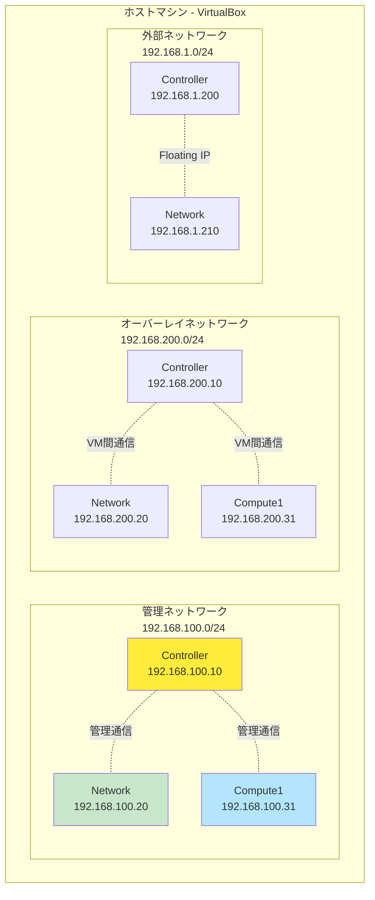

# Phase 1: 環境準備

## 📋 概要

このPhaseでは、Vagrant + VirtualBoxを使用してOpenStack学習用の3ノード構成VMを構築します。

### 目的

- VagrantとVirtualBoxのインストール
- 3ノード構成のVMを起動
- ノード間のネットワーク疎通確認

### 構成

- **Controller Node**: コントロールプレーン（API、DB、メッセージキュー）
- **Network Node**: ネットワークサービス（L3、DHCP、メタデータ）
- **Compute Node**: VM実行環境（ハイパーバイザー）

---

## 🎯 前提条件

### ホストマシンの要件

| 項目     | 最小要件                    | 推奨要件         |
| -------- | --------------------------- | ---------------- |
| CPU      | 6コア（仮想化支援機能必須） | 8コア以上        |
| メモリ   | 16GB                        | 24GB以上         |
| ディスク | 150GB空き容量               | 200GB以上（SSD） |
| OS       | Windows 10/11, macOS, Linux | -                |

### 必要なソフトウェア

- [VirtualBox](https://www.virtualbox.org/) 7.0以降
- [Vagrant](https://www.vagrantup.com/) 2.3以降

---

## 📐 ネットワーク構成



### ノード詳細

| ノード     | ホスト名   | 管理IP         | オーバーレイIP | 外部IP        | CPU | RAM |
| ---------- | ---------- | -------------- | -------------- | ------------- | --- | --- |
| Controller | controller | 192.168.100.10 | 192.168.200.10 | 192.168.1.200 | 4   | 8GB |
| Network    | network    | 192.168.100.20 | 192.168.200.20 | 192.168.1.210 | 2   | 4GB |
| Compute    | compute1   | 192.168.100.31 | 192.168.200.31 | -             | 4   | 8GB |

---

## 📝 Step 1-1: ホストマシンの準備

### VirtualBoxのインストール

#### Chocolatey（Windows推奨）

```powershell
# PowerShell管理者権限で実行
choco install virtualbox -y

# インストール確認
VBoxManage --version
```

#### 手動インストール

1. [VirtualBox公式サイト](https://www.virtualbox.org/wiki/Downloads)から最新版をダウンロード
2. インストーラーを実行してインストール

### Vagrantのインストール

#### Chocolatey（Windows推奨）

```powershell
# PowerShell管理者権限で実行
choco install vagrant -y

# 再起動が必要な場合があります
# 再起動後、インストール確認
vagrant --version
```

#### 手動インストール

1. [Vagrant公式サイト](https://www.vagrantup.com/downloads)から最新版をダウンロード
2. インストーラーを実行してインストール

### インストール確認

```bash
# VirtualBoxのバージョン確認
VBoxManage --version

# Vagrantのバージョン確認
vagrant --version
```

**期待される出力例**:

```bash
7.0.12r159484
Vagrant 2.4.0
```

### VirtualBoxネットワーク設定について

**このプロジェクトでは手動のネットワーク設定は不要です。**

Vagrantfileで`virtualbox__intnet`（Internal Network）を使用しているため、以下のネットワークが自動的に作成されます：

- `mgmt-net`: 管理ネットワーク（192.168.100.0/24）
- `overlay-net`: オーバーレイネットワーク（192.168.200.0/24）
- `external-net`: 外部ネットワーク（192.168.1.0/24）

**Internal Networkの特徴**:

- VM間のみ通信可能（完全に隔離された仮想ネットワーク）
- ホストOSからは直接アクセス不可
- OpenStackの学習には最適（実際のデータセンターネットワークに近い）

**参考**: Host-Only NetworkやNATネットワークは不要です。各VMは`eth0`（NAT、Vagrant default）でインターネットに接続し、`eth1-eth3`でInternal Networkを使用します。

### 仮想化支援機能の確認

#### Windows（PowerShell管理者権限で実行）

```powershell
# 仮想化機能の確認
systeminfo | findstr /C:"Virtualization"
```

**期待される出力**:

```bash
Virtualization Enabled In Firmware: Yes
```

**もし無効の場合**:

1. PCを再起動
2. BIOS/UEFI設定画面に入る（起動時にDel, F2, F10等を押す）
3. 「Virtualization Technology」または「Intel VT-x」「AMD-V」を有効化
4. 保存して再起動

**Hyper-Vが有効の場合は無効化**:

```powershell
# Hyper-Vを無効化
bcdedit /set hypervisorlaunchtype off

# 再起動
shutdown /r /t 0
```

#### macOS

```bash
# 仮想化機能の確認
sysctl -a | grep machdep.cpu.features | grep VMX
```

**期待される出力**:
VMXが含まれていること

#### Linux

```bash
# 仮想化機能の確認
grep -E '(vmx|svm)' /proc/cpuinfo
```

**期待される出力**:
vmx（Intel）またはsvm（AMD）が表示されること

---

## 📝 Step 1-2: プロジェクトのセットアップ

### リポジトリのクローン

```bash
# GitHubリポジトリをクローン
git clone https://github.com/y-nosuke/vagrant-samples.git

# プロジェクトディレクトリに移動
cd vagrant-samples/openstack-3node
```

### ファイル構成の確認

```bash
# ファイル一覧の確認
ls -la

# Vagrantfileの存在確認
cat Vagrantfile
```

**確認すべきファイル**:

- `Vagrantfile` - VM構成定義ファイル
- `README.md` - プロジェクト概要
- `.gitignore` - Git管理除外設定

### Vagrantfileの内容確認

Vagrantfileの詳細は以下のファイルを参照してください：

- [Vagrantfile](../Vagrantfile)

**主な設定項目**:

- **ベースイメージ**: ubuntu/noble64 (Ubuntu 24.04 LTS)
- **ネットワーク**: 3つのプライベートネットワーク
- **リソース**: 各ノードのCPU・メモリ設定
- **入れ子仮想化**: コンピュートノードで有効化

### メモリ・CPU設定の調整（オプション）

ホストマシンのリソースが不足している場合は、Vagrantfileを編集してリソースを削減できます。

**最小構成例**:

```ruby
# Controller Node
vb.memory = "4096"  # 8GB → 4GB
vb.cpus = 2         # 4コア → 2コア

# Network Node
vb.memory = "2048"  # 4GB → 2GB
vb.cpus = 2

# Compute Node
vb.memory = "4096"  # 8GB → 4GB
vb.cpus = 2         # 4コア → 2コア
```

---

## 📝 Step 1-3: VM起動と基本確認

### 全ノードの起動

```bash
# 全ノードを一括起動（初回は20-30分かかります）
vagrant up
```

**実行中の出力例**:

```bash
Bringing machine 'controller' up with 'virtualbox' provider...
Bringing machine 'network' up with 'virtualbox' provider...
Bringing machine 'compute1' up with 'virtualbox' provider...
==> controller: Importing base box 'ubuntu/noble64'...
==> controller: Matching MAC address for NAT networking...
==> controller: Setting the name of the VM: openstack-controller
...
```

**初回起動時の処理**:

1. Ubuntu 24.04 LTSのベースイメージをダウンロード（約1GB）
2. 各ノードのVMを作成
3. ネットワークインターフェースを設定
4. VMを起動

### ノードごとに起動（メモリ不足の場合）

```bash
# 1台ずつ起動
vagrant up controller
vagrant up network
vagrant up compute1
```

### VM状態の確認

```bash
# 全ノードの状態確認
vagrant status
```

**期待される出力**:

```bash
Current machine states:

controller                running (virtualbox)
network                   running (virtualbox)
compute1                  running (virtualbox)

This environment represents multiple VMs...
```

### SSH接続テスト

#### Controllerノード

```bash
# SSH接続
vagrant ssh controller

# ホスト名確認
hostname

# IPアドレス確認
ip addr show

# exit で抜ける
exit
```

**期待される出力**:

```bash
controller

eth0: NAT (DHCP)
eth1: 192.168.100.10/24
eth2: 192.168.200.10/24
eth3: 192.168.1.200/24
```

#### Networkノード

```bash
vagrant ssh network
hostname
ip addr show
exit
```

#### Compute1ノード

```bash
vagrant ssh compute1
hostname
ip addr show
exit
```

### ノード間の疎通確認

```bash
# Controllerノードにログイン
vagrant ssh controller

# Networkノードへのping確認
ping -c 3 192.168.100.20

# Compute1ノードへのping確認
ping -c 3 192.168.100.31

# オーバーレイネットワークの疎通確認
ping -c 3 192.168.200.20
ping -c 3 192.168.200.31

# exit で抜ける
exit
```

**期待される出力**:

```bash
PING 192.168.100.20 (192.168.100.20) 56(84) bytes of data.
64 bytes from 192.168.100.20: icmp_seq=1 ttl=64 time=0.xxx ms
64 bytes from 192.168.100.20: icmp_seq=2 ttl=64 time=0.xxx ms
64 bytes from 192.168.100.20: icmp_seq=3 ttl=64 time=0.xxx ms

--- 192.168.100.20 ping statistics ---
3 packets transmitted, 3 received, 0% packet loss, time xxxms
```

---

## ✅ Phase 1 完了チェックリスト

以下を確認してください：

- [ ] VirtualBoxがインストールされている
- [ ] Vagrantがインストールされている
- [ ] 仮想化支援機能が有効になっている
- [ ] `vagrant status`で3ノードすべてが「running」
- [ ] 各ノードにSSH接続できる
- [ ] Controllerから他のノードにpingが通る
- [ ] 管理ネットワーク（192.168.100.0/24）の疎通確認完了
- [ ] オーバーレイネットワーク（192.168.200.0/24）の疎通確認完了

---

## 🔧 よく使うVagrantコマンド

```bash
# VM起動
vagrant up

# VM停止
vagrant halt

# VM再起動
vagrant reload

# VM削除（やり直したい場合）
vagrant destroy -f

# VM状態確認
vagrant status

# SSH接続
vagrant ssh <node-name>

# 特定ノードのみ操作
vagrant up controller
vagrant halt network
vagrant reload compute1
```

---

## ⚠️ トラブルシューティング

問題が発生した場合は、以下のドキュメントを参照してください：

- [トラブルシューティングガイド - Phase 1](./appendix_b_troubleshooting.md#phase-1-環境準備のトラブルシューティング)

### よくある問題

1. **仮想化支援機能が有効にならない**
   - BIOSで仮想化機能を有効化
   - Windows: Hyper-Vを無効化

2. **メモリ不足でVM起動失敗**
   - Vagrantfileのメモリ設定を削減
   - ノードを順次起動

3. **ネットワーク接続失敗**
   - VirtualBoxネットワーク設定を確認
   - ファイアウォールを一時無効化してテスト

---

## 📚 次のステップ

Phase 1が完了したら、Phase 2（基盤構築）に進んでください：

- [Phase 2: 基盤構築](./phase2_foundation.md)

---

## 📝 学習記録

このPhaseで学んだことを記録しましょう：

- [学習記録テンプレート](./learning-log.md#phase-1-環境準備)

---

## 🔗 関連ドキュメント

- [OpenStack学習ロードマップ](../openstack-learning-roadmap.md)
- [ネットワーク構成図（詳細）](./network-diagram.md)
- [Vagrantfile](../Vagrantfile)
- [プロジェクトREADME](../README.md)
