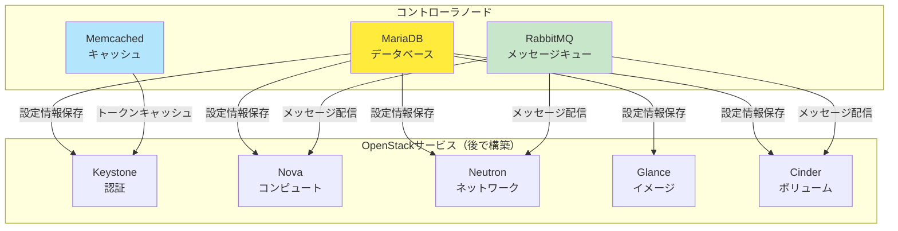

# Phase 2: 基盤構築

## 目次

- [Phase 2: 基盤構築](#phase-2-基盤構築)
  - [目次](#目次)
  - [📋 概要](#-概要)
    - [目的](#目的)
    - [構成](#構成)
  - [🎯 前提条件](#-前提条件)
    - [Phase 1の完了確認](#phase-1の完了確認)
    - [必要な知識](#必要な知識)
  - [📐 基盤サービスの概要](#-基盤サービスの概要)
    - [基盤サービスの役割](#基盤サービスの役割)
    - [サービス間の依存関係](#サービス間の依存関係)
  - [📝 Step 2-1: 全ノード共通設定](#-step-2-1-全ノード共通設定)
    - [hostsファイルの設定](#hostsファイルの設定)
    - [NTPによる時刻同期設定](#ntpによる時刻同期設定)
    - [OpenStackリポジトリの追加](#openstackリポジトリの追加)
    - [パッケージの更新](#パッケージの更新)
  - [📝 Step 2-2: コントローラノードのデータベース構築](#-step-2-2-コントローラノードのデータベース構築)
    - [MariaDBのインストール](#mariadbのインストール)
    - [root用パスワード設定](#root用パスワード設定)
    - [リモート接続の設定](#リモート接続の設定)
    - [文字コード設定（UTF-8）](#文字コード設定utf-8)
    - [OpenStack用データベースの作成準備](#openstack用データベースの作成準備)
  - [📝 Step 2-3: RabbitMQのインストール](#-step-2-3-rabbitmqのインストール)
    - [RabbitMQのインストール](#rabbitmqのインストール)
    - [openstack用ユーザーの作成](#openstack用ユーザーの作成)
    - [権限設定](#権限設定)
    - [動作確認](#動作確認)
  - [📝 Step 2-4: Memcachedのインストール](#-step-2-4-memcachedのインストール)
    - [Memcachedのインストール](#memcachedのインストール)
    - [設定ファイルの編集](#設定ファイルの編集)
    - [サービスの起動](#サービスの起動)
  - [📝 Step 2-5: 基盤の動作確認](#-step-2-5-基盤の動作確認)
    - [ノード間通信の確認](#ノード間通信の確認)
    - [データベース接続確認](#データベース接続確認)
    - [RabbitMQ動作確認](#rabbitmq動作確認)
    - [Memcached動作確認](#memcached動作確認)
  - [✅ Phase 2 完了チェックリスト](#-phase-2-完了チェックリスト)
  - [⚠️ トラブルシューティング](#️-トラブルシューティング)
  - [📚 次のステップ](#-次のステップ)
  - [📝 学習記録](#-学習記録)
  - [🔗 関連ドキュメント](#-関連ドキュメント)

## 📋 概要

このPhaseでは、OpenStackの土台となる基盤サービスを構築します。

### 目的

- OpenStackの基盤となるサービスの構築
- データベース、メッセージキュー、キャッシュシステムの設定
- ノード間の通信基盤の確立

### 構成

- **データベース**: MariaDB（認証情報、設定情報の永続化）
- **メッセージキュー**: RabbitMQ（サービス間非同期通信）
- **キャッシュ**: Memcached（認証トークンのキャッシュ）

---

## 🎯 前提条件

### Phase 1の完了確認

以下が完了していることを確認してください：

- [ ] 3ノードのVMが正常に起動している
- [ ] 各ノードにSSH接続できる
- [ ] ノード間の疎通が確認できている
- [ ] 管理ネットワーク（172.16.100.0/24）が正常に動作している

### 必要な知識

- Linux基本コマンド（vim、systemctl、など）
- ネットワーク基礎（IP、ポート番号）
- データベース基礎概念
- SSH接続方法

---

## 📐 基盤サービスの概要

### 基盤サービスの役割



### サービス間の依存関係

| サービス  | 役割             | 使用ポート | 利用するOpenStackサービス |
| --------- | ---------------- | ---------- | ------------------------- |
| MariaDB   | データ永続化     | 3306       | 全サービス                |
| RabbitMQ  | メッセージキュー | 5672       | Nova, Neutron, Cinder     |
| Memcached | キャッシュ       | 11211      | Keystone（主に）          |

---

## 📝 Step 2-1: 全ノード共通設定

### hostsファイルの設定

全ノード（controller、network、compute1）で実行します。

**コントローラノードにSSH接続**:

```bash
vagrant ssh controller
```

**hostsファイルの編集**:

```bash
# バックアップを作成
sudo cp /etc/hosts /etc/hosts.backup

# hostsファイルを編集
sudo vim /etc/hosts
```

**以下の内容を追加**:

```bash
# OpenStack Hosts
172.16.100.10   controller
172.16.100.20   network
172.16.100.31   compute1
```

**設定確認**:

```bash
# 名前解決の確認
ping -c 3 controller
ping -c 3 network
ping -c 3 compute1
```

**他のノードでも同様の設定を実行**:

```bash
# exitでcontrollerから抜ける
exit

# networkノードで同じ設定
vagrant ssh network
sudo cp /etc/hosts /etc/hosts.backup
sudo vim /etc/hosts
# 同じ内容を追加
ping -c 3 controller
ping -c 3 network
ping -c 3 compute1
exit

# compute1ノードで同じ設定
vagrant ssh compute1
sudo cp /etc/hosts /etc/hosts.backup
sudo vim /etc/hosts
# 同じ内容を追加
ping -c 3 controller
ping -c 3 network
ping -c 3 compute1
exit
```

### NTPによる時刻同期設定

時刻同期はOpenStackサービスの認証で重要です。全ノードで実行します。

**chronyのインストールと設定**（コントローラノード）:

```bash
vagrant ssh controller

# chronyのインストール
sudo apt update
sudo apt install -y chrony

# 設定ファイルのバックアップ
sudo cp /etc/chrony/chrony.conf /etc/chrony/chrony.conf.backup

# 設定ファイルの編集
sudo vim /etc/chrony/chrony.conf
```

**chrony.confの主な設定項目**:

```bash
# Ubuntu標準のNTPサーバーを使用
pool ntp.ubuntu.com        iburst maxsources 4
pool 0.ubuntu.pool.ntp.org iburst maxsources 1
pool 1.ubuntu.pool.ntp.org iburst maxsources 1
pool 2.ubuntu.pool.ntp.org iburst maxsources 2

# ローカルネットワークからの時刻同期を許可（コントローラのみ）
allow 172.16.100.0/24
```

**chronyサービスの起動**:

```bash
# サービスの有効化と起動
sudo systemctl enable chrony
sudo systemctl restart chrony

# 動作確認
sudo chronyc sources -v
```

**期待される出力例**:

```bash
  .-- Source mode  '^' = server, '=' = peer, '#' = local clock.
 / .- Source state '*' = current best, '+' = combined, '-' = not combined,
| /             'x' = may be in error, '~' = too variable, '?' = unusable.
||                                                 .- xxxx [ yyyy ] +/- zzzz
||      Reachability register (octal) -.           |  xxxx = adjusted offset,
||      Log2(Polling interval) --.      |          |  yyyy = measured offset,
||                                \     |          |  zzzz = estimated error.
||                                 |    |           \
MS Name/IP address         Stratum Poll Reach LastRx Last sample
===============================================================================
^* ntp.ubuntu.com               2   6   377    63    +15us[+123us] +/-   45ms
```

**他のノードでの設定**（network、compute1）:

```bash
# networkノード
vagrant ssh network
sudo apt update
sudo apt install -y chrony

# 設定ファイルの編集
sudo vim /etc/chrony/chrony.conf
```

**他のノード用chrony.conf設定**:

```bash
# コントローラを参照するように設定
server controller iburst

# Ubuntu標準も併用
pool ntp.ubuntu.com        iburst maxsources 2
pool 0.ubuntu.pool.ntp.org iburst maxsources 1
```

**サービス起動**:

```bash
sudo systemctl enable chrony
sudo systemctl restart chrony

# 動作確認
sudo chronyc sources -v
exit

# compute1でも同様に設定
vagrant ssh compute1
# 同じ手順を実行
```

### OpenStackリポジトリの追加

Ubuntu 24.04 + OpenStack Epoxyの環境を構築します。全ノードで実行します。

**コントローラノードでの実行**:

```bash
vagrant ssh controller

# システムの更新
sudo apt update
sudo apt upgrade -y

# OpenStack Epoxyリポジトリの追加
sudo add-apt-repository cloud-archive:epoxy -y

# パッケージリストの更新
sudo apt update

# OpenStackクライアントのインストール
sudo apt install -y python3-openstackclient
```

**他のノードでも同様の設定**:

```bash
# networkノード
vagrant ssh network
sudo apt update
sudo apt upgrade -y
sudo add-apt-repository cloud-archive:epoxy -y
sudo apt update
sudo apt install -y python3-openstackclient
exit

# compute1ノード
vagrant ssh compute1
sudo apt update
sudo apt upgrade -y
sudo add-apt-repository cloud-archive:epoxy -y
sudo apt update
sudo apt install -y python3-openstackclient
exit
```

### パッケージの更新

**全ノードでシステム全体の更新**:

```bash
# 各ノードで実行
sudo apt update
sudo apt upgrade -y
sudo apt autoremove -y
```

**OpenStackクライアントの動作確認**:

```bash
# OpenStackクライアントがインストールされているか確認
openstack --version
```

**期待される出力例**:

```bash
openstack 7.4.0
```

---

## 📝 Step 2-2: コントローラノードのデータベース構築

データベースはコントローラノードにのみインストールします。

### MariaDBのインストール

**コントローラノードにSSH接続**:

```bash
vagrant ssh controller
```

**MariaDBのインストール**:

```bash
# MariaDBサーバーのインストール
sudo apt install -y mariadb-server python3-pymysql

# MariaDBクライアントの確認
mysql --version
```

### root用パスワード設定

**MariaDBの初期設定**:

```bash
# セキュアインストールの実行
sudo mysql_secure_installation
```

**設定例**:

```bash
Enter current password for root (enter for none): [Enter]
Switch to unix_socket authentication [Y/n] Y
Change the root password? [Y/n] Y
New password: password      # パスワードを設定（例: password）
Re-enter new password: password
Remove anonymous users? [Y/n] Y
Disallow root login remotely? [Y/n] n    # リモート接続を許可
Remove test database and access to it? [Y/n] Y
Reload privilege tables now? [Y/n] Y
```

**rootユーザーでのログイン確認**:

```bash
mysql -u root -p
```

パスワードを入力してMariaDBにログインできることを確認します。

```sql
-- バージョン確認
SELECT VERSION();

-- データベース一覧表示
SHOW DATABASES;

-- 終了
EXIT;
```

### リモート接続の設定

**MariaDB設定ファイルの編集**:

```bash
# 設定ファイルのバックアップ
sudo cp /etc/mysql/mariadb.conf.d/50-server.cnf /etc/mysql/mariadb.conf.d/50-server.cnf.backup

# 設定ファイルの編集
sudo vim /etc/mysql/mariadb.conf.d/50-server.cnf
```

**bind-addressの変更**:

```ini
[mysqld]
# 以下の行を見つけて変更
# bind-address = 127.0.0.1
bind-address = 172.16.100.10

# 追加設定
default-storage-engine = innodb
innodb_file_per_table = on
max_connections = 4096
```

### 文字コード設定（UTF-8）

**文字コード設定ファイルの作成**:

```bash
sudo vim /etc/mysql/mariadb.conf.d/99-openstack.cnf
```

**内容**:

```ini
[mysqld]
bind-address = 172.16.100.10

default-storage-engine = innodb
innodb_file_per_table = on
max_connections = 4096

# 文字コード設定
character-set-server = utf8mb4
collation-server = utf8mb4_general_ci

[mysql]
default-character-set = utf8mb4

[client]
default-character-set = utf8mb4
```

**MariaDBサービスの再起動**:

```bash
sudo systemctl restart mariadb
sudo systemctl enable mariadb

# 動作確認
sudo systemctl status mariadb
```

### OpenStack用データベースの作成準備

**リモート接続用rootユーザーの設定**:

```bash
mysql -u root -p
```

**SQL実行**:

```sql
-- リモート接続用のrootユーザーを作成
CREATE USER 'root'@'%' IDENTIFIED BY 'password';
GRANT ALL PRIVILEGES ON *.* TO 'root'@'%' WITH GRANT OPTION;

-- 設定の反映
FLUSH PRIVILEGES;

-- 設定確認
SELECT User, Host FROM mysql.user WHERE User = 'root';

EXIT;
```

**他ノードからの接続確認**:

```bash
# controllerから一度出る
exit

# networkノードにMariaDBクライアントをインストール
vagrant ssh network
sudo apt update
sudo apt install -y mariadb-client

# networkノードから接続テスト
mysql -h controller -u root -p
```

MariaDBにリモート接続できることを確認します。

```sql
SHOW DATABASES;
EXIT;
```

```bash
exit

# compute1ノードにMariaDBクライアントをインストール
vagrant ssh compute1
sudo apt update
sudo apt install -y mariadb-client

# compute1ノードからも同様に確認
mysql -h controller -u root -p
```

```sql
SHOW DATABASES;
EXIT;
```

```bash
exit
```

---

## 📝 Step 2-3: RabbitMQのインストール

RabbitMQもコントローラノードにインストールします。

### RabbitMQのインストール

**コントローラノードでの実行**:

```bash
vagrant ssh controller

# RabbitMQのインストール
sudo apt install -y rabbitmq-server

# サービスの有効化と起動
sudo systemctl enable rabbitmq-server
sudo systemctl start rabbitmq-server

# 動作確認
sudo systemctl status rabbitmq-server
```

### openstack用ユーザーの作成

**RabbitMQユーザーの作成**:

```bash
# openstackユーザーの作成
sudo rabbitmqctl add_user openstack password

# パスワードの確認用（作成したユーザーの表示）
sudo rabbitmqctl list_users
```

### 権限設定

**openstackユーザーの権限設定**:

```bash
# 管理者権限の付与
sudo rabbitmqctl set_user_tags openstack administrator

# 全リソースへのアクセス権限の付与
sudo rabbitmqctl set_permissions openstack ".*" ".*" ".*"

# 権限確認
sudo rabbitmqctl list_permissions
sudo rabbitmqctl list_user_permissions openstack
```

**期待される出力例**:

```bash
Listing permissions for user "openstack" ...
vhost configure write read
/ .* .* .*
```

### 動作確認

**RabbitMQ管理プラグインの有効化（オプション）**:

```bash
# 管理プラグインの有効化
sudo rabbitmq-plugins enable rabbitmq_management

# サービス再起動
sudo systemctl restart rabbitmq-server
```

**接続確認**:

```bash
# ノード情報の確認
sudo rabbitmqctl cluster_status

# ユーザー一覧の再確認
sudo rabbitmqctl list_users
```

**期待される出力例**:

```bash
Listing users ...
user tags
guest [administrator]
openstack [administrator]
```

---

## 📝 Step 2-4: Memcachedのインストール

Memcachedもコントローラノードにインストールします。

### Memcachedのインストール

**コントローラノードでの実行**:

```bash
# Memcachedのインストール
sudo apt install -y memcached python3-memcache

# 現在の設定確認
sudo systemctl status memcached
```

### 設定ファイルの編集

**設定ファイルのバックアップと編集**:

```bash
# バックアップ作成
sudo cp /etc/memcached.conf /etc/memcached.conf.backup

# 設定ファイルの編集
sudo vim /etc/memcached.conf
```

**主な設定変更**:

```bash
# 以下の行を見つけて変更
# -l 127.0.0.1
# -l ::1
-l 172.16.100.10

# メモリサイズ（デフォルト64MBから変更）
-m 128
```

**設定ファイル全体の確認**:

```bash
# 主要な設定項目の確認
grep -v "^#" /etc/memcached.conf | grep -v "^$"
```

**期待される出力例**:

```bash
-d
-m 128
-p 11211
-u memcache
-l 172.16.100.10
```

### サービスの起動

**Memcachedサービスの再起動**:

```bash
# サービスの再起動と有効化
sudo systemctl restart memcached
sudo systemctl enable memcached

# 動作確認
sudo systemctl status memcached
```

**ポート確認**:

```bash
# Memcachedがリスンしているか確認
sudo ss -tuln | grep 11211
# または（net-toolsがインストールされている場合）
# sudo netstat -tuln | grep 11211
```

**期待される出力例**:

```bash
tcp        0      0 172.16.100.10:11211     0.0.0.0:*               LISTEN
```

**接続テスト**:

```bash
# telnetで接続テスト
telnet 172.16.100.10 11211
```

接続できたら以下のコマンドでテスト:

```bash
version
quit
```

---

## 📝 Step 2-5: 基盤の動作確認

### ノード間通信の確認

**名前解決の確認**:

```bash
# 全ノードから実行
ping -c 3 controller
ping -c 3 network
ping -c 3 compute1

# hostsファイルの設定確認
cat /etc/hosts | grep -E "(controller|network|compute1)"
```

### データベース接続確認

**コントローラからの接続確認**:

```bash
vagrant ssh controller

# ローカル接続
mysql -u root -p -e "SELECT VERSION();"

# リモート接続（自分自身）
mysql -h controller -u root -p -e "SELECT VERSION();"
```

**他ノードからの接続確認**:

```bash
# networkノードから
vagrant ssh network
mysql -h controller -u root -p -e "SHOW DATABASES;"
exit

# compute1ノードから
vagrant ssh compute1
mysql -h controller -u root -p -e "SHOW DATABASES;"
exit
```

### RabbitMQ動作確認

**RabbitMQサーバーの状態確認**:

```bash
vagrant ssh controller

# サービス状態確認
sudo systemctl status rabbitmq-server

# クラスター状態確認
sudo rabbitmqctl cluster_status

# ユーザー確認
sudo rabbitmqctl list_users

# 接続テスト（管理プラグインが有効な場合）
curl -u openstack:password http://172.16.100.10:15672/api/overview
```

### Memcached動作確認

**Memcachedの動作確認**:

```bash
# サービス状態確認
sudo systemctl status memcached

# ポート確認
sudo ss -tuln | grep 11211

# 統計情報の確認
echo "stats" | nc 172.16.100.10 11211
```

**他ノードからの接続確認**:

```bash
# networkノードから
vagrant ssh network
echo "version" | nc controller 11211
exit

# compute1ノードから
vagrant ssh compute1
echo "version" | nc controller 11211
exit
```

**Python3からの接続テスト**:

```bash
vagrant ssh controller

# Python3での接続テスト
python3 -c "
import memcache
mc = memcache.Client(['172.16.100.10:11211'], debug=0)
mc.set('test_key', 'test_value')
print('Value:', mc.get('test_key'))
"
```

**期待される出力**:

```bash
Value: test_value
```

---

## ✅ Phase 2 完了チェックリスト

以下を確認してください：

- [ ] 全ノードでhostsファイルが設定されている
- [ ] 全ノードでNTP時刻同期が動作している
- [ ] 全ノードでOpenStackリポジトリが追加されている
- [ ] MariaDBがコントローラノードで動作している
- [ ] MariaDBにリモート接続できる
- [ ] RabbitMQがコントローラノードで動作している
- [ ] RabbitMQでopenstackユーザーが作成されている
- [ ] Memcachedがコントローラノードで動作している
- [ ] 他ノードからMemcachedに接続できる
- [ ] 全ての基盤サービスが正常に動作している

**確認コマンド例**:

```bash
# controllerノードで実行
vagrant ssh controller

# サービス状態の一括確認
sudo systemctl status mariadb rabbitmq-server memcached chrony

# ポート確認
sudo ss -tuln | grep -E "(3306|5672|11211)"

# 他ノードからの接続確認
mysql -h controller -u root -p -e "SELECT 1;"
echo "version" | nc controller 11211
sudo rabbitmqctl list_users
```

---

## ⚠️ トラブルシューティング

よくある問題と解決策：

**MariaDB接続エラー**:

- bind-addressの設定を確認
- ファイアウォール設定の確認
- パスワード設定の確認

**RabbitMQ接続エラー**:

- サービスの起動状態確認
- ユーザー権限の確認
- ポート5672の開放確認

**Memcached接続エラー**:

- リスンアドレスの設定確認
- サービスの起動状態確認
- ポート11211の開放確認

**時刻同期エラー**:

- chronyサービスの状態確認
- NTPサーバーとの疎通確認
- chronyc sourcesコマンドで同期状態確認

詳細は [トラブルシューティングガイド](./appendix_b_troubleshooting.md) を参照してください。

---

## 📚 次のステップ

Phase 2が完了したら、Phase 3（Keystone認証サービス）に進んでください：

- [Phase 3: Keystone構築](./phase3_keystone.md)

---

## 📝 学習記録

このPhaseで学んだことを記録しましょう：

- [学習記録テンプレート](./learning-log.md#phase-2-基盤構築)

---

## 🔗 関連ドキュメント

- [OpenStack学習ロードマップ](../openstack-learning-roadmap.md)
- [Server World - OpenStack Epoxy](https://www.server-world.info/query?os=Ubuntu_24.04&p=openstack_epoxy)
- [MariaDB公式ドキュメント](https://mariadb.org/documentation/)
- [RabbitMQ公式ドキュメント](https://www.rabbitmq.com/documentation.html)
- [プロジェクトREADME](../README.md)
