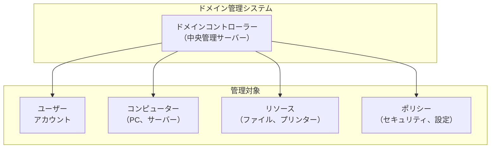
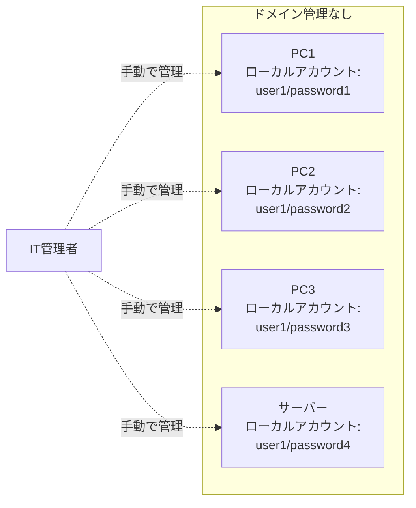
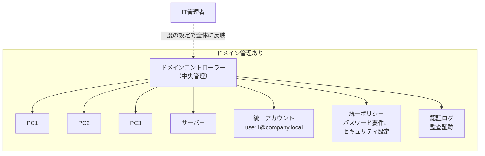
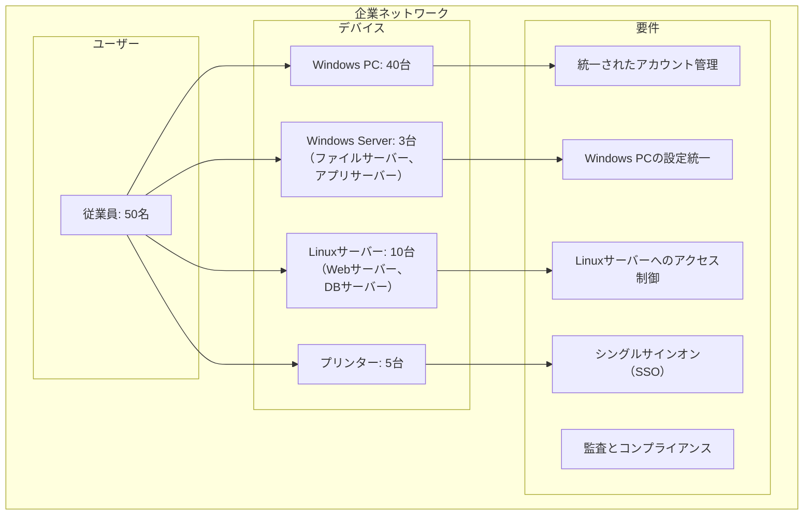
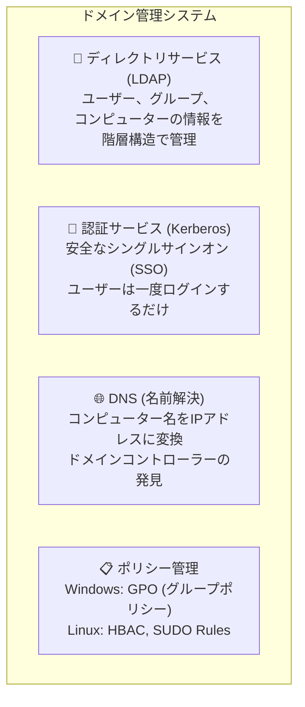
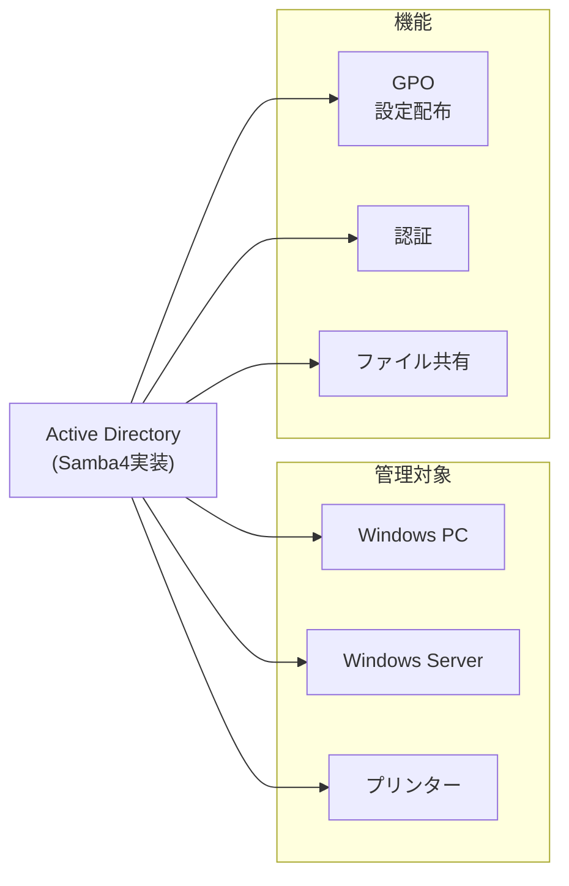
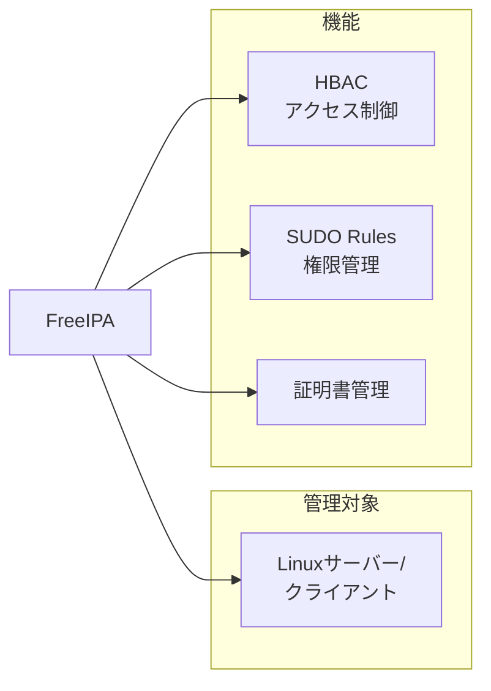
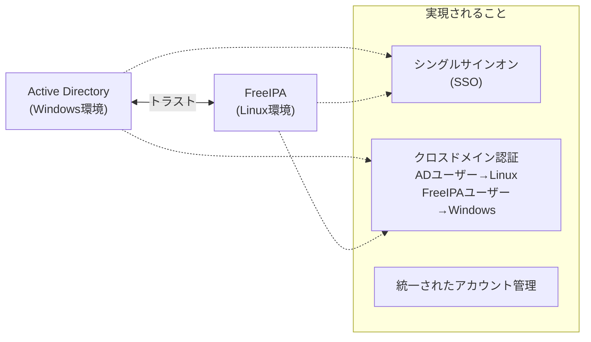
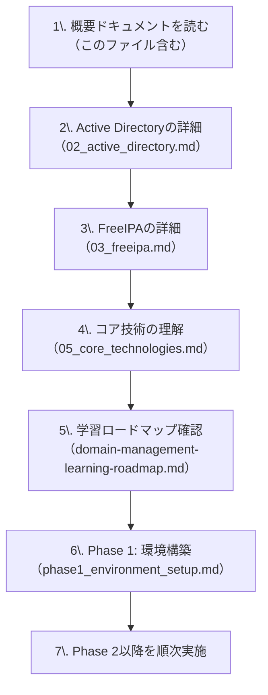

# ドメイン管理の概要

## 📋 目次

- [ドメイン管理の概要](#ドメイン管理の概要)
  - [📋 目次](#-目次)
  - [🎯 このドキュメントについて](#-このドキュメントについて)
  - [💡 ドメイン管理とは](#-ドメイン管理とは)
    - [ドメイン管理の目的](#ドメイン管理の目的)
    - [ドメイン管理がない場合の問題](#ドメイン管理がない場合の問題)
    - [ドメイン管理がある場合のメリット](#ドメイン管理がある場合のメリット)
  - [🏢 企業ネットワークでの必要性](#-企業ネットワークでの必要性)
    - [典型的な企業IT環境](#典型的な企業it環境)
    - [ドメイン管理が解決する課題](#ドメイン管理が解決する課題)
      - [課題1: アカウント管理の複雑さ](#課題1-アカウント管理の複雑さ)
      - [課題2: セキュリティポリシーの適用](#課題2-セキュリティポリシーの適用)
      - [課題3: 運用効率の低下](#課題3-運用効率の低下)
      - [課題4: 監査とコンプライアンス](#課題4-監査とコンプライアンス)
  - [🔑 ドメイン管理の主要コンポーネント](#-ドメイン管理の主要コンポーネント)
    - [1. ディレクトリサービス（LDAP）](#1-ディレクトリサービスldap)
    - [2. 認証サービス（Kerberos）](#2-認証サービスkerberos)
    - [3. DNS（名前解決）](#3-dns名前解決)
    - [4. ポリシー管理](#4-ポリシー管理)
  - [🔄 本プロジェクトで学ぶこと](#-本プロジェクトで学ぶこと)
    - [Active Directory (Samba4)](#active-directory-samba4)
    - [FreeIPA](#freeipa)
    - [統合とトラスト](#統合とトラスト)
  - [🎓 学習の進め方](#-学習の進め方)
    - [推奨学習順序](#推奨学習順序)
    - [必要な前提知識](#必要な前提知識)
  - [📚 関連ドキュメント](#-関連ドキュメント)

---

## 🎯 このドキュメントについて

このドキュメントは、**ドメイン管理**の基本概念と、企業ネットワークでの必要性を説明します。

**対象読者**:

- ドメイン管理を初めて学ぶ方
- Active DirectoryやFreeIPAの必要性を理解したい方
- 企業ITインフラの全体像を把握したい方

**読み終えた後にできること**:

- ✅ ドメイン管理の目的と必要性を説明できる
- ✅ ドメイン管理の主要コンポーネントを理解できる
- ✅ 企業でのドメイン管理の重要性を理解できる
- ✅ 次に学ぶべき内容が分かる

---

## 💡 ドメイン管理とは

### ドメイン管理の目的

**ドメイン管理**とは、企業ネットワーク内の**ユーザー、コンピューター、リソース**を**中央集権的に管理**する仕組みです。



**主な目的**:

1. **統一されたアカウント管理** - 全システムで同じアカウントを使用
2. **集中的なセキュリティ管理** - パスワードポリシー、アクセス制御を一元管理
3. **効率的な運用** - 設定変更を一度で全体に反映
4. **監査とコンプライアンス** - 認証ログで誰が何にアクセスしたか追跡

### ドメイン管理がない場合の問題

**小規模オフィス（5-10名）の例**:



**発生する問題**:

| 問題                                       | 影響                                   |
| ------------------------------------------ | -------------------------------------- |
| ❌ **各PCにローカルアカウントを個別作成**   | 新入社員1人につき、5台のPCで設定が必要 |
| ❌ **パスワード変更が各PCで必要**           | パスワード変更のたびに全PCで手動変更   |
| ❌ **設定変更を各PCで実施**                 | セキュリティ設定の変更に膨大な時間     |
| ❌ **誰がどのリソースにアクセスしたか不明** | セキュリティインシデント時の調査が困難 |
| ❌ **パスワードポリシーがバラバラ**         | 弱いパスワードの使用を防げない         |
| ❌ **退職者のアカウント削除漏れ**           | セキュリティリスクの増大               |

**管理者の負担**:

- 新入社員1人のアカウント作成: **30分 × PC台数**
- パスワードリセット: **10分 × PC台数**
- セキュリティ設定変更: **1時間 × PC台数**

### ドメイン管理がある場合のメリット



**得られるメリット**:

| メリット                                 | 効果                                         |
| ---------------------------------------- | -------------------------------------------- |
| ✅ **中央でユーザーアカウントを一元管理** | 新入社員のアカウント作成が1回で完了          |
| ✅ **パスワード変更が全PCに自動反映**     | ユーザーが自分でパスワード変更可能           |
| ✅ **ポリシーを配布して設定を統一**       | セキュリティ設定の変更が即座に全体へ         |
| ✅ **認証ログで監査が可能**               | 誰がいつどこにアクセスしたか追跡可能         |
| ✅ **シングルサインオン（SSO）**          | 一度ログインすれば他のリソースにアクセス可能 |
| ✅ **退職者のアカウント無効化が即座**     | 1回の操作で全システムからアクセス遮断        |

**管理者の負担軽減**:

- 新入社員1人のアカウント作成: **5分（1回のみ）**
- パスワードリセット: **3分（1回のみ、またはユーザー自身で実施）**
- セキュリティ設定変更: **10分（1回のみ、全PCに自動適用）**

**ROI（投資対効果）の例**:

- 従業員50名、PC50台の環境
- アカウント管理の時間削減: **年間200時間以上**
- セキュリティインシデントのリスク削減: **大幅なコスト削減**

---

## 🏢 企業ネットワークでの必要性

### 典型的な企業IT環境

**中小企業（従業員50名）の例**:



### ドメイン管理が解決する課題

#### 課題1: アカウント管理の複雑さ

**問題**:

- 従業員1人につき、複数のアカウントが必要
- Windows用、Linux用、各アプリケーション用...
- パスワード管理が煩雑

**ドメイン管理による解決**:

- 統一されたアカウントで全システムにアクセス
- 1つのパスワードで全てのリソースを利用（SSO）

#### 課題2: セキュリティポリシーの適用

**問題**:

- パスワード要件がバラバラ
- スクリーンセーバーの設定が各自任せ
- セキュリティアップデートの適用漏れ

**ドメイン管理による解決**:

- 中央でセキュリティポリシーを定義
- 全デバイスに自動適用
- 一貫したセキュリティレベルの維持

#### 課題3: 運用効率の低下

**問題**:

- 新入社員のオンボーディングに膨大な時間
- 部署異動時のアクセス権変更が大変
- 退職者のアカウント削除漏れ

**ドメイン管理による解決**:

- アカウント作成の自動化
- グループベースのアクセス制御
- 一元的なアカウントライフサイクル管理

#### 課題4: 監査とコンプライアンス

**問題**:

- 誰がいつどのファイルにアクセスしたか不明
- セキュリティインシデント時の調査が困難
- コンプライアンス要件（ISO、PCI-DSS等）を満たせない

**ドメイン管理による解決**:

- 全認証のログ記録
- アクセス履歴の追跡
- 監査証跡の確保

---

## 🔑 ドメイン管理の主要コンポーネント

ドメイン管理システムは、複数の技術コンポーネントで構成されています。



### 1. ディレクトリサービス（LDAP）

**役割**: ユーザー、グループ、コンピューターの情報を保存

**特徴**:

- 階層構造で情報を管理
- 高速な検索が可能
- 多数のクライアントからの同時アクセスに対応

**管理する情報**:

- ユーザー名、パスワード、メールアドレス
- グループのメンバー
- コンピューターの登録情報
- 組織構造（部門、拠点）

### 2. 認証サービス（Kerberos）

**役割**: ユーザー認証とシングルサインオン（SSO）

**特徴**:

- チケットベースの認証
- ネットワーク上でパスワードを送信しない（安全）
- 一度ログインすれば他のサービスに自動ログイン

**動作の流れ**:

1. ユーザーがログイン（パスワード入力）
2. 認証サーバーが「チケット」を発行
3. チケットを使って各サービスにアクセス
4. パスワードの再入力不要

### 3. DNS（名前解決）

**役割**: コンピューター名とIPアドレスの対応管理

**ドメイン管理での重要性**:

- ドメインコントローラーの場所を特定
- サービスの自動発見（SRVレコード）
- クライアントが自動的にドメインに参加

**例**:

- `dc.lab.local` → `172.20.0.10`
- `ipa.ipa.lab.local` → `172.20.0.20`

### 4. ポリシー管理

**役割**: デバイスの設定とセキュリティポリシーを配布

**Windows（GPO - グループポリシー）**:

- デスクトップ壁紙の統一
- スクリーンセーバーの設定
- ソフトウェアの自動インストール
- セキュリティ設定（パスワード要件、ファイアウォール）

**Linux（HBAC、SUDO Rules）**:

- どのユーザーがどのホストにアクセスできるか
- sudoコマンドの実行権限
- SSH鍵の配布

---

## 🔄 本プロジェクトで学ぶこと

このプロジェクトでは、以下の2つのドメイン管理システムを学習します。

### Active Directory (Samba4)



**対象プラットフォーム**: Windows

**主な機能**:

- ユーザー、グループ、OU（組織単位）の管理
- GPOでWindowsクライアントの設定配布
- ドメイン参加とクライアント管理
- ファイル共有とプリンター管理

**学習内容**:

- Samba4でADドメインコントローラーを構築
- RSATでWindowsから管理
- PowerShellでの自動化

### FreeIPA



**対象プラットフォーム**: Linux

**主な機能**:

- ユーザー、グループ、ホストの管理
- HBACでホストへのアクセス制御
- SUDO Rulesで権限管理
- 証明書の自動発行と管理

**学習内容**:

- FreeIPAサーバーの構築
- Web UIとCLI（ipaコマンド）での管理
- Linuxクライアントのドメイン参加

### 統合とトラスト



**学習内容**:

- AD-FreeIPA間のトラスト構築
- クロスドメイン認証の設定
- 統一されたアカウント管理の実現

---

## 🎓 学習の進め方

### 推奨学習順序



### 必要な前提知識

| 分野             | 必要なレベル                                      |
| ---------------- | ------------------------------------------------- |
| **ネットワーク** | TCP/IP、DNS、サブネットの基本概念を理解している   |
| **Linux**        | コマンドライン操作ができる（cd, ls, cat, viなど） |
| **Windows**      | 基本的なPC操作ができる                            |
| **仮想化**       | VirtualBoxやDockerの概念を知っている              |

**前提知識が不足している場合**:

1. ネットワーク基礎を学習（推奨書籍: 「ネットワークはなぜつながるのか」）
2. Linux入門サイトで基本コマンドを習得
3. Docker公式チュートリアルを実施

---

## 📚 関連ドキュメント

次に読むべきドキュメント：

| ドキュメント                              | 内容                       | 推奨順序 |
| ----------------------------------------- | -------------------------- | -------- |
| **02_active_directory.md**                | Active Directoryの詳細説明 | 2番目    |
| **03_freeipa.md**                         | FreeIPAの詳細説明          | 3番目    |
| **04_samba4.md**                          | Samba4の役割と位置づけ     | 4番目    |
| **05_core_technologies.md**               | LDAP、Kerberos、DNSの詳細  | 5番目    |
| **06_trust_and_integration.md**           | トラストと統合の詳細       | 6番目    |
| **07_enterprise_scenarios.md**            | 企業での実践シナリオ       | 7番目    |
| **domain-management-learning-roadmap.md** | 学習の全体計画             | 読了後   |

**次のステップ**:

一般的な説明を理解したら、学習ロードマップを確認して、Phase 1（環境構築）から始めましょう。

```text
「02_active_directory.mdの内容を教えてください」
「domain-management-learning-roadmap.mdを確認したい」
「Phase 1 Step 1の詳細手順を教えてください」
```

---

**作成日**: 2025年11月2日
**対象**: ドメイン管理初学者
**次のドキュメント**: 02_active_directory.md
