# Active Directory 詳細説明

## 📋 目次

- [Active Directory 詳細説明](#active-directory-詳細説明)
  - [📋 目次](#-目次)
  - [🎯 このドキュメントについて](#-このドキュメントについて)
  - [💡 Active Directoryとは](#-active-directoryとは)
    - [概要](#概要)
    - [歴史と発展](#歴史と発展)
    - [Active Directoryの位置づけ](#active-directoryの位置づけ)
  - [🏗️ Active Directoryの主要概念](#️-active-directoryの主要概念)
    - [ドメイン (Domain)](#ドメイン-domain)
    - [フォレスト (Forest)](#フォレスト-forest)
    - [ドメインコントローラー (DC: Domain Controller)](#ドメインコントローラー-dc-domain-controller)
    - [組織単位 (OU: Organizational Unit)](#組織単位-ou-organizational-unit)
    - [グループポリシー (GPO: Group Policy Object)](#グループポリシー-gpo-group-policy-object)
    - [FSMO (Flexible Single Master Operations)](#fsmo-flexible-single-master-operations)
  - [👥 ユーザーとグループ](#-ユーザーとグループ)
    - [ユーザーアカウント](#ユーザーアカウント)
    - [グループの種類](#グループの種類)
      - [1. セキュリティグループ](#1-セキュリティグループ)
      - [2. 配布グループ](#2-配布グループ)
    - [グループの使い分け](#グループの使い分け)
  - [📋 グループポリシー (GPO) 詳細](#-グループポリシー-gpo-詳細)
    - [GPOの適用範囲](#gpoの適用範囲)
    - [GPOでできること](#gpoでできること)
      - [1. セキュリティ設定](#1-セキュリティ設定)
      - [2. デスクトップ設定](#2-デスクトップ設定)
      - [3. ソフトウェアインストール](#3-ソフトウェアインストール)
      - [4. スクリプト](#4-スクリプト)
    - [GPOの処理順序](#gpoの処理順序)
  - [🛠️ 管理ツール](#️-管理ツール)
    - [RSAT (Remote Server Administration Tools)](#rsat-remote-server-administration-tools)
    - [PowerShellでの管理](#powershellでの管理)
      - [ユーザー管理](#ユーザー管理)
      - [グループ管理](#グループ管理)
      - [GPO管理](#gpo管理)
  - [🔒 セキュリティ機能](#-セキュリティ機能)
    - [認証とアクセス制御](#認証とアクセス制御)
    - [パスワードポリシー](#パスワードポリシー)
    - [監査とログ](#監査とログ)
  - [🌐 ネットワークサービス](#-ネットワークサービス)
    - [DNS統合](#dns統合)
    - [サイトとレプリケーション](#サイトとレプリケーション)
  - [📊 Active Directoryのメリットとデメリット](#-active-directoryのメリットとデメリット)
    - [メリット](#メリット)
    - [デメリット](#デメリット)
  - [🎯 ユースケース](#-ユースケース)
    - [適している環境](#適している環境)
    - [適していない環境](#適していない環境)
  - [📚 関連ドキュメント](#-関連ドキュメント)

---

## 🎯 このドキュメントについて

このドキュメントは、**Active Directory (AD)** の詳細な説明を提供します。

**対象読者**:

- Active Directoryを初めて学ぶ方
- ADの各機能を体系的に理解したい方
- Windows環境の管理を担当する方

**読み終えた後にできること**:

- ✅ Active Directoryの主要概念を説明できる
- ✅ ドメイン、フォレスト、DC、OU、GPOの関係を理解できる
- ✅ Active Directoryの管理ツールを把握できる
- ✅ 企業での適用範囲を判断できる

---

## 💡 Active Directoryとは

### 概要

**Active Directory (AD)** は、Microsoftが開発した**Windows環境向けのディレクトリサービス**です。

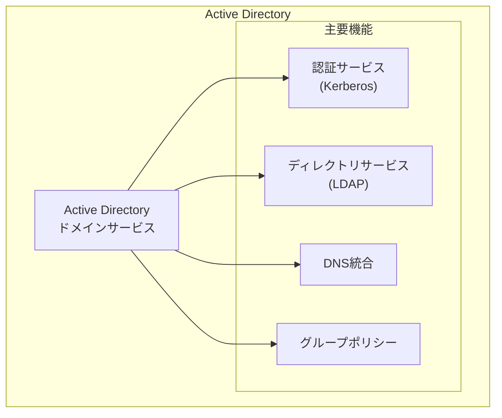

**主な特徴**:

- Windows Server上で動作
- Windows PCやサーバーの管理に最適化
- グループポリシー (GPO) でクライアント設定を集中管理
- 企業の標準的なID管理基盤として広く採用

### 歴史と発展

| バージョン              | リリース年 | 主な新機能                 |
| ----------------------- | ---------- | -------------------------- |
| **Windows 2000 Server** | 2000年     | Active Directory初登場     |
| **Windows Server 2003** | 2003年     | フォレスト機能レベルの導入 |
| **Windows Server 2008** | 2008年     | 読み取り専用DC (RODC)      |
| **Windows Server 2012** | 2012年     | 仮想化DC、動的アクセス制御 |
| **Windows Server 2016** | 2016年     | Azure AD統合強化           |
| **Windows Server 2019** | 2019年     | セキュリティ機能強化       |
| **Windows Server 2022** | 2021年     | ハイブリッドクラウド対応   |
| **Windows Server 2025** | 2024年     | 最新版                     |

### Active Directoryの位置づけ

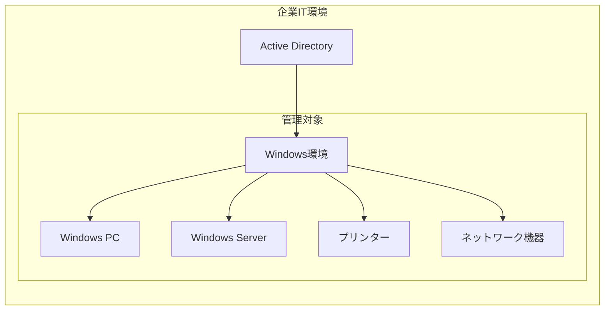

**企業での役割**:

- Windows環境の中核管理基盤
- ユーザー認証の中心
- セキュリティポリシーの配布拠点
- 組織構造の反映（部門、拠点）

---

## 🏗️ Active Directoryの主要概念

### ドメイン (Domain)

**ドメイン**は、Active Directoryの**セキュリティ境界**であり、**管理の基本単位**です。

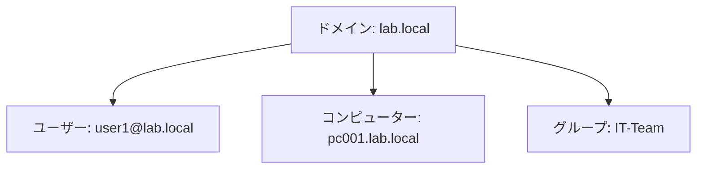

**ドメインの特徴**:

- 共通のディレクトリデータベースを持つ
- 統一されたセキュリティポリシー
- 同じドメイン名（例: `lab.local`, `company.com`）
- ユーザーは `ユーザー名@ドメイン名` で識別

**ドメイン名の例**:

- 内部ドメイン: `lab.local`, `internal.company.com`
- 外部ドメイン: `company.com` (公開DNSと分離推奨)

### フォレスト (Forest)

**フォレスト**は、複数のドメインを含む**最上位の管理境界**です。

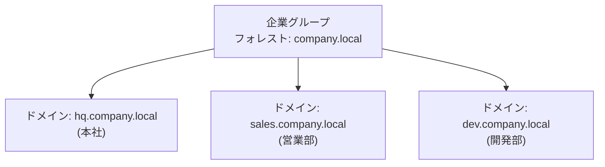

**フォレストの特徴**:

- 複数のドメインツリーを含む
- 共通のスキーマ（属性定義）
- 共通のグローバルカタログ
- ドメイン間で自動的にトラスト関係が構築される（推移的トラスト）

**フォレストを分ける理由**:

- 異なる組織（買収した会社、子会社）
- 異なるセキュリティ要件
- 政治的・地理的な分離

### ドメインコントローラー (DC: Domain Controller)

**ドメインコントローラー (DC)** は、**Active Directoryサービスを提供するサーバー**です。

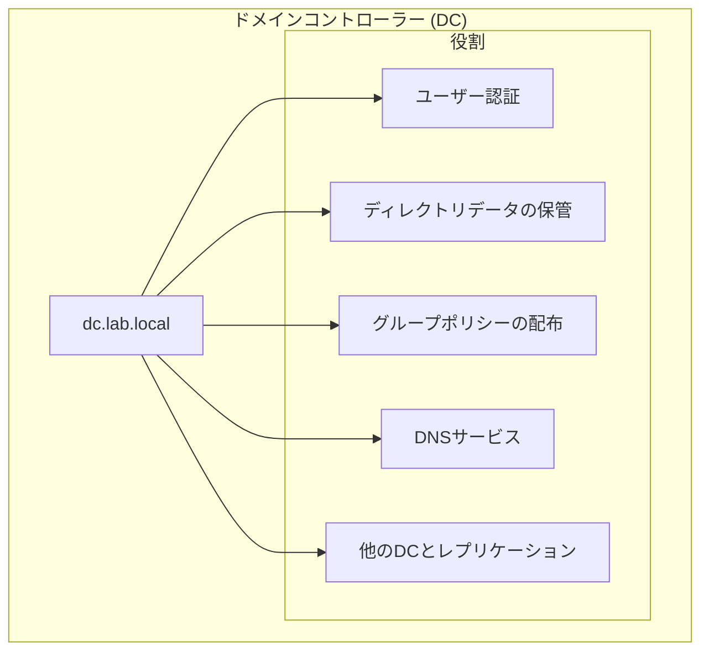

**DCの役割**:

1. **認証** - ユーザーのログインを処理
2. **ディレクトリサービス** - ユーザー、グループ、コンピューターの情報を保管
3. **GPO配布** - グループポリシーをクライアントに提供
4. **DNS** - ドメインのDNSサービス（通常は統合）
5. **レプリケーション** - 他のDCと情報を同期

**DCの冗長化**:

- 企業では通常2台以上のDCを配置
- 1台が障害でも他のDCで継続稼働
- 自動的にデータが同期される

**DCの配置例**:

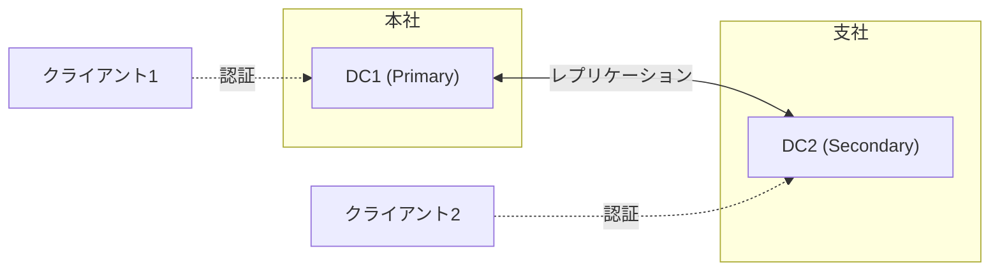

### 組織単位 (OU: Organizational Unit)

**OU (Organizational Unit)** は、**オブジェクトをグループ化し、ポリシーを適用する単位**です。

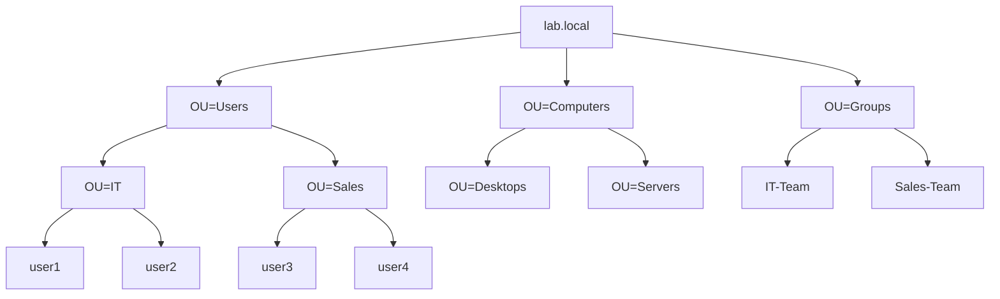

**OUの用途**:

- **組織構造の反映** - 部門、拠点、役職を階層化
- **GPOの適用単位** - OUに対してGPOを適用
- **管理権限の委任** - OUごとに管理者を割り当て
- **アカウント管理の整理** - ユーザー、コンピューター、グループを分類

**OU設計の例**:

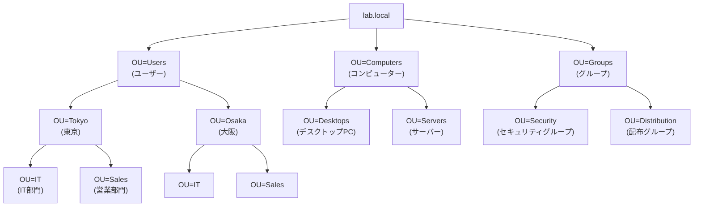

### グループポリシー (GPO: Group Policy Object)

**GPO**は、**Windows PCやサーバーに設定を配布する仕組み**です。

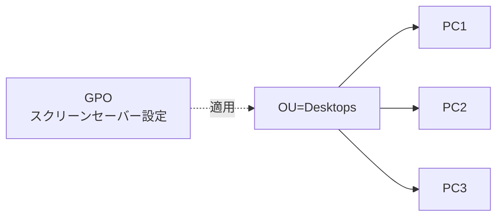

**GPOでできること**:

- デスクトップ設定（壁紙、スクリーンセーバー）
- セキュリティ設定（パスワードポリシー、ファイアウォール）
- ソフトウェアの自動インストール
- スクリプトの実行（ログイン時、起動時）
- レジストリ設定

**GPOの適用対象**:

- サイト
- ドメイン
- OU

**GPOの例**:

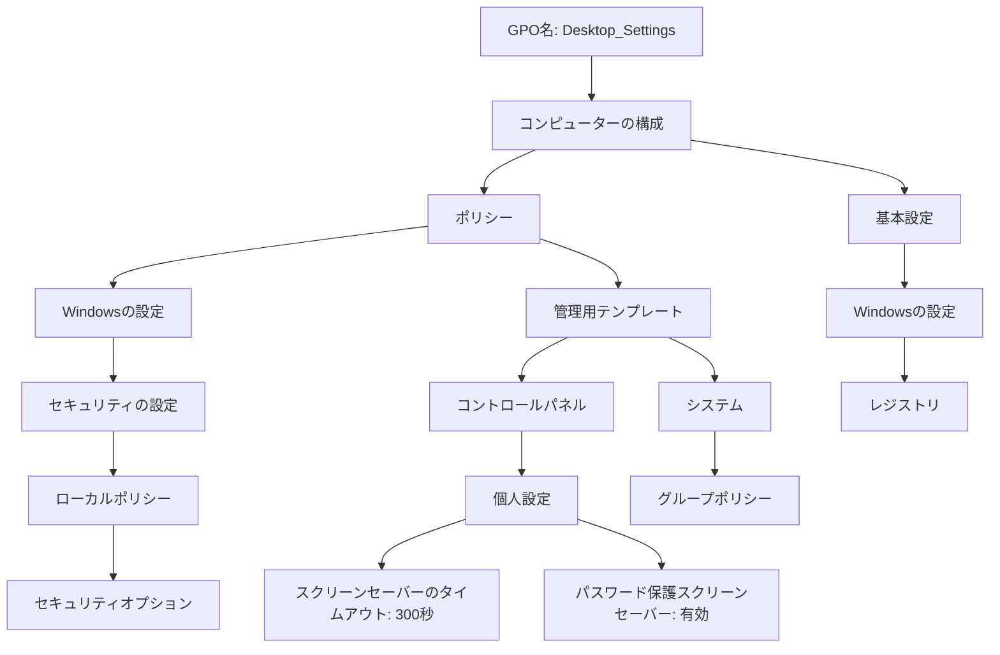

### FSMO (Flexible Single Master Operations)

**FSMO**は、特定のDCが担当する**5つの特別な役割**です。

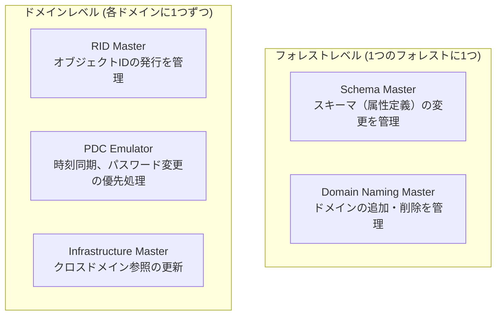

| 役割                      | スコープ   | 説明                                                                       |
| ------------------------- | ---------- | -------------------------------------------------------------------------- |
| **Schema Master**         | フォレスト | スキーマ（属性定義）の変更を管理。Exchange等のインストール時に必要         |
| **Domain Naming Master**  | フォレスト | ドメインの追加・削除を管理                                                 |
| **RID Master**            | ドメイン   | オブジェクトに一意のIDを発行するためのRIDプールを管理                      |
| **PDC Emulator**          | ドメイン   | 時刻同期のマスター、パスワード変更の優先処理、ダウンレベルクライアント対応 |
| **Infrastructure Master** | ドメイン   | クロスドメイン参照（他ドメインのオブジェクト）の更新                       |

**FSMOの重要性**:

- 通常は1台のDCが全てのFSMO役割を保持
- 障害時は他のDCに役割を移管（Seize）
- 定期的なバックアップが重要

---

## 👥 ユーザーとグループ

### ユーザーアカウント

**ユーザーアカウント**は、個人を識別し、認証するための情報です。

**主要な属性**:

| 属性                  | 説明                      | 例                                       |
| --------------------- | ------------------------- | ---------------------------------------- |
| **sAMAccountName**    | ログイン名（Windows形式） | `jdoe`                                   |
| **userPrincipalName** | ログイン名（メール形式）  | `jdoe@lab.local`                         |
| **cn (Common Name)**  | 表示名                    | `John Doe`                               |
| **givenName**         | 名                        | `John`                                   |
| **sn (surname)**      | 姓                        | `Doe`                                    |
| **mail**              | メールアドレス            | `john.doe@company.com`                   |
| **telephoneNumber**   | 電話番号                  | `+81-3-1234-5678`                        |
| **department**        | 部門                      | `IT部`                                   |
| **title**             | 役職                      | `システム管理者`                         |
| **manager**           | 上司                      | `CN=Jane Smith,OU=Users,DC=lab,DC=local` |

**アカウントの種類**:

- **通常のユーザーアカウント** - 個人用
- **管理者アカウント** - 管理者権限を持つ
- **サービスアカウント** - アプリケーション実行用
- **コンピューターアカウント** - コンピューターのドメイン参加用

### グループの種類

Active Directoryには**2種類のグループ**があります。

#### 1. セキュリティグループ

**用途**: アクセス権限の管理

**特徴**:

- ファイルやフォルダーへのアクセス許可
- グループポリシーの適用
- アプリケーションの権限管理

**例**:

- `IT-Team` - IT部門のメンバー
- `Sales-Managers` - 営業マネージャー
- `Server-Admins` - サーバー管理者

#### 2. 配布グループ

**用途**: メール配信リスト

**特徴**:

- メールの配信にのみ使用
- アクセス権限には使えない
- Exchange Serverで利用

**例**:

- `All-Employees@company.com`
- `IT-Dept@company.com`

### グループの使い分け

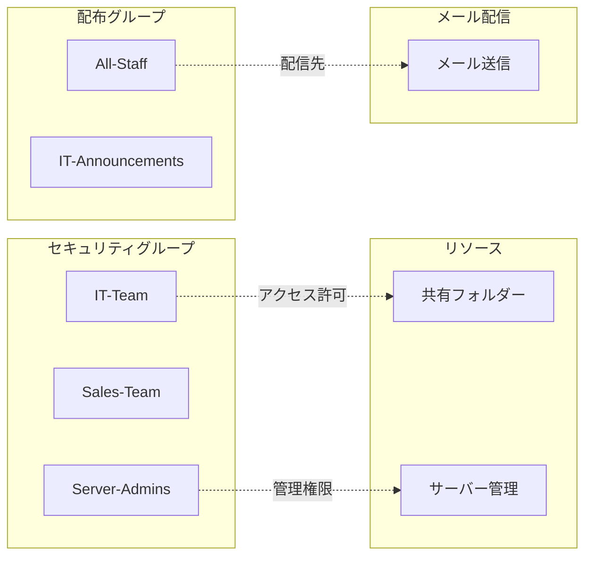

**ベストプラクティス**:

- **AGDLP戦略**:
  - **A**ccount (ユーザー) → **G**lobal Group → **D**omain Local Group → **P**ermission (権限)
- セキュリティグループは目的別に作成
- ネスト（グループのメンバーにグループを追加）を活用

---

## 📋 グループポリシー (GPO) 詳細

### GPOの適用範囲

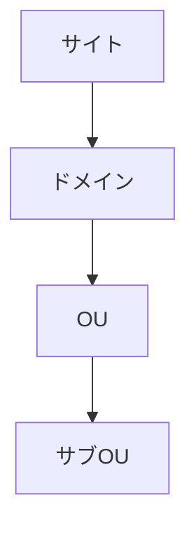

**適用順序**: サイト → ドメイン → OU → サブOU（LSDOU）

### GPOでできること

#### 1. セキュリティ設定

| 設定項目                   | 例                                 |
| -------------------------- | ---------------------------------- |
| **パスワードポリシー**     | 最小文字数、複雑さの要件、有効期限 |
| **アカウントロックアウト** | 失敗回数、ロック時間               |
| **ユーザー権利の割り当て** | ローカルログオン、バックアップ権限 |
| **セキュリティオプション** | UAC設定、ネットワークアクセス      |

#### 2. デスクトップ設定

| 設定項目               | 例                          |
| ---------------------- | --------------------------- |
| **壁紙**               | 企業ロゴの壁紙を統一        |
| **スクリーンセーバー** | 5分後に起動、パスワード保護 |
| **タスクバー**         | ピン留めアプリの統一        |
| **スタートメニュー**   | カスタマイズ                |

#### 3. ソフトウェアインストール

| 設定項目           | 例                             |
| ------------------ | ------------------------------ |
| **割り当て**       | ログイン時に自動インストール   |
| **発行**           | ユーザーが選択してインストール |
| **アップグレード** | 既存ソフトウェアの更新         |

#### 4. スクリプト

| 種類                         | 実行タイミング                 |
| ---------------------------- | ------------------------------ |
| **ログオンスクリプト**       | ユーザーログイン時             |
| **ログオフスクリプト**       | ユーザーログオフ時             |
| **起動スクリプト**           | コンピューター起動時           |
| **シャットダウンスクリプト** | コンピューターシャットダウン時 |

### GPOの処理順序

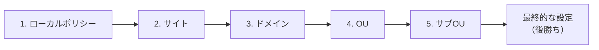

**重要な設定**:

- **強制 (Enforced)**: 子OUの設定を上書き
- **ブロック (Block Inheritance)**: 親からの継承を遮断
- **リンクの無効化**: GPOを一時的に無効化

---

## 🛠️ 管理ツール

### RSAT (Remote Server Administration Tools)

**RSAT**は、Windows PCからActive Directoryを管理するためのツール群です。

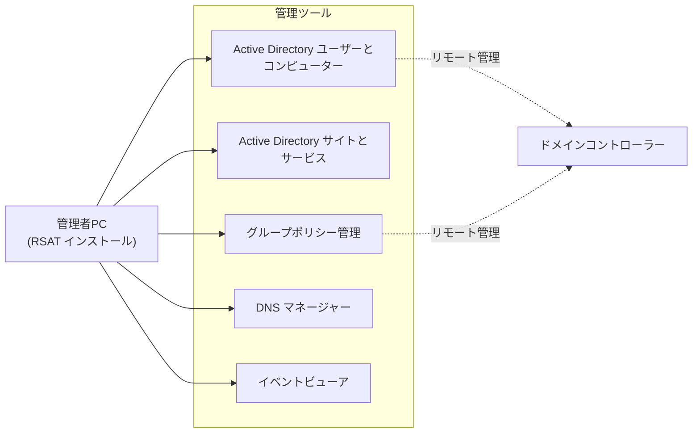

**主要ツール**:

| ツール名                                      | 用途                                       |
| --------------------------------------------- | ------------------------------------------ |
| **Active Directory ユーザーとコンピューター** | ユーザー/グループ/OU/コンピューターの管理  |
| **Active Directory サイトとサービス**         | サイト、サブネット、レプリケーションの管理 |
| **グループポリシー管理**                      | GPOの作成、編集、適用                      |
| **DNS マネージャー**                          | DNSゾーンとレコードの管理                  |
| **イベントビューア**                          | ログの確認                                 |
| **Active Directory 管理センター**             | PowerShell統合型の管理ツール               |

**RSATのインストール** (Windows 11):

```powershell
# オプション機能としてインストール
Get-WindowsCapability -Name RSAT* -Online | Add-WindowsCapability -Online

# または特定のツールのみ
Add-WindowsCapability -Online -Name "Rsat.ActiveDirectory.DS-LDS.Tools~~~~0.0.1.0"
```

### PowerShellでの管理

**Active Directory PowerShellモジュール**を使用した管理操作。

#### ユーザー管理

```powershell
# ユーザー一覧取得
Get-ADUser -Filter *

# 特定のユーザー検索
Get-ADUser -Identity "jdoe"
Get-ADUser -Filter "Name -like '*John*'"

# ユーザー作成
New-ADUser -Name "John Doe" `
    -GivenName "John" `
    -Surname "Doe" `
    -SamAccountName "jdoe" `
    -UserPrincipalName "jdoe@lab.local" `
    -Path "OU=IT,OU=Users,DC=lab,DC=local" `
    -AccountPassword (ConvertTo-SecureString "P@ssw0rd123!" -AsPlainText -Force) `
    -Enabled $true

# ユーザー変更
Set-ADUser -Identity "jdoe" -Department "IT" -Title "System Administrator"

# ユーザー削除
Remove-ADUser -Identity "jdoe" -Confirm:$false
```

#### グループ管理

```powershell
# グループ一覧
Get-ADGroup -Filter *

# グループ作成
New-ADGroup -Name "IT-Team" `
    -GroupScope Global `
    -GroupCategory Security `
    -Path "OU=Groups,DC=lab,DC=local"

# グループにメンバー追加
Add-ADGroupMember -Identity "IT-Team" -Members "jdoe"

# グループメンバー一覧
Get-ADGroupMember -Identity "IT-Team"

# ユーザーが所属するグループ一覧
Get-ADPrincipalGroupMembership -Identity "jdoe"
```

#### GPO管理

```powershell
# GPO一覧
Get-GPO -All

# GPO作成
New-GPO -Name "Desktop Settings"

# GPOをOUにリンク
New-GPLink -Name "Desktop Settings" -Target "OU=Desktops,OU=Computers,DC=lab,DC=local"

# GPOの詳細情報
Get-GPOReport -Name "Desktop Settings" -ReportType Html -Path "C:\Temp\GPOReport.html"
```

---

## 🔒 セキュリティ機能

### 認証とアクセス制御

**認証方式**:

- **Kerberos** - デフォルトの認証プロトコル
- **NTLM** - レガシー環境用（後方互換性）

**アクセス制御**:

- **ACL (Access Control List)** - オブジェクトごとのアクセス許可
- **セキュリティグループ** - グループ単位での権限管理
- **継承** - 親フォルダーから子フォルダーへの権限継承

### パスワードポリシー

**ドメインレベルのパスワードポリシー**:

| 設定項目                     | 推奨値        | 説明                                           |
| ---------------------------- | ------------- | ---------------------------------------------- |
| **最小パスワード長**         | 12文字以上    | パスワードの最小文字数                         |
| **パスワードの複雑さの要件** | 有効          | 大文字、小文字、数字、記号を含む               |
| **パスワードの有効期間**     | 90日          | パスワードの有効日数                           |
| **パスワードの履歴**         | 24個          | 再利用できないパスワードの数                   |
| **最小パスワード使用期間**   | 1日           | パスワード変更後、次回変更可能になるまでの期間 |
| **アカウントロックアウト**   | 5回失敗で30分 | ログイン失敗回数とロック時間                   |

**細かい制御 (Fine-Grained Password Policy)**:

- ドメイン機能レベル 2008以上で利用可能
- グループやユーザー単位で異なるパスワードポリシーを適用

### 監査とログ

**監査ポリシー**:

| 監査項目                 | 用途                                   |
| ------------------------ | -------------------------------------- |
| **ログオンイベント**     | ユーザーのログイン/ログアウトを記録    |
| **アカウント管理**       | ユーザー作成、削除、変更を記録         |
| **オブジェクトアクセス** | ファイル、フォルダーへのアクセスを記録 |
| **ポリシーの変更**       | GPOやセキュリティポリシーの変更を記録  |
| **特権の使用**           | 管理者権限の使用を記録                 |

**ログの場所**:

- **セキュリティログ** - イベントビューア > Windowsログ > セキュリティ
- **ログのエクスポート**: PowerShellで自動化可能

```powershell
# セキュリティログのエクスポート
Get-EventLog -LogName Security -Newest 1000 | Export-Csv "C:\Temp\SecurityLog.csv"
```

---

## 🌐 ネットワークサービス

### DNS統合

Active DirectoryはDNSと密接に統合されています。

**DNS SRVレコード**:

| レコード                     | サービス       | 説明                       |
| ---------------------------- | -------------- | -------------------------- |
| **_ldap._tcp.lab.local**     | LDAP           | LDAPサーバーの場所         |
| **_kerberos._tcp.lab.local** | Kerberos       | Kerberosサーバーの場所     |
| **_kpasswd._tcp.lab.local**  | Kerberos       | パスワード変更サービス     |
| **_gc._tcp.lab.local**       | Global Catalog | グローバルカタログサーバー |

**動的DNS更新**:

- クライアントが自動的にDNSレコードを更新
- IPアドレス変更時も自動対応

### サイトとレプリケーション

**サイト**: 物理的な場所（本社、支社）を論理的に定義

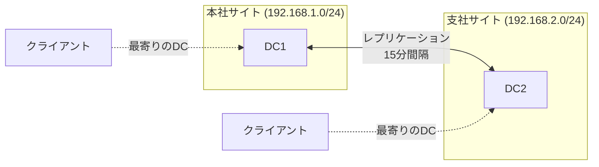

**レプリケーション**:

- **サイト内レプリケーション**: 15秒～数分間隔で高頻度
- **サイト間レプリケーション**: スケジュール設定可能（例: 15分～数時間間隔）
- **変更通知**: 重要な変更は即座にレプリケーション

---

## 📊 Active Directoryのメリットとデメリット

### メリット

| メリット               | 説明                                                     |
| ---------------------- | -------------------------------------------------------- |
| ✅ **Windowsとの統合**  | Windows環境でネイティブに動作、最適化されている          |
| ✅ **豊富なGPO機能**    | デスクトップからサーバーまで詳細な設定が可能             |
| ✅ **成熟した技術**     | 20年以上の実績、豊富なドキュメントとコミュニティ         |
| ✅ **幅広いサポート**   | ほとんどのエンタープライズアプリケーションがAD認証に対応 |
| ✅ **管理ツールの充実** | RSAT、PowerShell、サードパーティツールが豊富             |
| ✅ **Azure AD統合**     | クラウドとオンプレミスのハイブリッド環境に対応           |

### デメリット

| デメリット               | 説明                                     |
| ------------------------ | ---------------------------------------- |
| ❌ **Windowsに依存**      | Windows Server上でのみ動作（Samba4除く） |
| ❌ **ライセンスコスト**   | Windows Serverのライセンスが必要         |
| ❌ **Linux対応が限定的**  | GPOがLinuxに適用できない                 |
| ❌ **複雑な設計**         | 大規模環境では設計が複雑になる           |
| ❌ **レガシー技術の残存** | NTLM等の古い技術が残っている             |

---

## 🎯 ユースケース

### 適している環境

✅ **Windows PCが中心の企業**

- オフィスワーカーがWindows PCを使用
- Microsoft Office、Teamsなどを利用

✅ **集中管理が必要な環境**

- デスクトップ設定の統一
- ソフトウェアの自動配布
- セキュリティポリシーの徹底

✅ **ファイルサーバー、プリンター共有**

- Windowsファイルサーバーでの共有
- プリンターの一元管理

✅ **既存のWindowsインフラ**

- 既にWindows Serverを運用中
- Exchangeサーバー、SharePoint等を使用

### 適していない環境

❌ **Linuxサーバーが中心の環境**

- WebサーバーやDBサーバーがLinux
- GPOが適用できない

❌ **小規模すぎる環境**

- PC数台程度ではコストに見合わない
- クラウドサービス（Microsoft 365、Google Workspace）で十分

❌ **クラウドネイティブ環境**

- SaaS中心の環境
- オンプレミスサーバーを持たない

**解決策**: Active DirectoryとFreeIPAを組み合わせたハイブリッド環境

---

## 📚 関連ドキュメント

次に読むべきドキュメント：

| ドキュメント                    | 内容                                     |
| ------------------------------- | ---------------------------------------- |
| **03_freeipa.md**               | FreeIPAの詳細説明（Linux環境の管理）     |
| **04_samba4.md**                | Samba4の説明（本プロジェクトでのAD実装） |
| **05_core_technologies.md**     | LDAP、Kerberos、DNSの詳細                |
| **06_trust_and_integration.md** | AD-FreeIPA統合の詳細                     |

---

**作成日**: 2025年11月2日
**対象**: Active Directory初学者
**次のドキュメント**: 03_freeipa.md
