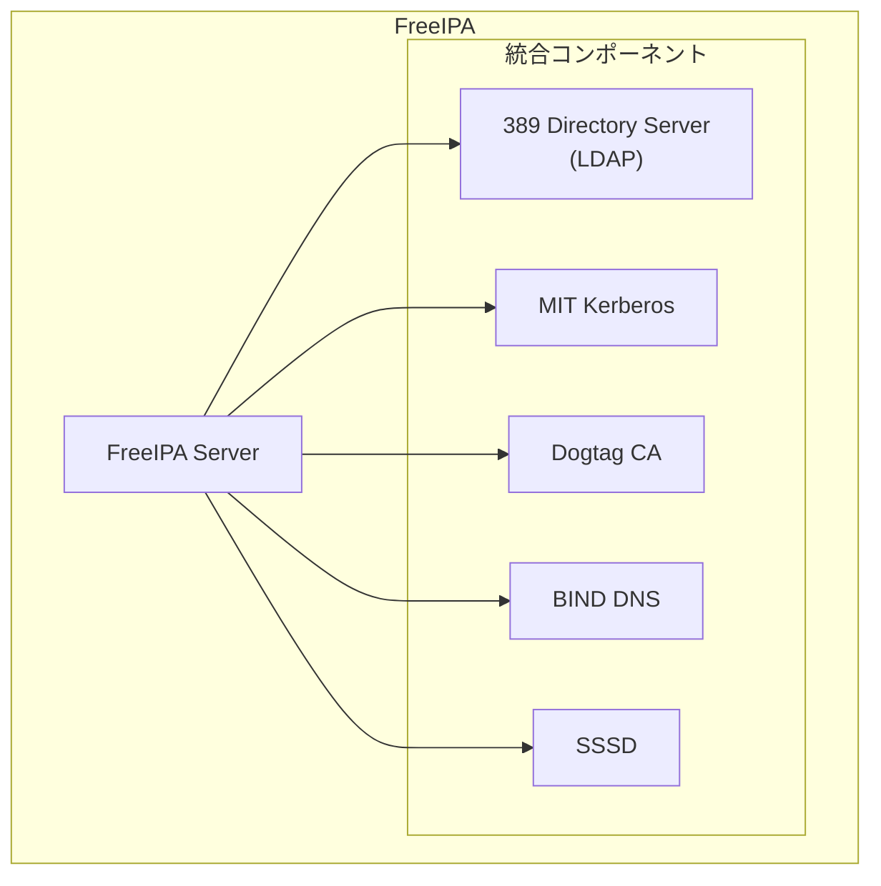
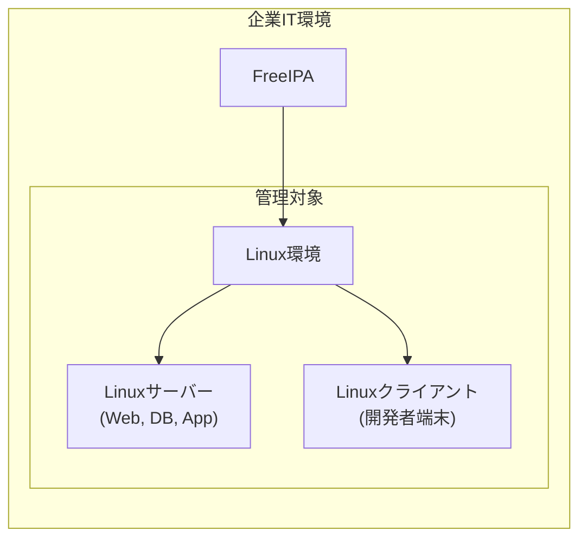
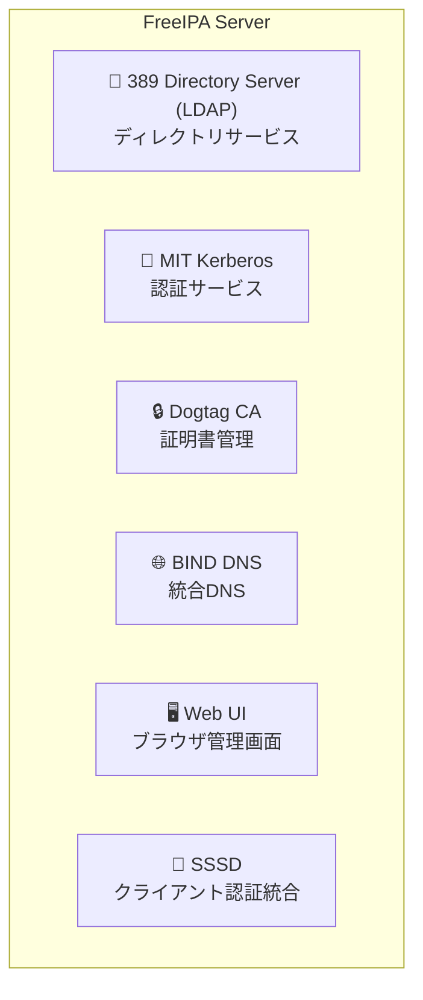
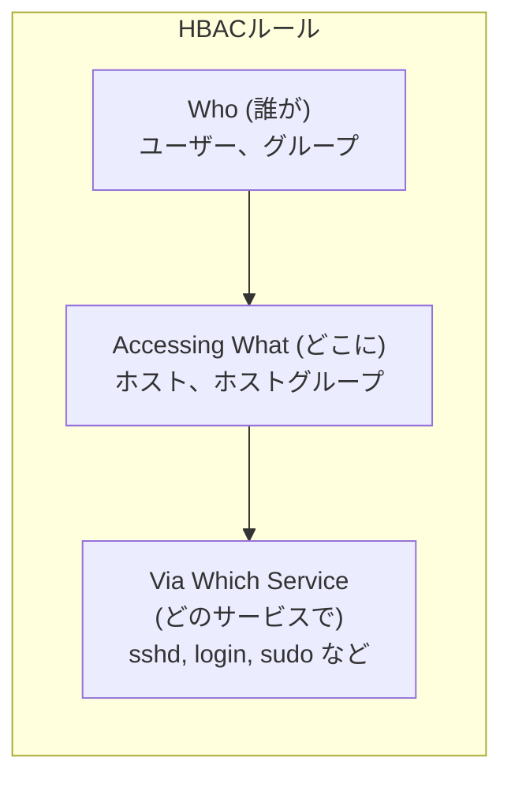
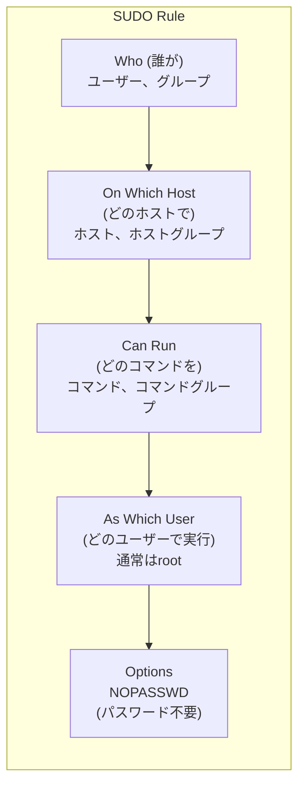
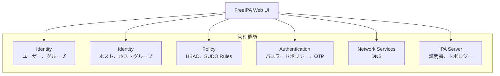
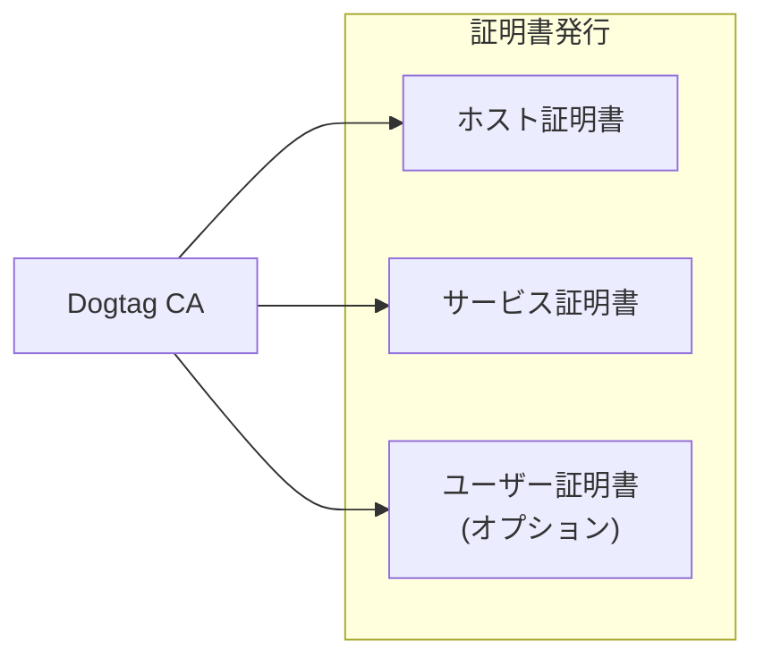
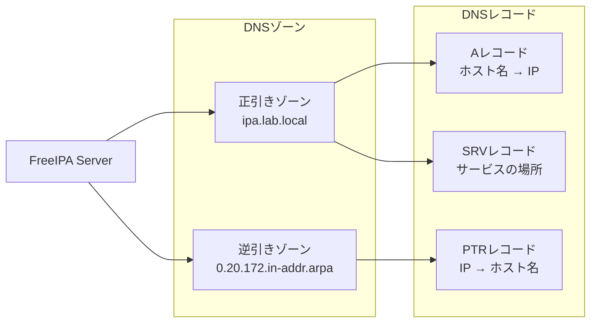
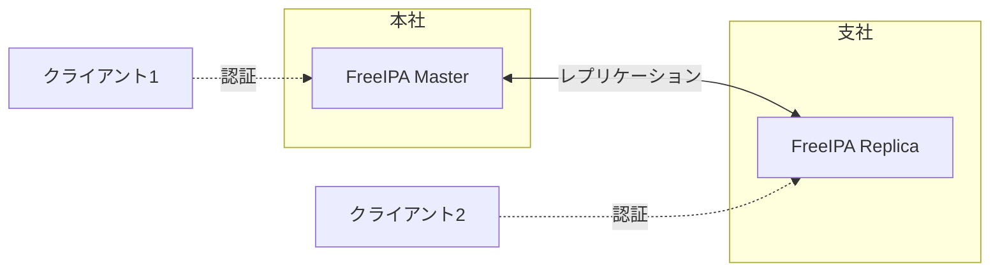

# FreeIPA 詳細説明

## 📋 目次

- [FreeIPA 詳細説明](#freeipa-詳細説明)
  - [📋 目次](#-目次)
  - [🎯 このドキュメントについて](#-このドキュメントについて)
  - [💡 FreeIPAとは](#-freeipaとは)
    - [概要](#概要)
    - [歴史と発展](#歴史と発展)
    - [FreeIPAの位置づけ](#freeipaの位置づけ)
  - [🏗️ FreeIPAのアーキテクチャ](#️-freeipaのアーキテクチャ)
    - [統合コンポーネント](#統合コンポーネント)
    - [コンポーネントの役割](#コンポーネントの役割)
      - [1. 389 Directory Server (LDAP)](#1-389-directory-server-ldap)
      - [2. MIT Kerberos](#2-mit-kerberos)
      - [3. Dogtag CA (Certificate Authority)](#3-dogtag-ca-certificate-authority)
      - [4. BIND DNS](#4-bind-dns)
      - [5. SSSD (System Security Services Daemon)](#5-sssd-system-security-services-daemon)
  - [🔑 FreeIPAの主要機能](#-freeipaの主要機能)
    - [HBAC (Host-Based Access Control)](#hbac-host-based-access-control)
    - [SUDO Rules](#sudo-rules)
    - [SELinux User Maps](#selinux-user-maps)
    - [SSH鍵管理](#ssh鍵管理)
  - [👥 ユーザーとグループ管理](#-ユーザーとグループ管理)
    - [ユーザーアカウント](#ユーザーアカウント)
    - [グループの種類](#グループの種類)
      - [1. ユーザーグループ](#1-ユーザーグループ)
      - [2. ホストグループ](#2-ホストグループ)
    - [ホストとホストグループ](#ホストとホストグループ)
  - [🛠️ 管理方法](#️-管理方法)
    - [Web UI](#web-ui)
    - [CLI (ipaコマンド)](#cli-ipaコマンド)
      - [ユーザー管理](#ユーザー管理)
      - [グループ管理](#グループ管理)
      - [ホスト管理](#ホスト管理)
      - [HBAC管理](#hbac管理)
      - [SUDO管理](#sudo管理)
  - [🔒 セキュリティ機能](#-セキュリティ機能)
    - [証明書管理 (Dogtag CA)](#証明書管理-dogtag-ca)
    - [OTP (ワンタイムパスワード)](#otp-ワンタイムパスワード)
    - [パスワードポリシー](#パスワードポリシー)
  - [🌐 ネットワーク統合](#-ネットワーク統合)
    - [DNS統合](#dns統合)
    - [レプリカとトポロジー](#レプリカとトポロジー)
  - [📊 FreeIPAのメリットとデメリット](#-freeipaのメリットとデメリット)
    - [メリット](#メリット)
    - [デメリット](#デメリット)
  - [🎯 ユースケース](#-ユースケース)
    - [適している環境](#適している環境)
    - [適していない環境](#適していない環境)
  - [🔄 Active Directoryとの比較](#-active-directoryとの比較)
  - [📚 関連ドキュメント](#-関連ドキュメント)

---

## 🎯 このドキュメントについて

このドキュメントは、**FreeIPA** の詳細な説明を提供します。

**対象読者**:

- FreeIPAを初めて学ぶ方
- Linux統合ID管理を理解したい方
- Linux環境の集中管理を担当する方

**読み終えた後にできること**:

- ✅ FreeIPAの主要機能を説明できる
- ✅ HBAC、SUDO Rulesの仕組みを理解できる
- ✅ FreeIPAの管理方法を把握できる
- ✅ Active Directoryとの違いを説明できる

---

## 💡 FreeIPAとは

### 概要

**FreeIPA** は、Red Hatが開発した**Linux統合ID管理システム**です。



**主な特徴**:

- Linux (RHEL系) 上で動作
- Linuxサーバー/クライアントの管理に最適化
- オープンソース（無料）
- 複数のOSSコンポーネントを統合した包括的なソリューション
- Web UIとCLIの両方で管理可能

**FreeIPAの意味**:

- **Free** - オープンソース、無料
- **I**dentity - アイデンティティ管理
- **P**olicy - ポリシー管理
- **A**udit - 監査

### 歴史と発展

| バージョン       | リリース年 | 主な新機能                           |
| ---------------- | ---------- | ------------------------------------ |
| **FreeIPA 1.0**  | 2008年     | 初回リリース                         |
| **FreeIPA 2.0**  | 2011年     | Web UI刷新、DNSSECサポート           |
| **FreeIPA 3.0**  | 2013年     | AD Trust（Active Directory統合）     |
| **FreeIPA 4.0**  | 2014年     | トポロジー管理、OTP認証              |
| **FreeIPA 4.5**  | 2017年     | KRA (Key Recovery Authority)         |
| **FreeIPA 4.9**  | 2021年     | 健全性チェック機能                   |
| **FreeIPA 4.11** | 2023年     | セキュリティ強化、パフォーマンス改善 |

### FreeIPAの位置づけ



**企業での役割**:

- Linux環境の中核管理基盤
- Linuxサーバーの集中認証
- アクセス制御と権限管理
- SSH鍵と証明書の管理

---

## 🏗️ FreeIPAのアーキテクチャ

### 統合コンポーネント

FreeIPAは複数のOSSを統合しています：



### コンポーネントの役割

#### 1. 389 Directory Server (LDAP)

**役割**: ディレクトリサービス、データの保存

**特徴**:

- オープンソースのLDAPサーバー
- ユーザー、グループ、ホストの情報を保存
- 高速検索とレプリケーション

**保存される情報**:

- ユーザーアカウント
- グループメンバーシップ
- ホスト情報
- HBAC/SUDO Rules
- 証明書

#### 2. MIT Kerberos

**役割**: 認証サービス

**特徴**:

- チケットベースの認証
- シングルサインオン（SSO）
- Active Directoryとの相互運用性

**提供するサービス**:

- KDC (Key Distribution Center)
- TGT (Ticket Granting Ticket) 発行
- サービスチケット発行

#### 3. Dogtag CA (Certificate Authority)

**役割**: 証明書管理

**特徴**:

- 内蔵の認証局
- SSL/TLS証明書の自動発行
- ホストとサービスの証明書管理

**提供する証明書**:

- ホスト証明書（自動更新）
- サービス証明書（HTTPS、LDAPS等）
- ユーザー証明書（オプション）

#### 4. BIND DNS

**役割**: DNSサービス

**特徴**:

- 統合DNSサーバー
- 動的DNS更新
- DNSSECサポート

**管理するレコード**:

- Aレコード（ホスト名 → IPアドレス）
- PTRレコード（IPアドレス → ホスト名）
- SRVレコード（サービスの場所）

#### 5. SSSD (System Security Services Daemon)

**役割**: クライアント側の認証統合

**特徴**:

- FreeIPAとクライアント間のブリッジ
- キャッシュによるオフライン認証
- NSS/PAM統合

**提供する機能**:

- ユーザー情報の取得（NSS）
- 認証処理（PAM）
- キャッシング（オフライン時も動作）

---

## 🔑 FreeIPAの主要機能

### HBAC (Host-Based Access Control)

**HBAC**は、**どのユーザーがどのホストにアクセスできるか**を制御します。



**HBACルールの構成要素**:

| 要素                  | 説明                      | 例                           |
| --------------------- | ------------------------- | ---------------------------- |
| **Who**               | どのユーザー/グループ     | `developers` グループ        |
| **Accessing What**    | どのホスト/ホストグループ | `dev_servers` ホストグループ |
| **Via Which Service** | どのサービス              | `sshd`, `login`, `sudo`      |

**HBACルールの例**:

**シナリオ**: 開発者グループが開発サーバーにSSHアクセス可能

```bash
# HBACルールの作成
ipa hbacrule-add developers_ssh_access

# ユーザー/グループの追加
ipa hbacrule-add-user developers_ssh_access --groups=developers

# ホスト/ホストグループの追加
ipa hbacrule-add-host developers_ssh_access --hostgroups=dev_servers

# サービスの追加
ipa hbacrule-add-service developers_ssh_access --hbacsvcs=sshd

# ルールの有効化
ipa hbacrule-enable developers_ssh_access
```

**デフォルトルール**:

- `allow_all` - すべてのユーザーが全ホストにアクセス可能（初期状態）
- 本番運用では無効化し、明示的なルールを作成

**HBACルールのテスト**:

```bash
# ユーザーがホストにアクセスできるかテスト
ipa hbactest --user=jdoe --host=dev-server01.ipa.lab.local --service=sshd
```

### SUDO Rules

**SUDO Rules**は、**sudoコマンドの実行権限**を集中管理します。



**SUDO Ruleの構成要素**:

| 要素              | 説明                      | 例                                         |
| ----------------- | ------------------------- | ------------------------------------------ |
| **Who**           | どのユーザー/グループ     | `sysadmins` グループ                       |
| **On Which Host** | どのホスト/ホストグループ | `all_servers` ホストグループ               |
| **Can Run**       | どのコマンド              | すべて (`--cmdcat=all`) または特定コマンド |
| **As Which User** | 実行ユーザー              | `root`                                     |
| **Options**       | オプション                | `NOPASSWD` (パスワード不要)                |

**SUDO Ruleの例**:

**シナリオ1**: システム管理者が全サーバーで全コマンドをsudo実行可能

```bash
# SUDO Ruleの作成
ipa sudorule-add sysadmin_all

# ユーザー/グループの追加
ipa sudorule-add-user sysadmin_all --groups=sysadmins

# ホスト/ホストグループの追加
ipa sudorule-add-host sysadmin_all --hostgroups=all_servers

# すべてのコマンドを許可
ipa sudorule-mod sysadmin_all --cmdcat=all

# rootとして実行
ipa sudorule-mod sysadmin_all --runasusercat=all

# 有効化
ipa sudorule-enable sysadmin_all
```

**シナリオ2**: 特定のコマンドのみ許可

```bash
# SUDO Ruleの作成
ipa sudorule-add apache_restart

# グループの追加
ipa sudorule-add-user apache_restart --groups=webadmins

# ホストグループの追加
ipa sudorule-add-host apache_restart --hostgroups=web_servers

# 特定のコマンドのみ許可
ipa sudocmd-add /usr/bin/systemctl
ipa sudocmdgroup-add apache_cmds
ipa sudocmdgroup-add-member apache_cmds --sudocmds="/usr/bin/systemctl"
ipa sudorule-add-allow-command apache_restart --sudocmdgroups=apache_cmds

# パスワード不要
ipa sudorule-add-option apache_restart --sudooption="!authenticate"
```

### SELinux User Maps

**SELinux User Maps**は、FreeIPAユーザーとSELinuxユーザーのマッピングを管理します。

**用途**:

- SELinuxの強制モードでのアクセス制御
- ユーザーごとに異なるSELinuxコンテキストを適用

**例**:

```bash
# SELinux User Mapの作成
ipa selinuxusermap-add sysadmin_map --selinuxuser=staff_u:staff_r:staff_t:s0

# グループの追加
ipa selinuxusermap-add-user sysadmin_map --groups=sysadmins

# ホストグループの追加
ipa selinuxusermap-add-host sysadmin_map --hostgroups=all_servers
```

### SSH鍵管理

**FreeIPAでのSSH鍵管理**:

**機能**:

- ユーザーの公開鍵をFreeIPAに保存
- クライアントが自動的に鍵を取得
- 鍵の配布を自動化

**SSH鍵の登録**:

```bash
# ユーザーの公開鍵を追加
ipa user-mod jdoe --sshpubkey="ssh-rsa AAAAB3NzaC1yc2E... user@host"

# 複数の鍵を追加
ipa user-mod jdoe --sshpubkey="ssh-rsa KEY1..." --sshpubkey="ssh-rsa KEY2..."

# 鍵の確認
ipa user-show jdoe --all
```

**クライアント側の設定**:

```bash
# /etc/ssh/sshd_config
AuthorizedKeysCommand /usr/bin/sss_ssh_authorizedkeys
AuthorizedKeysCommandUser nobody
```

---

## 👥 ユーザーとグループ管理

### ユーザーアカウント

**ユーザーの主要属性**:

| 属性                 | 説明               | 例                   |
| -------------------- | ------------------ | -------------------- |
| **uid**              | ユーザーID         | `jdoe`               |
| **cn (Common Name)** | 表示名             | `John Doe`           |
| **givenname**        | 名                 | `John`               |
| **sn (surname)**     | 姓                 | `Doe`                |
| **mail**             | メールアドレス     | `jdoe@ipa.lab.local` |
| **uidNumber**        | UNIX UID           | `10001`              |
| **gidNumber**        | UNIX GID           | `10001`              |
| **homeDirectory**    | ホームディレクトリ | `/home/jdoe`         |
| **loginShell**       | ログインシェル     | `/bin/bash`          |

**ユーザーの作成**:

```bash
# Web UIまたはCLI
ipa user-add jdoe \
    --first=John \
    --last=Doe \
    --email=jdoe@ipa.lab.local \
    --shell=/bin/bash \
    --homedir=/home/jdoe \
    --password
```

**パスワードの設定**:

```bash
# 初回ログイン時に変更を強制
ipa user-mod jdoe --password

# パスワードの有効期限を設定
ipa pwpolicy-mod --maxlife=90
```

### グループの種類

FreeIPAには主に**2種類のグループ**があります。

#### 1. ユーザーグループ

**用途**: ユーザーをグループ化

**例**:

```bash
# グループの作成
ipa group-add developers --desc="Development Team"

# ユーザーの追加
ipa group-add-member developers --users=jdoe,jsmith

# グループの確認
ipa group-show developers
```

#### 2. ホストグループ

**用途**: ホスト（サーバー/クライアント）をグループ化

**例**:

```bash
# ホストグループの作成
ipa hostgroup-add dev_servers --desc="Development Servers"

# ホストの追加
ipa hostgroup-add-member dev_servers --hosts=dev-server01.ipa.lab.local,dev-server02.ipa.lab.local

# ホストグループの確認
ipa hostgroup-show dev_servers
```

### ホストとホストグループ

**ホストの登録**:

```bash
# ホストの追加
ipa host-add web-server01.ipa.lab.local --ip-address=172.20.0.100

# ホストの確認
ipa host-show web-server01.ipa.lab.local
```

**ホストのドメイン参加**:

```bash
# クライアント側で実行
ipa-client-install \
    --domain=ipa.lab.local \
    --server=ipa.ipa.lab.local \
    --realm=IPA.LAB.LOCAL \
    --principal=admin \
    --password=AdminPassword \
    --unattended
```

---

## 🛠️ 管理方法

### Web UI

**アクセス**:

<https://ipa.ipa.lab.local>

**ログイン**:

- ユーザー名: `admin`
- パスワード: インストール時に設定したパスワード

**主要機能**:



**Web UIの利点**:

- ✅ 直感的な操作
- ✅ 全機能にアクセス可能
- ✅ 初心者に優しい
- ✅ グラフィカルな表示

### CLI (ipaコマンド)

**基本的な使い方**:

```bash
# Kerberos認証
kinit admin

# コマンドの基本形式
ipa <オブジェクトタイプ>-<操作> <オブジェクト名> [オプション]
```

**よく使うコマンド**:

#### ユーザー管理

```bash
# ユーザー一覧
ipa user-find

# ユーザー検索
ipa user-find --login=j*

# ユーザー詳細
ipa user-show jdoe

# ユーザー作成
ipa user-add jdoe --first=John --last=Doe --email=jdoe@ipa.lab.local

# ユーザー変更
ipa user-mod jdoe --title="Senior Engineer"

# ユーザー削除
ipa user-del jdoe
```

#### グループ管理

```bash
# グループ一覧
ipa group-find

# グループ作成
ipa group-add developers

# メンバー追加
ipa group-add-member developers --users=jdoe

# メンバー削除
ipa group-remove-member developers --users=jdoe
```

#### ホスト管理

```bash
# ホスト一覧
ipa host-find

# ホスト作成
ipa host-add web-server01.ipa.lab.local --ip-address=172.20.0.100

# ホストグループ作成
ipa hostgroup-add web_servers

# ホストをホストグループに追加
ipa hostgroup-add-member web_servers --hosts=web-server01.ipa.lab.local
```

#### HBAC管理

```bash
# HBACルール一覧
ipa hbacrule-find

# HBACルール作成
ipa hbacrule-add developers_ssh

# ユーザーグループ追加
ipa hbacrule-add-user developers_ssh --groups=developers

# ホストグループ追加
ipa hbacrule-add-host developers_ssh --hostgroups=dev_servers

# サービス追加
ipa hbacrule-add-service developers_ssh --hbacsvcs=sshd

# ルール有効化
ipa hbacrule-enable developers_ssh

# テスト
ipa hbactest --user=jdoe --host=dev-server01.ipa.lab.local --service=sshd
```

#### SUDO管理

```bash
# SUDO Rule一覧
ipa sudorule-find

# SUDO Rule作成
ipa sudorule-add sysadmin_all

# ユーザーグループ追加
ipa sudorule-add-user sysadmin_all --groups=sysadmins

# ホストグループ追加
ipa sudorule-add-host sysadmin_all --hostgroups=all_servers

# すべてのコマンドを許可
ipa sudorule-mod sysadmin_all --cmdcat=all
```

**CLIの利点**:

- ✅ 自動化・スクリプト化が容易
- ✅ 高速な操作
- ✅ リモート実行が可能
- ✅ バッチ処理

---

## 🔒 セキュリティ機能

### 証明書管理 (Dogtag CA)

**FreeIPAの内蔵CA**:



**証明書の自動発行**:

- ホスト参加時に自動的にホスト証明書を発行
- サービス（HTTPS、LDAPS等）用の証明書
- 自動更新（certmongerデーモン）

**証明書の管理**:

```bash
# 証明書一覧
ipa cert-find

# ホストの証明書確認
ipa-getcert list

# 証明書の取得（手動）
ipa-getcert request -f /etc/pki/tls/certs/server.crt -k /etc/pki/tls/private/server.key -K HTTP/server.example.com
```

### OTP (ワンタイムパスワード)

**2要素認証（2FA）のサポート**:

**OTPトークンの追加**:

```bash
# ユーザーにOTPトークンを追加
ipa otptoken-add --owner=jdoe --type=totp --algorithm=sha1

# QRコードを表示（Google Authenticator等で読み取り）
ipa otptoken-show <token-id> --show-uri
```

**OTPでのログイン**:

```bash
# パスワード + OTPコードを入力
ssh jdoe@server.ipa.lab.local
Password: <password><OTP-code>
```

### パスワードポリシー

**グローバルパスワードポリシー**:

| 設定項目             | デフォルト | 説明                                             |
| -------------------- | ---------- | ------------------------------------------------ |
| **最小パスワード長** | 8文字      | パスワードの最小文字数                           |
| **パスワードの履歴** | 0          | 再利用できないパスワードの数                     |
| **最小クラス数**     | 0          | 文字クラス（大文字、小文字、数字、記号）の最小数 |
| **最大有効期間**     | 90日       | パスワードの有効日数                             |
| **最小有効期間**     | 1時間      | パスワード変更後、次回変更可能になるまでの期間   |
| **ログイン失敗回数** | 6回        | アカウントロックまでの失敗回数                   |
| **ロック時間**       | 600秒      | アカウントロックの時間                           |

**パスワードポリシーの変更**:

```bash
# グローバルポリシーの変更
ipa pwpolicy-mod --minlength=12 --minclasses=3 --maxlife=90

# グループ別のポリシー
ipa pwpolicy-add developers --minlength=14 --maxlife=60
```

---

## 🌐 ネットワーク統合

### DNS統合

**FreeIPAの統合DNS**:



**重要なSRVレコード**:

| レコード                         | サービス                |
| -------------------------------- | ----------------------- |
| **_ldap._tcp.ipa.lab.local**     | LDAPサーバー            |
| **_kerberos._tcp.ipa.lab.local** | Kerberosサーバー        |
| **_kerberos._udp.ipa.lab.local** | Kerberosサーバー（UDP） |
| **_kpasswd._tcp.ipa.lab.local**  | パスワード変更サービス  |

**DNSの管理**:

```bash
# DNSゾーンの確認
ipa dnszone-find

# Aレコードの追加
ipa dnsrecord-add ipa.lab.local web-server01 --a-rec=172.20.0.100

# PTRレコードの追加
ipa dnsrecord-add 0.20.172.in-addr.arpa 100 --ptr-rec=web-server01.ipa.lab.local

# SRVレコードの確認
ipa dnsrecord-find ipa.lab.local --name=_ldap._tcp
```

### レプリカとトポロジー

**FreeIPAレプリカ**: 高可用性のために複数のFreeIPAサーバーを配置



**レプリカの作成**:

```bash
# マスターサーバーで実行
ipa-replica-prepare ipa-replica.ipa.lab.local

# レプリカサーバーで実行
ipa-replica-install --setup-ca --setup-dns
```

**トポロジーの確認**:

```bash
# レプリケーション状態の確認
ipa topologysegment-find domain
ipa topologysegment-find ca

# レプリカの一覧
ipa server-find
```

---

## 📊 FreeIPAのメリットとデメリット

### メリット

| メリット                   | 説明                                   |
| -------------------------- | -------------------------------------- |
| ✅ **オープンソース・無料** | ライセンスコスト不要                   |
| ✅ **Linux最適化**          | Linuxサーバー/クライアントの管理に特化 |
| ✅ **統合ソリューション**   | LDAP、Kerberos、DNS、CAが一体化        |
| ✅ **証明書管理**           | 内蔵CAによる自動発行と更新             |
| ✅ **HBAC/SUDO Rules**      | きめ細かいアクセス制御と権限管理       |
| ✅ **Active Directory統合** | トラストによるAD連携                   |
| ✅ **Web UI**               | ブラウザから簡単管理                   |
| ✅ **RHEL互換性**           | Red Hat Enterprise Linuxで公式サポート |

### デメリット

| デメリット                 | 説明                                 |
| -------------------------- | ------------------------------------ |
| ❌ **Windowsに非対応**      | Windows PCの管理には向かない         |
| ❌ **GPO機能なし**          | グループポリシーの代替機能は限定的   |
| ❌ **学習コスト**           | Active Directoryとは異なる概念と操作 |
| ❌ **RHEL系に最適化**       | Ubuntu/Debianでは一部機能に制限      |
| ❌ **コミュニティサポート** | 商用サポートはRed Hatのみ            |

---

## 🎯 ユースケース

### 適している環境

✅ **Linuxサーバーが中心の環境**

- Webサーバー、DBサーバー、アプリサーバーがLinux
- 開発者がLinux端末を使用

✅ **アクセス制御が必要な環境**

- サーバーごとに異なるアクセス権限
- sudoコマンドの権限を細かく制御

✅ **証明書管理が必要**

- SSL/TLS証明書の自動発行と更新
- 内部CAで証明書管理

✅ **コスト削減**

- オープンソースでライセンス不要
- 小規模から大規模まで対応

### 適していない環境

❌ **Windows PCが中心の環境**

- オフィスワーカーがWindows PCを使用
- Microsoft Office、Teamsが中心

❌ **デスクトップ設定の統一が必要**

- GPOのようなデスクトップポリシー配布が必要
- Windows環境の細かい制御

❌ **Exchangeサーバー等の統合**

- Microsoft製品との深い統合が必要

**解決策**: FreeIPAとActive Directoryを組み合わせたハイブリッド環境

---

## 🔄 Active Directoryとの比較

| 項目                 | **Active Directory**    | **FreeIPA**                |
| -------------------- | ----------------------- | -------------------------- |
| **プラットフォーム** | Windows Server          | Linux（RHEL系推奨）        |
| **開発元**           | Microsoft（商用）       | Red Hat（オープンソース）  |
| **主な対象環境**     | Windows PC/サーバー     | Linuxサーバー/クライアント |
| **認証基盤**         | LDAP + Kerberos         | LDAP + Kerberos            |
| **ポリシー配布**     | GPO（グループポリシー） | HBAC、SUDO Rules           |
| **GUI管理ツール**    | RSAT（Windows専用）     | Web UI（ブラウザ）         |
| **証明書管理**       | AD CS（別サービス）     | Dogtag CA（統合）          |
| **DNS統合**          | あり                    | あり                       |
| **コスト**           | ライセンス必要          | 無料（オープンソース）     |
| **Linuxサポート**    | 限定的                  | ネイティブ                 |
| **Windowsサポート**  | ネイティブ              | 限定的（トラスト経由）     |

**相互運用性**:

- FreeIPAとActive Directory間でトラスト関係を構築可能
- ADユーザーがLinuxサーバー（FreeIPA管理）にログイン可能
- 統一されたアカウント管理とSSO

---

## 📚 関連ドキュメント

次に読むべきドキュメント：

| ドキュメント                    | 内容                                 |
| ------------------------------- | ------------------------------------ |
| **04_samba4.md**                | Samba4の説明（Active Directory実装） |
| **05_core_technologies.md**     | LDAP、Kerberos、DNSの詳細            |
| **06_trust_and_integration.md** | AD-FreeIPA統合の詳細                 |
| **07_enterprise_scenarios.md**  | 企業での実践シナリオ                 |

---

**作成日**: 2025年11月2日
**対象**: FreeIPA初学者
**次のドキュメント**: 04_samba4.md
