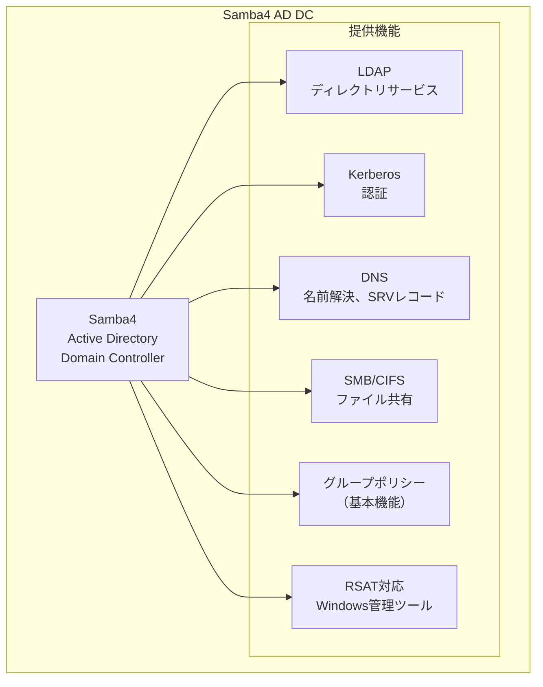
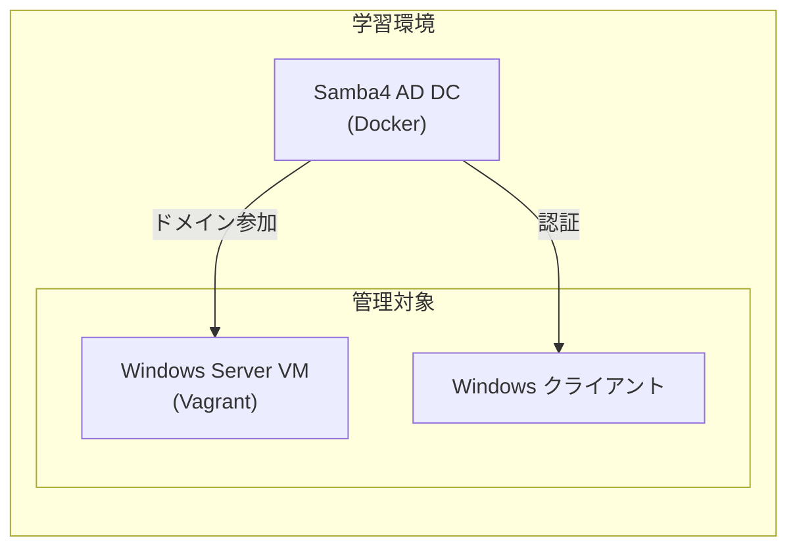
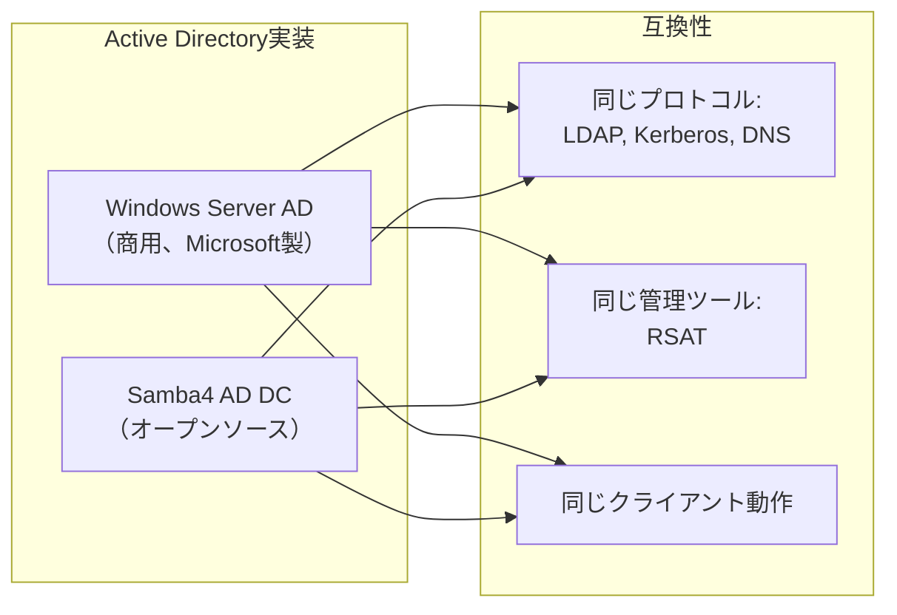
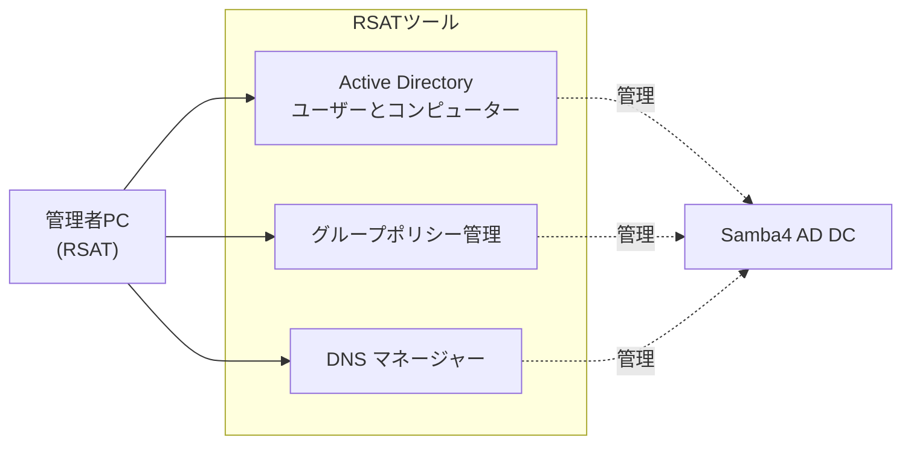

# Samba4 詳細説明

## 📋 目次

- [Samba4 詳細説明](#samba4-詳細説明)
  - [📋 目次](#-目次)
  - [🎯 このドキュメントについて](#-このドキュメントについて)
  - [💡 Samba4とは](#-samba4とは)
    - [概要](#概要)
    - [歴史と発展](#歴史と発展)
  - [🏗️ Samba4の位置づけ](#️-samba4の位置づけ)
    - [本プロジェクトでの役割](#本プロジェクトでの役割)
    - [Windows Server ADとの関係](#windows-server-adとの関係)
  - [🔑 Samba4 AD DCの機能](#-samba4-ad-dcの機能)
    - [提供する機能](#提供する機能)
    - [機能の詳細](#機能の詳細)
      - [1. ディレクトリサービス（LDAP）](#1-ディレクトリサービスldap)
      - [2. 認証サービス（Kerberos）](#2-認証サービスkerberos)
      - [3. DNS統合](#3-dns統合)
      - [4. グループポリシー（GPO）](#4-グループポリシーgpo)
      - [5. ファイル共有（SMB/CIFS）](#5-ファイル共有smbcifs)
  - [⚖️ Windows Server ADとSamba4の比較](#️-windows-server-adとsamba4の比較)
    - [サポートされる機能](#サポートされる機能)
    - [制限事項](#制限事項)
  - [🎓 学習環境でSamba4を使う理由](#-学習環境でsamba4を使う理由)
  - [🏢 本番環境でのSamba4利用](#-本番環境でのsamba4利用)
    - [適用シナリオ](#適用シナリオ)
    - [導入事例](#導入事例)
  - [🛠️ Samba4の管理](#️-samba4の管理)
    - [samba-toolコマンド](#samba-toolコマンド)
      - [ドメイン管理](#ドメイン管理)
      - [ユーザー管理](#ユーザー管理)
      - [グループ管理](#グループ管理)
      - [DNS管理](#dns管理)
      - [FSMO役割管理](#fsmo役割管理)
    - [RSATでの管理](#rsatでの管理)
  - [📊 Samba4のメリットとデメリット](#-samba4のメリットとデメリット)
    - [メリット](#メリット)
    - [デメリット](#デメリット)
  - [📚 関連ドキュメント](#-関連ドキュメント)

---

## 🎯 このドキュメントについて

このドキュメントは、**Samba4** の詳細な説明を提供します。

**対象読者**:

- Samba4を初めて学ぶ方
- Active Directoryをオープンソースで実装したい方
- 学習環境の構築を検討している方

**読み終えた後にできること**:

- ✅ Samba4とは何かを説明できる
- ✅ Windows Server ADとの違いを理解できる
- ✅ 学習環境でSamba4を使う理由を説明できる
- ✅ Samba4の制限事項を把握できる

---

## 💡 Samba4とは

### 概要

**Samba4** は、オープンソースの**Active Directory実装**です。



**主な特徴**:

- Linux上でActive Directoryドメインコントローラーを実現
- Windows Server ADとの高い互換性
- オープンソース（GPLv3ライセンス）
- Windows管理ツール（RSAT）で管理可能

**Samba4の意味**:

- **Samba** - SMB/CIFSプロトコルの実装プロジェクト名
- **4** - バージョン4（AD機能が追加されたメジャーバージョン）

### 歴史と発展

| バージョン     | リリース年 | 主な新機能                                 |
| -------------- | ---------- | ------------------------------------------ |
| **Samba 1.0**  | 1992年     | SMB/CIFS実装、ファイル共有                 |
| **Samba 2.0**  | 1999年     | NT4ドメインコントローラー                  |
| **Samba 3.0**  | 2003年     | Active Directoryメンバーサーバー           |
| **Samba 4.0**  | 2012年     | **Active Directoryドメインコントローラー** |
| **Samba 4.5**  | 2016年     | AD Forest機能レベル2008 R2                 |
| **Samba 4.10** | 2019年     | パフォーマンス改善                         |
| **Samba 4.15** | 2021年     | セキュリティ強化                           |
| **Samba 4.19** | 2023年     | AD Forest機能レベル2016                    |

**重要なマイルストーン**:

- **2012年**: Samba 4.0でADドメインコントローラー機能が追加
- これにより、Linux上でWindows Server ADと互換性のあるドメインコントローラーを構築可能に

---

## 🏗️ Samba4の位置づけ

### 本プロジェクトでの役割



**本プロジェクトでの位置づけ**:

1. **Active Directoryの学習環境** - Windows Server ADの代替として使用
2. **無料でADを構築** - ライセンスコスト不要
3. **Dockerで簡単構築** - コンテナで手軽に起動・破棄
4. **FreeIPAとのトラスト** - AD-FreeIPA統合の学習

### Windows Server ADとの関係



**互換性**:

- Samba4は**Windows Server ADの仕様に準拠**
- 同じプロトコル（LDAP、Kerberos）を使用
- Windows クライアントはSamba4とWindows Server ADを区別できない
- 同じ管理ツール（RSAT）で管理可能

---

## 🔑 Samba4 AD DCの機能

### 提供する機能

| 機能                 | サポート状況   | 説明                       |
| -------------------- | -------------- | -------------------------- |
| **LDAP**             | ✅ 完全サポート | ディレクトリサービス       |
| **Kerberos**         | ✅ 完全サポート | 認証サービス               |
| **DNS**              | ✅ 完全サポート | 統合DNS、SRVレコード       |
| **SMB/CIFS**         | ✅ 完全サポート | ファイル共有               |
| **RSAT管理**         | ✅ 完全サポート | Windows管理ツール対応      |
| **グループポリシー** | ⚠️ 部分サポート | 基本的なGPOのみ            |
| **レプリケーション** | ✅ 完全サポート | 複数DCのレプリケーション   |
| **トラスト**         | ✅ 完全サポート | 外部トラスト、Forest Trust |

### 機能の詳細

#### 1. ディレクトリサービス（LDAP）

**サポート内容**:

- ユーザー、グループ、コンピューターの管理
- 組織単位（OU）
- スキーマ拡張

**使用例**:

```bash
# ユーザー作成
samba-tool user create jdoe P@ssw0rd123!

# グループ作成
samba-tool group add IT-Team

# グループにユーザー追加
samba-tool group addmembers IT-Team jdoe
```

#### 2. 認証サービス（Kerberos）

**サポート内容**:

- Kerberos 5プロトコル
- TGT（Ticket Granting Ticket）発行
- サービスチケット発行
- シングルサインオン（SSO）

**動作確認**:

```bash
# Kerberosチケットの確認
klist

# Kerberos認証のテスト
kinit Administrator@LAB.LOCAL
```

#### 3. DNS統合

**サポート内容**:

- 動的DNS更新
- SRVレコード自動作成
- フォワーダー設定

**DNS管理**:

```bash
# DNSレコードの追加
samba-tool dns add dc.lab.local lab.local test A 192.168.1.100 -U Administrator

# DNSレコードの確認
samba-tool dns query dc.lab.local lab.local @ ALL -U Administrator
```

#### 4. グループポリシー（GPO）

**サポート内容**:

- GPOの作成と適用
- 基本的なポリシー設定
- セキュリティフィルタリング

**制限事項**:

- Windows Server ADの全GPO機能には非対応
- 複雑なGPO設定は動作しない場合あり
- クライアント側拡張（CSE）の一部が未実装

**サポートされるGPO例**:

- パスワードポリシー
- アカウントロックアウトポリシー
- ログオンスクリプト
- ドライブマッピング

**未サポートのGPO例**:

- ソフトウェアインストール
- フォルダーリダイレクト
- AppLocker
- 一部の高度なセキュリティ設定

#### 5. ファイル共有（SMB/CIFS）

**サポート内容**:

- Windows ファイル共有
- アクセス権限管理（ACL）
- 継承

**共有の作成**:

```bash
# 共有の作成
samba-tool ntacl sysvolreset
```

---

## ⚖️ Windows Server ADとSamba4の比較

### サポートされる機能

| 機能                       | Windows Server AD | Samba4 AD DC |
| -------------------------- | ----------------- | ------------ |
| **ドメインコントローラー** | ✅                 | ✅            |
| **ユーザー/グループ管理**  | ✅                 | ✅            |
| **LDAP/Kerberos/DNS**      | ✅                 | ✅            |
| **RSAT管理**               | ✅                 | ✅            |
| **ドメイン参加**           | ✅                 | ✅            |
| **レプリケーション**       | ✅                 | ✅            |
| **外部トラスト**           | ✅                 | ✅            |
| **Forest Trust**           | ✅                 | ✅            |
| **基本的なGPO**            | ✅                 | ✅            |
| **高度なGPO**              | ✅                 | ⚠️ 部分的     |
| **RODC**                   | ✅                 | ❌            |
| **AD RMS**                 | ✅                 | ❌            |
| **AD FS**                  | ✅                 | ❌            |
| **AD CS（証明書）**        | ✅                 | ❌            |

### 制限事項

**Samba4で未サポートの機能**:

| 機能                          | 影響                           | 回避策                   |
| ----------------------------- | ------------------------------ | ------------------------ |
| **RODC（読み取り専用DC）**    | 支社への配置が制限             | 通常のDCを配置           |
| **AD CS（証明書サービス）**   | 内部CAが使えない               | FreeIPA CA、外部CAを利用 |
| **AD FS（フェデレーション）** | SAML連携が制限                 | Keycloakなどを利用       |
| **高度なGPO**                 | 一部のポリシーが適用不可       | スクリプトで代替         |
| **DFS-R**                     | ファイルレプリケーションが制限 | rsyncなどで代替          |

---

## 🎓 学習環境でSamba4を使う理由

**学習環境でSamba4を選択する理由**:

| 理由                                | 説明                                       |
| ----------------------------------- | ------------------------------------------ |
| ✅ **無料**                          | ライセンスコスト不要、何度でも構築可能     |
| ✅ **軽量**                          | Dockerコンテナで動作、リソース消費が少ない |
| ✅ **簡単に構築**                    | docker-composeで数分で起動                 |
| ✅ **繰り返し可能**                  | 環境を破棄して再構築が容易                 |
| ✅ **Windows Server ADと高い互換性** | 実際のAD環境と同様の操作が可能             |
| ✅ **RSAT対応**                      | Windows Server ADと同じ管理ツールが使える  |
| ✅ **トラスト対応**                  | FreeIPAとのトラスト学習が可能              |

**学習に適している理由**:

- 失敗しても何度でもやり直せる
- コストを気にせず実験できる
- 本番環境に近い操作が学べる
- Docker環境で一貫した構築手順

**学習には十分な機能**:

- Active Directoryの基本概念
- ドメイン参加
- ユーザー/グループ管理
- 基本的なGPO
- トラスト構築

---

## 🏢 本番環境でのSamba4利用

### 適用シナリオ

**Samba4が本番環境で適している場合**:

✅ **小規模環境**

- ユーザー数: 10-100名程度
- Windows Server ライセンスコスト削減

✅ **基本的なAD機能のみ必要**

- ドメイン認証
- ファイル共有
- 基本的なグループポリシー

✅ **Linux環境との統合**

- LinuxサーバーとWindows PCの混在環境
- FreeIPAとのトラスト

✅ **教育機関、非営利団体**

- 予算が限られている
- 基本機能で十分

**Samba4が適していない場合**:

❌ **大規模企業環境**

- ユーザー数: 1000名以上
- 複雑なGPO要件

❌ **Microsoft製品との深い統合**

- Exchange Server
- SharePoint
- System Center

❌ **高度なAD機能が必要**

- AD CS（証明書サービス）
- AD FS（フェデレーション）
- 複雑なGPO

❌ **公式サポートが必要**

- SLA（サービスレベル契約）
- 24/7サポート

### 導入事例

**Samba4の導入実績**:

| 組織タイプ         | 用途                       | 規模            |
| ------------------ | -------------------------- | --------------- |
| **中小企業**       | ドメイン認証、ファイル共有 | 50-100ユーザー  |
| **教育機関**       | 学生アカウント管理         | 100-500ユーザー |
| **研究機関**       | Linuxサーバーとの統合      | 50-200ユーザー  |
| **NGO/非営利団体** | コスト削減                 | 20-100ユーザー  |

---

## 🛠️ Samba4の管理

### samba-toolコマンド

**Samba4専用の管理コマンド**:

#### ドメイン管理

```bash
# ドメインレベルの確認
samba-tool domain level show

# ドメイン情報
samba-tool domain info dc.lab.local
```

#### ユーザー管理

```bash
# ユーザー一覧
samba-tool user list

# ユーザー作成
samba-tool user create jdoe P@ssw0rd123!

# ユーザー削除
samba-tool user delete jdoe

# パスワードリセット
samba-tool user setpassword jdoe --newpassword=NewP@ss123!

# ユーザー有効化/無効化
samba-tool user enable jdoe
samba-tool user disable jdoe
```

#### グループ管理

```bash
# グループ一覧
samba-tool group list

# グループ作成
samba-tool group add IT-Team

# グループ削除
samba-tool group delete IT-Team

# メンバー追加
samba-tool group addmembers IT-Team jdoe,jsmith

# メンバー削除
samba-tool group removemembers IT-Team jdoe
```

#### DNS管理

```bash
# DNSゾーン一覧
samba-tool dns zonelist dc.lab.local -U Administrator

# DNSレコード追加
samba-tool dns add dc.lab.local lab.local server01 A 192.168.1.100 -U Administrator

# DNSレコード削除
samba-tool dns delete dc.lab.local lab.local server01 A 192.168.1.100 -U Administrator
```

#### FSMO役割管理

```bash
# FSMO役割の表示
samba-tool fsmo show

# FSMO役割の移管
samba-tool fsmo transfer --role=all
```

### RSATでの管理

**Samba4はRSAT（Windows管理ツール）で管理可能**:



**RSATでの操作**:

- Active Directory ユーザーとコンピューター
- グループポリシー管理
- DNS マネージャー
- Active Directory サイトとサービス

**Windows Server ADと同じ操作感**:

- ユーザー作成、編集、削除
- グループ管理
- OU作成と管理
- GPOの作成と適用

---

## 📊 Samba4のメリットとデメリット

### メリット

| メリット            | 説明                                      |
| ------------------- | ----------------------------------------- |
| ✅ **無料**          | オープンソース、ライセンスコスト不要      |
| ✅ **Linux上で動作** | Windows Serverが不要                      |
| ✅ **高い互換性**    | Windows Server ADとプロトコルレベルで互換 |
| ✅ **RSAT対応**      | Windows管理ツールで管理可能               |
| ✅ **学習に最適**    | 繰り返し構築・破棄が容易                  |
| ✅ **軽量**          | Dockerで動作、リソース消費が少ない        |
| ✅ **トラスト対応**  | FreeIPAやWindows Server ADとトラスト可能  |

### デメリット

| デメリット                    | 説明                                     |
| ----------------------------- | ---------------------------------------- |
| ❌ **GPO機能が限定的**         | 高度なGPO機能は未サポート                |
| ❌ **公式サポートなし**        | コミュニティサポートのみ                 |
| ❌ **一部機能未実装**          | RODC、AD CS、AD FSなど                   |
| ❌ **大規模環境には不向き**    | 1000ユーザー以上は要検証                 |
| ❌ **Microsoft製品統合に制限** | Exchange、SharePoint等との深い統合は制限 |

---

## 📚 関連ドキュメント

次に読むべきドキュメント：

| ドキュメント                    | 内容                      |
| ------------------------------- | ------------------------- |
| **05_core_technologies.md**     | LDAP、Kerberos、DNSの詳細 |
| **06_trust_and_integration.md** | トラストと統合の詳細      |
| **phase1_environment_setup.md** | Samba4の実際の構築手順    |

---

**作成日**: 2025年11月2日
**対象**: Samba4初学者
**次のドキュメント**: 05_core_technologies.md
