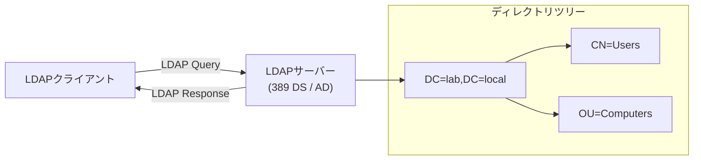
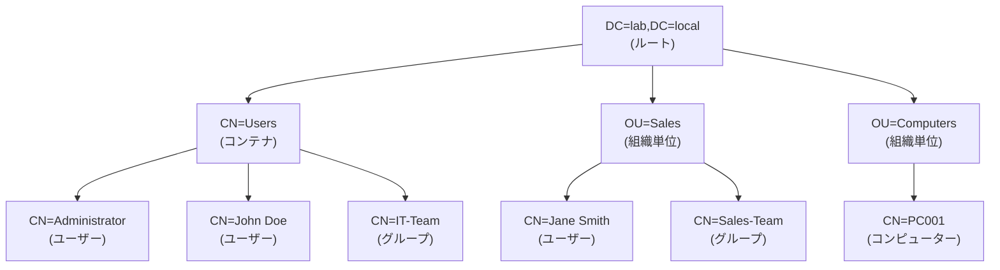
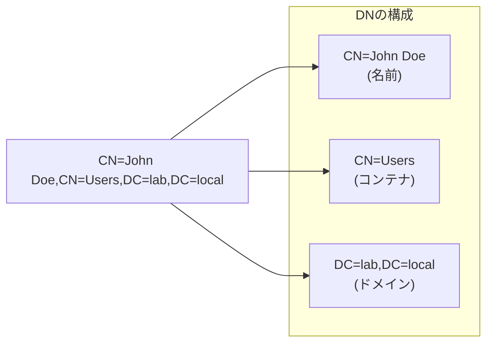
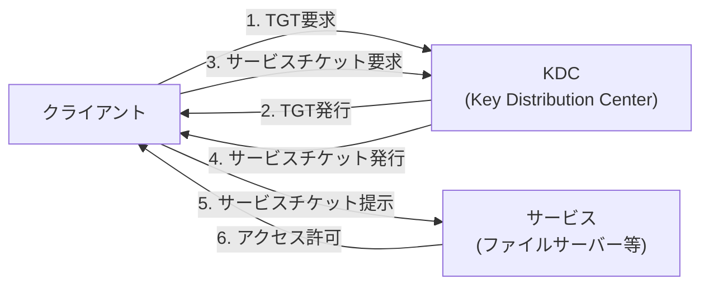
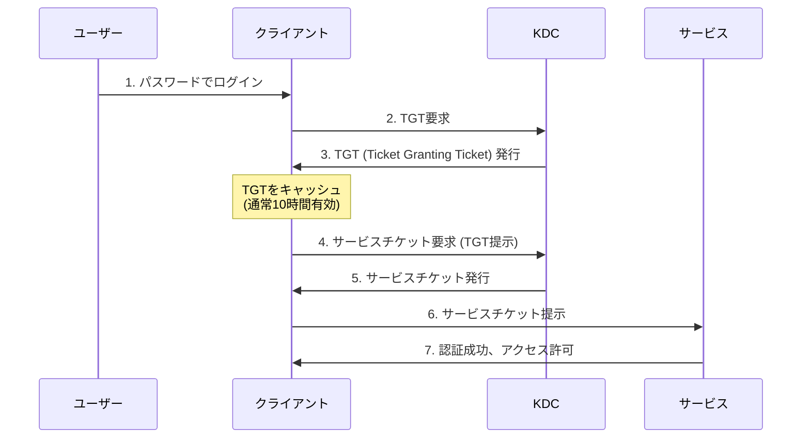
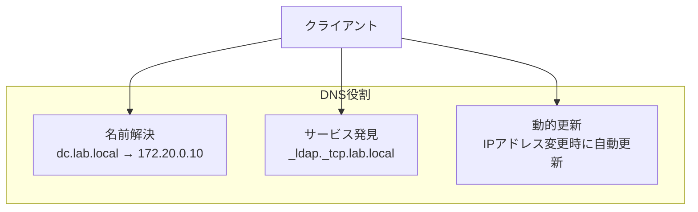
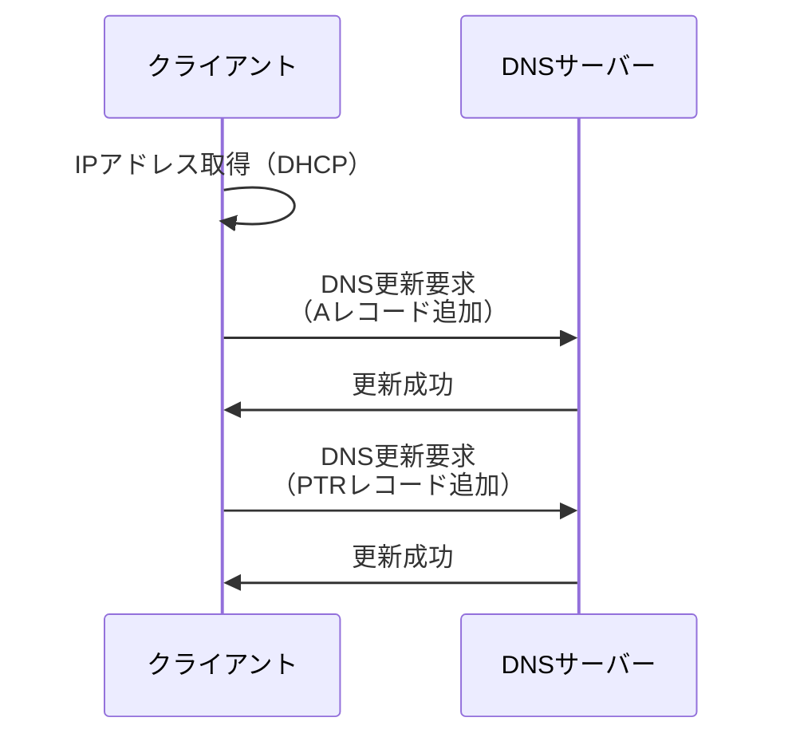
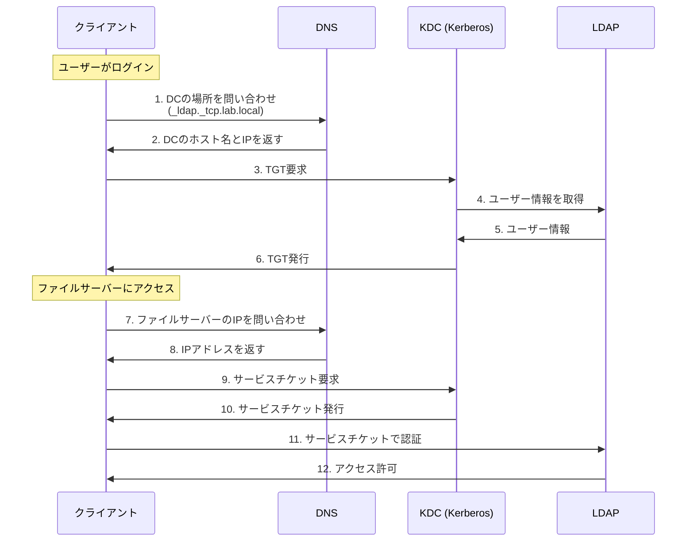

# コア技術詳細

## 📋 目次

- [コア技術詳細](#コア技術詳細)
  - [📋 目次](#-目次)
  - [🎯 このドキュメントについて](#-このドキュメントについて)
  - [📁 LDAP (Lightweight Directory Access Protocol)](#-ldap-lightweight-directory-access-protocol)
    - [LDAPとは](#ldapとは)
    - [ディレクトリツリー構造](#ディレクトリツリー構造)
    - [DN (Distinguished Name)](#dn-distinguished-name)
    - [主要な属性](#主要な属性)
    - [LDAP検索](#ldap検索)
    - [LDAPの操作](#ldapの操作)
  - [🔐 Kerberos](#-kerberos)
    - [Kerberosとは](#kerberosとは)
    - [Kerberos認証フロー](#kerberos認証フロー)
    - [Kerberosの主要概念](#kerberosの主要概念)
    - [Kerberosチケットの確認](#kerberosチケットの確認)
    - [Kerberosのセキュリティ](#kerberosのセキュリティ)
  - [🌐 DNS (Domain Name System)](#-dns-domain-name-system)
    - [DNSの役割](#dnsの役割)
    - [DNSレコードの種類](#dnsレコードの種類)
    - [Active DirectoryのDNS SRVレコード](#active-directoryのdns-srvレコード)
    - [DNS確認コマンド](#dns確認コマンド)
    - [動的DNS更新](#動的dns更新)
  - [🔗 3つの技術の連携](#-3つの技術の連携)
  - [📚 関連ドキュメント](#-関連ドキュメント)

---

## 🎯 このドキュメントについて

このドキュメントは、ドメイン管理の基盤となる**3つのコア技術**を詳しく説明します。

**対象読者**:

- LDAP、Kerberos、DNSの仕組みを理解したい方
- ドメイン管理の技術的な基礎を学びたい方
- トラブルシューティングに必要な知識を得たい方

**読み終えた後にできること**:

- ✅ LDAPのディレクトリ構造を理解できる
- ✅ Kerberos認証の流れを説明できる
- ✅ DNSの役割とSRVレコードを理解できる
- ✅ 3つの技術がどう連携するか説明できる

---

## 📁 LDAP (Lightweight Directory Access Protocol)

### LDAPとは

**LDAP**は、**ディレクトリサービスにアクセスするためのプロトコル**です。



**LDAPの特徴**:

- **階層構造**でデータを管理
- **読み取り最適化**（検索が高速）
- **標準化されたプロトコル**（異なる実装間でも互換性）
- **拡張可能なスキーマ**（属性を追加可能）

**LDAPサーバーの実装**:

- **389 Directory Server** - FreeIPAで使用
- **Active Directory** - Windows Server
- **OpenLDAP** - 汎用LDAPサーバー

### ディレクトリツリー構造

LDAPは**階層構造（ツリー）**でデータを管理します。



**構成要素**:

- **Root** - ツリーの最上位（ドメイン）
- **CN (Common Name)** - 一般的な名前（ユーザー、グループ、コンピューター）
- **OU (Organizational Unit)** - 組織単位
- **DC (Domain Component)** - ドメインの構成要素

### DN (Distinguished Name)

**DN**は、LDAPツリー内のオブジェクトを**一意に識別する名前**です。



**DNの例**:

```text
CN=John Doe,CN=Users,DC=lab,DC=local
└─┬─┘ └────┬────┘ └─────┬──────┘
  │        │             │
  名前   コンテナ      ドメイン
```

**DNの読み方**:

- **右から左**に読む（最下位から最上位へ）
- `DC=lab,DC=local` → `CN=Users` → `CN=John Doe`
- 意味: lab.localドメインのUsersコンテナにあるJohn Doeというオブジェクト

### 主要な属性

LDAPオブジェクトは**複数の属性**を持ちます。

**ユーザーオブジェクトの主要属性**:

| 属性名                | 説明                     | 例                                     |
| --------------------- | ------------------------ | -------------------------------------- |
| **cn**                | Common Name（名前）      | `John Doe`                             |
| **sAMAccountName**    | ログイン名（Windows）    | `jdoe`                                 |
| **userPrincipalName** | ログイン名（メール形式） | `jdoe@lab.local`                       |
| **mail**              | メールアドレス           | `john.doe@company.com`                 |
| **givenName**         | 名                       | `John`                                 |
| **sn**                | 姓（surname）            | `Doe`                                  |
| **displayName**       | 表示名                   | `John Doe`                             |
| **telephoneNumber**   | 電話番号                 | `+81-3-1234-5678`                      |
| **department**        | 部門                     | `IT`                                   |
| **title**             | 役職                     | `System Administrator`                 |
| **memberOf**          | 所属グループ             | `CN=IT-Team,OU=Groups,DC=lab,DC=local` |
| **objectClass**       | オブジェクトのクラス     | `user`, `person`, `top`                |

**グループオブジェクトの主要属性**:

| 属性名          | 説明                 | 例                                     |
| --------------- | -------------------- | -------------------------------------- |
| **cn**          | グループ名           | `IT-Team`                              |
| **member**      | メンバーのDN         | `CN=John Doe,CN=Users,DC=lab,DC=local` |
| **description** | 説明                 | `IT Department Members`                |
| **objectClass** | オブジェクトのクラス | `group`                                |

### LDAP検索

**LDAP検索フィルター**:

| フィルター           | 説明     | 例                                      |
| -------------------- | -------- | --------------------------------------- |
| `(属性=値)`          | 等価     | `(cn=John Doe)`                         |
| `(属性=値*)`         | 前方一致 | `(cn=John*)`                            |
| `(属性=*値)`         | 後方一致 | `(cn=*Doe)`                             |
| `(属性=*値*)`        | 部分一致 | `(cn=*John*)`                           |
| `(&(条件1)(条件2))`  | AND      | `(&(objectClass=user)(department=IT))`  |
| `(\|(条件1)(条件2))` | OR       | `(\|(department=IT)(department=Sales))` |
| `(!(条件))`          | NOT      | `(!(department=IT))`                    |

**ldapsearchコマンドの例**:

```bash
# 全ユーザーを検索
ldapsearch -x -H ldap://dc.lab.local \
  -D "CN=Administrator,CN=Users,DC=lab,DC=local" \
  -w "P@ssw0rd123!" \
  -b "DC=lab,DC=local" \
  "(objectClass=user)" cn sAMAccountName

# 特定の部門のユーザーを検索
ldapsearch -x -H ldap://dc.lab.local \
  -D "CN=Administrator,CN=Users,DC=lab,DC=local" \
  -w "P@ssw0rd123!" \
  -b "DC=lab,DC=local" \
  "(&(objectClass=user)(department=IT))" cn mail

# グループのメンバーを検索
ldapsearch -x -H ldap://dc.lab.local \
  -D "CN=Administrator,CN=Users,DC=lab,DC=local" \
  -w "P@ssw0rd123!" \
  -b "DC=lab,DC=local" \
  "(memberOf=CN=IT-Team,OU=Groups,DC=lab,DC=local)" cn
```

**オプションの説明**:

- `-x` - シンプル認証
- `-H` - LDAPサーバーのURI
- `-D` - バインドDN（認証ユーザー）
- `-w` - パスワード
- `-b` - ベースDN（検索の開始位置）

### LDAPの操作

**LDAP操作の種類**:

| 操作       | 説明 | コマンド例   |
| ---------- | ---- | ------------ |
| **Bind**   | 認証 | `ldapwhoami` |
| **Search** | 検索 | `ldapsearch` |
| **Add**    | 追加 | `ldapadd`    |
| **Modify** | 変更 | `ldapmodify` |
| **Delete** | 削除 | `ldapdelete` |

**LDIF (LDAP Data Interchange Format)**:

LDAPデータを表現するテキスト形式

```ldif
# ユーザーの追加
dn: CN=John Doe,CN=Users,DC=lab,DC=local
changetype: add
objectClass: user
objectClass: person
objectClass: top
cn: John Doe
sAMAccountName: jdoe
userPrincipalName: jdoe@lab.local
givenName: John
sn: Doe
```

---

## 🔐 Kerberos

### Kerberosとは

**Kerberos**は、**チケットベースの認証プロトコル**です。



**Kerberosの特徴**:

- **パスワードをネットワークに流さない**（安全）
- **シングルサインオン（SSO）**（一度ログインすれば他サービスにアクセス可能）
- **相互認証**（クライアントとサーバーの両方を認証）
- **タイムスタンプ**（リプレイ攻撃を防止）

### Kerberos認証フロー



**フローの詳細**:

1. **ユーザーログイン**
   - ユーザーがパスワードを入力
   - パスワードから暗号化鍵を生成

2. **TGT要求**
   - クライアントがKDCにTGTを要求
   - ユーザー名を送信（パスワードは送信しない）

3. **TGT発行**
   - KDCがTGT（Ticket Granting Ticket）を発行
   - TGTはユーザーの鍵で暗号化
   - 有効期限: 通常10時間

4. **サービスチケット要求**
   - クライアントがTGTをKDCに提示
   - アクセスしたいサービスを指定

5. **サービスチケット発行**
   - KDCがサービスチケットを発行
   - サービスの鍵で暗号化

6. **サービスへのアクセス**
   - クライアントがサービスチケットをサービスに提示
   - サービスがチケットを検証

7. **アクセス許可**
   - 認証成功
   - サービスへのアクセスが許可される

### Kerberosの主要概念

| 概念                              | 説明                                                       |
| --------------------------------- | ---------------------------------------------------------- |
| **KDC (Key Distribution Center)** | 認証サーバー。TGTとサービスチケットを発行                  |
| **TGT (Ticket Granting Ticket)**  | 初期認証チケット。他のサービスチケットを取得するために使用 |
| **サービスチケット**              | 特定のサービスにアクセスするためのチケット                 |
| **プリンシパル (Principal)**      | Kerberosで識別されるエンティティ（ユーザー、サービス）     |
| **レルム (Realm)**                | Kerberosドメイン（通常、ドメイン名を大文字にしたもの）     |
| **SPN (Service Principal Name)**  | サービスの識別子                                           |

**プリンシパル名の形式**:

| 種類         | 形式                     | 例                             |
| ------------ | ------------------------ | ------------------------------ |
| **ユーザー** | `username@REALM`         | `jdoe@LAB.LOCAL`               |
| **サービス** | `service/hostname@REALM` | `HTTP/web.lab.local@LAB.LOCAL` |

**レルム名**:

- Active Directory: `LAB.LOCAL`
- FreeIPA: `IPA.LAB.LOCAL`

### Kerberosチケットの確認

**Windows**:

```cmd
# チケット一覧
klist

# チケットの削除
klist purge

# チケットの詳細情報
klist -li 0x3e7
```

**Linux**:

```bash
# チケット一覧
klist

# チケットの削除
kdestroy

# 新しいチケットの取得
kinit jdoe@LAB.LOCAL

# チケットの更新
kinit -R
```

**klist出力例**:

```bash
Ticket cache: FILE:/tmp/krb5cc_1000
Default principal: jdoe@LAB.LOCAL

Valid starting     Expires            Service principal
11/02/25 10:00:00  11/02/25 20:00:00  krbtgt/LAB.LOCAL@LAB.LOCAL
 renew until 11/03/25 10:00:00
11/02/25 10:05:00  11/02/25 20:00:00  cifs/fileserver.lab.local@LAB.LOCAL
 renew until 11/03/25 10:00:00
```

**解説**:

- **TGT**: `krbtgt/LAB.LOCAL@LAB.LOCAL`
- **サービスチケット**: `cifs/fileserver.lab.local@LAB.LOCAL`
- **有効期限**: 20:00:00まで有効
- **更新期限**: 翌日10:00:00まで更新可能

### Kerberosのセキュリティ

**セキュリティ機能**:

| 機能               | 説明                                     |
| ------------------ | ---------------------------------------- |
| **暗号化**         | すべての通信が暗号化される               |
| **タイムスタンプ** | リプレイ攻撃を防止                       |
| **相互認証**       | クライアントとサーバーの両方を認証       |
| **有効期限**       | チケットには有効期限がある（通常10時間） |
| **更新期限**       | TGTは一定期間更新可能（通常7日間）       |

**時刻同期の重要性**:

- Kerberosは**タイムスタンプ**で認証を検証
- クライアントとサーバーの時刻差が**5分以上**あると認証失敗
- NTPで時刻同期が必須

**時刻確認**:

```bash
# 時刻の確認
date

# NTPサーバーとの同期状態
timedatectl status
```

---

## 🌐 DNS (Domain Name System)

### DNSの役割

**ドメイン管理におけるDNSの役割**:



**3つの主要な役割**:

1. **名前解決**
   - ホスト名 → IPアドレス
   - 例: `dc.lab.local` → `172.20.0.10`

2. **サービスの発見**
   - SRVレコードでサービスの場所を特定
   - 例: LDAPサーバー、Kerberosサーバーの場所

3. **動的更新**
   - クライアントが自動的にDNSレコードを更新
   - IPアドレス変更時も自動対応

### DNSレコードの種類

| レコードタイプ | 説明                            | 例                                          |
| -------------- | ------------------------------- | ------------------------------------------- |
| **A**          | ホスト名 → IPv4アドレス         | `dc.lab.local` → `172.20.0.10`              |
| **AAAA**       | ホスト名 → IPv6アドレス         | `dc.lab.local` → `2001:db8::1`              |
| **PTR**        | IPアドレス → ホスト名（逆引き） | `10.0.20.172.in-addr.arpa` → `dc.lab.local` |
| **CNAME**      | ホスト名のエイリアス            | `www` → `web-server01.lab.local`            |
| **MX**         | メールサーバー                  | `mail.lab.local` (優先度: 10)               |
| **SRV**        | サービスの場所                  | `_ldap._tcp.lab.local` → `dc.lab.local:389` |
| **TXT**        | テキスト情報                    | SPF、DKIM等                                 |

### Active DirectoryのDNS SRVレコード

**重要なSRVレコード**:

| レコード                   | サービス       | ポート | 説明                    |
| -------------------------- | -------------- | ------ | ----------------------- |
| `_ldap._tcp.lab.local`     | LDAP           | 389    | LDAPサーバーの場所      |
| `_ldaps._tcp.lab.local`    | LDAPS          | 636    | LDAP over SSL           |
| `_kerberos._tcp.lab.local` | Kerberos       | 88     | Kerberosサーバー（TCP） |
| `_kerberos._udp.lab.local` | Kerberos       | 88     | Kerberosサーバー（UDP） |
| `_kpasswd._tcp.lab.local`  | Kerberos       | 464    | パスワード変更サービス  |
| `_gc._tcp.lab.local`       | Global Catalog | 3268   | グローバルカタログ      |

**SRVレコードの形式**:

```bash
_service._proto.domain  TTL  class  SRV  priority  weight  port  target
_ldap._tcp.lab.local    600  IN     SRV  0         100     389   dc.lab.local.
```

**フィールドの説明**:

- **priority**: 優先度（低い方が優先）
- **weight**: 同じ優先度での重み付け
- **port**: サービスのポート番号
- **target**: サービスを提供するホスト名

### DNS確認コマンド

**Windows**:

```cmd
# ホスト名の名前解決
nslookup dc.lab.local

# SRVレコードの確認
nslookup -type=SRV _ldap._tcp.lab.local

# すべてのレコードタイプ
nslookup -type=ANY dc.lab.local

# 逆引き
nslookup 172.20.0.10

# DNSサーバーの指定
nslookup dc.lab.local 172.20.0.10
```

**Linux**:

```bash
# ホスト名の名前解決
dig dc.lab.local

# SRVレコードの確認
dig SRV _ldap._tcp.lab.local

# すべてのレコードタイプ
dig ANY dc.lab.local

# 逆引き
dig -x 172.20.0.10

# DNSサーバーの指定
dig @172.20.0.10 dc.lab.local

# 短い出力
dig +short dc.lab.local
```

### 動的DNS更新

**動的更新の仕組み**:



**動的更新の利点**:

- クライアントのIPアドレス変更に自動対応
- 手動でのDNSレコード管理が不要
- DHCP環境でも名前解決が可能

**動的更新の確認** (Windows):

```cmd
# クライアントのDNS登録を強制更新
ipconfig /registerdns

# DNSキャッシュのクリア
ipconfig /flushdns

# DNS設定の確認
ipconfig /all
```

---

## 🔗 3つの技術の連携

ドメイン管理では、LDAP、Kerberos、DNSが連携して動作します。



**連携のポイント**:

1. **DNS** - サービスの場所を発見
   - `_ldap._tcp.lab.local` でLDAPサーバーの場所を特定
   - `_kerberos._tcp.lab.local` でKDCの場所を特定

2. **Kerberos** - 認証を実行
   - ユーザーを認証
   - サービスチケットを発行

3. **LDAP** - ユーザー情報を提供
   - ユーザーの属性情報
   - グループメンバーシップ
   - アクセス権限

**3つの技術が連携する場面**:

| 場面                 | DNS                | Kerberos                     | LDAP                           |
| -------------------- | ------------------ | ---------------------------- | ------------------------------ |
| **ログイン**         | DCの場所を発見     | 認証を実行                   | ユーザー情報を提供             |
| **ファイルアクセス** | サーバーのIPを解決 | サービスチケット発行         | アクセス権限を確認             |
| **グループポリシー** | DCの場所を発見     | 認証                         | GPO情報を取得                  |
| **ドメイン参加**     | DCを発見           | コンピューターアカウント認証 | コンピューターオブジェクト作成 |

---

## 📚 関連ドキュメント

次に読むべきドキュメント：

| ドキュメント                      | 内容                   |
| --------------------------------- | ---------------------- |
| **06_trust_and_integration.md**   | トラストと統合の詳細   |
| **07_enterprise_scenarios.md**    | 企業での実践シナリオ   |
| **appendix_b_troubleshooting.md** | トラブルシューティング |

---

**作成日**: 2025年11月2日
**対象**: ドメイン管理の技術基盤を学ぶ方
**次のドキュメント**: 06_trust_and_integration.md
