# トラストと統合

## 📋 目次

- [トラストと統合](#トラストと統合)
  - [📋 目次](#-目次)
  - [🎯 このドキュメントについて](#-このドキュメントについて)
  - [💡 トラストとは](#-トラストとは)
    - [トラストの概念](#トラストの概念)
    - [トラストの目的](#トラストの目的)
  - [🔄 トラストの種類](#-トラストの種類)
    - [一方向トラスト](#一方向トラスト)
    - [双方向トラスト](#双方向トラスト)
    - [推移的トラスト](#推移的トラスト)
    - [外部トラスト](#外部トラスト)
  - [🔗 AD-FreeIPAトラスト](#-ad-freeipaトラスト)
    - [トラストの仕組み](#トラストの仕組み)
    - [実現されること](#実現されること)
      - [1. ADユーザーがLinuxサーバーにアクセス](#1-adユーザーがlinuxサーバーにアクセス)
      - [2. FreeIPAユーザーがWindowsリソースにアクセス（制限あり）](#2-freeipaユーザーがwindowsリソースにアクセス制限あり)
      - [3. 統一されたアカウント管理](#3-統一されたアカウント管理)
      - [4. シングルサインオン (SSO)](#4-シングルサインオン-sso)
    - [トラストの前提条件](#トラストの前提条件)
  - [🌐 クロスドメイン認証](#-クロスドメイン認証)
    - [認証フロー](#認証フロー)
    - [名前解決の仕組み](#名前解決の仕組み)
  - [🔐 シングルサインオン (SSO)](#-シングルサインオン-sso)
    - [SSOの仕組み](#ssoの仕組み)
    - [SSOのメリット](#ssoのメリット)
  - [🏗️ 企業でのトラスト設計パターン](#️-企業でのトラスト設計パターン)
    - [パターン1: Windows中心 + Linux統合](#パターン1-windows中心--linux統合)
    - [パターン2: Linux中心 + Windows統合](#パターン2-linux中心--windows統合)
    - [パターン3: 対等な統合](#パターン3-対等な統合)
  - [⚠️ トラストの制限事項](#️-トラストの制限事項)
  - [📚 関連ドキュメント](#-関連ドキュメント)

---

## 🎯 このドキュメントについて

このドキュメントは、**トラスト関係と統合**について詳しく説明します。

**対象読者**:

- トラストの仕組みを理解したい方
- AD-FreeIPA統合を学びたい方
- クロスドメイン認証を実装したい方

**読み終えた後にできること**:

- ✅ トラストの種類と違いを説明できる
- ✅ AD-FreeIPAトラストの仕組みを理解できる
- ✅ クロスドメイン認証のフローを説明できる
- ✅ 企業でのトラスト設計パターンを理解できる

---

## 💡 トラストとは

### トラストの概念

**トラスト（信頼関係）**は、**異なるドメイン間で認証を許可する仕組み**です。

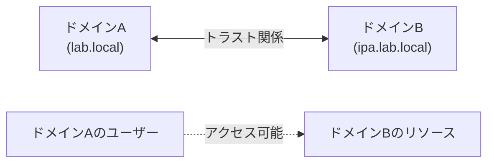

**トラストなしの場合**:

- ドメインAのユーザーは、ドメインBのリソースにアクセスできない
- 各ドメインで個別のアカウントが必要

**トラストありの場合**:

- ドメインAのユーザーが、ドメインBのリソースにアクセス可能
- 一つのアカウントで複数のドメインにアクセス

### トラストの目的

| 目的                         | 説明                                                     |
| ---------------------------- | -------------------------------------------------------- |
| **統一されたアカウント管理** | 複数のドメインで同じアカウントを使用                     |
| **シングルサインオン (SSO)** | 一度ログインすれば、他のドメインのリソースにアクセス可能 |
| **組織間連携**               | 買収、提携、子会社との統合                               |
| **プラットフォーム統合**     | Windows環境とLinux環境の統合                             |

---

## 🔄 トラストの種類

### 一方向トラスト

**片方のドメインのユーザーのみがアクセス可能**

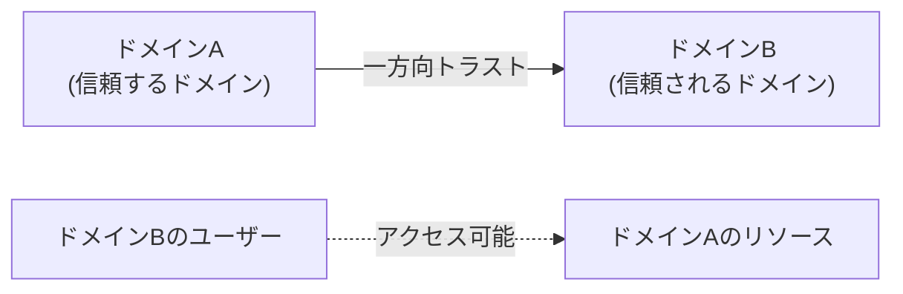

**特徴**:

- ドメインBのユーザー → ドメインAのリソース（✅ アクセス可能）
- ドメインAのユーザー → ドメインBのリソース（❌ アクセス不可）

**用途**:

- 部門間のアクセス制御
- ベンダーや外部組織への限定的なアクセス許可

### 双方向トラスト

**両方のドメインのユーザーが相互にアクセス可能**

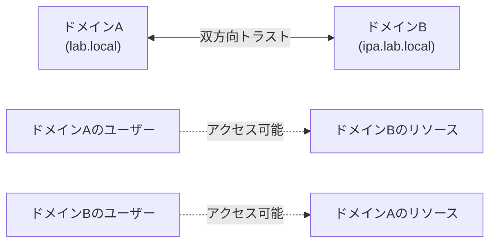

**特徴**:

- ドメインAのユーザー ↔ ドメインBのリソース（両方向でアクセス可能）

**用途**:

- 対等な組織間の連携
- Windows環境とLinux環境の統合（AD-FreeIPA）

### 推移的トラスト

**A→B、B→Cのトラストがあれば、A→Cも成立**

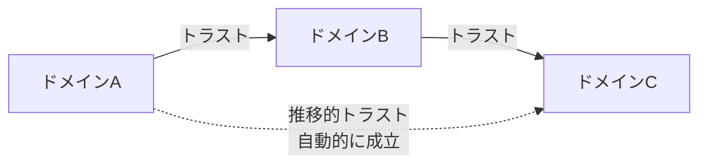

**特徴**:

- Active Directoryフォレスト内では自動的に推移的トラスト
- 管理が簡単

**用途**:

- 大規模なActive Directoryフォレスト
- 複数ドメインの階層構造

### 外部トラスト

**異なるフォレスト間の非推移的トラスト**

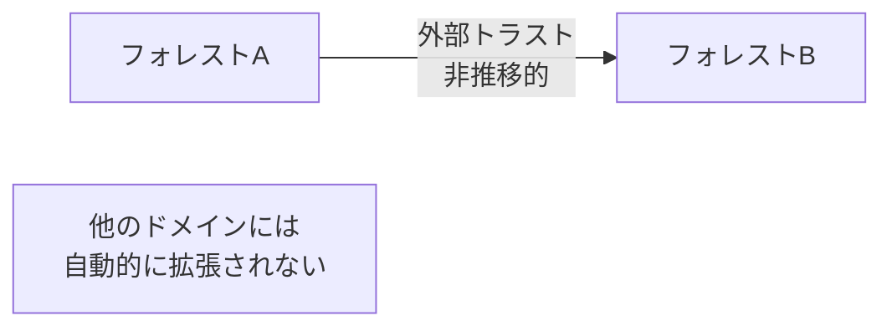

**特徴**:

- 推移的ではない（明示的なトラストのみ有効）
- セキュリティが高い

**用途**:

- 別組織との限定的な連携
- セキュリティ要件が厳しい環境

---

## 🔗 AD-FreeIPAトラスト

### トラストの仕組み

Active DirectoryとFreeIPA間の双方向トラスト

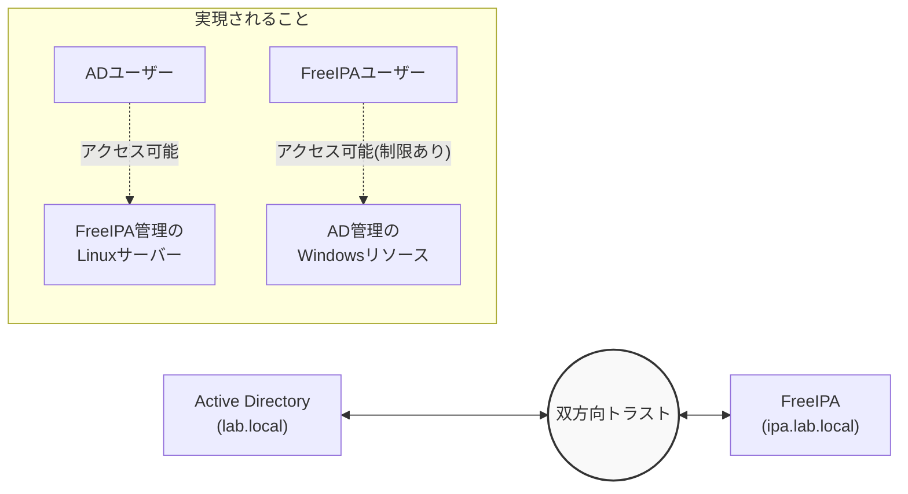

### 実現されること

#### 1. ADユーザーがLinuxサーバーにアクセス

**シナリオ**:

- Windows PCでADユーザーとしてログイン
- 同じアカウントでLinuxサーバー（FreeIPA管理）にSSHログイン

```bash
# Windows PCでログイン: jdoe@lab.local
# LinuxサーバーにSSH
ssh jdoe@lab.local@dev-server.ipa.lab.local
```

#### 2. FreeIPAユーザーがWindowsリソースにアクセス（制限あり）

**シナリオ**:

- FreeIPAユーザーがWindowsファイルサーバーにアクセス

**制限事項**:

- Windows PCへのログインは通常不可
- ファイル共有、プリンター等のリソースアクセスは可能

#### 3. 統一されたアカウント管理

**メリット**:

- 新入社員のアカウント作成が1回で完了
- パスワード変更が両環境に反映
- 退職者のアカウント無効化が即座に全環境へ

#### 4. シングルサインオン (SSO)

**メリット**:

- 一度ログインすれば、他のリソースにパスワード入力不要
- Kerberosチケットで自動認証

### トラストの前提条件

AD-FreeIPAトラストを構築するための前提条件：

| 項目                 | 要件                   | 説明                                                     |
| -------------------- | ---------------------- | -------------------------------------------------------- |
| **DNS解決**          | 双方向の名前解決が必要 | ADからFreeIPAのホスト、FreeIPAからADのホストが解決できる |
| **時刻同期**         | 時刻差が5分以内        | Kerberos認証のため                                       |
| **ファイアウォール** | 必要なポートが開放     | LDAP(389), Kerberos(88), DNS(53)等                       |
| **ドメイン名**       | 異なるドメイン名       | 例: `lab.local` と `ipa.lab.local`                       |
| **Forest機能レベル** | 2008以上               | ADのForest機能レベル                                     |

**必要なポート**:

| ポート  | プロトコル | サービス                |
| ------- | ---------- | ----------------------- |
| **88**  | TCP/UDP    | Kerberos                |
| **389** | TCP        | LDAP                    |
| **636** | TCP        | LDAPS                   |
| **53**  | TCP/UDP    | DNS                     |
| **464** | TCP/UDP    | Kerberos パスワード変更 |

---

## 🌐 クロスドメイン認証

### 認証フロー

ADユーザーがFreeIPA管理のLinuxサーバーにアクセスする流れ：

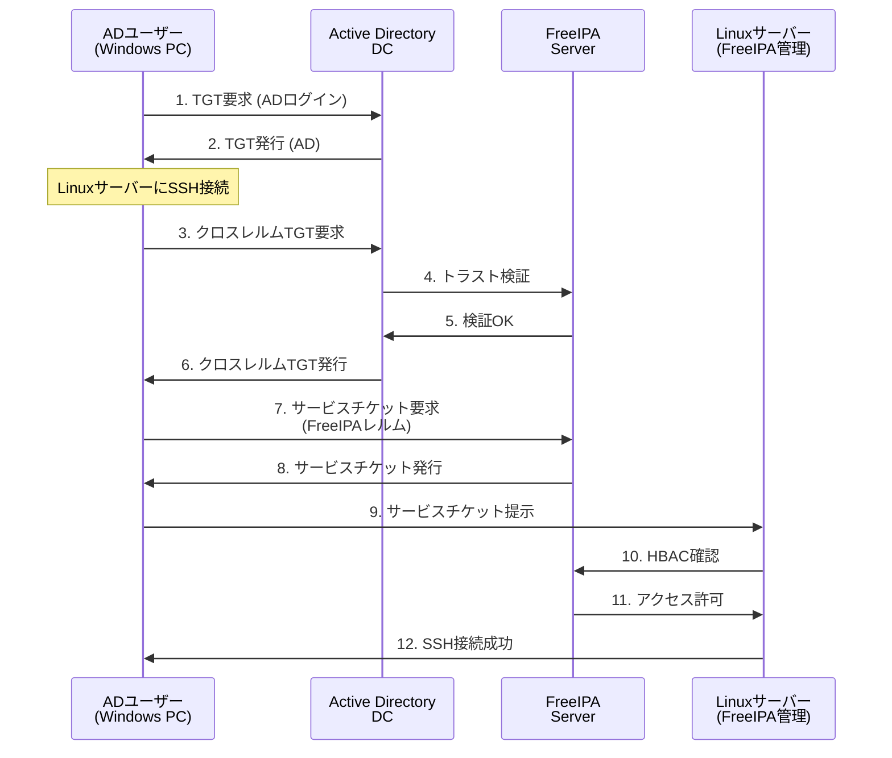

**フローの詳細**:

1-2. **ADでログイン**

- ユーザーがWindows PCにログイン
- ADからTGTを取得

3-6. **クロスレルムTGT取得**

- ADとFreeIPA間のトラストを利用
- クロスレルムTGTを取得

7-8. **FreeIPAレルムのサービスチケット取得**

- FreeIPAからサービスチケットを取得

9-12. **Linuxサーバーへのアクセス**

- サービスチケットを提示
- FreeIPAのHBACルールを確認
- アクセス許可

### 名前解決の仕組み

トラスト環境でのユーザー名の扱い：

| 環境                 | ユーザー名の形式                           | 例                                 |
| -------------------- | ------------------------------------------ | ---------------------------------- |
| **Active Directory** | `domain\username` または `username@domain` | `LAB\jdoe` または `jdoe@lab.local` |
| **FreeIPA**          | `username@REALM`                           | `jdoe@LAB.LOCAL`                   |
| **Linux (SSH)**      | `username@domain`                          | `jdoe@lab.local`                   |

**ドメイン名の解決**:

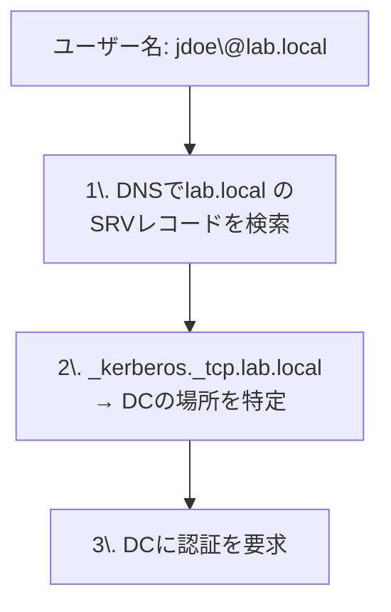

---

## 🔐 シングルサインオン (SSO)

### SSOの仕組み

トラスト環境でのシングルサインオン：

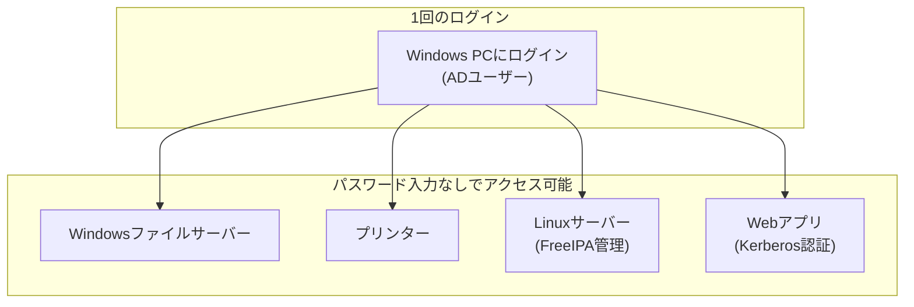

**SSOの流れ**:

1. ユーザーがWindows PCにログイン（パスワード入力）
2. ADからTGTを取得（キャッシュされる）
3. 他のリソースにアクセスする際、TGTを使って自動的にサービスチケットを取得
4. パスワードの再入力不要

### SSOのメリット

| メリット                 | 説明                                 |
| ------------------------ | ------------------------------------ |
| ✅ **ユーザビリティ向上** | パスワードを何度も入力する必要がない |
| ✅ **セキュリティ向上**   | パスワードの露出機会が減る           |
| ✅ **運用効率化**         | パスワード忘れのサポート件数が減る   |
| ✅ **生産性向上**         | スムーズなシステム間移動             |

---

## 🏗️ 企業でのトラスト設計パターン

### パターン1: Windows中心 + Linux統合

**構成**:

- メイン: Active Directory
- サブ: FreeIPA（Linuxサーバー管理用）

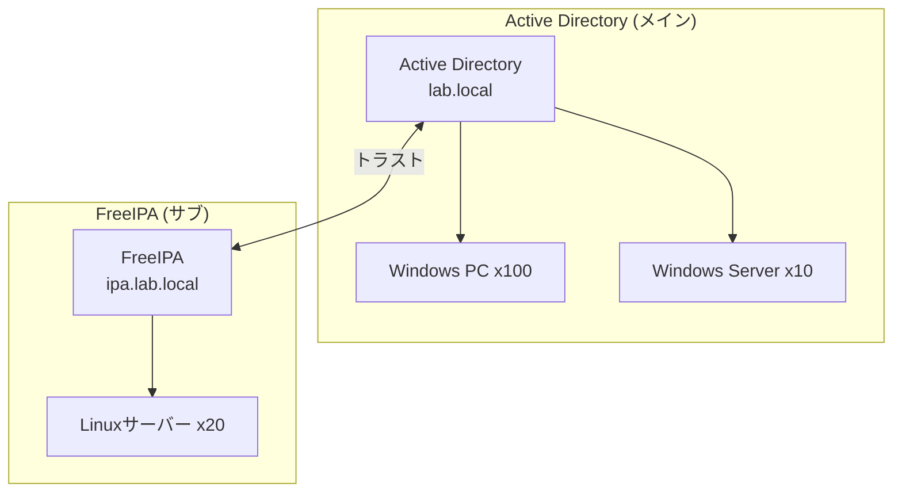

**適用シナリオ**:

- オフィスワーカーが中心（Windows PC）
- 一部でLinuxサーバーを運用（Web、DB）
- ADが主要なID基盤

**メリット**:

- 既存のAD環境を活かせる
- WindowsユーザーがLinuxサーバーにもアクセス可能

### パターン2: Linux中心 + Windows統合

**構成**:

- メイン: FreeIPA
- サブ: Active Directory（一部のWindows PC用）

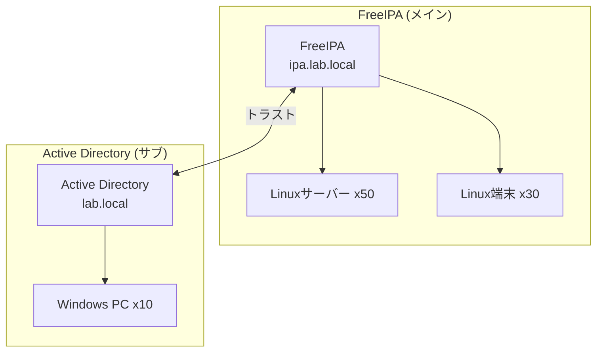

**適用シナリオ**:

- 開発者中心の組織
- Linuxサーバーとクライアントが主流
- 一部の管理部門でWindows PC

**メリット**:

- Linux環境の管理が主体
- 必要最小限のWindows環境を統合

### パターン3: 対等な統合

**構成**:

- Active DirectoryとFreeIPAが対等

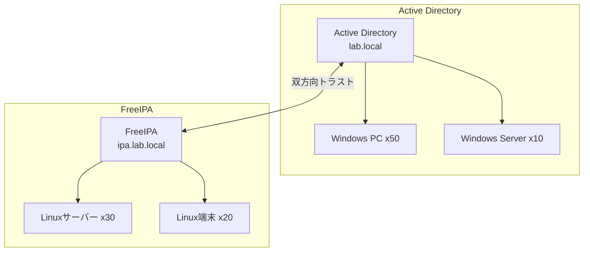

**適用シナリオ**:

- WindowsとLinuxが同程度の比重
- 両環境の独立性を保ちつつ統合

**メリット**:

- 各環境の独立性を維持
- 統一されたアカウント管理

---

## ⚠️ トラストの制限事項

| 制限事項                   | 影響                                          | 回避策                                           |
| -------------------------- | --------------------------------------------- | ------------------------------------------------ |
| **GPOの非適用**            | FreeIPAユーザーにGPOが適用されない            | FreeIPAのHBAC/SUDO Rulesで代替                   |
| **Windows PCログイン制限** | FreeIPAユーザーがWindows PCにログインできない | ADにアカウント作成、またはローカルアカウント使用 |
| **複雑な権限管理**         | クロスドメインでの権限設定が複雑              | 明確なグループ設計と文書化                       |
| **トラブルシューティング** | 問題発生時の切り分けが難しい                  | ログの集中管理、監視の強化                       |
| **時刻同期**               | 時刻がずれると認証失敗                        | NTP必須、定期的な時刻確認                        |

**ベストプラクティス**:

- トラストは必要最小限に
- 明確な命名規則（ドメイン名、レルム名）
- ドキュメントの整備（トラスト設定、認証フロー）
- 定期的な動作確認
- ログの監視

---

## 📚 関連ドキュメント

次に読むべきドキュメント：

| ドキュメント                      | 内容                   |
| --------------------------------- | ---------------------- |
| **07_enterprise_scenarios.md**    | 企業での実践シナリオ   |
| **phase4_trust_configuration.md** | トラスト構築の実践手順 |
| **appendix_b_troubleshooting.md** | トラブルシューティング |

---

**作成日**: 2025年11月2日
**対象**: トラスト統合を学ぶ方
**次のドキュメント**: 07_enterprise_scenarios.md
