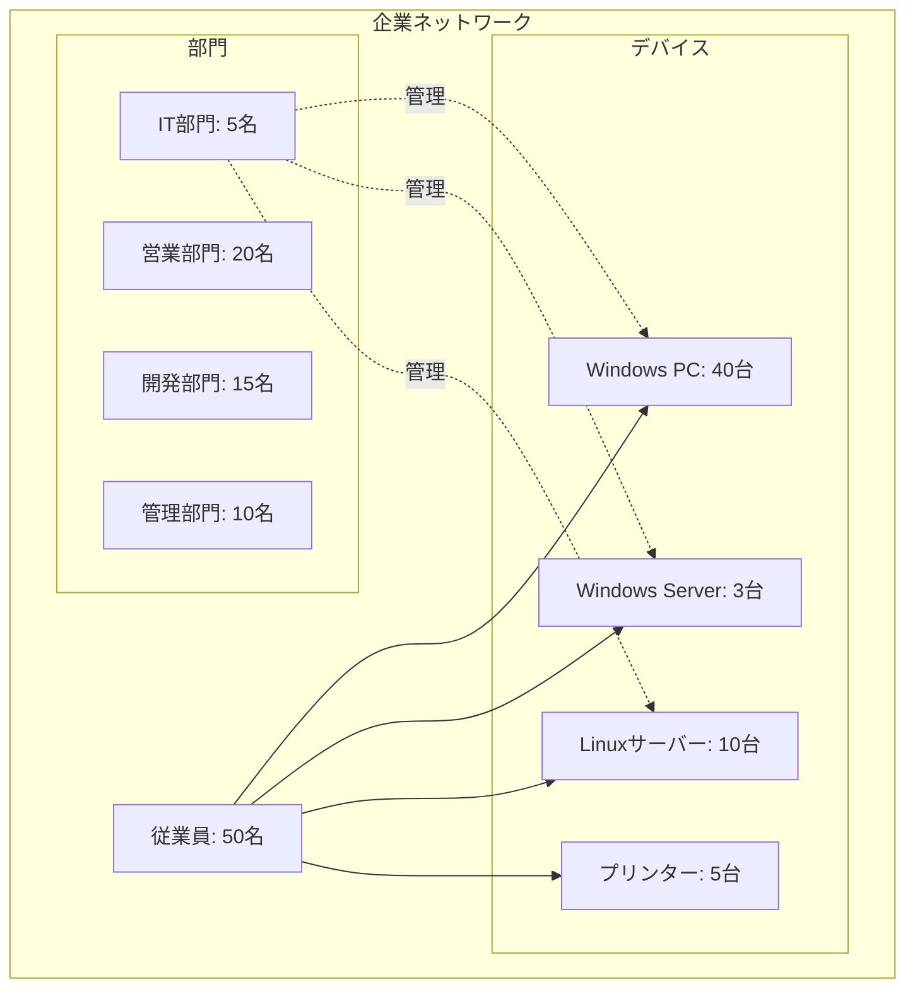
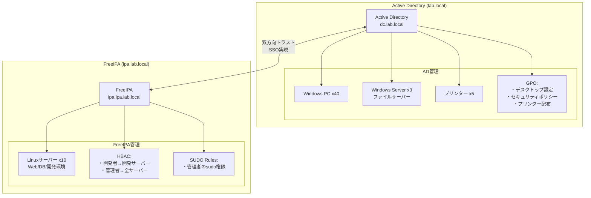
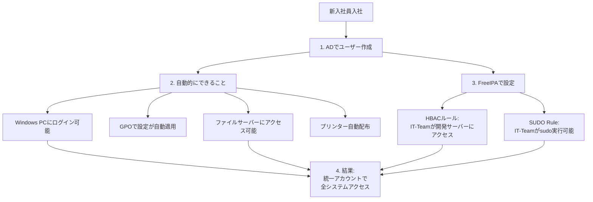
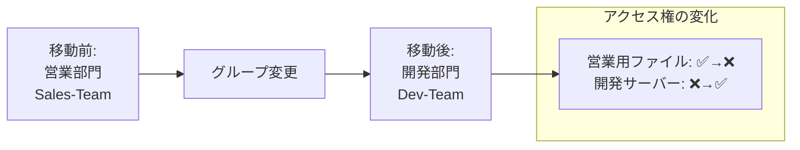
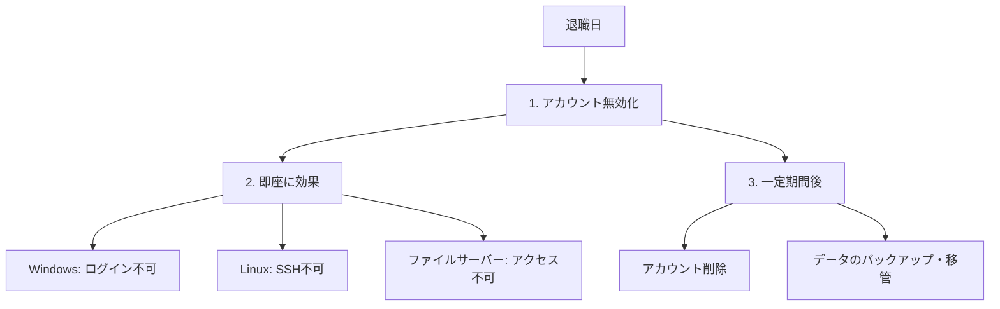
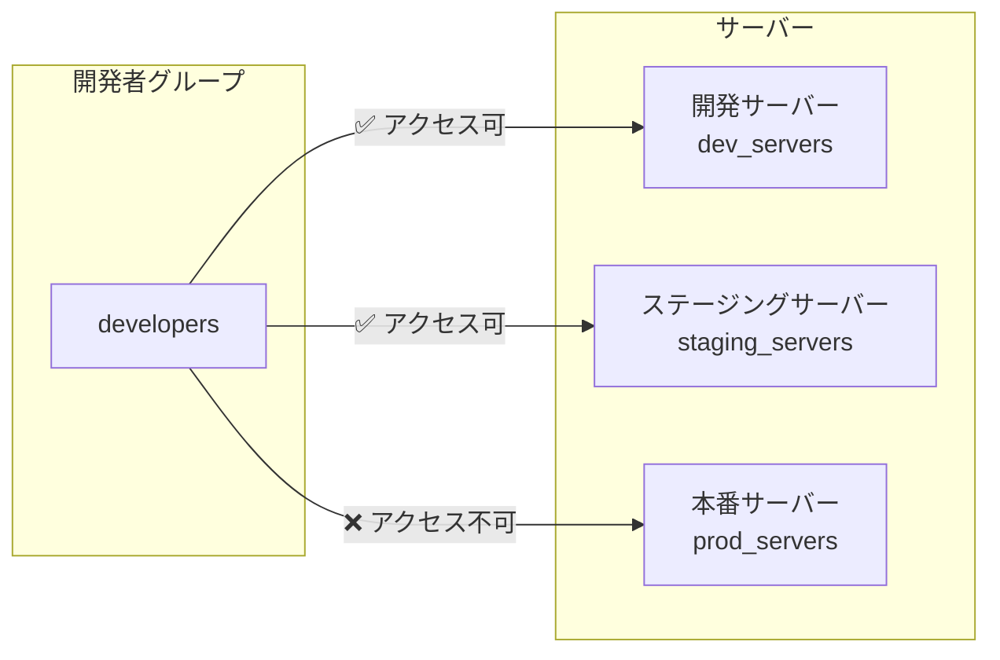
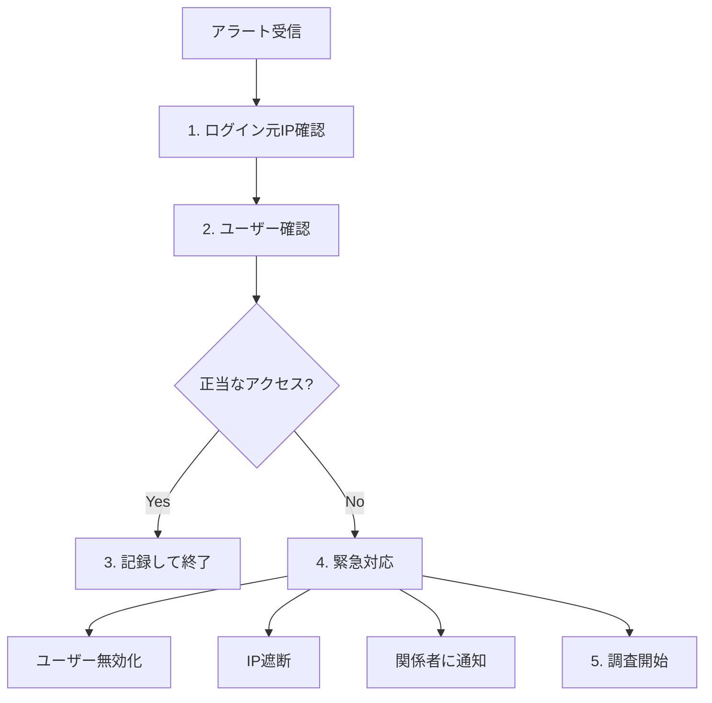
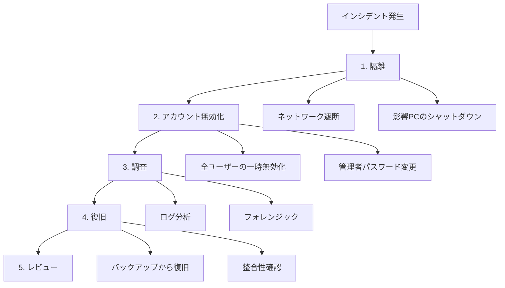

# 企業での実践シナリオ

## 📋 目次

- [企業での実践シナリオ](#企業での実践シナリオ)
  - [📋 目次](#-目次)
  - [🎯 このドキュメントについて](#-このドキュメントについて)
  - [🏢 典型的な企業IT環境](#-典型的な企業it環境)
    - [中小企業（従業員50名）の例](#中小企業従業員50名の例)
    - [IT要件](#it要件)
  - [🔧 ソリューション: ハイブリッド環境](#-ソリューション-ハイブリッド環境)
    - [システム構成](#システム構成)
  - [📝 運用シナリオ](#-運用シナリオ)
    - [シナリオ1: 新入社員のオンボーディング](#シナリオ1-新入社員のオンボーディング)
      - [ステップ1: Active Directoryでユーザー作成](#ステップ1-active-directoryでユーザー作成)
      - [ステップ2: 自動的に実現されること](#ステップ2-自動的に実現されること)
      - [ステップ3: FreeIPAでの設定（トラスト経由）](#ステップ3-freeipaでの設定トラスト経由)
      - [ステップ4: 動作確認](#ステップ4-動作確認)
    - [シナリオ2: 部署異動](#シナリオ2-部署異動)
    - [シナリオ3: 退職者の対応](#シナリオ3-退職者の対応)
      - [ステップ1: アカウント無効化（退職日当日）](#ステップ1-アカウント無効化退職日当日)
      - [ステップ2: 即座の効果確認](#ステップ2-即座の効果確認)
      - [ステップ3: データの移管（退職後1週間以内）](#ステップ3-データの移管退職後1週間以内)
      - [ステップ4: アカウント削除（退職後30-90日）](#ステップ4-アカウント削除退職後30-90日)
    - [シナリオ4: パスワードリセット](#シナリオ4-パスワードリセット)
    - [シナリオ5: 開発者のアクセス制御](#シナリオ5-開発者のアクセス制御)
  - [🔒 セキュリティシナリオ](#-セキュリティシナリオ)
    - [シナリオ6: 監査対応](#シナリオ6-監査対応)
      - [Active Directoryのログ](#active-directoryのログ)
      - [FreeIPAのログ](#freeipaのログ)
      - [監査レポートの生成](#監査レポートの生成)
    - [シナリオ7: 不正アクセスの検知](#シナリオ7-不正アクセスの検知)
    - [シナリオ8: セキュリティインシデント対応](#シナリオ8-セキュリティインシデント対応)
  - [⚙️ 運用自動化シナリオ](#️-運用自動化シナリオ)
    - [シナリオ9: 自動バックアップ](#シナリオ9-自動バックアップ)
    - [シナリオ10: 定期的なアカウント棚卸](#シナリオ10-定期的なアカウント棚卸)
  - [🎓 教訓とベストプラクティス](#-教訓とベストプラクティス)
  - [📚 関連ドキュメント](#-関連ドキュメント)

---

## 🎯 このドキュメントについて

このドキュメントは、**企業での実践的なシナリオ**を通して、ドメイン管理の運用方法を説明します。

**対象読者**:

- 実際の運用イメージを掴みたい方
- 企業でのドメイン管理を担当する方
- 具体的な運用手順を知りたい方

**読み終えた後にできること**:

- ✅ 企業での典型的な運用シナリオを理解できる
- ✅ 新入社員のオンボーディング手順を説明できる
- ✅ セキュリティインシデントへの対応方法を理解できる
- ✅ 運用自動化の方法を把握できる

---

## 🏢 典型的な企業IT環境

### 中小企業（従業員50名）の例



**デバイス構成**:

- **Windows PC**: オフィスワーカー用（営業、管理部門）
- **Windows Server**: ファイルサーバー、アプリサーバー
- **Linuxサーバー**: Webサーバー、DBサーバー、開発環境
- **プリンター**: 各フロアに配置

### IT要件

| 要件                              | 説明                                         |
| --------------------------------- | -------------------------------------------- |
| **統一されたアカウント管理**      | 全システムで同じアカウントを使用             |
| **Windows PCの設定統一**          | デスクトップ設定、セキュリティポリシーの統一 |
| **Linuxサーバーへのアクセス制御** | 開発者のみが開発サーバーにアクセス可能       |
| **シングルサインオン (SSO)**      | 一度ログインすれば全リソースにアクセス可能   |
| **監査とコンプライアンス**        | 誰がいつどこにアクセスしたか記録             |
| **セキュリティポリシー**          | パスワード要件、アカウントロックアウト       |

---

## 🔧 ソリューション: ハイブリッド環境

### システム構成



---

## 📝 運用シナリオ

### シナリオ1: 新入社員のオンボーディング

**状況**: IT部門に新入社員（田中太郎）が入社



**手順**:

#### ステップ1: Active Directoryでユーザー作成

**GUI（RSAT）**:

1. Active Directory ユーザーとコンピューター を開く
2. `OU=IT,OU=Users,DC=lab,DC=local` を右クリック
3. 新規作成 → ユーザー
4. 以下を入力:
   - 名: `太郎`
   - 姓: `田中`
   - ユーザーログオン名: `t.tanaka`
5. パスワードを設定（初回変更を強制）
6. グループに追加: `IT-Team`

**PowerShell**:

```powershell
# ユーザー作成
New-ADUser -Name "田中太郎" `
    -GivenName "太郎" `
    -Surname "田中" `
    -SamAccountName "t.tanaka" `
    -UserPrincipalName "t.tanaka@lab.local" `
    -Path "OU=IT,OU=Users,DC=lab,DC=local" `
    -AccountPassword (ConvertTo-SecureString "TempP@ss123!" -AsPlainText -Force) `
    -ChangePasswordAtLogon $true `
    -Enabled $true

# グループに追加
Add-ADGroupMember -Identity "IT-Team" -Members "t.tanaka"
```

#### ステップ2: 自動的に実現されること

- ✅ Windows PCにログイン可能
- ✅ GPOでデスクトップ設定が自動適用
- ✅ ファイルサーバーにアクセス可能（IT-Teamグループの権限）
- ✅ プリンターが自動配布

#### ステップ3: FreeIPAでの設定（トラスト経由）

**HBACルールの確認**:

```bash
# IT-Teamが開発サーバーにアクセスできることを確認
ipa hbacrule-show it_team_dev_access
```

**SUDO Ruleの確認**:

```bash
# IT-Teamがsudoを実行できることを確認
ipa sudorule-show it_team_sudo
```

#### ステップ4: 動作確認

**Windows PCログイン**:

- ユーザー名: `LAB\t.tanaka` または `t.tanaka@lab.local`
- パスワード: 初回パスワード（変更を求められる）

**Linuxサーバーへのアクセス**:

```bash
# ADアカウントでLinuxサーバーにSSH
ssh t.tanaka@lab.local@dev-server01.ipa.lab.local

# sudoの確認
sudo ls /root
```

**所要時間**: 約10-15分

---

### シナリオ2: 部署異動

**状況**: 営業部門の山田花子さんが開発部門に異動



**手順**:

```powershell
# グループから削除
Remove-ADGroupMember -Identity "Sales-Team" -Members "h.yamada" -Confirm:$false

# 新しいグループに追加
Add-ADGroupMember -Identity "Dev-Team" -Members "h.yamada"

# OUの移動（オプション）
Move-ADObject -Identity "CN=山田花子,OU=Sales,OU=Users,DC=lab,DC=local" `
    -TargetPath "OU=Dev,OU=Users,DC=lab,DC=local"
```

**自動的に変わること**:

- ✅ 営業用ファイルサーバーへのアクセス権が削除
- ✅ 開発用ファイルサーバーへのアクセス権が追加
- ✅ 開発サーバー（Linux）へのSSHアクセスが可能に
- ✅ GPOが新しいOUのポリシーに変更（OU移動時）

---

### シナリオ3: 退職者の対応

**状況**: 佐藤一郎さんが退職



**手順**:

#### ステップ1: アカウント無効化（退職日当日）

```powershell
# アカウント無効化
Disable-ADAccount -Identity "i.sato"

# 説明の追加（退職日を記録）
Set-ADUser -Identity "i.sato" -Description "退職: 2025年11月30日"
```

#### ステップ2: 即座の効果確認

- ❌ Windows PCにログインできない
- ❌ Linux サーバーにSSHできない
- ❌ ファイルサーバーにアクセスできない
- ❌ VPNに接続できない

#### ステップ3: データの移管（退職後1週間以内）

```powershell
# ホームディレクトリのバックアップ
$source = "\\fileserver\home\i.sato"
$backup = "\\fileserver\backup\retired\i.sato_20251130"
Copy-Item -Path $source -Destination $backup -Recurse

# メールボックスのアーカイブ（Exchange環境の場合）
# New-MailboxExportRequest -Mailbox "i.sato" -FilePath "\\fileserver\backup\mailbox\i.sato.pst"
```

#### ステップ4: アカウント削除（退職後30-90日）

```powershell
# アカウント削除
Remove-ADUser -Identity "i.sato" -Confirm:$false
```

---

### シナリオ4: パスワードリセット

**状況**: 鈴木次郎さんがパスワードを忘れた

**手順**:

```powershell
# パスワードリセット（次回ログイン時に変更を強制）
Set-ADAccountPassword -Identity "j.suzuki" `
    -NewPassword (ConvertTo-SecureString "TempP@ss456!" -AsPlainText -Force) `
    -Reset

Set-ADUser -Identity "j.suzuki" -ChangePasswordAtLogon $true

# アカウントロックアウトの解除（必要に応じて）
Unlock-ADAccount -Identity "j.suzuki"
```

**ユーザーへの案内**:

```text
件名: パスワードリセット完了

鈴木様

パスワードをリセットしました。

仮パスワード: TempP@ss456!

次回ログイン時に新しいパスワードの設定を求められます。
セキュリティポリシーに従ったパスワードを設定してください。

- 最小12文字
- 大文字、小文字、数字、記号を含む
- 過去24個のパスワードは再利用不可

IT部門
```

---

### シナリオ5: 開発者のアクセス制御

**状況**: 開発チームが本番サーバーにアクセスできないように制御



**FreeIPAでのHBAC設定**:

```bash
# 開発者用のHBACルール
ipa hbacrule-add developers_dev_access
ipa hbacrule-add-user developers_dev_access --groups=developers
ipa hbacrule-add-host developers_dev_access --hostgroups=dev_servers,staging_servers
ipa hbacrule-add-service developers_dev_access --hbacsvcs=sshd

# 本番サーバーへのアクセスルール（管理者のみ）
ipa hbacrule-add sysadmin_prod_access
ipa hbacrule-add-user sysadmin_prod_access --groups=sysadmins
ipa hbacrule-add-host sysadmin_prod_access --hostgroups=prod_servers
ipa hbacrule-add-service sysadmin_prod_access --hbacsvcs=sshd

# デフォルトルールの無効化
ipa hbacrule-disable allow_all
```

**テスト**:

```bash
# 開発者が開発サーバーにアクセスできることを確認
ipa hbactest --user=dev1 --host=dev-server01.ipa.lab.local --service=sshd
# 結果: Access granted (アクセス許可)

# 開発者が本番サーバーにアクセスできないことを確認
ipa hbactest --user=dev1 --host=prod-server01.ipa.lab.local --service=sshd
# 結果: Access denied (アクセス拒否)
```

---

## 🔒 セキュリティシナリオ

### シナリオ6: 監査対応

**状況**: 内部監査で過去3ヶ月の特権アクセスログを提出

**必要な情報**:

- 誰が（ユーザー）
- いつ（日時）
- どこに（サーバー）
- 何をした（sudo実行コマンド）

**ログ収集手順**:

#### Active Directoryのログ

```powershell
# セキュリティログから特権アクセスを抽出
$startDate = (Get-Date).AddDays(-90)
Get-EventLog -LogName Security -After $startDate |
    Where-Object { $_.EventID -eq 4672 } | # 特権ログオン
    Select-Object TimeGenerated, UserName, Message |
    Export-Csv "C:\Audit\AD_PrivilegedAccess.csv" -NoTypeInformation
```

#### FreeIPAのログ

```bash
# sudo実行ログの抽出
journalctl --since "3 months ago" | grep "sudo:" > /var/log/audit/sudo_3months.log

# 特定ユーザーのsudo実行履歴
journalctl --since "3 months ago" | grep "sudo:" | grep "admin1"

# 本番サーバーへのSSHログイン履歴
journalctl --since "3 months ago" | grep "sshd" | grep "prod-server"
```

#### 監査レポートの生成

```bash
# サマリーレポートの作成
cat << EOF > audit_report.md
# セキュリティ監査レポート
期間: $(date -d '3 months ago' +%Y-%m-%d) - $(date +%Y-%m-%d)

## 1. 特権アクセス統計
- AD特権ログオン: $(grep -c "4672" AD_PrivilegedAccess.csv) 件
- sudo実行回数: $(grep -c "sudo:" /var/log/audit/sudo_3months.log) 件

## 2. 異常検知
$(grep -i "failed" /var/log/audit/sudo_3months.log | wc -l) 件の失敗したsudo実行

## 3. 推奨事項
- パスワードポリシーの見直し
- 多要素認証の導入検討
EOF
```

### シナリオ7: 不正アクセスの検知

**状況**: 深夜に本番サーバーへの不審なSSHログインを検知

**検知アラート**:

```text
Alert: 異常なSSHログイン
Time: 2025-11-02 02:35:12
User: admin2@lab.local
Host: prod-server03.ipa.lab.local
Source IP: 203.0.113.45 (外部IP)
```

**対応手順**:



**緊急対応コマンド**:

```powershell
# AD: ユーザーの無効化
Disable-ADAccount -Identity "admin2"

# セッション情報の確認
qwinsta /server:prod-server03

# 強制ログアウト
logoff <session-id> /server:prod-server03
```

```bash
# FreeIPA: ホストからのキックアウト
ssh root@prod-server03.ipa.lab.local "pkill -9 -u admin2@lab.local"

# ファイアウォールでIP遮断
firewall-cmd --add-rich-rule='rule family="ipv4" source address="203.0.113.45" reject' --permanent
firewall-cmd --reload
```

**調査**:

```bash
# 該当時刻のログ確認
journalctl --since "2025-11-02 02:30:00" --until "2025-11-02 02:40:00" | grep "admin2"

# 実行されたコマンドの確認
journalctl --since "2025-11-02 02:30:00" --until "2025-11-02 02:40:00" | grep "COMMAND"

# ファイルアクセスの確認
ausearch -ts 02:30:00 -te 02:40:00 -ua admin2
```

### シナリオ8: セキュリティインシデント対応

**状況**: ランサムウェア感染の疑い

**対応フロー**:



---

## ⚙️ 運用自動化シナリオ

### シナリオ9: 自動バックアップ

**毎日のバックアップスクリプト**:

```bash
#!/bin/bash
# /root/scripts/daily_backup.sh

DATE=$(date +%Y%m%d)
BACKUP_DIR="/backup/domain"

# Active Directory (Samba4) バックアップ
echo "Starting AD backup..."
samba-tool domain backup offline --targetdir=${BACKUP_DIR}/ad_${DATE}

# FreeIPA バックアップ
echo "Starting FreeIPA backup..."
ipa-backup --data --logs --dir=${BACKUP_DIR}/ipa_${DATE}

# 古いバックアップの削除（30日以上前）
find ${BACKUP_DIR} -type d -mtime +30 -exec rm -rf {} \;

echo "Backup completed: ${DATE}"
```

**cronで自動実行**:

```bash
# crontab -e
# 毎日午前2時に実行
0 2 * * * /root/scripts/daily_backup.sh >> /var/log/backup.log 2>&1
```

### シナリオ10: 定期的なアカウント棚卸

**月次アカウントレビュースクリプト**:

```powershell
# monthly_account_review.ps1

# 90日間ログインしていないアカウントを抽出
$inactiveDate = (Get-Date).AddDays(-90)
$inactiveUsers = Get-ADUser -Filter * -Properties LastLogonDate |
    Where-Object { $_.LastLogonDate -lt $inactiveDate -and $_.Enabled -eq $true } |
    Select-Object Name, SamAccountName, LastLogonDate, DistinguishedName

# CSVに出力
$inactiveUsers | Export-Csv "C:\Reports\InactiveUsers_$(Get-Date -Format 'yyyyMMdd').csv" -NoTypeInformation

# メール送信
$body = @"
以下のアカウントが90日間使用されていません。
確認の上、不要なアカウントは無効化してください。

アカウント数: $($inactiveUsers.Count)

詳細は添付ファイルを参照してください。
"@

Send-MailMessage -To "it-admin@company.com" `
    -From "system@company.com" `
    -Subject "月次アカウントレビュー: 未使用アカウント" `
    -Body $body `
    -Attachments "C:\Reports\InactiveUsers_$(Get-Date -Format 'yyyyMMdd').csv" `
    -SmtpServer "mail.company.com"
```

---

## 🎓 教訓とベストプラクティス

| ベストプラクティス       | 説明                                                             |
| ------------------------ | ---------------------------------------------------------------- |
| **命名規則の統一**       | ユーザー名、グループ名の規則を明確に（例: `firstname.lastname`） |
| **OU設計**               | 組織構造を反映したOU設計、GPO適用を考慮                          |
| **グループ戦略**         | AGDLP戦略（Account→Global Group→Domain Local Group→Permission）  |
| **パスワードポリシー**   | 強固なパスワード要件、多要素認証の導入                           |
| **最小権限の原則**       | 必要最小限の権限のみ付与                                         |
| **ログ管理**             | すべての認証ログを保存、定期的なレビュー                         |
| **バックアップ**         | 毎日のバックアップ、定期的なリストアテスト                       |
| **ドキュメント化**       | 手順書、設定内容、トラブルシューティングを文書化                 |
| **定期的な棚卸**         | 未使用アカウント、グループメンバーシップの定期確認               |
| **インシデント対応計画** | 事前にインシデント対応手順を準備                                 |

---

## 📚 関連ドキュメント

次に読むべきドキュメント：

| ドキュメント                      | 内容                   |
| --------------------------------- | ---------------------- |
| **appendix_a_glossary.md**        | 用語集                 |
| **appendix_b_troubleshooting.md** | トラブルシューティング |
| **appendix_c_references.md**      | 参考資料               |
| **phase1_environment_setup.md**   | 実際の環境構築手順     |

---

**作成日**: 2025年11月2日
**対象**: 企業でのドメイン管理運用を学ぶ方
**次のドキュメント**: appendix_a_glossary.md
