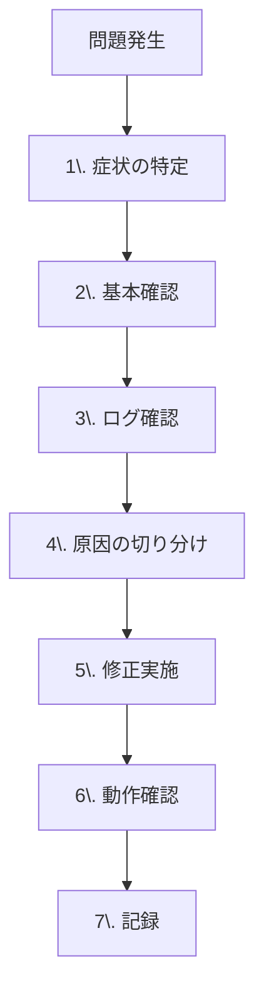
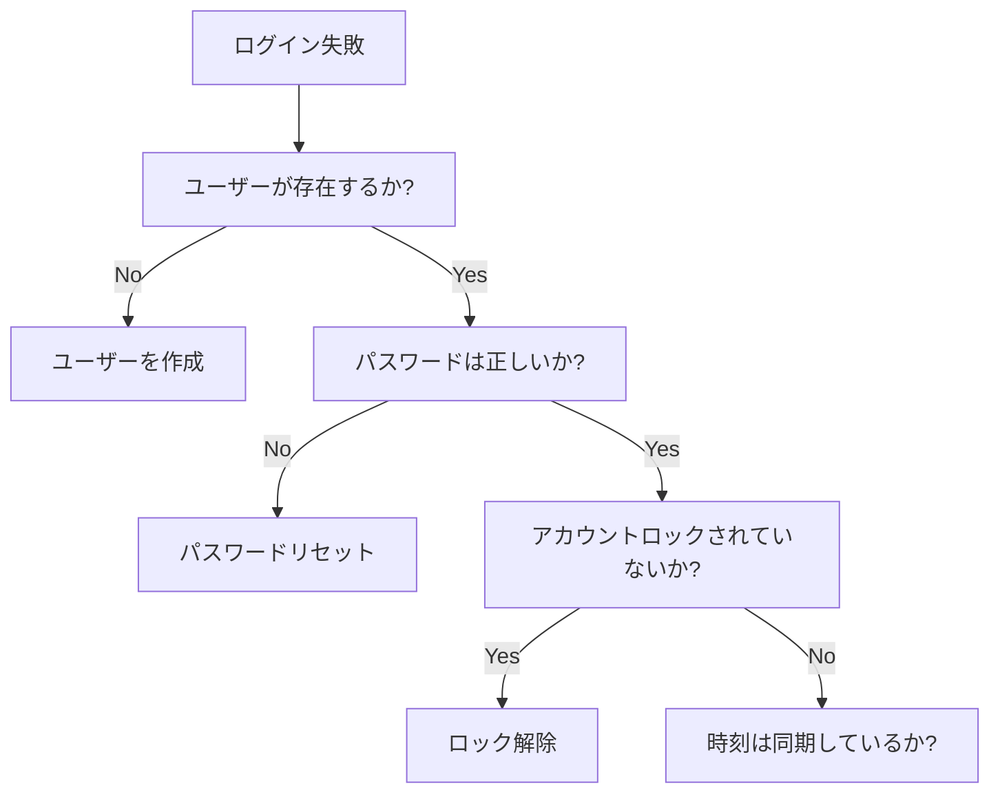

# Appendix B: トラブルシューティング

## 📋 目次

- [Appendix B: トラブルシューティング](#appendix-b-トラブルシューティング)
  - [📋 目次](#-目次)
  - [🎯 このドキュメントについて](#-このドキュメントについて)
  - [🔍 トラブルシューティングの基本](#-トラブルシューティングの基本)
  - [🌐 DNS関連の問題](#-dns関連の問題)
    - [問題1: 名前解決ができない](#問題1-名前解決ができない)
    - [問題2: SRVレコードが見つからない](#問題2-srvレコードが見つからない)
  - [🔐 認証関連の問題](#-認証関連の問題)
    - [問題3: ログインできない](#問題3-ログインできない)
    - [問題4: Kerberosチケットが取得できない](#問題4-kerberosチケットが取得できない)
    - [問題5: 時刻同期エラー](#問題5-時刻同期エラー)
  - [🔗 トラスト関連の問題](#-トラスト関連の問題)
    - [問題6: トラストが構築できない](#問題6-トラストが構築できない)
    - [問題7: クロスドメイン認証が失敗](#問題7-クロスドメイン認証が失敗)
  - [📋 グループポリシー関連の問題](#-グループポリシー関連の問題)
    - [問題8: GPOが適用されない](#問題8-gpoが適用されない)
  - [🐧 Linux クライアント関連の問題](#-linux-クライアント関連の問題)
    - [問題9: FreeIPAへのドメイン参加失敗](#問題9-freeipaへのドメイン参加失敗)
    - [問題10: HBACでアクセス拒否](#問題10-hbacでアクセス拒否)
  - [💻 Windows クライアント関連の問題](#-windows-クライアント関連の問題)
    - [問題11: ドメイン参加できない](#問題11-ドメイン参加できない)
  - [🛠️ 一般的なコマンド集](#️-一般的なコマンド集)
    - [DNS確認](#dns確認)
    - [Kerberos確認](#kerberos確認)
    - [LDAP確認](#ldap確認)
    - [ネットワーク確認](#ネットワーク確認)

---

## 🎯 このドキュメントについて

よくある問題とその解決方法をまとめています。

**使い方**:

1. 症状から該当する問題を探す
2. 原因の確認手順を実施
3. 解決方法を試す
4. それでも解決しない場合は、ログを確認

---

## 🔍 トラブルシューティングの基本

**基本的なアプローチ**:



**基本確認項目**:

- [ ] ネットワーク接続（ping）
- [ ] DNS解決（nslookup/dig）
- [ ] 時刻同期（5分以内の誤差）
- [ ] ファイアウォール（必要なポート開放）
- [ ] サービス起動状態

---

## 🌐 DNS関連の問題

### 問題1: 名前解決ができない

**症状**:

- `ping dc.lab.local` が失敗
- ドメイン参加時に「ドメインが見つからない」

**原因確認**:

```bash
# Windows
nslookup dc.lab.local
ipconfig /all

# Linux
dig dc.lab.local
cat /etc/resolv.conf
```

**よくある原因と解決方法**:

| 原因                                       | 確認方法                            | 解決方法                         |
| ------------------------------------------ | ----------------------------------- | -------------------------------- |
| **DNSサーバー設定が間違っている**          | `ipconfig /all` でDNSサーバーを確認 | 正しいDNSサーバー（DC）を設定    |
| **DNSレコードが登録されていない**          | `nslookup dc.lab.local <DNS-IP>`    | DNSレコードを手動登録            |
| **ファイアウォールでポート53が閉じている** | `telnet <DNS-IP> 53`                | ファイアウォールでポート53を開放 |
| **DNSサービスが起動していない**            | サービスの状態確認                  | DNSサービスを起動                |

**解決手順**:

```bash
# Windows: DNSキャッシュのクリア
ipconfig /flushdns

# Windows: DNS設定変更
netsh interface ip set dns "イーサネット" static 172.20.0.10

# Linux: DNS設定変更
echo "nameserver 172.20.0.10" | sudo tee /etc/resolv.conf

# DNS動作確認
nslookup dc.lab.local 172.20.0.10
```

### 問題2: SRVレコードが見つからない

**症状**:

- ドメイン参加時に「ドメインコントローラーが見つからない」
- クライアント認証が失敗

**原因確認**:

```bash
# Windows
nslookup -type=SRV _ldap._tcp.lab.local

# Linux
dig SRV _ldap._tcp.lab.local
```

**期待される出力**:

```bash
_ldap._tcp.lab.local    service = 0 100 389 dc.lab.local.
```

**解決方法**:

```bash
# Samba4: SRVレコードの確認
samba-tool dns query dc.lab.local lab.local @ ALL -U Administrator

# SRVレコードの手動登録（必要に応じて）
samba-tool dns add dc.lab.local lab.local _ldap._tcp SRV "0 100 389 dc.lab.local." -U Administrator
```

---

## 🔐 認証関連の問題

### 問題3: ログインできない

**症状**:

- Windows: 「ユーザー名またはパスワードが正しくありません」
- Linux: `Permission denied`

**原因確認の手順**:



**確認コマンド**:

```powershell
# Windows: ユーザーの存在確認
Get-ADUser -Identity jdoe

# アカウントロック確認
Search-ADAccount -LockedOut

# アカウントのロック解除
Unlock-ADAccount -Identity jdoe

# パスワードリセット
Set-ADAccountPassword -Identity jdoe -Reset
```

```bash
# FreeIPA: ユーザー確認
ipa user-show jdoe

# アカウントロック解除
ipa user-unlock jdoe
```

### 問題4: Kerberosチケットが取得できない

**症状**:

- `kinit` が失敗
- SSO が動作しない

**エラーメッセージと原因**:

| エラーメッセージ                        | 原因                     | 解決方法                                |
| --------------------------------------- | ------------------------ | --------------------------------------- |
| `Clock skew too great`                  | 時刻のずれが5分以上      | NTPで時刻同期                           |
| `Client not found in Kerberos database` | ユーザーが存在しない     | ユーザーを作成                          |
| `Pre-authentication failed`             | パスワードが間違っている | 正しいパスワードを入力                  |
| `Cannot contact any KDC`                | KDCに接続できない        | ネットワーク、DNS、ファイアウォール確認 |

**時刻同期の確認と修正**:

```bash
# 時刻の確認
date

# NTPで時刻同期（Linux）
sudo chronyd -q
sudo systemctl restart chronyd

# 時刻の手動設定
sudo date -s "2025-11-02 12:00:00"
```

**Kerberosチケットの確認**:

```bash
# チケット一覧
klist

# 新しいチケット取得
kinit jdoe@LAB.LOCAL

# チケット削除
kdestroy

# Kerberos設定の確認
cat /etc/krb5.conf
```

### 問題5: 時刻同期エラー

**症状**:

- 認証が突然失敗
- `Clock skew too great` エラー

**確認**:

```bash
# 各サーバーの時刻を確認
# DCの時刻
ssh dc.lab.local date

# FreeIPAの時刻
ssh ipa.ipa.lab.local date

# クライアントの時刻
date

# 時刻差を計算（5分以内である必要がある）
```

**解決方法**:

```bash
# NTPサーバーの設定（Linux）
sudo vi /etc/chrony.conf
# server dc.lab.local iburst

sudo systemctl restart chronyd

# 強制同期
sudo chronyc makestep

# Windows: NTPサーバーの設定
w32tm /config /manualpeerlist:dc.lab.local /syncfromflags:manual /reliable:yes /update
w32tm /resync
```

---

## 🔗 トラスト関連の問題

### 問題6: トラストが構築できない

**症状**:

- `ipa trust-add` が失敗

**よくあるエラーと解決方法**:

| エラー                                | 原因        | 解決方法                |
| ------------------------------------- | ----------- | ----------------------- |
| `Unable to resolve domain controller` | DNS解決失敗 | 双方向のDNS設定を確認   |
| `Clock skew is too great`             | 時刻同期    | NTPで時刻を同期         |
| `Access denied`                       | 権限不足    | Domain Admins権限で実行 |

**トラストの前提条件チェックリスト**:

```bash
# 1. DNS解決の確認
## FreeIPAからADへ
dig dc.lab.local
dig SRV _ldap._tcp.lab.local

## ADからFreeIPAへ
nslookup ipa.ipa.lab.local
nslookup -type=SRV _ldap._tcp.ipa.lab.local

# 2. 時刻同期の確認
ssh ipa.ipa.lab.local date
ssh dc.lab.local date

# 3. ポート開放の確認
telnet dc.lab.local 88     # Kerberos
telnet dc.lab.local 389    # LDAP
telnet dc.lab.local 445    # SMB

# 4. Forest機能レベルの確認（AD）
Get-ADForest | Select-Object ForestMode
# 2008以上である必要がある
```

### 問題7: クロスドメイン認証が失敗

**症状**:

- ADユーザーがLinuxサーバーにログインできない

**確認手順**:

```bash
# 1. トラストの状態確認
ipa trust-show lab.local

# 2. HBACルールの確認
ipa hbacrule-find --all

# 3. ユーザーがアクセスできるかテスト
ipa hbactest --user=jdoe@lab.local --host=server.ipa.lab.local --service=sshd

# 4. SSSDログの確認
sudo tail -f /var/log/sssd/sssd_ipa.lab.local.log
```

**よくある原因**:

| 原因                         | 解決方法                          |
| ---------------------------- | --------------------------------- |
| **HBACルールでアクセス拒否** | ADユーザーを含むHBACルールを作成  |
| **`allow_all` ルールが無効** | 明示的なHBACルールを作成          |
| **SSSDキャッシュの問題**     | `sss_cache -E` でキャッシュクリア |

---

## 📋 グループポリシー関連の問題

### 問題8: GPOが適用されない

**症状**:

- 設定した GPO がクライアントに適用されない

**確認手順**:

```cmd
# 1. GPOの適用状態確認
gpresult /r

# 2. 詳細レポート作成
gpresult /h C:\gpresult.html

# 3. GPOの強制更新
gpupdate /force

# 4. イベントログ確認
eventvwr
# アプリケーションとサービスログ > Microsoft > Windows > GroupPolicy
```

**よくある原因と解決方法**:

| 原因                            | 確認方法                   | 解決方法                             |
| ------------------------------- | -------------------------- | ------------------------------------ |
| **GPOがOUにリンクされていない** | GPMC で確認                | GPOをOUにリンク                      |
| **セキュリティフィルタリング**  | GPOのセキュリティ設定確認  | 適切なグループを追加                 |
| **継承がブロックされている**    | OUの「継承のブロック」確認 | ブロックを解除、または「強制」を設定 |
| **GPOが無効化されている**       | GPOの状態確認              | GPOを有効化                          |
| **レプリケーション遅延**        | 全DCでGPOを確認            | レプリケーション完了を待つ           |

---

## 🐧 Linux クライアント関連の問題

### 問題9: FreeIPAへのドメイン参加失敗

**症状**:

- `ipa-client-install` が失敗

**よくあるエラー**:

```bash
# エラー: DNS resolution failed
# 原因: DNS設定が間違っている
# 解決:
sudo vi /etc/resolv.conf
# nameserver 172.20.0.20 (FreeIPAのIP)

# エラー: Unable to verify Kerberos realm
# 原因: 時刻同期
# 解決:
sudo chronyd -q

# エラー: Connection refused
# 原因: ファイアウォール
# 解決: FreeIPAサーバーのファイアウォール確認
```

**再インストール手順**:

```bash
# 1. 既存の設定を削除
sudo ipa-client-install --uninstall

# 2. キャッシュクリア
sudo rm -rf /var/lib/sss/db/*
sudo rm -rf /var/lib/sss/mc/*

# 3. 再インストール
sudo ipa-client-install \
    --domain=ipa.lab.local \
    --server=ipa.ipa.lab.local \
    --realm=IPA.LAB.LOCAL \
    --principal=admin \
    --password=AdminPassword \
    --mkhomedir \
    --unattended
```

### 問題10: HBACでアクセス拒否

**症状**:

- SSH接続が `Permission denied` で拒否される

**確認手順**:

```bash
# 1. HBACテスト
ipa hbactest --user=jdoe --host=server.ipa.lab.local --service=sshd

# 2. 適用されているHBACルールの確認
ipa hbacrule-find --all

# 3. SSSDログの確認
sudo tail -f /var/log/sssd/sssd_ipa.lab.local.log | grep HBAC

# 4. SSSD キャッシュのクリア
sudo sss_cache -E
sudo systemctl restart sssd
```

---

## 💻 Windows クライアント関連の問題

### 問題11: ドメイン参加できない

**症状**:

- 「ドメインに参加できません」エラー

**確認手順**:

```cmd
# 1. DNS設定確認
ipconfig /all
# DNSサーバーがDCを指しているか確認

# 2. DCへのpingテスト
ping dc.lab.local

# 3. ドメインコントローラーの確認
nltest /dsgetdc:lab.local

# 4. セキュアチャネルのリセット
nltest /sc_reset:lab.local

# 5. コンピューターアカウントの削除（ADで）
# → 再度ドメイン参加を試行
```

---

## 🛠️ 一般的なコマンド集

### DNS確認

```bash
# Windows
nslookup dc.lab.local
nslookup -type=SRV _ldap._tcp.lab.local
ipconfig /flushdns

# Linux
dig dc.lab.local
dig SRV _ldap._tcp.lab.local
dig @172.20.0.10 dc.lab.local
```

### Kerberos確認

```bash
# チケット確認
klist

# 新規チケット取得
kinit admin@LAB.LOCAL

# チケット削除
kdestroy

# Kerberos設定確認
cat /etc/krb5.conf
```

### LDAP確認

```bash
# LDAP接続テスト
ldapsearch -x -H ldap://dc.lab.local -b "DC=lab,DC=local" -D "CN=Administrator,CN=Users,DC=lab,DC=local" -w "password"

# ユーザー検索
ldapsearch -x -H ldap://dc.lab.local -b "DC=lab,DC=local" "(sAMAccountName=jdoe)"
```

### ネットワーク確認

```bash
# 接続確認
ping dc.lab.local

# ポート確認
telnet dc.lab.local 389   # LDAP
telnet dc.lab.local 88    # Kerberos
telnet dc.lab.local 53    # DNS

# ファイアウォール確認（Linux）
sudo firewall-cmd --list-all

# ルーティング確認
route print  # Windows
ip route     # Linux
```

---

**作成日**: 2025年11月2日
**対象**: トラブルシューティングを行う方
**次のドキュメント**: appendix_c_references.md
