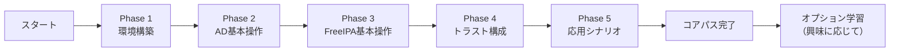
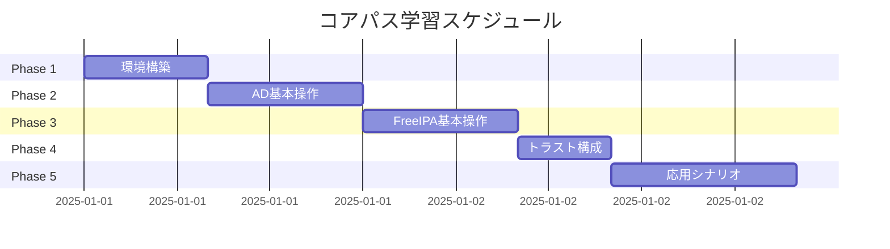
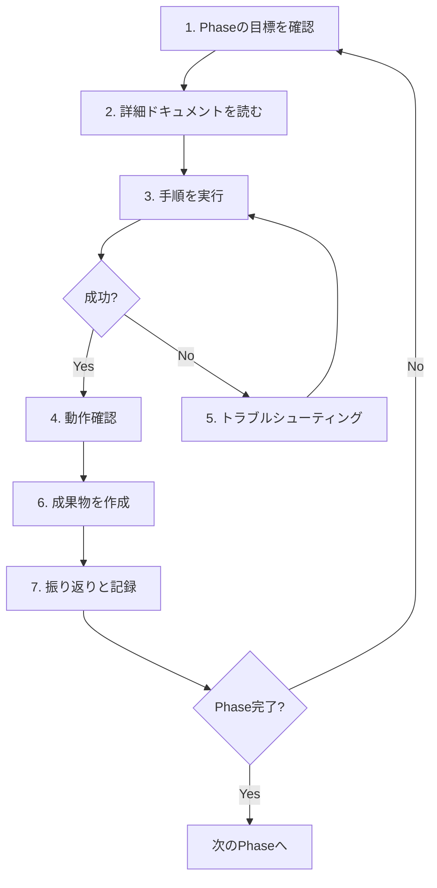

# ドメイン管理学習ロードマップ

## 📋 目次

- [ドメイン管理学習ロードマップ](#ドメイン管理学習ロードマップ)
  - [📋 目次](#-目次)
  - [🎯 このロードマップについて](#-このロードマップについて)
    - [学習の全体像](#学習の全体像)
    - [対象者](#対象者)
    - [前提知識](#前提知識)
  - [🏆 学習目標](#-学習目標)
    - [コアパス完了後にできること](#コアパス完了後にできること)
      - [📚 **知識・理解**](#-知識理解)
      - [🛠️ **技術・実装**](#️-技術実装)
      - [📋 **管理・運用**](#-管理運用)
      - [🎯 **実践・応用**](#-実践応用)
  - [📊 学習パスの構成](#-学習パスの構成)
    - [コアパス（必須）](#コアパス必須)
    - [オプションパス（選択）](#オプションパス選択)
  - [🗺️ Phase別学習ロードマップ](#️-phase別学習ロードマップ)
    - [Phase 1: 環境構築 (推奨学習時間: 4-8時間)](#phase-1-環境構築-推奨学習時間-4-8時間)
      - [🎯 Phase 1の目標](#-phase-1の目標)
      - [📚 学習内容](#-学習内容)
      - [✅ 完了条件](#-完了条件)
      - [📄 詳細ドキュメント](#-詳細ドキュメント)
    - [Phase 2: Active Directory基本操作 (推奨学習時間: 6-10時間)](#phase-2-active-directory基本操作-推奨学習時間-6-10時間)
      - [🎯 Phase 2の目標](#-phase-2の目標)
      - [📚 学習内容](#-学習内容-1)
      - [✅ 完了条件](#-完了条件-1)
      - [📝 成果物](#-成果物)
    - [Phase 3: FreeIPA基本操作 (推奨学習時間: 6-10時間)](#phase-3-freeipa基本操作-推奨学習時間-6-10時間)
      - [🎯 Phase 3の目標](#-phase-3の目標)
      - [📚 学習内容](#-学習内容-2)
      - [✅ 完了条件](#-完了条件-2)
      - [📝 成果物](#-成果物-1)
    - [Phase 4: トラスト構成 (推奨学習時間: 4-6時間)](#phase-4-トラスト構成-推奨学習時間-4-6時間)
      - [🎯 Phase 4の目標](#-phase-4の目標)
      - [📚 学習内容](#-学習内容-3)
      - [✅ 完了条件](#-完了条件-3)
      - [📝 成果物](#-成果物-2)
    - [Phase 5: 応用シナリオ (推奨学習時間: 8-12時間)](#phase-5-応用シナリオ-推奨学習時間-8-12時間)
      - [🎯 Phase 5の目標](#-phase-5の目標)
      - [📚 学習内容](#-学習内容-4)
      - [✅ 完了条件](#-完了条件-4)
      - [📝 成果物](#-成果物-3)
  - [📅 学習スケジュール例](#-学習スケジュール例)
    - [短期集中型 (2週間)](#短期集中型-2週間)
    - [標準型 (1ヶ月)](#標準型-1ヶ月)
    - [じっくり型 (2ヶ月)](#じっくり型-2ヶ月)
  - [✅ 各Phaseで用意すべき成果物](#-各phaseで用意すべき成果物)
  - [🔄 学習の進め方](#-学習の進め方)
    - [基本的な学習フロー](#基本的な学習フロー)
    - [質問のタイミング](#質問のタイミング)
    - [トラブルシューティング](#トラブルシューティング)
  - [📚 事前準備](#-事前準備)
    - [ソフトウェアのインストール](#ソフトウェアのインストール)
    - [リポジトリのクローン](#リポジトリのクローン)
    - [ISOイメージの取得](#isoイメージの取得)
  - [🎓 オプション学習項目](#-オプション学習項目)
    - [カテゴリA: Active Directory高度な管理](#カテゴリa-active-directory高度な管理)
    - [カテゴリB: FreeIPA高度な管理](#カテゴリb-freeipa高度な管理)
    - [カテゴリC: Web認証統合](#カテゴリc-web認証統合)
    - [カテゴリD: 監視とパフォーマンス](#カテゴリd-監視とパフォーマンス)
  - [🏁 学習完了の目安](#-学習完了の目安)
    - [コアパス完了チェックリスト](#コアパス完了チェックリスト)
      - [Phase 1: 環境構築](#phase-1-環境構築)
      - [Phase 2: Active Directory基本操作](#phase-2-active-directory基本操作)
      - [Phase 3: FreeIPA基本操作](#phase-3-freeipa基本操作)
      - [Phase 4: トラスト構成](#phase-4-トラスト構成)
      - [Phase 5: 応用シナリオ](#phase-5-応用シナリオ)
    - [最終課題](#最終課題)
  - [📖 次のステップ](#-次のステップ)
    - [学習を開始する](#学習を開始する)
    - [質問例](#質問例)

---

## 🎯 このロードマップについて

### 学習の全体像

このロードマップは、**Active Directory**、**FreeIPA**、**Samba4** を使ったドメイン管理を、実践的な環境で段階的に学習するためのガイドです。



### 対象者

以下のような方を対象としています：

- ✅ **ネットワーク基礎知識**がある方（TCP/IP、DNS、基本的なネットワーク概念）
- ✅ **Linux基本操作**ができる方（コマンドライン、基本的なファイル操作）
- ✅ **Windowsの普段使い**はできるが、管理経験は少ない方
- ✅ **ドメイン管理を実践的に学びたい**方

### 前提知識

学習を始める前に、以下の知識があることが望ましいです：

| 分野             | 必要なレベル                  | 確認方法                                        |
| ---------------- | ----------------------------- | ----------------------------------------------- |
| **ネットワーク** | TCP/IP、DNS、サブネットの基本 | `ping`, `nslookup`, `ipconfig` コマンドが使える |
| **Linux**        | 基本的なコマンド操作          | `cd`, `ls`, `cat`, `vi` などが使える            |
| **Windows**      | 基本的なPC操作                | エクスプローラー、コマンドプロンプトが使える    |
| **仮想化**       | 仮想マシンの概念              | VirtualBoxやDockerの概念を知っている            |

**前提知識が不足している場合**:

- ネットワーク: 「ネットワークはなぜつながるのか」などの入門書を読む
- Linux: Linux入門サイトや書籍で基本コマンドを学習
- Docker/Vagrant: 公式チュートリアルを実施

---

## 🏆 学習目標

### コアパス完了後にできること

このロードマップを完了すると、以下のスキルが身につきます：

#### 📚 **知識・理解**

- ✅ Active DirectoryとFreeIPAの違いを説明できる
- ✅ LDAP、Kerberos、DNSの役割を理解している
- ✅ ドメイン管理の主要概念（DC、OU、GPO、HBAC、SUDO Rules）を説明できる
- ✅ トラストの仕組みとクロスドメイン認証を理解している

#### 🛠️ **技術・実装**

- ✅ Samba4でActive Directoryドメインコントローラーを構築できる
- ✅ FreeIPAサーバーを構築できる
- ✅ Windows/Linuxクライアントをそれぞれのドメインに参加させられる
- ✅ AD-FreeIPA間のトラストを構築できる
- ✅ RSATでActive Directoryを管理できる
- ✅ FreeIPA Web UIとCLIで管理できる

#### 📋 **管理・運用**

- ✅ ユーザー、グループ、OUを管理できる
- ✅ GPOでWindowsクライアントの設定を配布できる
- ✅ HBACでLinuxホストのアクセス制御ができる
- ✅ SUDO RulesでLinuxのsudo権限を管理できる
- ✅ 認証ログを確認し、問題を調査できる
- ✅ バックアップとリストアを実行できる

#### 🎯 **実践・応用**

- ✅ 企業ネットワークでのハイブリッド環境を設計できる
- ✅ クロスプラットフォーム認証（SSO）を実現できる
- ✅ トラブルシューティングができる
- ✅ セキュリティベストプラクティスを適用できる

---

## 📊 学習パスの構成

### コアパス（必須）

**推奨学習時間**: 28-46時間（約1-2ヶ月）

すべての学習者が順番に完了すべき必須項目です。



### オプションパス（選択）

コアパスを完了後、興味や業務に応じて選択する項目です。

| カテゴリ                    | 内容                                             | 推奨対象                |
| --------------------------- | ------------------------------------------------ | ----------------------- |
| **A: AD高度な管理**         | GPO応用、証明書管理、PowerShell自動化            | Windows管理者           |
| **B: FreeIPA高度な管理**    | レプリケーション、複数ディストリビューション統合 | Linux管理者             |
| **C: Web認証統合**          | Keycloak、OIDC、SAML                             | Web開発者、アプリ管理者 |
| **D: 監視とパフォーマンス** | Prometheus、Grafana、ログ分析                    | SRE、インフラエンジニア |

---

## 🗺️ Phase別学習ロードマップ

### Phase 1: 環境構築 (推奨学習時間: 4-8時間)

#### 🎯 Phase 1の目標

実際に手を動かして学習するための環境を構築します。

**達成目標**:

- ✅ Vagrant + VirtualBoxでWindows Server VMを起動できる
- ✅ DockerでSamba4 AD DCとFreeIPAサーバーを起動できる
- ✅ ネットワークとDNSが正しく設定されている
- ✅ 各コンポーネント間の疎通が確認できる

#### 📚 学習内容

| Step       | 内容                                   | 推奨時間 |
| ---------- | -------------------------------------- | -------- |
| **Step 1** | リポジトリのクローンと準備             | 30分     |
| **Step 2** | Vagrant環境の構築（Windows Server VM） | 1-2時間  |
| **Step 3** | Docker環境の構築（Samba4, FreeIPA）    | 1-2時間  |
| **Step 4** | ネットワークとDNS設定                  | 1-2時間  |
| **Step 5** | 動作確認とトラブルシューティング       | 1-2時間  |

#### ✅ 完了条件

- [ ] Windows Server VMが起動し、ログインできる
- [ ] Samba4 AD DCが起動し、pingが通る
- [ ] FreeIPA Serverが起動し、Web UIにアクセスできる
- [ ] DNS解決が正しく動作する（`nslookup dc.lab.local`が成功）
- [ ] 環境変数とパスワードをメモしている

#### 📄 詳細ドキュメント

`phase1_environment_setup.md` を参照

---

### Phase 2: Active Directory基本操作 (推奨学習時間: 6-10時間)

#### 🎯 Phase 2の目標

Active Directoryの基本的な管理操作を習得します。

**達成目標**:

- ✅ RSATでActive Directoryを管理できる
- ✅ ユーザー、グループ、OUを作成・管理できる
- ✅ GPOを作成し、Windowsクライアントに適用できる
- ✅ コンピューターをドメインに参加させられる
- ✅ PowerShellで基本的な管理タスクができる

#### 📚 学習内容

| Step       | 内容                                | 推奨時間 |
| ---------- | ----------------------------------- | -------- |
| **Step 1** | RSATのインストールと設定            | 1時間    |
| **Step 2** | ユーザーとグループの管理            | 2-3時間  |
| **Step 3** | OU（組織単位）の設計と作成          | 1-2時間  |
| **Step 4** | GPO（グループポリシー）の作成と適用 | 2-3時間  |
| **Step 5** | PowerShellでの自動化                | 1-2時間  |

#### ✅ 完了条件

- [ ] ユーザーを3人以上作成し、グループに追加できる
- [ ] OUを階層的に作成できる
- [ ] GPOを作成し、スクリーンセーバー設定を配布できる
- [ ] Windows VMをドメインに参加させられる
- [ ] PowerShellでユーザー一覧を取得できる

#### 📝 成果物

- ユーザー/グループ設計書
- OU構造図
- GPO設定一覧
- PowerShellスクリプト集

---

### Phase 3: FreeIPA基本操作 (推奨学習時間: 6-10時間)

#### 🎯 Phase 3の目標

FreeIPAの基本的な管理操作を習得します。

**達成目標**:

- ✅ FreeIPA Web UIで管理できる
- ✅ `ipa`コマンドで管理操作ができる
- ✅ ユーザー、グループを管理できる
- ✅ HBACルールでアクセス制御ができる
- ✅ SUDO Rulesで権限管理ができる
- ✅ LinuxクライアントをFreeIPAに参加させられる

#### 📚 学習内容

| Step       | 内容                            | 推奨時間 |
| ---------- | ------------------------------- | -------- |
| **Step 1** | FreeIPA Web UIの操作            | 1-2時間  |
| **Step 2** | ユーザーとグループの管理        | 1-2時間  |
| **Step 3** | HBACルールの作成と適用          | 2-3時間  |
| **Step 4** | SUDO Rulesの作成と適用          | 2-3時間  |
| **Step 5** | Linuxクライアントのドメイン参加 | 1-2時間  |

#### ✅ 完了条件

- [ ] FreeIPA Web UIでユーザーを作成できる
- [ ] `ipa user-find`コマンドでユーザー一覧を取得できる
- [ ] HBACルールで開発者グループが特定サーバーにのみアクセスできるようにする
- [ ] SUDO Ruleで管理者グループがsudoを実行できるようにする
- [ ] Ubuntu 24.04クライアントをFreeIPAに参加させる

#### 📝 成果物

- FreeIPAコマンド集
- HBACルール設計書
- SUDO Rules設計書
- クライアント参加手順書

---

### Phase 4: トラスト構成 (推奨学習時間: 4-6時間)

#### 🎯 Phase 4の目標

Active DirectoryとFreeIPA間のトラストを構築し、クロスドメイン認証を実現します。

**達成目標**:

- ✅ AD-FreeIPA間のトラストを構築できる
- ✅ ADユーザーがLinuxサーバー（FreeIPA管理）にログインできる
- ✅ トラストの前提条件を理解している
- ✅ トラブルシューティングができる

#### 📚 学習内容

| Step       | 内容                        | 推奨時間 |
| ---------- | --------------------------- | -------- |
| **Step 1** | トラストの前提条件確認      | 1時間    |
| **Step 2** | DNS設定の確認と調整         | 1-2時間  |
| **Step 3** | トラストの構築（FreeIPA側） | 1-2時間  |
| **Step 4** | クロスドメイン認証のテスト  | 1時間    |
| **Step 5** | トラブルシューティング      | 1時間    |

#### ✅ 完了条件

- [ ] `ipa trust-add`コマンドでトラストを構築できる
- [ ] ADユーザーがLinuxサーバーにSSHログインできる
- [ ] `klist`でKerberosチケットを確認できる
- [ ] トラストの状態を確認できる（`ipa trust-show`）

#### 📝 成果物

- トラスト構築手順書
- DNS設定チェックリスト
- トラブルシューティングログ

---

### Phase 5: 応用シナリオ (推奨学習時間: 8-12時間)

#### 🎯 Phase 5の目標

実際の業務を想定したシナリオで、統合的な運用スキルを習得します。

**達成目標**:

- ✅ 新入社員のオンボーディングを自動化できる
- ✅ 部門別のアクセス制御を実装できる
- ✅ 監査ログを収集・分析できる
- ✅ バックアップとリカバリができる
- ✅ セキュリティベストプラクティスを適用できる

#### 📚 学習内容

| Step       | 内容                             | 推奨時間 |
| ---------- | -------------------------------- | -------- |
| **Step 1** | 新入社員オンボーディング自動化   | 2-3時間  |
| **Step 2** | 部門別アクセス制御の実装         | 2-3時間  |
| **Step 3** | 監査ログの収集と分析             | 2-3時間  |
| **Step 4** | バックアップとリカバリ           | 2-3時間  |
| **Step 5** | 総合演習とトラブルシューティング | 2-3時間  |

#### ✅ 完了条件

- [ ] PowerShell/Bashスクリプトで新規ユーザー作成を自動化
- [ ] 部門別のHBAC/GPOを設計・実装
- [ ] 認証ログを収集し、不正アクセスを検出できる
- [ ] Samba4とFreeIPAのバックアップを取得し、リストアできる
- [ ] セキュリティチェックリストに基づいて設定を見直す

#### 📝 成果物

- オンボーディング自動化スクリプト
- アクセス制御設計書
- ログ分析レポート
- バックアップ・リカバリ手順書
- セキュリティチェックリスト

---

## 📅 学習スケジュール例

### 短期集中型 (2週間)

**1日4-6時間の学習時間を確保できる場合**

| 週         | 曜日 | Phase   | 内容                       | 学習時間 |
| ---------- | ---- | ------- | -------------------------- | -------- |
| **Week 1** | 月   | Phase 1 | 環境構築                   | 6時間    |
|            | 火   | Phase 2 | AD基本操作 (Step 1-2)      | 4時間    |
|            | 水   | Phase 2 | AD基本操作 (Step 3-5)      | 6時間    |
|            | 木   | Phase 3 | FreeIPA基本操作 (Step 1-2) | 4時間    |
|            | 金   | Phase 3 | FreeIPA基本操作 (Step 3-5) | 6時間    |
| **Week 2** | 月   | Phase 4 | トラスト構成               | 6時間    |
|            | 火   | Phase 5 | 応用シナリオ (Step 1-2)    | 6時間    |
|            | 水   | Phase 5 | 応用シナリオ (Step 3-4)    | 6時間    |
|            | 木   | Phase 5 | 総合演習                   | 4時間    |
|            | 金   | 復習    | 総復習と振り返り           | 4時間    |

**合計**: 約52時間

### 標準型 (1ヶ月)

**1日2-3時間の学習時間を確保できる場合**

| 週         | Phase     | 学習内容                   |
| ---------- | --------- | -------------------------- |
| **Week 1** | Phase 1   | 環境構築                   |
| **Week 2** | Phase 2   | Active Directory基本操作   |
| **Week 3** | Phase 3   | FreeIPA基本操作            |
| **Week 4** | Phase 4-5 | トラスト構成と応用シナリオ |

### じっくり型 (2ヶ月)

**週末中心の学習（週8-10時間）**

| 月          | Week   | Phase   | 学習内容                     |
| ----------- | ------ | ------- | ---------------------------- |
| **Month 1** | Week 1 | Phase 1 | 環境構築                     |
|             | Week 2 | Phase 2 | AD基本操作 (前半)            |
|             | Week 3 | Phase 2 | AD基本操作 (後半)            |
|             | Week 4 | Phase 3 | FreeIPA基本操作 (前半)       |
| **Month 2** | Week 1 | Phase 3 | FreeIPA基本操作 (後半)       |
|             | Week 2 | Phase 4 | トラスト構成                 |
|             | Week 3 | Phase 5 | 応用シナリオ (前半)          |
|             | Week 4 | Phase 5 | 応用シナリオ (後半) + 総復習 |

---

## ✅ 各Phaseで用意すべき成果物

| Phase       | 成果物                           | 形式                  | 目的                    |
| ----------- | -------------------------------- | --------------------- | ----------------------- |
| **Phase 1** | 環境構築手順書                   | Markdown              | 再構築時の参照          |
|             | 環境設定メモ                     | テキスト              | パスワード、IP、DNS設定 |
| **Phase 2** | ユーザー/グループ設計書          | Excel/Markdown        | AD設計の記録            |
|             | OU構造図                         | 図（mermaid/draw.io） | 階層構造の可視化        |
|             | GPO設定一覧                      | Excel/Markdown        | ポリシー設定の記録      |
|             | PowerShellスクリプト集           | `.ps1`ファイル        | 自動化の蓄積            |
| **Phase 3** | FreeIPAコマンド集                | Markdown              | よく使うコマンドの記録  |
|             | HBACルール設計書                 | Excel/Markdown        | アクセス制御の設計      |
|             | SUDO Rules設計書                 | Excel/Markdown        | 権限管理の設計          |
| **Phase 4** | トラスト構築手順書               | Markdown              | 手順の記録              |
|             | トラブルシューティングログ       | テキスト              | 問題と解決策の記録      |
| **Phase 5** | オンボーディング自動化スクリプト | `.ps1`/`.sh`          | 自動化スクリプト        |
|             | アクセス制御設計書               | Excel/Markdown        | 包括的な設計書          |
|             | バックアップ手順書               | Markdown              | 運用手順                |
|             | 学習の振り返り                   | Markdown              | 学習成果のまとめ        |

---

## 🔄 学習の進め方

### 基本的な学習フロー



### 質問のタイミング

各ステップの学習を始める前に、以下のように質問してください：

**例**:

```text
「Phase 1 Step 1: リポジトリのクローンと準備の詳細手順を教えてください」
「Phase 2 Step 3: OU（組織単位）の設計と作成について詳しく教えてください」
「Phase 4全体の流れと前提条件を教えてください」
```

### トラブルシューティング

問題が発生したら、以下の情報を添えて質問してください：

1. **何をしようとしたか**
   - 実行したコマンド
   - 参照した手順

2. **何が起こったか**
   - エラーメッセージ（全文）
   - 期待した結果との差異
   - スクリーンショット（可能であれば）

3. **環境情報**
   - どのコンポーネントで発生したか（Samba4/FreeIPA/Windows VM）
   - ホストOS、バージョン情報

---

## 📚 事前準備

学習を始める前に、以下の準備を完了してください。

### ソフトウェアのインストール

| ソフトウェア       | バージョン | 用途                         |
| ------------------ | ---------- | ---------------------------- |
| **VirtualBox**     | 7.0以降    | Windows Server VMの実行      |
| **Vagrant**        | 2.3以降    | VMの自動構築                 |
| **Docker Desktop** | 最新版     | Samba4/FreeIPAコンテナの実行 |
| **Git**            | 最新版     | リポジトリのクローン         |

**動作確認コマンド**:

```powershell
# バージョン確認
VBoxManage --version
vagrant --version
docker --version
git --version
```

### リポジトリのクローン

```powershell
# 作業ディレクトリを作成
cd C:\
mkdir Projects
cd Projects

# リポジトリをクローン
git clone https://github.com/y-nosuke/vagrant-samples.git
git clone https://github.com/y-nosuke/docker-compose-samples.git
```

### ISOイメージの取得

**Windows Server 2025 評価版**:

- [Microsoft Evaluation Center](https://www.microsoft.com/ja-jp/evalcenter/)からダウンロード
- `vagrant-samples/windows-server-2025/iso/` ディレクトリに配置

---

## 🎓 オプション学習項目

コアパスを完了後、興味や業務に応じて選択する項目です。

### カテゴリA: Active Directory高度な管理

| 項目    | 内容                                   | 推奨学習時間 |
| ------- | -------------------------------------- | ------------ |
| **A-1** | コンピューター・デバイス管理           | 3-4時間      |
| **A-2** | ファイル・ストレージ管理               | 4-6時間      |
| **A-3** | 高度なセキュリティ（AppLocker、LAPS）  | 4-6時間      |
| **A-4** | GPO応用                                | 4-6時間      |
| **A-5** | インフラ・ネットワーク（DHCP、複数DC） | 6-8時間      |
| **A-6** | 証明書とフェデレーション               | 6-8時間      |
| **A-7** | アカウントライフサイクル               | 3-4時間      |
| **A-8** | PowerShell自動化                       | 6-8時間      |
| **A-9** | 高度な管理（FSMO、サイト管理）         | 4-6時間      |

### カテゴリB: FreeIPA高度な管理

| 項目    | 内容                                          | 推奨学習時間 |
| ------- | --------------------------------------------- | ------------ |
| **B-1** | 複数ディストリビューション統合                | 6-8時間      |
| **B-2** | FreeIPA高度な機能（レプリケーション、証明書） | 6-8時間      |
| **B-3** | HBAC/SUDO高度な設定                           | 4-6時間      |

### カテゴリC: Web認証統合

| 項目    | 内容                | 推奨学習時間 |
| ------- | ------------------- | ------------ |
| **C-1** | Keycloak + OIDC統合 | 8-10時間     |
| **C-2** | SAML統合            | 6-8時間      |

### カテゴリD: 監視とパフォーマンス

| 項目    | 内容                     | 推奨学習時間 |
| ------- | ------------------------ | ------------ |
| **D-1** | Prometheus + Grafana監視 | 6-8時間      |
| **D-2** | ログ分析（ELK Stack）    | 8-10時間     |

---

## 🏁 学習完了の目安

### コアパス完了チェックリスト

すべてチェックできたら、コアパスを完了とみなします。

#### Phase 1: 環境構築

- [ ] Windows Server VMが起動し、ログインできる
- [ ] Samba4 AD DCが起動し、名前解決ができる
- [ ] FreeIPA Serverが起動し、Web UIにアクセスできる
- [ ] 各コンポーネント間の疎通が確認できる

#### Phase 2: Active Directory基本操作

- [ ] RSATでADを管理できる
- [ ] ユーザー、グループ、OUを作成できる
- [ ] GPOを作成し、クライアントに適用できる
- [ ] PowerShellで基本的な管理タスクができる

#### Phase 3: FreeIPA基本操作

- [ ] FreeIPA Web UIとCLIで管理できる
- [ ] HBACルールを作成し、アクセス制御ができる
- [ ] SUDO Rulesを作成し、権限管理ができる
- [ ] LinuxクライアントをFreeIPAに参加させられる

#### Phase 4: トラスト構成

- [ ] AD-FreeIPA間のトラストを構築できる
- [ ] ADユーザーがLinuxサーバーにログインできる
- [ ] トラストの状態を確認できる

#### Phase 5: 応用シナリオ

- [ ] 新入社員オンボーディングを自動化できる
- [ ] 部門別のアクセス制御を実装できる
- [ ] 監査ログを収集・分析できる
- [ ] バックアップとリカバリができる

### 最終課題

以下のシナリオを実装できれば、コアパスを完全に習得したと言えます：

**シナリオ**: 新規部門の立ち上げ

1. **AD側**:
   - 新しいOU（例: OU=Marketing）を作成
   - 部門のユーザーとグループを作成
   - 部門専用のGPO（デスクトップ壁紙、セキュリティ設定）を適用

2. **FreeIPA側**:
   - 新しいホストグループ（例: marketing-servers）を作成
   - HBACルールを作成（部門ユーザーのみアクセス可能）
   - SUDO Rulesを作成（部門管理者のみsudo可能）

3. **統合**:
   - トラストを通じて、ADユーザーがFreeIPA管理のLinuxサーバーにアクセス
   - 認証ログを確認し、アクセスが正しく制御されていることを確認

4. **運用**:
   - 新入社員1名を追加（自動化スクリプト使用）
   - 設定のバックアップを取得
   - トラブルシューティング（意図的にDNS設定を壊し、復旧）

---

## 📖 次のステップ

### 学習を開始する

1. **一般的な説明ドキュメントを読む**
   - `01_overview.md` から `07_enterprise_scenarios.md` を順番に読む
   - 用語や概念を理解する

2. **Phase 1の詳細ドキュメントを読む**
   - `phase1_environment_setup.md` を読む
   - Step 1から順番に実行する

3. **質問する**
   - 不明な点があれば、いつでも質問してください
   - 例: 「Phase 1 Step 2の詳細手順を教えてください」

### 質問例

**Phase 1を始める場合**:

```text
「Phase 1 Step 1: リポジトリのクローンと準備の詳細手順を教えてください」
```

**一般的な説明を読みたい場合**:

```text
「01_overview.mdの内容について詳しく教えてください」
「Active DirectoryとFreeIPAの違いについて図解で説明してください」
```

**オプション学習を始める場合**:

```text
「オプション項目A-3のAppLockerについて詳しく教えてください」
```

---

**作成日**: 2025年11月2日
**対象**: ドメイン管理を実践的に学びたい方
**学習スタイル**: 段階的な実践学習
**推奨学習期間**: 1-2ヶ月（コアパス）
