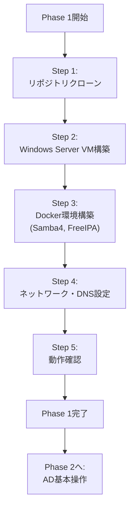
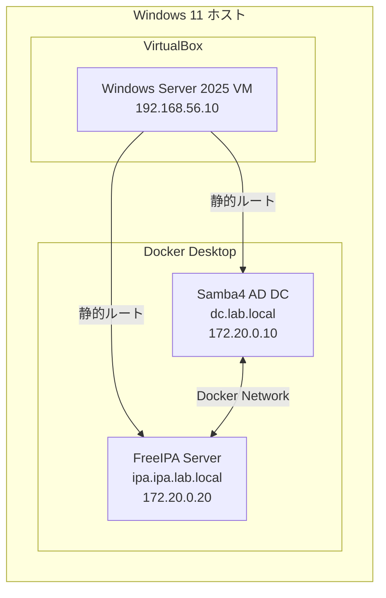

# Phase 1: 環境構築

## 📋 目次

- [Phase 1: 環境構築](#phase-1-環境構築)
  - [📋 目次](#-目次)
  - [🎯 Phase 1の目標](#-phase-1の目標)
  - [📚 前提知識](#-前提知識)
  - [💻 必要な環境](#-必要な環境)
  - [📅 推奨学習時間](#-推奨学習時間)
  - [🗺️ Phase 1の全体像](#️-phase-1の全体像)
  - [Step 1: リポジトリのクローンと準備](#step-1-リポジトリのクローンと準備)
    - [🎯 このStepの目標](#-このstepの目標)
    - [📝 手順](#-手順)
      - [1. 作業ディレクトリの作成](#1-作業ディレクトリの作成)
      - [2. リポジトリのクローン](#2-リポジトリのクローン)
      - [3. プロジェクト構造の確認](#3-プロジェクト構造の確認)
    - [✅ Step 1 完了確認](#-step-1-完了確認)
  - [Step 2: Vagrant環境の構築（Windows Server VM）](#step-2-vagrant環境の構築windows-server-vm)
    - [🎯 このStepの目標](#-このstepの目標-1)
    - [📝 手順](#-手順-1)
      - [1. Windows Server ISOの準備](#1-windows-server-isoの準備)
      - [2. Vagrantfileの確認](#2-vagrantfileの確認)
      - [3. VMの起動](#3-vmの起動)
      - [4. VMへの接続確認](#4-vmへの接続確認)
    - [⚠️ トラブルシューティング](#️-トラブルシューティング)
    - [✅ Step 2 完了確認](#-step-2-完了確認)
  - [Step 3: Docker環境の構築（Samba4, FreeIPA）](#step-3-docker環境の構築samba4-freeipa)
    - [🎯 このStepの目標](#-このstepの目標-2)
    - [📝 手順](#-手順-2)
      - [1. 環境変数ファイルの作成](#1-環境変数ファイルの作成)
      - [2. Docker Composeの起動](#2-docker-composeの起動)
      - [3. コンテナの動作確認](#3-コンテナの動作確認)
    - [⚠️ トラブルシューティング](#️-トラブルシューティング-1)
    - [✅ Step 3 完了確認](#-step-3-完了確認)
  - [Step 4: ネットワークとDNS設定](#step-4-ネットワークとdns設定)
    - [🎯 このStepの目標](#-このstepの目標-3)
    - [📝 手順](#-手順-3)
      - [1. Windows ホストに静的ルート追加](#1-windows-ホストに静的ルート追加)
      - [2. Windows VM に静的ルート追加](#2-windows-vm-に静的ルート追加)
      - [3. DNS設定（Windows VM）](#3-dns設定windows-vm)
      - [4. Hostsファイルの設定（Windows ホスト）](#4-hostsファイルの設定windows-ホスト)
    - [✅ Step 4 完了確認](#-step-4-完了確認)
  - [Step 5: 動作確認とトラブルシューティング](#step-5-動作確認とトラブルシューティング)
    - [🎯 このStepの目標](#-このstepの目標-4)
    - [📝 確認項目](#-確認項目)
      - [1. ネットワーク疎通確認](#1-ネットワーク疎通確認)
      - [2. DNS解決確認](#2-dns解決確認)
      - [3. サービス確認](#3-サービス確認)
      - [4. ログ確認](#4-ログ確認)
    - [🐛 トラブルシューティング](#-トラブルシューティング)
    - [✅ Step 5 完了確認](#-step-5-完了確認)
  - [✅ Phase 1完了チェックリスト](#-phase-1完了チェックリスト)
    - [環境構築](#環境構築)
    - [ネットワーク](#ネットワーク)
    - [DNS](#dns)
    - [サービス](#サービス)
    - [ドキュメント](#ドキュメント)
  - [📝 次のステップ](#-次のステップ)

---

## 🎯 Phase 1の目標

Phase 1を完了すると、以下ができるようになります：

- ✅ Vagrant + VirtualBoxでWindows Server VMを起動できる
- ✅ DockerでSamba4 AD DCとFreeIPAサーバーを起動できる
- ✅ ネットワークとDNSが正しく設定されている
- ✅ 各コンポーネント間の疎通が確認できる
- ✅ 学習環境が整い、Phase 2以降に進める準備が整う

---

## 📚 前提知識

Phase 1を始める前に、以下の知識があることが望ましいです：

| 分野                   | 必要なレベル                                |
| ---------------------- | ------------------------------------------- |
| **コマンドライン操作** | 基本的なコマンド（cd, ls, mkdir等）が使える |
| **テキストエディタ**   | vi/vim または nano が使える                 |
| **ネットワーク基礎**   | IPアドレス、サブネットの概念を理解している  |
| **仮想化の概念**       | 仮想マシン、コンテナの概念を知っている      |

---

## 💻 必要な環境

**ホストマシン要件**:

| 項目             | 推奨スペック       | 最小スペック   |
| ---------------- | ------------------ | -------------- |
| **OS**           | Windows 11 Pro     | Windows 10 Pro |
| **CPU**          | 4コア以上          | 2コア          |
| **メモリ**       | 16GB以上           | 8GB            |
| **ストレージ**   | 100GB以上の空き    | 50GB           |
| **ネットワーク** | インターネット接続 | 必須           |

**必要なソフトウェア**:

| ソフトウェア       | バージョン | 用途                 |
| ------------------ | ---------- | -------------------- |
| **VirtualBox**     | 7.0以降    | 仮想マシンの実行     |
| **Vagrant**        | 2.3以降    | VMの自動構築         |
| **Docker Desktop** | 最新版     | コンテナの実行       |
| **Git**            | 最新版     | リポジトリのクローン |

---

## 📅 推奨学習時間

| Step       | 内容                       | 推奨時間    |
| ---------- | -------------------------- | ----------- |
| **Step 1** | リポジトリのクローンと準備 | 30分        |
| **Step 2** | Vagrant環境の構築          | 1-2時間     |
| **Step 3** | Docker環境の構築           | 1-2時間     |
| **Step 4** | ネットワークとDNS設定      | 1-2時間     |
| **Step 5** | 動作確認                   | 1-2時間     |
| **合計**   |                            | **4-8時間** |

---

## 🗺️ Phase 1の全体像



**構築する環境**:



---

## Step 1: リポジトリのクローンと準備

### 🎯 このStepの目標

- GitHubから必要なリポジトリをクローンする
- プロジェクトディレクトリ構造を理解する
- 次のStepの準備を整える

### 📝 手順

#### 1. 作業ディレクトリの作成

```powershell
# PowerShellを管理者として起動

# 作業ディレクトリを作成
cd C:\
mkdir Projects
cd Projects
```

#### 2. リポジトリのクローン

```powershell
# vagrant-samplesリポジトリのクローン
git clone https://github.com/y-nosuke/vagrant-samples.git

# docker-compose-samplesリポジトリのクローン
git clone https://github.com/y-nosuke/docker-compose-samples.git

# ディレクトリ構造の確認
tree /F vagrant-samples\domain-management
tree /F docker-compose-samples\domain-management
```

#### 3. プロジェクト構造の確認

**期待される構造**:

```bash
C:\Projects\
├── vagrant-samples\
│   └── domain-management\
│       ├── Vagrantfile
│       ├── README.md
│       └── (その他のファイル)
└── docker-compose-samples\
    └── domain-management\
        ├── docker-compose.yml
        ├── .env.example
        └── (その他のファイル)
```

### ✅ Step 1 完了確認

- [ ] リポジトリが正しくクローンされている
- [ ] ディレクトリ構造を確認した
- [ ] 次のStepに必要なファイルが揃っている

---

## Step 2: Vagrant環境の構築（Windows Server VM）

### 🎯 このStepの目標

- VagrantでWindows Server 2025 VMを構築する
- VMに接続し、基本設定を確認する
- 次のStepでDockerコンテナと通信できるようにする

### 📝 手順

#### 1. Windows Server ISOの準備

**ISOのダウンロード**:

1. [Microsoft Evaluation Center](https://www.microsoft.com/en-us/evalcenter/evaluate-windows-server-2025)にアクセス
2. Windows Server 2025評価版ISOをダウンロード
3. `C:\Projects\vagrant-samples\domain-management\iso\` に配置

#### 2. Vagrantfileの確認

```powershell
cd C:\Projects\vagrant-samples\domain-management

# Vagrantfileの内容を確認
cat Vagrantfile
```

**Vagrantfileの主要設定**:

- VMのホスト名: `winserver2025`
- メモリ: `4096MB`
- CPU: `2コア`
- ネットワーク: `192.168.56.10` (Host-Only)

#### 3. VMの起動

```powershell
# VMの起動（初回は時間がかかります：30-60分）
vagrant up

# 起動状態の確認
vagrant status
```

**初回起動時の処理**:

- Windows Serverのインストール
- 基本設定の適用
- ネットワーク設定

#### 4. VMへの接続確認

```powershell
# RDPでの接続情報
# ホスト: 192.168.56.10
# ユーザー: Administrator
# パスワード: (Vagrantfileに記載)

# ホストマシンからpingテスト
ping 192.168.56.10
```

### ⚠️ トラブルシューティング

**問題: VMが起動しない**

```powershell
# VirtualBoxのログ確認
VBoxManage list vms
VBoxManage showvminfo <VM名>

# Vagrantのログ確認
vagrant up --debug
```

**問題: ネットワークに接続できない**

```powershell
# VirtualBox Host-Only Networkの確認
VBoxManage list hostonlyifs

# ネットワークアダプターの再作成（必要に応じて）
VBoxManage hostonlyif create
```

### ✅ Step 2 完了確認

- [ ] Windows Server VMが起動している
- [ ] ホストマシンから`192.168.56.10`にpingが通る
- [ ] RDPでVMに接続できる

---

## Step 3: Docker環境の構築（Samba4, FreeIPA）

### 🎯 このStepの目標

- Docker ComposeでSamba4 AD DCを起動する
- Docker ComposeでFreeIPA Serverを起動する
- コンテナ間の通信を確認する

### 📝 手順

#### 1. 環境変数ファイルの作成

```powershell
cd C:\Projects\docker-compose-samples\domain-management

# .env.exampleをコピー
copy .env.example .env

# .envファイルを編集
notepad .env
```

**`.env`ファイルの設定例**:

```env
# ドメイン設定
AD_DOMAIN=lab.local
AD_REALM=LAB.LOCAL
IPA_DOMAIN=ipa.lab.local
IPA_REALM=IPA.LAB.LOCAL

# 管理者パスワード
AD_ADMIN_PASSWORD=P@ssw0rd123!
IPA_ADMIN_PASSWORD=P@ssw0rd456!
IPA_DS_PASSWORD=P@ssw0rd789!

# ネットワーク設定
NETWORK_SUBNET=172.20.0.0/24
AD_DC_IP=172.20.0.10
IPA_SERVER_IP=172.20.0.20
```

#### 2. Docker Composeの起動

```powershell
# Samba4 AD DCの起動
docker-compose up -d samba4

# 起動確認（数分待つ）
docker-compose logs -f samba4

# FreeIPAの起動
docker-compose up -d freeipa

# 起動確認（数分待つ）
docker-compose logs -f freeipa
```

**起動完了の確認**:

- Samba4: `Samba4 AD DC is ready` というメッセージ
- FreeIPA: `FreeIPA server configured` というメッセージ

#### 3. コンテナの動作確認

```powershell
# コンテナ一覧
docker-compose ps

# Samba4コンテナに接続
docker-compose exec samba4 bash

# FreeIPAコンテナに接続
docker-compose exec freeipa bash
```

**コンテナ内での確認**:

```bash
# Samba4での確認
samba-tool domain info dc.lab.local
samba-tool user list

# FreeIPAでの確認
ipa-server-install --help
kinit admin
ipa user-find
```

### ⚠️ トラブルシューティング

**問題: コンテナが起動しない**

```powershell
# ログの確認
docker-compose logs samba4
docker-compose logs freeipa

# コンテナの再起動
docker-compose restart samba4
docker-compose restart freeipa

# コンテナの再構築
docker-compose down
docker-compose up -d --build
```

**問題: ポートが使用中**

```powershell
# ポートの使用状況確認
netstat -ano | findstr :389
netstat -ano | findstr :636

# 競合しているプロセスを停止
taskkill /PID <PID> /F
```

### ✅ Step 3 完了確認

- [ ] Samba4コンテナが起動している
- [ ] FreeIPAコンテナが起動している
- [ ] 各コンテナにログインできる
- [ ] サービスが正常に動作している

---

## Step 4: ネットワークとDNS設定

### 🎯 このStepの目標

- Windows VMからDockerコンテナへの通信を確立する
- DNS設定を行い、名前解決ができるようにする
- 全コンポーネント間の疎通を確認する

### 📝 手順

#### 1. Windows ホストに静的ルート追加

```powershell
# PowerShell（管理者）で実行

# Docker NetworkへのルートをWindows ホストに追加
route add 172.20.0.0 mask 255.255.255.0 192.168.56.1 -p

# ルートテーブルの確認
route print
```

#### 2. Windows VM に静的ルート追加

```powershell
# Windows Server VM (192.168.56.10) にRDP接続

# PowerShellで実行
route add 172.20.0.0 mask 255.255.255.0 192.168.56.1 -p

# 疎通確認
ping 172.20.0.10  # Samba4
ping 172.20.0.20  # FreeIPA
```

#### 3. DNS設定（Windows VM）

```powershell
# Windows Server VM で実行

# DNSサーバーの設定
Set-DnsClientServerAddress -InterfaceAlias "イーサネット" -ServerAddresses ("172.20.0.10", "172.20.0.20")

# 設定確認
Get-DnsClientServerAddress

# 名前解決テスト
nslookup dc.lab.local
nslookup ipa.ipa.lab.local
```

#### 4. Hostsファイルの設定（Windows ホスト）

```powershell
# 管理者権限でnotepad
notepad C:\Windows\System32\drivers\etc\hosts
```

**追加する内容**:

```text
# Domain Management
172.20.0.10    dc.lab.local dc
172.20.0.20    ipa.ipa.lab.local ipa
192.168.56.10  winserver2025.lab.local winserver2025
```

### ✅ Step 4 完了確認

- [ ] Windows ホストから Dockerコンテナにpingが通る
- [ ] Windows VMから Dockerコンテナにpingが通る
- [ ] 名前解決が正しく動作する（nslookup成功）

---

## Step 5: 動作確認とトラブルシューティング

### 🎯 このStepの目標

- 全コンポーネントが正しく動作していることを確認する
- 問題があれば修正する
- Phase 2に進む準備を整える

### 📝 確認項目

#### 1. ネットワーク疎通確認

```powershell
# Windows ホストから
ping 192.168.56.10  # Windows VM
ping 172.20.0.10    # Samba4
ping 172.20.0.20    # FreeIPA

# Windows VMから
ping 172.20.0.10    # Samba4
ping 172.20.0.20    # FreeIPA
```

#### 2. DNS解決確認

```powershell
# Windows ホストから
nslookup dc.lab.local
nslookup ipa.ipa.lab.local

# Windows VMから
nslookup dc.lab.local
nslookup ipa.ipa.lab.local
```

#### 3. サービス確認

**Samba4**:

```bash
# Samba4コンテナ内で
docker-compose exec samba4 bash

# ドメイン情報
samba-tool domain info dc.lab.local

# ユーザー一覧
samba-tool user list

# DNS確認
samba-tool dns query dc.lab.local lab.local @ ALL -U Administrator
```

**FreeIPA**:

```bash
# FreeIPAコンテナ内で
docker-compose exec freeipa bash

# Kerberos認証
kinit admin

# ユーザー一覧
ipa user-find

# サーバー状態
ipactl status
```

#### 4. ログ確認

```powershell
# Dockerコンテナのログ
docker-compose logs --tail=100 samba4
docker-compose logs --tail=100 freeipa

# Windows VMのイベントログ
# イベントビューアで確認
```

### 🐛 トラブルシューティング

**よくある問題と解決方法**:

| 問題                     | 原因             | 解決方法                                       |
| ------------------------ | ---------------- | ---------------------------------------------- |
| **pingが通らない**       | ルート設定不足   | Step 4の静的ルート設定を確認                   |
| **名前解決できない**     | DNS設定不足      | DNSサーバー設定、hostsファイルを確認           |
| **コンテナが起動しない** | ポート競合       | `docker-compose down` → `docker-compose up -d` |
| **認証失敗**             | パスワード間違い | `.env`ファイルのパスワードを確認               |

**詳細なトラブルシューティング**:

Appendix B: トラブルシューティングを参照してください。

### ✅ Step 5 完了確認

- [ ] 全コンポーネント間で疎通が取れる
- [ ] 名前解決が正しく動作する
- [ ] Samba4とFreeIPAのサービスが正常に動作している
- [ ] ログにエラーがない

---

## ✅ Phase 1完了チェックリスト

すべてチェックできたら、Phase 1は完了です。

### 環境構築

- [ ] Windows Server 2025 VMが起動している
- [ ] Samba4 AD DCコンテナが起動している
- [ ] FreeIPAコンテナが起動している

### ネットワーク

- [ ] Windows ホストから全コンポーネントにpingが通る
- [ ] Windows VMから全コンポーネントにpingが通る
- [ ] 静的ルートが設定されている

### DNS

- [ ] `dc.lab.local` が解決できる
- [ ] `ipa.ipa.lab.local` が解決できる
- [ ] SRVレコードが正しく設定されている

### サービス

- [ ] Samba4のドメイン情報が表示される
- [ ] FreeIPAのサーバー状態が正常
- [ ] ログにエラーがない

### ドキュメント

- [ ] 環境設定（IP、パスワード）をメモした
- [ ] トラブルがあれば記録した

---

## 📝 次のステップ

Phase 1を完了したら、**Phase 2: Active Directory基本操作**に進みましょう。

**Phase 2で学ぶこと**:

- RSATのインストールと設定
- ユーザー、グループ、OUの管理
- グループポリシー（GPO）の作成と適用
- PowerShellでの自動化

**次の質問例**:

```text
「Phase 2を開始したい。どこから始めればよいですか？」
「Phase 2 Step 1の詳細手順を教えてください」
```

---

**作成日**: 2025年11月2日
**対象**: ドメイン管理初学者
**推奨学習時間**: 4-8時間
**次のPhase**: Phase 2: Active Directory基本操作
